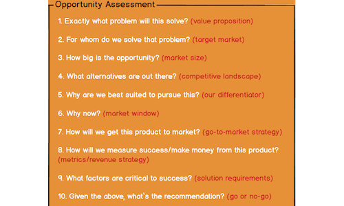

Marty Cagan, founder of Silicon Valley Product Group, was the first to use the idea of a Product Opportunity Assessment. The concept is a simpler, and more practical, version of a Product Requirements Document (PRD). Its first goals are to stop you sinking resources into weak opportunities, and to create a shared, mutual understanding of the opportunity that has appeared.

Further reading: [A customer-development guide for product managers](/en/docs/archive/customer-development/)

The idea is to answer these **10 key questions**:

1. Exactly what problem does it solve? (**value proposition**)

2. Who are we solving this problem for? (**target customer**)

3. How large is the market for this opportunity? (**market size**)

4. What alternatives already exist for this problem? (**competitive landscape**)

5. Why are we the right team for this opportunity? (**differentiator**)

6. Why now? (**market timing**)

7. How will we take this product to market? (**go-to-market**)

8. How will we measure success, and how will we make money? (**metrics / revenue strategy**)

9. Which factors are critical to this product’s success? (**solution requirements**)

10. Given the answers above, what is the final recommendation? (**go or no-go?**)

* * *

[**Read the full article**](https://svpg.com/assessing-product-opportunities/?ref=https://product-frameworks.com)
