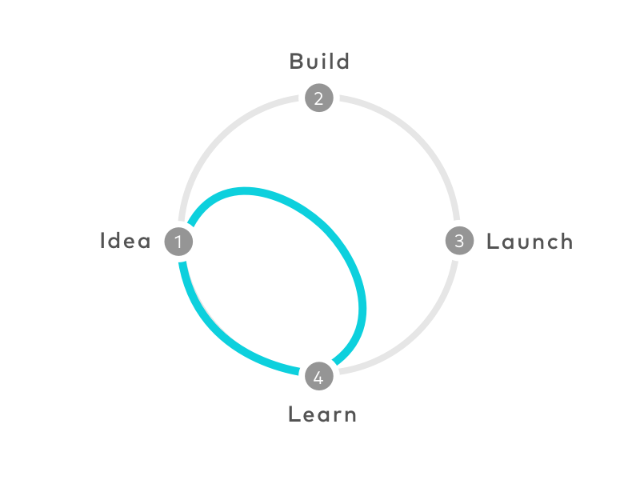

A Design Sprint is a 5-day process that helps you find a core problem in your business and then, through rapid ideation and prototyping, reach a suitable solution. The framework was introduced by Google Ventures and has been used by a large number of companies to solve their challenges. It has been used by companies with very different products and problems, and the process itself has stayed the same across them.

A Design Sprint starts with a team [brainstorm](/en/docs/archive/product-brain-storming/) to identify and focus on the key problem. The next stage is spent sketching different ideas and the solutions that emerge. After the brainstorm, the team moves to prioritizing and planning a testable idea. Then the team builds an initial prototype of the solution and tests it with a real customer.

* * *

First resource: [Read the full article](https://www.gv.com/sprint/?ref=https://product-frameworks.com)

Second resource: [Google Design Sprint](https://virgool.io/productfactory/%DA%AF%D9%88%DA%AF%D9%84-%D8%AF%DB%8C%D8%B2%D8%A7%DB%8C%D9%86-%D8%A7%D8%B3%D9%BE%D8%B1%DB%8C%D9%86%D8%AA%D8%9B-%DA%86%DA%AF%D9%88%D9%86%D9%87-%D8%B1%D9%88%DB%8C%DA%A9%D8%B1%D8%AF-%DA%86%D8%A7%D8%A8%DA%A9-%DA%AF%D9%88%DA%AF%D9%84-%D8%A8%D9%87-%D8%B4%D9%85%D8%A7-%D8%AF%D8%B1-%D8%B3%D8%A7%D8%AE%D8%AA-%D8%AA%D8%AC%D8%B1%D8%A8%D9%87-%DA%A9%D8%A7%D8%B1%D8%A8%D8%B1%DB%8C-%D8%A7%DB%8C%D8%AF%D9%87-%D8%A2%D9%84-%D8%A8%D8%B1%D8%A7%DB%8C-%D9%85%D8%AD%D8%B5%D9%88%D9%84-%DA%A9%D9%85%DA%A9-%D9%85%DB%8C-%DA%A9%D9%86%D8%AF-reo6p7s3dbmf) (an article by Aidin Ziapour on Virgool)
