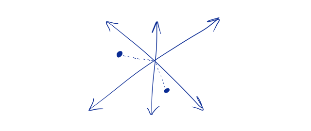

Every software product you use is built on data; that is the assumption we start with in this article. Services such as Uber, Spotify, Amazon, Facebook, Netflix, and even the AltexSoft website this article was translated from are all data-driven. To capture the highest possible value for your product or company, you need to invest time in customer return rates and loyalty. Business leaders like to start their week by looking at measurable data so they can see changes in revenue and customer behavior.

Knowing that those numbers moved, however, does not solve any problem on its own. Gibson Biddle, former VP at Netflix, [explains](https://medium.com/speroventures/customer-obsession-8f1689df60ad) how they used data to launch an A/B test so they could make better decisions. That is how Netflix decided to replace its five-star rating system with simple Like and Dislike buttons, introduce a “percent match” for titles, and simplify the interface to make it far more user-friendly.

In this article we will introduce the metrics and key performance indicators (KPIs) that can help you steer your product toward success. Knowing these KPIs will add to your knowledge, but what truly sets you apart is how you work with them, how you learn from them, how you interpret them, and the insight they spark.

### **KPIs and metrics for a product manager**

Metrics are measurable, quantitative values that let a business define and track product or company success. Stakeholders, marketing, and product management use them to identify problems, set goals, and make informed decisions. Those problems can relate both to the development team’s effort and to the results of the finished product.

Today the biggest issue with metrics is not how to measure them; tools such as Google Analytics are already valuable for calculating these values. The real challenge is choosing the most important metrics to measure, spending less time chasing data, and spending more time working with the valuable data you find.

Depending on your goal—for example opening a new customer-acquisition channel, growing popularity among users, or finding ideas for new product features—you need to pick the right metrics. KPIs are a key input when you build a product roadmap; they also let product managers evaluate engagement, feature usage, user experience, and of course commercial success.

**The most important product KPIs**

**1. Monthly Recurring Revenue (MRR)**

**2. Customer Lifetime Value (CLTV or LTV)**

**3. Customer Acquisition Cost (CAC)**

**4. Daily active users to monthly active users ratio**

**5. Session duration**

**6. Traffic and visits (paid, organic)**

**7. Bounce rate**

**8. Retention rate**

**9. Churn rate**

**10. Number of sessions per user**

**11. Number of user actions per session**

**12. Net Promoter Score (NPS)**

**13. Customer Satisfaction Score (CSAT)**

First, pay attention to the KPIs that serve your goals. Let’s start with the most important ones: how you measure revenue.

### Metrics for forecasting commercial success

We have to accept that shareholders pay the most attention to financial metrics, and fairly so: these numbers show how much you earn today and tomorrow, and therefore how far you can grow or how long you can survive. Shareholders care about revenue, customer acquisition cost (CAC), and customer lifetime value (LTV or CLTV). These indicators shape the fate of the company and the product.

#### **Monthly Recurring Revenue (MRR)**

These measures track total product revenue in a month. To calculate them, take MRR at the start of the month, add revenue from new subscriptions, and subtract revenue lost from customers who left.

Average revenue per user (ARPU) lets you calculate revenue from each user on a monthly or annual basis. You need these metrics if you want to measure product revenue against services you will offer in the future—for example if you plan to change pricing or run a specific campaign.

ARPU comes in two types: for each new account and for each existing account. ARPU for new accounts refers to data after a change in the subscription plan or product price, and ARPU for existing accounts includes data from accounts created before the price change. The ARPU formula is monthly recurring revenue divided by the total number of user accounts.

ARPU is used to compare yourself with competitors, consider different monetization channels, or segment customers by the value they bring.

How to use MRR and ARPU. This KPI is used to monitor a company’s current health and is especially valuable in SaaS businesses (companies that offer software as a service) that run on subscriptions. Once you have recurring customers, you no longer have to worry about one-off sales (purchases after which you never see the customer again and they never use your service). MRR is therefore easy to calculate and easy to forecast.

#### **Customer Lifetime Value (CLTV or LTV)**

These metrics let you calculate how much revenue you earn from a user over a long period. LTV is the average profit you receive from a user before they cancel. The point of this KPI is to show you, early on, how much you can spend to acquire a new customer given the likely profit from one person. To calculate it, you need average customer lifetime (how long a customer stays before they stop using the product) and average revenue per user.

**Average revenue per user** × **average customer lifetime = customer lifetime value**

CLTV is used to evaluate and choose customer-acquisition channels, purchase cycles, and user-retention strategies.

#### **Customer Acquisition Cost (CAC)**

This metric covers all costs of acquiring a customer: marketing spend, the sales team, and advertising. Sometimes it also includes the salaries of marketing and sales specialists. CAC usually involves choosing a time period and the revenue in that window. There are several formulas for CAC; the simplest is:

**Sales and marketing costs in a given period divided by the number of users added in that period = customer acquisition cost**

How should you use CAC? Use CLTV and CAC together to see whether your customers return enough money relative to what you spent to acquire them. Is it time to revisit pricing and marketing strategy in order to attract more users?

### **Metrics for analyzing and growing user engagement**

Customer-centric metrics matter less to shareholders, but they show how your product-development work turns into user interaction with the product. How many users find and use your product? How long do they spend with the product, or with a particular feature? How do customers react to a specific action or feature you placed in the product? These metrics also include data about people who suddenly stop using the product (bounce rate).

##### **Daily active users to monthly active users ratio**

Besides revenue, the most valuable growth metric is the number of users or subscribers over a given period. But the number of people who bought the product or subscribed is not a core KPI. What really matters is the number of active users. Metrics in this group track unique visitors or users per day (DAU), week (WAU), or month (MAU). A unique visitor is someone who visits a website at least once in a given time window.

**Daily active user:** the number of active users in a day. An “active user” is someone who signs into an account and completes one or more structurally valuable activities.

**Monthly active user:** the number of active users who complete valuable activities in a given month.

This KPI applies to mobile apps, online games, websites, and social networks. A unique user is defined by a user ID and login. To measure so-called product “stickiness” (how much users need or like your product), calculate the DAU / MAU ratio.

Example of the DAU/MAU ratio, image source: [Geckoboard](https://www.geckoboard.com/learn/kpi-examples/startup-kpis/dau-mau-ratio/)

How should you use the DAU / MAU ratio? A ratio of 20 is considered a good sign, while a percentage above 50 signals outstanding success. Growth in this value lets you track product growth or decline. Use the ratio for forecasting, budgeting, or deciding whether to build new features. That said, lack of daily use does not mean a product has failed. You might use Uber once a week on the weekend, or log into Airbnb twice a year. Products with high stickiness are more likely to go viral.

#### Session duration

This KPI is the simplest way to track usage of digital products. The best way to measure it is to take the total time users spend in your product and divide it by the number of users. The result is the average, which Google Analytics calculates for you.

Use this metric by looking at session duration for people who bounce and for people who stop using the product. You will likely find interesting results, because you then have to ask why bounce or churn is high and which parts of the product you can improve to move those numbers.

#### **Traffic and visits (paid, organic)**

This KPI is mainly for websites; for apps and software (mobile applications) we use user counts instead. It shows how many people found and visited your site. Organic traffic is the number of visitors who find your page through search, for example via search engines. Paid traffic is the number of people who visit through paid sources—for example Google Ads, social ads, or content that refers traffic to your site.

How should you use these metrics? Paid traffic tells you whether you should keep advertising, whether the target audience is right, and whether the ad placement is correct. Traffic metrics help a product manager see which type of marketing works better.

#### **Bounce rate**

Another metric is bounce rate. It measures the percentage of users who visit only one page of a website or app and then leave.

Example of bounce rate in Google Analytics, image source: [Neil Patel](https://neilpatel.com/blog/bounce-rate-analytics/)

Bounce rate lets you track user behavior and find clues for improving the product so you can reduce that number and increase attention paid to the product.

In later sections we cover KPIs that focus more on attracting users.

### **Metrics for growing user interest**

Retention metrics help you see whether your marketing and customer-support efforts are working. If you know your customer acquisition cost, you also know how long it takes to acquire a new user. Existing customers are more likely to try a new feature, move to a better plan, or join a user-research interview. So it makes sense to work at keeping them.

#### **Retention rate**

Customer retention rate (CRR) is the percentage of customers who are still with you and the product after a given period. You can base the calculation on downloads or on first login.

Retention rate = (number of users in the product at the end of a period minus new users, divided by the number of users at the start of that period) × 100

How should you use retention rate? This KPI tells you, when retention is growing, whether you can make new customers loyal and for how long. If it drops, look for a new competitor or a problem in the service you provide. According to Mixpanel’s product benchmarks report, depending on the industry, average CRR for most software products is below 20 percent over eight weeks.

Most people seem to leave SaaS apps after a week and move toward media and entertainment. Image source: [Product Benchmarks Report by Mixpanel](https://mixpanel.com/data-reports/2017-product-benchmarks-report/#retention)

You decide which input data to use for CRR calculations: which action counts as returning, and over what time window you should measure retention.

#### **Churn rate**

Unlike retention, which measures the percentage of users who stay, churn measures the ones you lost. There are two types of churn: customer churn (users who canceled a paid plan) and revenue churn (revenue lost because of customer churn). To measure customer churn, divide the number of customers you lost in a period by the number of customers at the start of that period.

Average customer churn rate for a monthly subscription business, image source: [Recurly Research](https://info.recurly.com/research/churn-rate-benchmarks)

For business success, revenue churn is more important than customer churn. Customer churn, however, can tell you a lot about satisfaction. If you measure churn after introducing a new plan or launching a new feature, you can measure how satisfied users are.

There are also KPIs that let you measure the popularity of new and old product features, which we discuss next.

### **Metrics for measuring the popularity of a product or feature**

One of a product manager’s core responsibilities is running product-development workshops, where a product team ideates new features and designs UX. To make those decisions you need convincing data on product and feature usage. The two main metrics here are the number of user actions and the number of sessions per user.

#### **Number of sessions per user**

This metric helps you understand core user behavior: how often users use the site. You can track it with login or visit statistics. If an audience keeps showing interest and returning, that is a sign of popularity. Unlike traffic and session duration, sessions per user can show average usage for a specific group of people over a period.

How should you use sessions per user? Compare this data across user or visitor groups (loyal vs. lost) so you can predict behavior changes before churn and prevent it.

##### **Number of user actions per session**

This KPI looks similar to the previous one, but it is not limited to how often a user opens the app. It looks at what a user does while using the product and which features they use. It is used to understand the popularity of a specific feature since launch and to compare it with a given period. You can also compare this metric for churned vs. loyal customers and get a sense of user interest.

**How should you use this metric?** Use this data in A/B tests to decide on new features, UX elements, and customer behavior.

The last set of metrics is customer satisfaction. The section below covers the KPIs that let you track it.

### **Indicators for measuring user satisfaction**

Churn and bounce, traffic, and retention indirectly tell you how customers perceive your service or product. The main way to understand satisfaction is direct customer feedback. Net Promoter Score, customer satisfaction, and customer effort are metrics you can collect through surveys.

#### **Net Promoter Score (NPS)**

This metric measures loyal customers who are likely to recommend the product (promoters) and customers who dislike it (detractors). To calculate NPS, ask users to rate your product from 0 to 10. Detractors (people who speak negatively about the product) score 0 to 6, scores of 7 or 8 are passive, and scores of 9 or 10 are promoters. The NPS formula is the percentage of promoters minus the percentage of detractors.

Example of NPS, image source: [Datapine](https://www.datapine.com/blog/measure-customer-satisfaction-metrics-effort-score/)

Bain & Company, which originally introduced this metric, found that a high NPS leads to 20 to 60 percent organic growth. The same is true in reverse for a negative NPS. If you have many detractors, you will see damaging economic results.

How should you use this indicator? Awareness of NPS across the organization motivates employees to deliver more value, react faster to issues, and find the root of detractor problems. Any insight about detractors should also be shared across departments so everyone has a common experience of improving the overall customer experience.

#### **Customer Satisfaction Score (CSAT)**

This measures the overall level of user satisfaction or dissatisfaction with a product or a specific feature. Users are usually asked to rate a product or service on a 1–3, 1–5, or 1–10 scale. You calculate the number by summing scores and dividing by the number of respondents. Unlike NPS, CSAT evaluates satisfaction with a specific feature. Customer experience is also measured with another metric, Customer Effort Score (CES). As with CSAT, you need a customer survey in which users rate how easy it was to get the information they needed about a product.

**How should you use this indicator?** Ask for user feedback at several points during the customer lifecycle, and do it before subscription renewal so you have time to improve the product and tell the user. Also use this metric as an industry benchmark. The American Customer Satisfaction Index records data from the largest companies and compares statistics with past results.

#### **Closing: how should you choose software KPI metrics?**

According to the [State of Product Leadership 2019](https://www.pendo.io/state-of-product-leadership/) survey by Pendo and Product Collective, most product managers still focus on product features and delivering them to customers. Product goals remain their top concern, while acquisition, revenue, and retention are still a secondary or even tertiary concern. Does that mean product managers should keep measuring success the same way? The survey suggests this is not a good strategy for a profitable product: the less you focus on the customer, the less successful your product is compared with competitors. A few recommendations:

- When you choose your core KPIs, focus on those that reflect user needs.
- Align user, product, and business goals.
- Focus on average indicators rather than totals.
- Focus on specific time periods (week, month, day).
- Take seriously the KPIs that affect long-term revenue growth.

Remember that a product is not only the software itself; it is also customer value and satisfaction. So the most important metrics should be about users.
