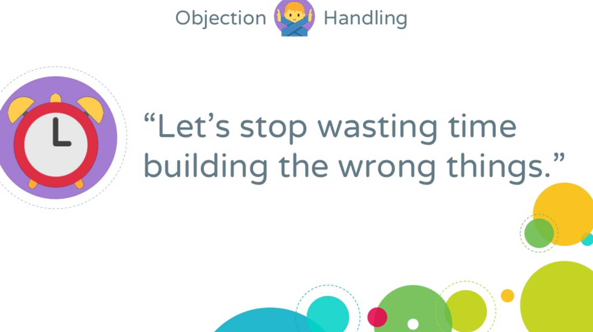

Something nobody has told you about your role as a product manager is that your job is essentially sales. Expect what may be the hardest selling job of your life. You will not be trained or even given help to get started. Nobody will tell you that the hardest product-management skill is managing people. As co-founder of ProdPad and Mind the Product, I have worked with hundreds of product managers and product teams.

- **There is no exception to this rule.**

Managing people is hard. People are unpredictable. People play politics at work, have their own opinions and expectations, are not neutral about events, and make more mistakes than they intend. There are also other groups of people who have more money and power than you and have no hesitation about using them.

When work goes in the wrong direction, I am sure your problem is not the roadmap. The issue is how you handle people problems.

That is how I opened my talk at this year’s Mind the Product conference in San Francisco. You can watch the full video, or go straight to the seven vital tactics I have learned over the years as a product manager.

## **Seven vital tactics for your work as a product manager**

### **1. Ask people questions that are not limiting.**

**One of the most stressful myths about being a product manager is the idea that the PM is the person who knows all the answers. That myth was once treated as true, but it is wrong. The assumption should be that you know less than your colleagues!**

Instead, show up with the best questions for drawing out the views of colleagues and others in the company. Encourage people to keep talking and explain in detail. Do this even if you are in a quarterly roadmap meeting or a kickoff for your new job as product manager.

- Please go on...

- What else?

- Tell me what you really think about this...

People go quiet when they feel their idea is not worth hearing, and that feeling is poison in a product-led company. The most valuable product ideas come from inside the business, as long as they are not rejected, ignored, or belittled.

**Effective product managers let people who want a chance to speak have that chance. You can do this too.**

### **2. Make your roadmap tell a story.**

A bad roadmap is a sign of structural problems in a company. It is a bad sign when your product roadmap uses acronyms. Another bad sign is product features that always need you or your Scrum Master to explain them. That means the most basic plans for the product’s future are not clear to the people working on them. Product management is storytelling. **If you want everyone aligned with you, your product roadmap must tell a story—a story about how you will reach your vision.**

Stories have enormous power to translate hard concepts and draw people toward you. That is why we write user stories, flows, or user personas and their attributes.

**Our job is to be the best person who communicates with others every day, and that includes aligning the organization around the product story.** Simplify the roadmap and focus on communicating what matters most: where you are now and what you want to do to move forward.

### **3. Play the “product tree” game.**

No roadmap for your product? Let’s build one together. The “product tree” is an excellent game for moving the team through early strategic discussions. Find a large empty wall and draw a tree on it. The trunk represents what you have now and want to build on. The branches represent different product areas and the direction the product should grow. The roots represent the infrastructure that keeps the product standing.

Ask the team to write as many product ideas as they can on sticky notes, then work together to place the notes on the tree.

Your job is to calmly organize the group while still letting the team debate where to put notes on the branches. This is your chance to see what matters and has higher priority for each person.

The end result is a start on your roadmap. Not a bad outcome for a fun afternoon project.

### **4. Invest in psychological safety.**

I once worked with a client who had been hired as head of product. In many interviews, people started crying. They were desperate and needed help. The culture was completely broken, and rebuilding trust and psychological safety was the first item on their agenda.

What does psychological safety mean? It exists when people feel comfortable speaking up, whether they are reporting errors or presenting to managers. Sometimes it can be as simple as a small change in language so people can express themselves safely. For example, it is better to ask:

- How might we...?

Using this kind of language turns an individual problem into a collective one so everyone has a stake in thinking about it. It replaces certainty with a hypothesis and does not make one person the center of criticism.

- I’ll bet that...!

“I’ll bet” is an interesting phrase. It lets you guess while still leaving room to be wrong and guess again. In the end it was not you who was wrong; the hypothesis was wrong. Another way to create a sense of safety at work is to amplify the voices around you so the team feels valued.

- I really liked that Sam suggested we do such-and-such.

- Hamid had already raised a good point about this.

**When you see that people have done good work, give them credit.** If you want the team to have your back, first make sure you have theirs.

### **5. When things get hard, build a product box.**

What happens when you have to sell your product vision to someone who is not buying? When you cannot get your boss on board with your plans, you need more than a positive outlook in front of them.

Get the team ready for an afternoon of art and challenge. I have another game for you.

The product-box game is a storytelling game. When you are thinking about a new feature, it is a sharp tool for testing whether that feature is sound. Start with decorative supplies and craft materials such as cardboard, stickers, glue, markers, and whatever else is at hand. Then think about how you would sell this feature (which is now a cardboard cereal box).

When you are done, the cereal box is covered with points the team sees as the biggest selling advantages. Practice selling your box to other groups and keep doing it until you are fluent.

You are developing something everyone has been able to contribute to and believe in. Now take it to your boss and try again, this time with the full support of your team.

### **6. If you see something terrible, say so.**

Sometimes you may need to upset people on the way to making your point. I once worked with a client named Penny whose executive team had told her the roadmap was unchangeable and there was no room for experimentation. That meant the entire plan and goals had to be delivered all at once.

By any standard that is madness. Investing in a roadmap nobody is willing to validate is a serious mistake.

This is what Penny and I did to make the point: she prepared a comparison table of the cost of five years of development versus the cost of building the wrong product. Penny showed leadership a figure that included the financial and technical cost of that mistake. The move worked.

Read more: [Working backward: how to reach your goals with the minimum technology you need](/en/docs/archive/backward-working/)

Her boss changed their mind and realized the roadmap was full of items that would not matter at launch. So they preferred to spend resources on experimenting and iterating on the product.

When you are told to cut project details and skip them, speak up. When you see something terrible, do not stay silent. It may be hard, but it is certainly easier than being locked into building a product nobody will buy.

### **7. Use the old “yes, and...” tactic.**

Have you ever heard someone say “yes, and...”? It is an improvisation exercise for keeping a conversation going, and also a useful sales method.

Use it to agree with people and their assumptions, then add something and bridge back to the goals of the meeting.

- Yes, and... that is exactly what I was thinking when I was designing the workflow.
- Yes, and... I agree our UI needs work, and that is why I suggested we look at this design.
- Yes, and... I think this issue is important. How about we run the project I proposed?

This method helps you negotiate for what you want without shutting other people down.

Try to know your executives and communicate with them in a way that has meaning for them. Identify their goals, know how they get recognized, and see how you can solve their problems. This steers the conversation in the direction you want.

### **Bonus: learn to live with imposter syndrome\* [we all have it].**

<figure>

<figcaption>

I think instead of worrying about why people don’t believe you, you should worry about why you don’t believe in yourself.

</figcaption>

</figure>

Finally, remember: **do not apologize for what you do not know. You are not behind anyone, and you are not alone in this. We are all winning here.**

A small amount of imposter syndrome is useful. It means you have self-awareness. What I have shared here is the result of more than a decade in product management, and it does not happen overnight. Great products are built through learning, iteration, and refinement; the same is true of successful product managers.

**No two product managers have the same challenges, because all of us work with products whose culture is shaped by different people, personalities, and politics.**

**What is the best way to speed up your progress?**

Put yourself among other product managers and ask for help. You will get it.

**\* Imposter syndrome:** a psychological phenomenon in which people cannot accept their successes. Despite external evidence that they succeeded through competition and effort, they believe they do not deserve success and are frauds. Success is attributed to luck, timing, or deceiving others, and they do not accept that they are intelligent or hard-working. (Wikipedia)

Source: [an article by Janna Bastow, founder of ProdPad](https://www.prodpad.com/blog/essential-skills-for-product-manager-roles/)

To read more articles on [product basics](/en/categories/product-basics/), click here.
