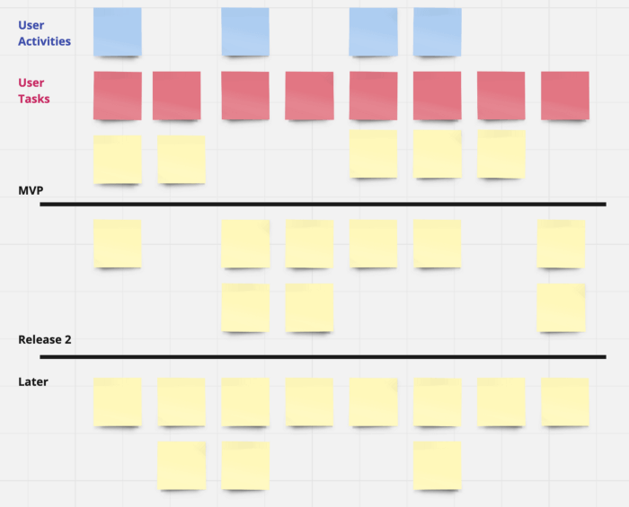
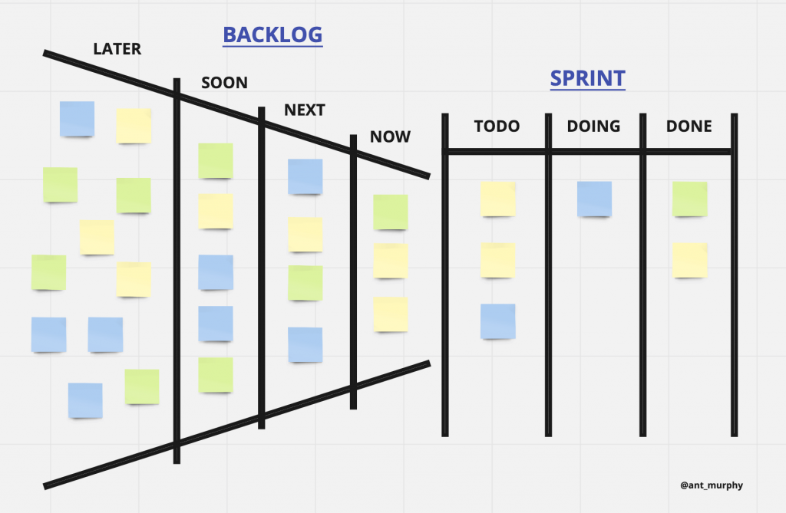
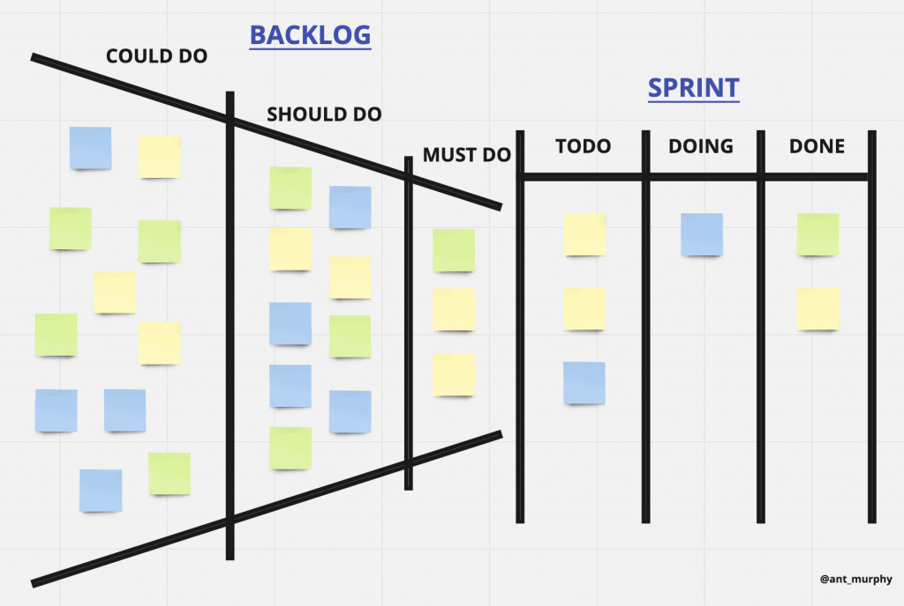
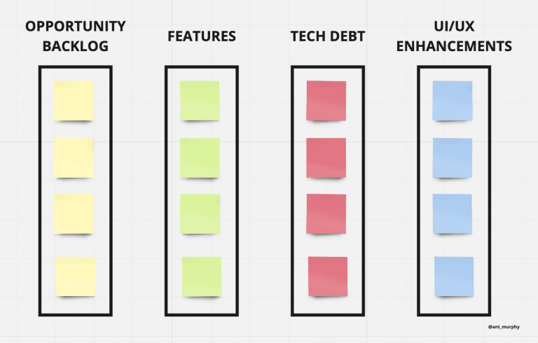
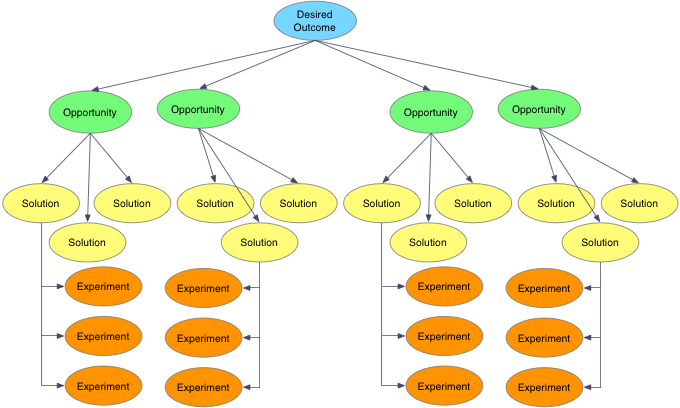
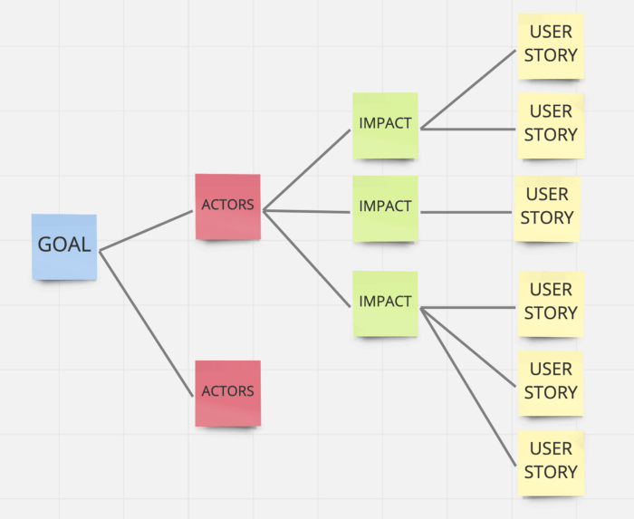
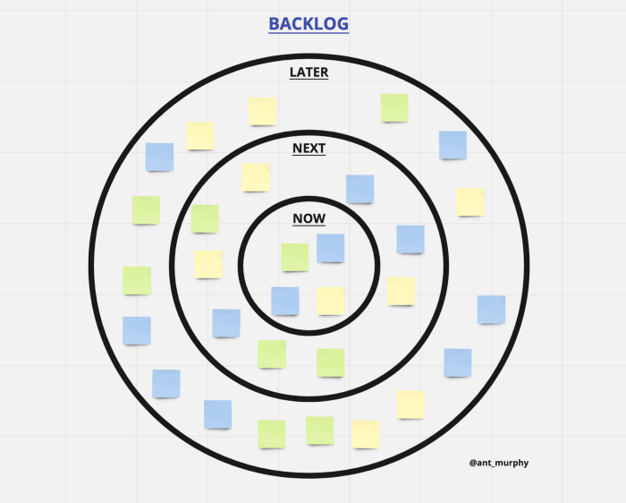
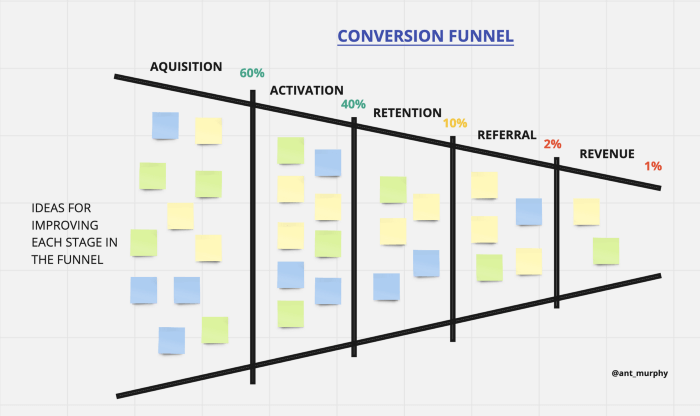

One of the main challenges for every product manager is how to manage and arrange product backlogs. Backlog management can have a large effect on how product goals move forward, especially if that management and prioritization is done effectively. In this article we look at different methods for managing backlogs.

### Method 1: User Story Map

In this method you get an overall view of the backlogs for each product, and the product manager also gets a view of [user story mapping](/en/docs/archive/userstory-mapping/). That makes the work that needs to be done at each stage much clearer.

### Method 2: Idea Funnel Backlog

An excellent way to have an overall view of backlogs and to help with prioritizing and focusing execution. You can group work by priority, or, like a roadmap, specify when each item will be done.

### Method 3: Opportunity Backlog

In this method, also called dual-track development, backlogs are split into two groups: the first for problem-solving and the second for implementation. After ideas are raised, every aspect is examined. If they help product development, they move to the development team for implementation; otherwise they are set aside. Note that in this method team agility may be lost or reduced a great deal.

### Method 4: Classes of work

Another way to manage backlogs is to group them by class of work. Each item should sit in its related work class. For example, a project might have classes for new feature, bug, technical work, design, and so on. In practice this splits the whole backlog into several smaller backlogs.

### Method 5: Tree Backlog

This method is used to manage large projects. Each branch of the tree contains the work for one category of the project. That makes the tree method very effective for separating and distinguishing types of work. As with Opportunity Backlog, team agility may be challenged.

### Method 6: Impact Map Backlog

This method is similar to the tree method, except that instead of grouping by work category, the emphasis is on why the work is done and the effect it can have on moving the project forward. This method is very close to, and dependent on, OKRs.

### Method 7: Circle Backlog

The circle method combines Tree Backlog (which grouped work by related work category) and Idea Funnel Backlog (which displayed prioritization clearly). In this method you can place work in its related category and apply prioritization at the same time. One of the best methods for implementing agile work is this one.

### Method 8: Conversion Funnel Backlog

One of the best-known and most popular methods for managing backlogs. It has a strong effect on how teams focus on prioritizing execution. Product managers can make the best choices when selecting work and assigning it to each team.

This article aimed to introduce the best-known methods for managing a backlog effectively. Each method has its own principles and rules. Our source is [this article](https://productcoalition.com/8-different-ways-to-organize-your-backlog-to-make-it-more-impactful-a472684d093b); if you want to learn more about each method, you can read it there.
