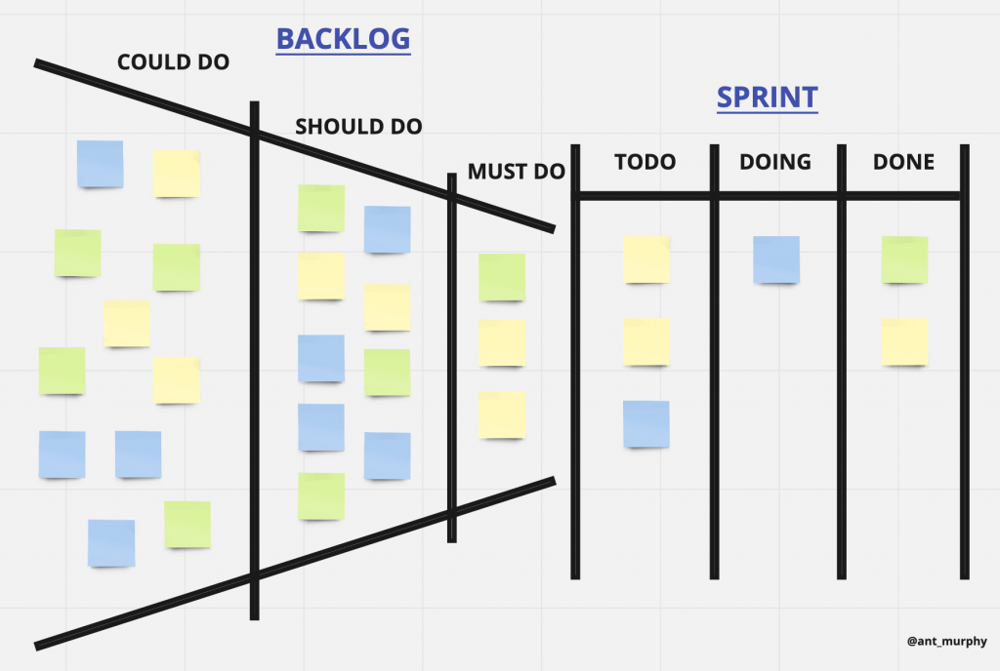
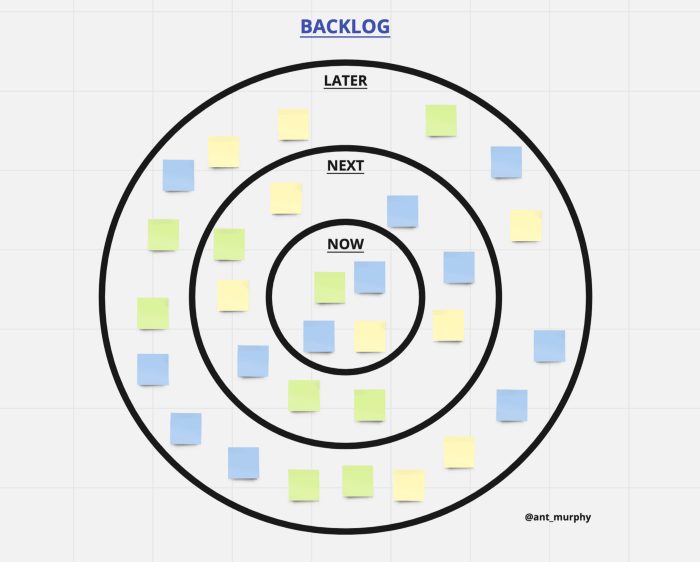

یکی از اصلی‌ترین چالش‌های هر مدیر محصول، نحوه مدیریت و چینش بک‌لاگ محصولات است. مدیریت بک‌لاگ‌ها می‌تواند در نحوه پیشبرد اهداف هر محصول تاثیر بسیاری داشته باشد. بخصوص اگر این مدیریت و الویت‌بندی به نحو اثرگذاری انجام پذیرد. در این مقاله می‌خواهیم به روش‌های مختلف مدیریت بک‌لاگ‌ها بپردازیم.

### روش اول: User Story Map

در این روش، یک نمای کلی از بک‌لاگ‌های موجود برای هر محصول بدست می‌آوریم و علاوه بر آن، چشم‌اندازی از [یوزر استوری مپینگ](https://theminiceo.ir/product-discovery/userstory-mapping/) نیز در اختیار مدیر محصول قرار می‌گیرد. که این موضوع کارهایی که در هر مرحله بایستی به انجام برسند را به خوبی مشخص می‌کند.

### روش دوم: Idea Funnel Backlog

یک روش عالی برای داشتن یک دید کلی از بک‌لاگ‌ها و همچنین کمک به الویت‌بندی و تمرکز انجام بک‌لاگ. می‌توان بر اساس الویت انجام کارها را دسته بندی کرد و یا همانند یک نقشه راه، زمان انجام هر یک را مشخص نمود.

### روش سوم: Opportunity Backlog

در این روش که Dual track development نیز نامیده می‌شود، بک‌لاگ‌ها به دو دسته تقسیم می‌شوند، دسته اول به حل مسئله و دسته دوم به پیاده سازی. در اینجا پس از مطرح شدن ایده‌ها، تمام جوانب آن مورد بررسی قرار می‌گیرند و اگر در جهت کمک به توسعه محصول قرار داشته باشند برای پیاده‌سازی به تیم توسعه منتقل می‌شوند و درغیراینصورت کنار گذاشته می‌شوند. دقت شود در این روش ممکن است چابکی تیم از بین برود و یا تا حد زیادی کاهش یابد.

### روش چهارم: Classes of work

یکی دیگر از روش‌های مدیریت بک‌لاگ‌ها، دسته‌بندی آن‌ها بر اساس کلاس کاری است. به این ترتیب که هر کار می‌بایست در دسته کاری مربوط به خود قرار داده شود. برای مثال در یک پروژه می‌توان دسته فیچر جدید، باگ، کار فنی، طراحی و... داشت. در واقع اینکار تقسیم کردن کل بک‌لاگ به چند دسته بک‌لاگ کوچکتر است.

### روش پنجم: Tree Backlog

از این روش در مدیریت پروژه‌های بزرگ استفاده می‌شود. هر شاخه از این درخت شامل کارهای یک دسته از پروژه می‌شود. از این رو، روش درختی یک روش بسیار کارآمد برای جداسازی و تفکیک انواع کارها می‌باشد. در این روش نیز همانند روش Opportunity Backlog ممکن است چابکی تیم‌ها به چالش کشیده شود.

### روش ششم: Impact Map Backlog

این روش نیز مشابه روش درختی است با این تفاوت که به جای دسته‌بندی بر اساس گروه کاری، تاکید بر دلیل انجام کار و اثری که می‌تواند بر پیشبرد پروژه داشته باشد، است. این روش به OKR  بسیار نزدیک و وابسته عمل می‌کند.

### روش هفتم: Circle Backlog

روش دایره‌ای ترکیبی از Tree Backlog (که بر دسته‌بندی کارها بر اساس گروه کاری مربوطه تاکید داشت) و Idea Funnel Backlog (که الویت‌بندی کارها را به درستی نمایش می‌داد) است. در این روش می‌توان کارها را در دسته‌بندی مربوط به خود جای داد و همزمان الویت بندی را هم برای کارها درنظر گرفت. یکی از بهترین روش‌ها برای پیاده سازی چابک در کارها، استفاده از این روش است.

### روش هشتم: Conversion Funnel Backlog

یکی از شناخته‌شده‌ترین و محبوب‌ترین روش‌ها برای مدیریت بک‌لاگ‌ها است. در تمرکز تیم‌ها برای الویت‌بندی انجام بسیار تاثیر گذار است. و مدیران محصول برای انتخاب کارها و سپردن آن‌ها به هر تیم، می‌توانند بهترین انتخاب‌ها را داشته باشند.

در این مقاله سعی شد تا با شناخته‌شده‌ترین روش‌های مدیریت بک‌لاگ بطور موثر آشنا شویم. هر یک از این روش‌ها دارای اصول و قواعد مربوط به خود هستند. منبع ما برای این مقاله [این نوشته](https://productcoalition.com/8-different-ways-to-organize-your-backlog-to-make-it-more-impactful-a472684d093b) است که می‌توانید در صورت تمایل و آشنایی بیشتر با هر روش، به آن مراجعه کنید.
