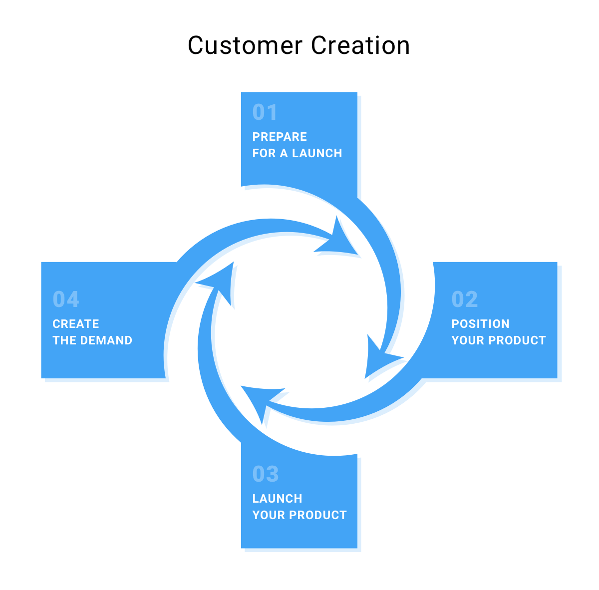

تابحال نام Everpix را شنیده‌ایده؟ Google Waveچطور؟ نشنیده‌اید؟ نگران نباشید، موضوع سورپرایز کننده‌ای نیست. اولی نام یک اپلیکیشن موبایل است که تصاویر موجود در گوشی شما را مرتب می کند. این اپلیکیشن در سال ۲۰۱۱ رونمایی شد و در سال ۲۰۱۳ از کار افتاد چراکه کاربران این محصول را نمی خریدند. Google Wave نیز یک پلتفرم ارتباطی گوگل بود که در سال ۲۰۱۰ راه اندازی شد و ۲ سال بعد بسته شد به این علت که کاربران آن نحوه استفاده از آن را متوجه نمی شدند. ت**وسعه مشتری به شما کمک می کند تا به سرنوشت محصولاتی که به خاطر عدم آگاهی کافی از مشتری شکست می خورند دچار نشوید.**  

به وضوح روشن است که این محصولات بدون دخالت دادن کاربران در طراحی آن محصول بوجود آمدند. صاحبان محصول به فرضیات و حدسیات خود کفایت کردند و به مهمترین بحث در مدیریت محصول که پیدا کردن تناسب محصول با بازار است توجهی نکردند. این دو محصول به نیازهای بازار پاسخ ندادند. کاربران این دو محصول ارزشی که محصولات خلق می کردند را متوجه نشدند و به همین دلیل فروش این دو محصول بسیار پایین بود. **در این شرایط ربطی ندارد که ارایه دهنده محصول کدام شرکت است یا اینکه چقدر هزینه صرف تولید این محصول شده است. همیشه شانس اینکه یک محصول جدید شکست بخورد وجود دارد. اما در عوض راه هایی وجود دارد که بتوانید با بکارگیری آن ها شانس شکست را کاهش دهید.**  

## **مدل توسعه مشتری و چگونگی بکارگیری آن**

"**نمی‌توانید هیچ حقیقتی را درون ساختمان محل کار خود بیابید، پس از ساختمان بیرون رفته و به دنبال کشف حقیقت باشید**." این یکی از جملات معرفی استیو بلنک خالق رویکرد توسعه مشتری است. این موضوع به خوبی مفهوم مرکزی توسعه مشتری را توضیح می دهد.  

پس از اینکه یک ایده خیلی خوب به ذهن شما خطور کرد، گروهی از توسعه دهندگان نرم افزار و طراحان گرافیک دست به کار شده تا این ایده را تبدیل به یک محصول کنند. آن‌ها تمامی مراحل را مخفی نگه می دارند، که این خود یک اشتباه بسیار بزرگ است - آن‌ها هیچ بازخوردی از کاربران خود نمیگیرند که متوجه شوند آیا در مسیر درستی حرکت می کنند یا خیر. این کار ادامه پیدا می کند تا زمانیکه یکی از رسانه های محبوب و پرطرفدار ار محصول آن ها رونمایی می کند که باعث ورود و ثبت نام هزاران نفر در آن محصول می شود. از آنجاییکه تب نوآوری کاهش پیدا می کند تنها ۱۰ تا ۱۵ درصد از این کاربران جدید در محصول باقی می مانند و محصول نتوانسته است اهداف فروش خود را پشت سر بگذارد. اینجا همانجایی است که زمان شرمندگی و تاسف فرا می‌رسد. پس از آن اعضای استارتاپ کمی صبر می کنند و می فهمند که بایستی از ساختمان خود خارج شوند و به مصاحبه با مشتریان واقعی بپردازند و بازخوردهای آن‌ها را جمع‌آوری کنند تا مدیران محصول بتوانند محصول را بهبود بخشند. اگر این فعالیت موفقیت‌آمیز باشد شاید موفقیت پیش رو باشد.

**استیو بلنک توسعه مشتری را بصورت فرایندی برای دریافت دیدگاه ها و بینش های مشتری معرفی می کند که می توانید با استفاده از آن ایده های خود را در زمان توسعه محصول بهبود، بازبینی و بهینه سازی کنید.** مهمترین بخش از توسعه مشتری این است که به شما کمک می کند تا مشتری های خود را پیدا کرده و برای آن‌ها محصول و پیام مرتبط با آن ها را بسازید. در واقع همچون یک استراتژی است که منحنی رشد استارتاپ را تحت تاثیر خود قرار می‌دهد و راهی برای ساختن بهترین راه‌حل‌ها برای کاربران شما با کمک بینش هایی که از آن ها کسب کرده‌ایم به حساب می‌آید.

**توسعه مشتری را بکار میگیریم تا دریابیم:**

- آیا فرضیه محصول ما وجود خارجی دارد یا خیر؛

- راه حل ارایه شده واقعا مشکلات مشتری را حل می کند یا خیر؛

- مخاطب هدف ما از محصول استفاده می کند یا خیر؛

- مفهوم این قابلیت جدید برای محصولی که قبلا وجود دارد اثربخش خواهد بود یا خیر؛

- مشتری ها حاضرند یک مبلغ خاص را برای این محصول پرداخت کنند یا خیر؛

- و غیره

توجه داشته باشید که رویکرد توسعه مشتری را نه تنها می توان برای ارایه محصول به بازار استفاده کرد بلکه در تمامی چرخه محصولات قابل استفاده و بکارگیری می‌باشد. **توسعه مشتری را می‌توان در هر مرحله‌ای از ساخت محصول بکار برد چرا که این کار نیازمند منابع پردازشی عظیم نمی باشد و به سادگی قابل اجراست.**  

**توسعه مشتری خود شامل شناخت مشتری، اعتبارسنجی مشتری، ساخت مشتری و ساخت شرکت می باشد.** در ادامه هرکدام از این مراحل و بخش ها را باز کرده و وارد جزییات آن‌ها می شوید تا بتوانید با بکارگیری آنها بیشترین استفاده را از داده‌ها و اطلاعاتی که جمع‌آوری می کنید را داشته باشید.  

شناخت مشتری

توسعه مشتری یکی از کارهای خیلی مفید و کاربردی است که متاسفانه بسیاری از استارتاپ ها و حتی سازمان های بزرگ و قدیمی این مرحله را نادیده می گیرند. اما چرا؟ **چون آن‌ها نگران این هستند که شاید مشتری‌ها ایده آن‌ها را نپذیرفته و از محصول آن‌ها استفاده نکنند**. درست فکر می کنند چرا که ممکن است در خلال این فرایند توسعه مشتری متوجه همچین چیزی شوند.  

**توسعه مشتری همه اش درباره شناخت مشتری بالقوه شما است که منجر به آزمایش درستی فرضیات محصولی شما می‌شود.** در مراحل اولیه محصول شما به شما امکان تشخیص اینکه مفهموم اصلی و کلی شما چقدر قابل پیاده سازی است و چه چیزهایی باید بهبود پیدا کنند/ حذف شوند/ اضافه شوند صحبت می کند.  

### فرضیات خود را بیان کنید

اینکه بتوانیم فرضیات خود را با مشتریان واقعی تست کنیم کاری واقعا سخت است. به هرحال سخت به معنی امکان ناپذیر بودن نیست. استیو بلنک اعتقاد دارد که بوم مدل کسب و کار یک ابزار قدرتمند و کاربردی برای توسعه این فرضیات به حساب می آید.

بوم مدل کسب وکار یک استراتژی ۹ بخشی است که توسط [الکساندر اوستراولدر](https://alexosterwalder.com/) (نظریه پرداز کسب و کار) و [یووس پیگنار](https://en.wikipedia.org/wiki/Yves_Pigneur) (دانشمند کامپیوتر) توسعه داده شده است. این دو نفر هردو در لیست ۵۰ تاثیرگذار در زمینه مدیریت دنیا شناخته شده اند.  

بوم مدل کسب و کار کاری می کند که شما سوالات درستی در هر مرحله از کسب و کار خود از خود بپرسید و پاسخ ها را با یکدیگر مقایسه کنید تا بتوانید در نهایت فرضیات خود را مورد بررسی قرار دهید.  

## اما بوم مدل کسب و کار چگونه کار می کند؟

**۱- ارزش پیشنهادی**: محصول شما چه نوع مشکلی را حل می کند؟ محصول شما چه نیازی را رفع می کند؟ قابلیت های اصلی این محصول چه چیزهایی هستند؟ مشتریان شما چه مزایایی دریافت می کنند؟

**۲- بخش بندی مشتریان**: مشتریان شما چه کسانی هستند؟ موقعیت جغرافیایی، دموگرافی، محیط اجتماعی و … آن ها چیست؟ یک مشتری معمولی شما چه ویژگی های خاصی برای خود دارد؟  

**۳- کانال ها**: چگونه می خواهید محصول خود را به فروش برسانید؟ چگونه با مشتریان خود ارتباط برقرار می‌کنید؟

**۴- ارتباط با مشتری**: چگونه ارتباط خود را با مشتری ایجاد می‌کنید، نگهداری می‌کنید و رشد می‌دهید؟

**۵- جریان های درآمدی**: شرکت شما از هر بخش از مشتریان چگونه به سود می‌رسد؟ کدام یک از ارزش های محصول شما بیشتری سود را برای شما به ارمغان می‌آورد؟

**۶- منابع**: برای اینکه بتوانید کار خود را انجام دهید به چه منابعی (سرمایه، اعتبار، دارایی، ارتباط و …)‌ احتیاج دارید؟

**۷- مشارکت**: آیا واقعا به شریکان محتلف نیاز دارید؟ چه منفعتی از هرکدام از آن ها دریافت می‌کنید؟ عملکرد کلیدی هرکدام از آن ها چیست؟

**۸- فعالیت ها**: تیم شما برای اینکه این کسب و کار را به پیش ببرد و نقشه‌های شما را دریابد چه کارهایی باید انجام دهد؟

**۹- هزینه ها**: کل هزینه شما برای توسعه محصول چقدر است؟ چه منابع یا فعالیت هایی پرهزینه هستند؟  

### **فرضیات خود را آزمایش کنید**  

با پاسخ دادن به این سوالات و ساخت یک بوم مدل کسب و کار فرضیات اولیه خود درباره بازار و محصول را بوجود آورده‌اید که در مرحله اولیه توسعه این رویکرد برای شما اهمیت بالایی دارند. همچنین فرصت‌هایی را بدست می‌آورید که بتوایند به مشتری خود نزدیک شده و در نهایت آن چیزی را بسازید که واقعا نیاز دارد.  

اینجا همان جایی است که جذابیت موضوع آشکار می شود. برای اینکه بفهمید آیا مشتری محصول شما را می خواهد یا نیاز دارد، بدون شک بایستی به چند نماینده از جامعه مخاطب خود دسترسی داشته باشید و با آن‌ها صحبت کنید. البته مصاحبه به صورت برنامه ریزی شده و مرتب. این کار بخش مرکزی توسعه مشتری به حساب می‌آيد چرا که در حین مصاحبه ها با افراد حقیقی می توانید اطلاعات ارزشمندی بدست بیاورید. **مصاحبه ها می توانند شما را از ساخت محصولی که مشتری نمی‌خواهد یا اینکه نیاز ندارد نجات دهد. البته تنها در صورتی که سوالات درست پرسیده شود.**

دو دسته سوال برای پرسیدن وجود دارد که می توانید با استفاده از آن ها در مصاحبه خود نتیجه بگیرید. سوالات با پایان بسته و سوالات با پایان باز. دسته اول سوالاتی هستند که معمولا پاسخ آن ها صحیح/غلط، بله/خیر یا تعداد محدودی پاسخ می باشد. به همین دلیل است که **سوالات با پایان باز اثرگذاری بیشتری دارند و اطلاعات کارآمدتری به شما می دهند.**

**ویژگی‌های سوالات با پایان باز:**

- اطلاعات کیفی می‌‌دهند؛

- می‌توانید ارتباط عمیق تری میان مفاهیم مختلف پیدا کنید؛

- بینش هایی را کسب می‌کنید که در زمان انجام پرسشنامه از قلم افتاده بودند؛

- امکان درک بهتری از مشتری به شما می‌دهند؛

- دیدی از محدودیت ها و مشکلات محصول یا قابلیت های آن به شما می‌دهند؛

**سوالات با پایان باز یکی از عوامل کلیدی و اصلی در موفقیت در توسعه مشتری می باشد.** پس حتما در برنامه ریزی و فرایند آماده سازی آن ها را از قلم نیندازید.  

**پیشنهاد استیو بلنک** مرتب سازی این سوالات به شیوه زیر می باشد:

1. وارد شبکه ارتباطی خود شده و لیستی از ۵۰ نفر را آماده کنید (همکاران، همکاران قدیمی، دوستان، حسابداران، وکیلان، فروشنده ها و ...).

3. پس از اینکه این افراد که پتانسیل تبدیل شدن به مشتری برای شما را دارند، یک پرزنتیشن شامل فرضیات موجود آماده کنید. هدف این پرزنتیشن فروش محصول نیست بلکه بایستی با استفاده از آن پس از صحبت کردن درباره مشکل مخاطب و راه حلی که شما برای آن ارایه کرده‌اید از مشتری بازخورد بگیرد. دقت داشته باشید که **هدف از انجام این مصاحبه‌ها متقاعد کردن افراد به تایید فرضیات خود نیست. بلکه هدف جمع‌آوری اطلاعات و نظرات مشتریان است که شما به تنهایی نمی توانستید به آن ها برسید.** و درنهایت مصاحبه ابزاری است که به شما کمک می کند به این اطلاعات دستیابی پیدا کنید و مسیر توسعه مشتری را به پیش ببرید.

بخش مهم دیگر از آزمایش فرضیات خود یادگیری بیشتر درباره عادات، شغل، کسب و کار و روتین مشتریان شماست چراکه دانستن این موارد به شما کمک می‌کند تا درک مناسب‌تری از مشتریان خود داشته باشید. این بینش‌ها می توانند در موفقیت شما سهم بسزایی داشته باشند. البته این اطلاعات به تنهایی کافی نیستند. بلکه این اطلاعات در کنار اطلاعات بازار، شناخت رقیبان محصول، روندهای اقتصاد و بازار می توانند به شما کمک کنند تا بتوانید وارد بازار شده و سهم خوبی از آن را بدست بیاورید.  

پس از اینکه اطلاعات مختلف را جمع‌آوری کردید و فرضیات خود را مورد آزمایش قرار دادید زمان این است که حدس هایی که قبلا زده اید را با نتایجی که از این اطلاعات بدست آوردید مقایسه کنید. اینجاست که بوم مدل کسب و کار به کمک شما می‌آید.

### **بوم مدل کسب و کار خود را بسازید**  

کمی به عقب برگشته و با استفاده از داده‌ها و اطلاعات جدیدی که بدست آورده‌اید یک مدل کسب و کار جدید بسازید. وب سایت [Strategyzer](https://www.strategyzer.com/) اعلام کرده است که تا بحال بالای ۵ میلیون نفر فایل [بوم مدل کسب و کار](https://www.strategyzer.com/canvas/business-model-canvas) را دانلود کرده‌اند و درصد بسیار زیادی از افراد هم از این مدل استفاده کرده‌اند. زمانیکه شما بوم مدل کسب و کار خود را با توجه به اطلاعات و داده‌های جدیدی که بدست اورده‌اید بازنویسی می‌کنید، در ابتدای امر به نظریه‌های جدیدی برای توسعه کسب و کار خود می‌رسید. سپس با مقایسه مدل قبلی و مدل جدید می‌توانید فرضیاتی که داشتید را زیر سوال ببرید و صحت آن‌ها را دریابید. این امر به شما نشان می‌دهد که تا چه اندازه می توانید روی حدسیات و فرضیات خود در آینده حساب باز کنید.  

### **نمونه موردی**

اجازه دهید با ارایه یک نمونه موردی و مثال این موضوع را برای شما شفاف تر و قابل درک تر کنم. تصور کنید می خواهید وارد بازار Selfie Drone ها شوید. پس از نوشتن بوم مدل کسب و کار خود به لیستی از قابلیت ها برای این محصول رسیدید:

- وزن: ۲۰۰ گرم باشد تا نیازی به دریافت گواهینامه FAA نداشته باشید

- کنترل از طریق Wi-Fi

- کنترل با GPS

- کیفیت ویدیو: 720p (بهتر از دیگر دستگاه های موجود)

- قابلیت حمل

- یک اپلیکیشن ساده برای راه اندازی و استفاده

- قابلیت جدید: دانلود مستقیم تصاویر از گوشی به کامپیوتر

- قابلیت جدید: ۲۰ دقیقه زمانه پرواز

حال لیستی از مشتریان بالقوه محصول خود را آماده می کنید که شامل دوستان نزدیک، کاربران فیسبوک، صاحبان Drone و … می‌شود. سپس به دنبال تست فرضیات خود می‌روید و به نظر می‌رسد که افراد مختلف یک محصول کوچک و قابل حمل با فابلیت های پیشرفته را دوست دارند. متوجه می شوید که کاربران بالقوه نگران ۲۰ دقیقه زمان پرواز هستند چراکه زمان شارژ شدن دستگاه را از ۱۲۰ دقیقه به ۴ ساعت افزایش می‌دهد. در این فرایند متوجه می شوید که مشتریان شما دوست دارند امکان انتخاب رنگ بدنه در هنگام خرید وجود داشته باشد بخصوص رنگ هایی همچون سفید، سیاه، آبی تیره و سبز.

حال سراغ مطالعه و بررسی رقبای محصول خود در بازار می روید و پیشنهادهای آن‌ها را مورد بررسی قرار می‌دهید. پس از بررسی آن ها بوم مدل کسب و کار خود را بازبینی کرده و همچنین استراتژی توسعه محصول خود را نیز دستکاری می‌کنید.

البته که این تنها بخش کوچکی از فرایند کشف مشتری بود که به شما یک ایده عمومی و کلی می‌دهد. اما نباید اهمیت این موضوع را نادیده بگیرید بخصوص اینکه نیرو و تلاش زیادی از شما نمی‌خواهد و خیلی ساده می‌توانید همه این کارها را انجام دهید. در هر صورت بایستی اطلاعاتی که بدست می‌آورید را اعتبار سنجی کنید و ریسک ورود به بازار با جایگاه یابی بد و نامناسب محصول خود را کاهش دهید.  

## **اعتبارسنجی مشتری**

**بر اساس تحقیقی که توسط CB Insights انجام شد، ۴۲ درصد استارتاپ ها به خاطر عدم نیاز بازار به محصول آن ها، ۱۸ درصد به خاطر مشکلات قیمت گذاری و ۱۴ درصد نیز به خاطر نادیده گرفتن مشتری شکست می خورند**. با این اوصاف اگر فکر می‌کنید که هر آنچه باید در مرحله کشف مشتری انجام دهید را انجام داده اید و اطلاعات کافی برای رونمایی کامل محصول خود و آغاز فروش را دارید، کمی بیشتر فکر کنید. شما باید داده هایی که از محیط واقعی بدست می‌آورید را مورد تست و آزمایش قرار دهید و این موضوع از طریق اعتبارسنجی مشتری صورت می‌پذیرد.

**اعتبارسنجی مشتری فرایند کسب اطمینان از این است که شما به درستی مشتری را شناخته‌اید و جایگاه‌یابی مناسبی برای محصول و شرکت خود توسعه داده اید.** این موضوع خیلی نزدیک به مفهوم استارتاپ ناب است که توسط Eric Reis در سال ۲۰۰۸ ایجاد شد. این مفهوم شامل آزمایش بر اساس فرضیات و چرخش در نسخه های مختلف محصول براساس اعتبارسنجی می باشد. مفهوم MVP نیز از دل همین موضوع بیرون آمده است که بتوانیم با ساخت یک محصول اولیه و کوچک بازخورد افراد واقعی را بدست بیاوریم.

**بازخوردهای MVP به ما کمک می کنند تا:**

- بفهمیم که اصلا آماده ورود به بازار هستیم یا نه

- مشتریان خود را بهتر بشناسیم

- نقشه راه فروش خود را طراحی کنیم

- بفهمیم که آیا زمان مناسبی برای رشد فروش و بازاریابی می باشد یا خیر

### **کمینه محصول پذیرفتنی (MVP)  
**

نمی خواهم شما را گیج کنم. **MVP یک محصول نیست بلکه نسخه ای است که کمترین قابلیت ها را دارد تا مشکل مشتری را حل کند.** این نسخه از محصول را با کمترین منابع برای اعتبارسنجی اولیه ایده تجاری خود می سازیم. نسخه اولیه و کاربردی محصول زمانی ساخته می شود که با استفاده از این MVP توانسته باشیم اطلاعات کافی بدست آورده باشیم.  

**مزیتی که MVP برای شما دارد** این است که هرجای مسیر که متوجه اشتباه بودن فرضیات خود شدید، هزینه مالی و زمانی زیادی نکرده‌اید و خیلی سریع تر پاسخ سوال ها و فرضیات خود را بدست می‌آورید چرا که فرصت تغییر مسیر دارید.  

### **نمونه موردی**

اعتبارسنجی مشتریان محصول خود که در این جا منظور از محصول همان Selfie Drone است یک فرایند مرحله به مرحله است که در این مسیر احتمال اینکه اشتباه های زیادی از ما سر بزند وجود دارد. تصور کنید که اولین نسخه از اپلیکیشن خود با کمترین قابلیت ها را جهت کنترل Drone ها، فیلم برداری و تصویربرداری در اختیار کاربران خود قرار داده‌اید. در این نسخه امکان کنترل رزلوشن تصویر، حالت های پروازی مختلف، دنبال کردن چهره شخص و .. را پیاده سازی نکرده اید چراکه این ها همگی قابلیت های اضافی به حساب می‌آيند. در این حالت ۳ سناریوی مختلف می تواند رخ دهد:

1. همه چیز به خوبی پیش می‌رود و مشکل مشتری حل شده و وی خوشحال بنظر می‌رسد. کار با اپلیکیشن بسیار ساده بوده و همچنین کنترل کردن Drone از دست هرکسی برمی‌آید. خب مرحله بعدی شما ارایه برخی از قابلیت‌های اضافی در محصول خود می‌باشد.

3. اپلیکیشن شما خیلی قابل درک نیست و دکمه ثبت تصویر به راحتی در دسترسی کاربر نیست. اینجاست که باید با دقت به بازخورد کاربر دقت کرده و در صورت نیاز تغییرات لازم را در محصول خود اعمال کنید.

5. اپلیکیشن نیازهای مشتری را رفع نمی کند و نرخ رضایت بسیار پایین است و فروش اوضاع خوبی ندارد. اینجاست که باید به مشتری برگردید و موضوعات مختلف را با وی بررسی کنید تا مشکلات را پیدا کنید.

این خروجی‌ها نشان دهنده اهمیت موضوع توسعه مشتری می‌باشد که چگونه می تواند در هر مرحله از محصول به داد شما برسد. پس حتما بخش های مختلف توسعه مشتری را در چرخه کاری خود قرار دهید تا با هزینه و تلاش کمتر نتایج دقیق تر و کاراتری بدست بیاورید.  

## **ساخت مشتری**

این مرحله بدون حضور دو مرحله قبل وجود نخواهد داشت. ساخت مشتری یعنی دستیابی به محدوده بزرگتری از مشتریان. پس از اینکه شما آن‌ها را کشف و اعتبارسنجی نمودید، درک درستی از افرادی که از محصول شما استفاده می‌کنند و همچنین اینکه در چه جاهایی می‌توانید آن‌ها را پیدا کنید بدست می‌آورید. حال زمانی است که باید به بازاریابی خود قدرت بخشیده و مراحل زیر را دنبال کنید:

- **آماده رونمایی از محصول شوید**. اینکه نام محصول را در رسانه های مختلف به زبان بیاورید کار بسیار مهمی است و برای این کار کافی است یک استراتژی رسانه ای دقیق و منظم طراحی کنید. بوسیله این برنامه قادر خواهید بود با رسانه ها و مشتریان خود که مخاطب هدف شما به حساب می‌آيند وارد ارتباط شده و محصول خود را پیش روی آن‌ها قرار دهید. این ها همگی تاثیرگذاران بر روی مصرف کنندگان محصول شما به حساب می‌آیند که از استفاده از محصول شما راضی شده و به دیگران نیز توصیه می‌کنند بخصوص در شبکه های اجتماعی. آن‌ها افرادی کلیدی و ضروری برای فروش شما به حساب می‌آیند. پس مطمین شوید که محصول خود را در کانال‌های مناسبی به مخاطبان خود ارایه می کنید.

- **محصول خود را جایگاه یابی کنید**. در این مرحله نیاز دارید تعیین کنید که می خواهید وارد چه بازاری شوید: بازاری که از قبل وجود دارد، بازاری گوشه ای، بازار کم هزینه یا بازاری کاملا جدید. پس از اینکه جهت حرکت خود را شناسایی کردید، یا باید به یکسری قوانین پایبند باشید و از آن‌ها پیروی کنید (برای بازارهای موجود)، یا اینکه روی روش های جدید منحصر بفرد خود سرمایه گذاری کرده و با استراتژي جدید خود را به مشتری‌های خود معرفی کنید(برای بازارهای جدید). اینجا همان مرحله‌ای است که باید حدس بزنید بهترین چیز برای معرفی محصول شما چیست.

بیشتر بخوانید: [جایگاه یابی محصول + نمونه موردی بیس کمپ](https://theminiceo.ir/product-strategy/%D8%AC%D8%A7%DB%8C%DA%AF%D8%A7%D9%87-%DB%8C%D8%A7%D8%A8%DB%8C-%D9%85%D8%AD%D8%B5%D9%88%D9%84-%D9%86%D9%85%D9%88%D9%86%D9%87-%D9%85%D9%88%D8%B1%D8%AF%DB%8C-%D8%A8%DB%8C%D8%B3-%DA%A9%D9%85%D9%BE/)

- **محصول خود را رونمایی کنید**. در این مرحله قرار است متخصصان و علاقه مندان به محصولات حوزه خود را با کمک روابط عمومی درگیر کنید. باید از اشتباه های کوچک پرهیز کنید و مراقب تمامی رفتارهای خود در مواجهه شدن با مخاطبان خود باشید. به همین دلیل است که به یک استراتژي مرحله به مرحله برای رونمایی نیاز دارید. اینجاست که نتیجه کار بر اساس کیفیت ارایه شما به مخاطبان دیده می شود.

- برای محصول خود نیاز ایجاد کنید. شاید با خود اینگونه فکر کرده باشید که پس از یک رونمایی رسمی و سروصدا کردن در رسانه های مختلف دیگر نیازی به ایجاد نیاز در مخاطب خود ندارید. اما حقیقت چیز دیگری است. بطور متوسط یک خانواده آمریکایی در ۸۵٪ از خریدهای خود ۱۵۰ ایتم یکسان را می‌خرند. به نظر شما تغییر این عادت کار ساده ای است؟ نه این چنین نیست. به همین دلیل است که باید پای خود را چند قدم جلوتر بگذارید و نیاز ایجاد کنید. استراتژی های مختلفی هستند که به شما در این راستا کمک می کنند:
    - پیشنهادهای با زمان محدود
    
    - تیزرهای تبلیغاتی
    
    - جشنواره های مختلف به کمک محتوای تولید شده توسط کاربر
    
    - فروش انحصاری
    
    - سایر موارد

ساخت مشتری مجموع اجرای استراتژی های مختلف، پیاده سازی نقشه های کاری و آغاز فروش واقعی می باشد. قبول دارم که انجام این کارها ساده نیست چرا که باید بتوانید مشتری و محصول خود را به درستی تعریف کنید. بدون شک فرایندی زمان بر بوده که برای موفقیت در آن باید تلاش‌های بسیار زیادی از سمت شما صورت پذیرد. پس آماده باشید.  

### **نمونه موردی**

به همان مثال Selfie Droneها برگردیم. برای آغاز فرایند ساخت مشتری ابتدا باید یک تیم مارکتینگ تشکیل دهید که برنامه شما را درک کند و ارزش واقعی که محصول شما ایجاد می کند را بفهمد. این کار به شما امکان توسعه یک استراتژي رسانه ای برای دستیابی به مشتریان و مخاطبان هدف از طریق کانال هال مناسب می‌دهد. برای مثال ممکن است خبر انتشار محصول شما را در وب سایت هایی همچون Businesswire.com, Neurala.com, DPreview.com و Personal-drones.net منتشر کنند. حتی ممکن است در یوتیوب از یکسری افراد بخواهند که از محصول شما استفاده کرده و نظر خود را در استفاده از محصول منتشر کنند.  

بالاخره محصول شما وارد بازار گوشه ای خود شده است. بازاری که به اندازه خود در آن رقابت وجود دارد. بنابراین جایگاه یابی محصول باید شامل قابلیت‌هایی باشد که محصول شما را از میان دیگر محصولات مشابه جدا کرده و تمایز دهد. برای این کار باید یک جمله برای خود داشته باشید: یک Selfie Drone سبک که دو برابر دیگر Selfie Drone ها پرواز می کند.  با این جمله به مخاطبان خود نشان می‌دهید که محصول شما بیشتر از همه محصولات مشابه پرواز می کند.  

یکی از راه هایی که می توانید به وسیله آن برای محصول خود نیاز ایجاد کنید، درخواست از مخاطبان خود به تولید محتوا است. به عنوان مثال از مخاطبان خود می خواهید که ویدیوهایی از کار با محصول شما ارسال کنند. این محتوا توجه افراد بیشتری را به محصول شما جذب می کند و باعث می شود که افراد بسیار بیشتری با محصول شما آشنا شوند. این همان کاری بود که دوربین های GoPro انجام داد و نتیجه شگفت انگیزی بدست آورد.  

## **ساخت شرکت**  

این قسمت مرحله آخر از فرایند توسعه مشتری در مارکتینگ به حساب می‌آيد که یک استارتاپ را به یک شرکت رشد یافته و بزرگ تبدیل می‌کند. در این مرحله تمرکز شما از تحقیق و شناخت محصول و بازار به برنامه ریزی طولانی مدت و توسعه ماموریت شرکت تغییر پیدا می‌کند. البته این چیزی نیست که به خودی خود شکل پیدا کند. این خود شما و تیم شماست که بر مدیریت شرکت تسلط دارد و می‌تواند برنامه آن را برنامه‌ریزی کند. این موضوع یک تغییر جدی به حساب می‌آيد که نیازمند اقدام مرحله به مرحله شماست. در ادامه چند نکته در این زمینه در اختیار شما قرار داده شده است.  

### **رسیدن به مشتری**  

در ۳ مرحله گذشته تلاش کردید تا به مخاطبان اولیه‌ای برای محصول خود برسید که به دنبال یک راه حل سریع برای مشکل خود بودند. اما ممکن است این افراد تنها ۵ درصد از کل بازار شما را تشکیل دهند. حالا باید دایره مشتریان خود را بزرگ تر کرده و محصول را به مشتریان اصلی معرفی سازید. برای رسیدن به این هدف باید مدیران فروش مناسبی را استخدام کرده که روانشناسی مشتری را بشناسند:

- مشتریان اصلی شما به دنبال یک راه حل سریع و درجا نیستند. آن ها به دنبال یک محصول قابل اتکا و مطمین هستند.

- آن‌ها توسط نقد و بررسی های مخاطبان اولیه شما تحت تاثیر قرار نمی‌گیرند. آن‌ها به دنبال نظرات افراد مشابه خود هستند و به آن‌ها اعتماد بیشتری می کنند.

- آن‌ها مدت زمان بیشتری در مقایسه با مخاطبان اولیه با شما می‌مانند چرا که مخاطبان اولیه همیشه به دنبال محصولات جدیدتر هستند.

### **ماموریت خود را بسازید**  

بیایید با هم نگاهی به ماموریت PayPal بیندازیم - ساخت راحت‌ترین، امن‌ترین و به صرفه ترین راهکار پرداختی دنیا- پس از خواندن این ماموریت خیلی راحت با چشم انداز و اهداف PayPal آشنا می‌شوید حتی اگر در آنجا کار نکنید. و این همان چیزی است که شما نیز باید برای شرکت خود پیدا کنید.  

ماموریت به کارکنان شما درک بهتری از جایی که به سمت آن حرکت می‌کنید می دهد و دلیل کارهایی که باید انجام دهند را مشخص می سازد. این هدفی است که افراد را با هم متحد و یکپارچه می سازد تا با کمک یکدیگر سریع تر به موفقیت برسند. به همین دلیل است که باید ماموریت خود را پیدا کنید.  

### **ساختار مدیریت و ساختار شرکت خود را بازبینی کنید**  

ساخت محصول با کارکنانی خلاق که با علاقه و اشتیاق بسیار شب های طولانی را برای رفع مشکلات محصول و بهبود تجربه کاربری صرف می کنند یک تجربه هیجان‌انگیز است. اما اگر می خواهید کسب و کار خود را یک قدم جلوتر ببرید اطمینان پیدا کنید که آن‌ها نیز آماده این رشد و بزرگ‌شدن هستند و در مسیر این ماموریت با شما همراه می‌مانند.  

همچنین باید مطمین شوید که افرادی که پشت فرمان هدایت شرکت نشسته اند افرادی قابل اعتماد، اتکا، برنامه ریز و چابک هستند. اگر بتوانید از هیات‌مدیره شرکت خود در این مورد کمک بگیرید و نیروهای مدیریتی خود را بازبینی کنید می‌توانید انتخاب‌های بهتری داشته باشید.  

### **دپارتمان‌های خود را تشکیل دهید**  

در محیط استارتاپی معمولا افراد در ابتدای مسیر تنوع کارهایی که انجام می‌دهند بسیار زیاد است بخصوص کارهایی که در حیطه تخصص آن ها نیست. اما زمانی که درحال ساخت شرکت خود برای رشد و توسعه هستید دیگر نمی توانید به این صورت ادامه دهید چراکه نمی توانید به دنبال راه حل های موضعی و کوتاه مدت باشید. به شما پیشنهاد می کنم مراحل زیر را طی کنید:

1. ایجاد دپارتمان‌ها بر اساس ماموریت اصلی شما

3. شرح دقیق و واضح مسولیت‌های هر دپارتمان

5. توسعه ماموریت‌های درونی و کوچک تر برای هر دپارتمان که باعث تمرکز آن‌ها بشود

7. ایجاد فرهنگ پاسخ سریع به مشکلات از همان ابتدای فعالیت

### **اطمینان یابید همه چیز چابک است**

بروکراسی و وابسته بودن به دیگر بخش ها مانع بزرگی برای رشد شما به حساب می‌آید. در مقابل، این دو موضوع باعث کندتر شدن فرایندهای شرکت و همچنین توسعه می‌شوند که در نهایت چابکی را از بین می‌برند. برای پیشگیری از این موقعیت‌ها، مطمین شوید که کارکنان شما قابلیت تصمیم گیری در محل و زمان حادثه را دارند و منتظر ارایه راه حل ها از سطوح مدیریت بالا نمی‌مانند.  

به این روش مدیریت غیرمتمرکز گفته می شود که باعث به اشتراک گذاری، کار کردن در یک تیم بزرگتر و همچنین تبدیل شدن به یک رهبر می‌شود. این روابط درون شرکتی باید برپایه اعتماد و درک مقابل شکل بگیرند چراکه تنها در این حالت است که می‌توانید مسیر چابک بودن خود را حفظ کنید.  

**تحقیقات نشان می‌دهند که شرکت‌های مشتری محور تا ۶۰ درصد بیشتر از دیگر شرکت هایی که نظرات مشتری های خود را در مرکز توجه و برنامه ریزی خود قرار نمی دهند سود کسب می کنند.** گواه این موضوع شرکت هایی همچون Zappos, Amazon هستند که میلیون‌ها ساعت نفر از نیروهای خود را صرف شناخت دقیق تر مشتری‌های خود کرده‌اند تا بتوانند مشکلات آن ها را شناخته و راه حل های مناسب برایشان پیدا کنند. این اعداد و حقایق نشان دهنده اهمیت بالای توسعه مشتری در یک کسب و کار می باشند.

بیشتر بخوانید: [استراتژی محصول خوب چگونه است؟ + نمونه موردی اسنپ](https://theminiceo.ir/product-strategy/%DB%8C%DA%A9-%D8%A7%D8%B3%D8%AA%D8%B1%D8%A7%D8%AA%DA%98%DB%8C-%D9%85%D8%AD%D8%B5%D9%88%D9%84-%D8%AE%D9%88%D8%A8-%DA%86%DA%AF%D9%88%D9%86%D9%87-%D8%A7%D8%B3%D8%AA%D8%9F/)

## **ابزارهای توسعه مشتری**

پس از اینکه از ساختمان محل کار خود بیرون رفتید به ابزارهایی برای درک بهتر از توسعه مشتری نیاز دارید. در ادامه به ابزارهای رایجی که شرکت های مختلف از آن ها برای توسعه مشتری خود انجام می دهند اشاره شده است:  

### **مصاحبه با مشتری**

کمی قبل تر نیز درباره اهمیت گفتگوی واقعی و رودررو با مشتری صحبت کردیم. صحبت کردن راه اصلی و قابل اتکا برای جمع‌آوری اطلاعات از کاربران می‌باشد. مصاحبه را می‌توان بصورت تلفنی یا تماس آنلاین  نیز برگزار کرد. برحسب اینکه چه هدفی در این مصاحبه دارید باید بهترین روش انجام مصاحبه را انتخاب کنید. مهم ترین چیزی که باید به یاد داشته باشید این است که **همیشه قبل از انجام مصاحبه آماده باشید و در حین مصاحبه از صحبت‌هایی که می‌شنوید به آن چیزهایی که کاربران انجام می‌دهند بیشتر از چیزهایی که می‌گویند تمرکز کنید و سعی کنید شنونده خوبی باشید.**

### **آزمایش‌ کردن**

سعی کنید استراتژی‌های متفاوتی برای ایجاد نیاز برای محصول خود را امتحان کنید. تا می توانید MVP های مختلفی از محصول خود تولید کنید و از آزمایش کردن نگران نباشید.

### **تست A/B**

مشتری های خود را در همه چیز درگیر کنید. بخصوص زمانی که می خواهید از میان دو موضوع یکی را انتخاب کنید. فرض کنید میان اینکه دکمه انتخاب یک مورد را در بخش بالایی قرار دهید یا بخش پایینی دچار سردرگمی و شک هستید. بهترین راه حل را مشتری به شما نشان می دهد. پس مشتری را در این تصمیم گیری دخیل کنید. چراکه **محصول را برای مشتری می سازید نه برای خود.**  

### **پشتیبانی کاربر**

از چت بات ها، ویدیو چت و دیگر پلتفرم های ارتباط با مشتری استفاده کنید. این ابزارها باعث بهینه شدن فرایندهای شما می شوند و توسعه مشتری را سرعت می بخشند.

یکی از نکاتی که می‌تواند به شما کمک کند استفاده از ابزارهای مختلف در مراحل مختلف ساخت و توسعه محصول است. استفاده از محصولات آماده به شما کمک می‌کند سریع‌تر اقدام کنید و سریع‌تر و دقیق‌تر تصمیم بگیرید. همچنین از نظر هزینه‌ای نیز برای شما به صرفه‌تر می‌باشند.  

## **کتاب هایی برای توسعه مشتری**

برای درک بهتر و عمیق تر این موضوع می‌توانید کتاب‌هایی که در بالا معرفی شد را مطالعه کنید. این کتاب ها به شما کمک می کنند که ارزش واقعی این فرایندها را درک کرده و با بکارگیری نکات عملیاتی آن‌ها فرایند توسعه مشتری خود را به خوبی انجام دهید.

### **[کتاب The Four Steps to the Epiphany نوشته استیو بلنک](https://www.amazon.com/Four-Steps-Epiphany-Steve-Blank/dp/0989200507)**  

در حقیقت اولین جایی که درباره توسعه مشتری صحبت شد همین کتاب بود. پس بهتر بگویم که به عنوان یک مدیر محصول یا صاحب کسب و کار این وظیفه بر گردن شماست که این کتاب را بخوانید.

### **[کتاب لین استارتاپ نوشته اریک رایس](https://www.ketabrah.ir/%DA%A9%D8%AA%D8%A7%D8%A8-%D8%A7%D8%B3%D8%AA%D8%A7%D8%B1%D8%AA%D8%A7%D9%BE-%D9%86%D8%A7%D8%A8/book/30172)**  

این حقیقت بر همه روشن است که دو مفهوم لین استارتاپ و توسعه مشتری دو مفهوم بسیار نزدیک و گره خورده به هم هستند. پس حتما این کتاب را مطالعه کنید چرا‌که دانستن نکات ذکر شده در آن در بسیاری از مراحل ساخت و توسعه محصول و مشتری به کمک شما می‌آید.

### **[کتاب توسعه مشتری لین نوشته سیندی آلوارز](https://www.amazon.com/Lean-Customer-Development-Building-Customers/dp/1492023744)**  

این کتاب کمک بسیار زیادی در انجام مصاحبه‌ها و اعتبارسنجی مشتری و محصول می‌کند. به جرات می‌توان گفت که دانش شما را در زمینه توسعه مشتری به طور قابل توجهی افزایش می‌دهد. پس این کتاب را از دست ندهید.

### **[کتاب راهنمای کارآفرینان برای توسعه مشتری نوشته برانت کوپر و پاتریک ولاسکویتس](https://www.amazon.com/Entrepreneurs-Guide-Customer-Development-Epiphany/dp/0982743602)**  

اگر استیو بلنک به شخصه می گوید که خواندن این کتاب را به هر بنیانگذار استارتاپی و صاحب کسب و کاری پیشنهاد می‌کند حتما از ارزشمند بودن آن کتاب خبر دارد. این کتاب فرایندهای رسیدن به تناسب بازار و محصول را به مراحل کوچک‌تری شکسته و به شما در توسعه MVPهای مختلف برای بهبود استراتژی‌های بازاریابی شما کمک بسزایی می‌کند.

### **[کتاب تست مامان نوشته راب فیتزپاتریک](https://pingonio.com/books/5aab1b21-266c-5130-8cda-efd35f88faf4)**  

این کتاب بصورت پایه‌ای و دقیق به شما آموزش می‌دهد که چگونه با مشتری خود صحبت کنید تا داده هایی که به دنبال آن هستید را بصورت دقیق و واقعی بدست بیاورید. این کتاب بر پایه مثال های بسیار زیاد بنا شده است و به شما یاد می‌دهد که چگونه یک مصاحبه را آغاز و جهت‌دهی کنید تا به آنچه به دنبال فهمیدن آن از مشتری هستید برسید.

قبل از اینکه وارد دنیای مشتریان شوید باید درباره اینکه چگونه این کار را درست انجام دهید تحقیق کنید. بنابراین به اندازه کافی برای تقویت خود در این زمنیه وقت بگذارید.  

مفهوم توسعه مشتری از دهه ۹۰ میلادی پیدا شد و به ده ها هزار استارتاپ کمک کرده است که کسب و کارهای خود را بررسی و راه اندازی کنند. بدون شک توسعه مشتری یک ابزار قدرتمند برای شما به حساب می‌آید که در هر بازاری که باشید می‌توانید از آن استفاده کنید. همیشه به یاد داشته باشید که این فرایند همزمان با فرایند توسعه محصول شما شکل می‌گیرد. تمرکز تنها بر یکی از این دو را توصیه نمی کنیم چرا که ریسک شما را کاهش نمی‌دهد بلکه باعث کند شدن شما می شود. این دقیقا همان استراتژی است که به هوشمندانه‌تر کار کردن شما کمک می‌کند.

برای مطالعه دیگر مطالب در زمینه [شناخت محصول اینجا](https://theminiceo.ir/category/product-discovery/) کلیک کنید.

منبع: [نوشته ای از مدیر‌محصول Product Tribe](https://producttribe.com/product-management/customer-development-guide)
