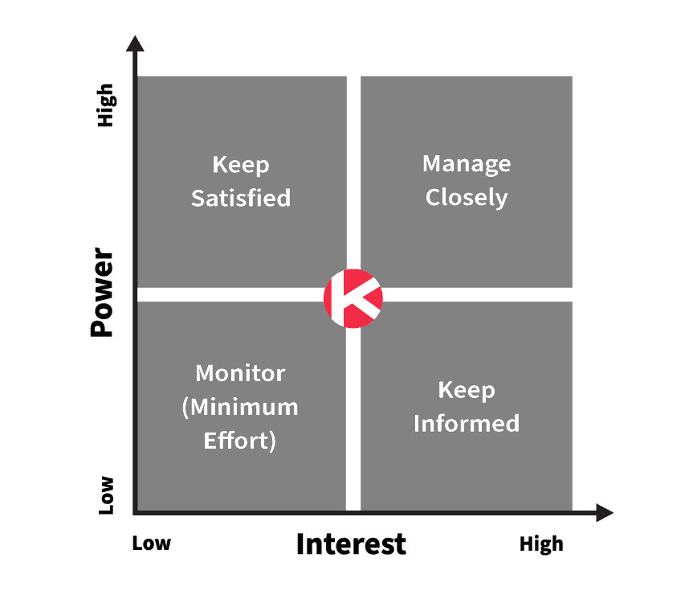

Have you ever stopped your project because one of the main [stakeholders](/en/docs/archive/top-tips-negotiating-stakeholders/) said “no” to you? Have you ever dealt with project stakeholders who are nowhere to be found at critical moments? I think all of us have, at some point in our careers, faced difficult stakeholders.

Whether the stakeholder on the project is only looking for faults in your work, or is the kind of person you can never find, in either case you need to know how to work with and manage your relationships with this group of stakeholders. If you are tired of figuring out how to deal with this group of stakeholders and nothing comes to mind, don’t worry. Just read this article to the end and get familiar with the strategies introduced.

### **Know your stakeholders during a project**

Before you enter the battlefield, you need to know what you are facing. Of course I do not mean you should fight your stakeholders. I mean you should know a stakeholder’s role in your project and also find how much influence they have.

[PMI](https://www.pmi.org/learning/library/stakeholder-analysis-pivotal-practice-projects-8905), the Project Management Institute, defines a stakeholder as: “individuals and organizations that are actively involved in the project, or whose interests may have a positive or negative effect on the outcome of a project.” This includes a wide group of people. For example you can point to the project manager, the project team, project sponsors, the leadership team, company managers, and your end customers. Each stakeholder will have a different level of involvement and influence on your project. This is where prioritizing key project stakeholders can be useful.

### **Prioritize key project stakeholders**

Categorizing project stakeholders helps you plan how to deal with them. Mendelow’s power-versus-interest grid is a popular tool used specifically for this.

Mendelow suggests we analyze our stakeholders based on how much power and interest they have in the project. Power is generally described as the stakeholder’s level of authority over the organization and the project, which includes the ability to influence organizational strategy, project resources, and of course the final outcome. Interest, on the other hand, is a stakeholder’s interest in being informed about the project’s progress and completion. Different levels of power and interest affect how you communicate and deal with project stakeholders, especially with those who are difficult.

Below are points on how to interact with stakeholders depending on their place in Mendelow’s diagram.

- Manage closely (high power and high interest) — these stakeholders have a great deal of interest and power to help your project succeed. You should always seek their views, communicate with them, and implement their suggestions as far as possible so you can keep them enthusiastic about your project. Try always to keep them satisfied and informed. Your project sponsor is a good example of people you should manage closely.
- Keep them satisfied (high power and low interest) — these stakeholders have high power in the organization but do not need to know every detail of events. Do not take too much of your time or theirs, and only ask them for help on important decisions. Keep them satisfied and happy, in which case you can count on their help at critical moments. Company executives can sit in this section.
- Keep them informed (low power and high interest) — these stakeholders do not have the ability to actively influence the project’s strategy and outcome, but they will be among those strongly affected by it. It is important that these people are kept in the loop and involved. If they are not satisfied, they may influence those who have enough power and cause a problem.
- Monitor (low power and low interest) — these stakeholders have no power to influence your project. Maintain your relationship with them but do not put a lot of effort into it.

The important point is that your stakeholders can change place during the project. So you must be ready to change your strategy when that happens.

Initial knowledge of project stakeholders helps you create a communication plan that keeps all parties satisfied according to their profile. This shows its value even more when you face a difficult stakeholder.

/en/product-skills/top-tips-negotiating-stakeholders/

### **How do we face a difficult stakeholder?**

During your project you will face difficult stakeholders. During that encounter you can use the 5 points below to get through challenging currents.

#### 1. Stay calm

When interacting with difficult stakeholders, you must take emotion out of the equation. Do not take the words personally. In the face of objections, be assertive and respond. Staying professional and putting project goals first above everything helps you see issues more clearly. By doing these things, you will look at issues with a more open view and find a way to solve them.

#### 2. Build empathy

[Habit 5 of Stephen Covey’s *The 7 Habits of Highly Effective People*](https://www.franklincovey.com/the-7-habits/habit-5.html) says: “Seek first to understand, then to be understood.” To deal with difficult stakeholders, you need to know where this negativity and opposition comes from. Why are they so critical? Why, when they should be involved in the project, are they indifferent? To become aware of their concerns, problems, and motivational issues, you must consult with them so you can find the best way to manage them.

#### 3. Adjust your communications

Communication is the most important topic when dealing with difficult stakeholders. You must know that there is no single way to communicate and interact effectively with all of your stakeholders, especially those who are difficult.

- How often do they want to receive information, and in what form?
- What kind of personality do they have, and how should you communicate with them?
- How can you effectively build a working relationship?

These are only some of the questions that can help you adjust your communication plan for each stakeholder. Bombarding a stakeholder with lots of email when they themselves have no desire to communicate that way can turn them into a difficult, problematic stakeholder. Leaving out the person through whom stakeholders want to be informed about topics can have the same effect.

#### 4. Work with them

You need to make these stakeholders feel important and make them understand that their interests matter a great deal to you, so they understand you are willing to work with them to solve any problem. Your goal in this is that during this collaboration and conversation you discover what bothers them. Ask them to guide you. Listen carefully to their guidance. They may have excellent suggestions that will surprise you.

#### 5. Act according to the agreements

A difficult stakeholder can understand your real goals. If you only agree with what they say to make them feel better but you do not act on it, you will probably have to wait for hard days. Acting builds trust. Implement their suggestions, especially when you have agreed with them. But if a time comes when you have to take another path, inform them first and then explain why you have to do this.

### **Interacting with stakeholders**

When dealing with difficult stakeholders you may expect resistance from them. But that does not mean you cannot make this process easier. When you are professional and realistic, you are more in search of solutions than creating obstacles. Accept their authority but know how to level and manage their expectations. Use the power–interest diagram for planning. At the end of the day, you want your project to succeed, and by managing your stakeholders effectively you will reach that goal.
