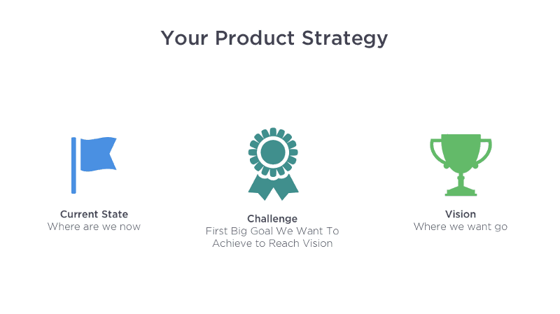

**What is your product strategy? You certainly need a strategy too.**

When I replay this scene in my mind, I clearly hear the engineering manager’s voice shouting loud and clear in the product team. He was very angry. Our team had been working on a specific, objective goal for two months and had made good progress. In that time we had learned a lot about the things that were stopping users from signing up on the website. In fact the path we should move toward had become clearer. But we still had to test our ideas.

This was not acceptable to the engineering manager, because in reality he was not looking for strategy; he wanted a work plan. He needed a list of what we want to build along with a schedule for developing those items. In fact he was looking for certainty about what we want to develop tomorrow so he could measure the team’s speed and performance. There was truly nothing wrong with his work. This is the way we have been taught to think about product strategy.

**Most companies treat product strategy as a plan for building new features and capabilities in their product.** That is a trap. We usually state our product strategy in forms such as:

- Build a platform that lets music producers upload and share their music.

- Build an online system that lets the sales team manage their sales leads.

- Build a website that helps convert our target users into customers in the sales funnel.

This is not strategy; it is a plan. **Our problem is when we treat strategy as a plan, and in most cases we fail. A plan does not include uncertainty and change.**

Plans wrongly give you a sense of security. We tell ourselves: if we follow the plan we will succeed. Unfortunately there is no guarantee of success in this state. (Though I wish there were, because our work would get much easier.)

When we commit ourselves to a plan of building a set of new features in the product, we usually rarely pause and ask ourselves whether this new feature helps us reach our goals. We will have practically less focus on outcome and more focus on the team’s output.

We must have a plan, but not one that says “build such-and-such a feature.” **Our plan must be for reaching our business goals.** We should avoid thinking of product strategy as something dictated from the top down, and instead treat product strategy as something that, the further we go, the more we understand what can help us reach our commercial business goals.

> **Product strategy is a system of achievable goals that all work together to reach an acceptable result for your business and your customers.**
>
>   

Product strategy is obtained from experimenting to reach predetermined goals. All hypotheses related to product features are proven this way. All those KPIs, OKRs, and other metrics you set for your team are part of product strategy. But they cannot by themselves determine a successful strategy for your product.

For our product strategy to be successful we need a few foundational items:

## **Vision**

Vision is the final, large picture of your company or business that you are moving toward. In large organizations you have to limit this to each of the different business lines and the customer journey. In smaller companies you have a shared vision for the company and the product. This is where you have to think long term and treat your vision as qualitative. This is where you should talk about your competitors, about how your customers see you, and about your aspirations for development.

## **Challenge**

The challenge is that first commercial goal you must reach in order to achieve your longer-term goal. Which part of your customer journey or sales funnel should be optimized first? Raise the challenge as a strategic goal that helps your team speak the same language and focus on particular parts of product development. A challenge can be quantitative or qualitative. Understanding the challenge may be a bit hard, but pay attention to the example that follows so you understand this topic correctly and fully.

## **Target condition**

The target condition helps you break the challenge into smaller parts. Each condition is made of several smaller problems that you have to solve. You must divide these problems into achievable, measurable metrics. **When you set a target condition, it should not be such that your team knows the next day what they have to do to reach it. They should have ideas for finding a solution to this problem and start exploring.**

## **Current condition**

This is the current, real condition that can be compared with the target condition. You should always examine and measure your current condition before moving toward reaching the target condition.

The items mentioned above all point to a theory called unified field theory, which is explained fully at [this link](https://theleanthinker.com/2011/11/26/bill-costantino-toyota-kata-unified-field-theory/). When we are building a product, we have a threshold of knowledge and awareness. We cannot start on day one and make a precise plan for reaching our final goal and vision. There are too many unknowns and variables. So we set our goals along the path, then we remove the obstacles in the way until we reach our final goal by means of the experiments we run.

### **A practical example**

Let me open this topic for you in a real example. We want to use [Snapp](https://snapp.ir) as an example. Suppose you are a product manager who lets drivers sign up on your platform.

### **Vision**

Suppose the CEO has claimed that Snapp’s vision is to become a cheap, efficient alternative solution for people who have a personal car and people who use public transport. (He raised this in an interview.)

### **Challenge**

Well, if we have understood the vision correctly so far, Snapp wants to make people use Snapp as their only mobility solution. First they have to understand why people currently use other transport methods instead of Snapp. To find the answer they might go outside the office, especially to cities where Snapp is not well known, and interview and talk with various people. They realize that one important reason for not using Snapp is the long time they have to wait for a car to arrive. Then they compare this problem with other existing problems. Let’s assume that among the items found, this one was larger than the rest and of high importance.

So up to here the first obstacle they have to get past is reducing the passenger’s wait time for a car to arrive. Let’s assume we consider any wait longer than 10 minutes a long time, and we want to reduce this wait time to 5 minutes, because by examining our data we realized that in cities where Snapp is more established, 80 percent of people use Snapp more because their average wait time is 5 minutes.

So our new challenge is reducing car arrival time for the passenger in cities where this time is more than 10 minutes to 5 minutes, and our deadline for doing this is the end of next month.

### **Target condition**

As product manager you now have to understand what causes wait time to be this long. In this case the problem could be that in some areas of the city there are not enough cars. Well, the current metric we care about is acquiring new drivers.

Our goal for the team should be measurable and also achievable. Something like: we want to acquire one driver for every 50 people in each city by the end of next month.

As product manager you will be directly involved in the process of acquiring new drivers. First you go to measuring the ratio of drivers to passengers in each city, which becomes your current condition, then you look for the obstacles in your way that prevent driver acquisition. Then by running various tests and experiments you try to remove each of these obstacles.

Let’s look together at the **product strategy canvas**:

You can download a blank version of this canvas from [this link](https://www.dropbox.com/s/44td2ksgkb3oqns/Product%20Strategy%20Canvas%20-%20Blank.pdf?dl=0).

Usually as a product manager you do not control all of these numbers. Vision is set by CEOs, senior product managers, the board, and other executives. Challenges are also set by the next level of managers.

Direct managers help their team set an optimal target condition for themselves. At the beginning these items are usually dictated from management to the team. As the team matures and gets used to this method, managers and the team set these items together.

## Product strategy is the team’s roadmap

After you transfer these items to your team they can start their work and look for ways to reach the goals. One of the product manager’s duties is to find users’ problems and the obstacles in front of them so the team can reach the desired target condition. Then together they test and experiment with their ideas until they find the solution.

This method causes all team members to become familiar with and aligned around the strategic goals and the vision. In fact each part of the team has its own goals. Practically these teams are themselves responsible for their progress and for reaching their target condition.

You will probably read this and say to yourself that this is not product strategy, it is business strategy. Yes, product strategy comes from business goals, but are these goals not the reason for developing the product? Product management is the art of solving your customers’ problems in reaching your business goals. If you are not doing these two things, your product is only made of code for display.

To read more articles on product strategy, use [this link](/en/categories/product-strategy/).

Source: [an article on Medium](https://medium.com/@melissaperri/what-is-good-product-strategy-8d5587cb7429)
