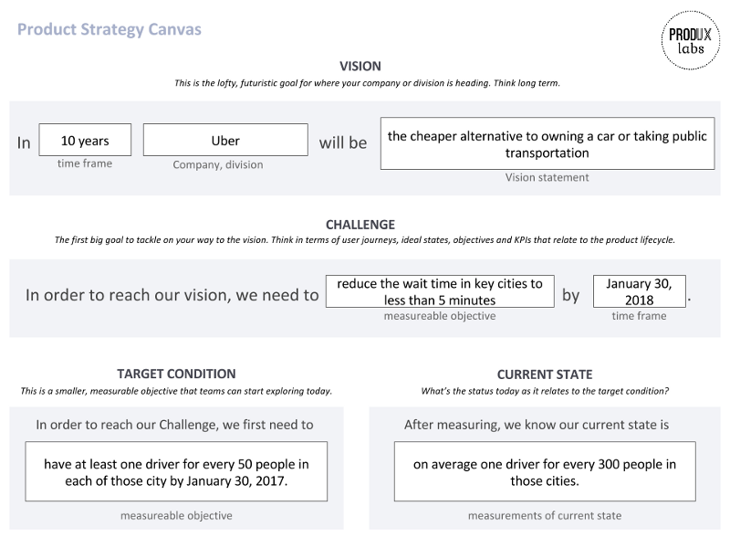

**استراتژی محصول شما چست؟ بدون شک شما هم یک استراتژی نیاز دارید.**

وقتی که این صحنه را در ذهنم تکرار می کنم، به وضوح صدای مدیر تیم فنی را می شنوم که در تیم محصول با صدای بلند و واضح  داد می‌زد. خیلی عصبانی بود. تیم ما به مدت دو ماه در حال کار روی یک هدف مشخص و عینی بود و پیشرفت خوبی داشت. در این مدت موارد زیادی درباره آن چیزهایی که مانع از ثبت نام کاربران روی وب سایت می شدند یاد گرفتیم. در واقع مسیری که باید به سمت آن حرکت می کردیم مشخص تر شده بود. اما همچنان هم باید ایده های خود را تست می‌کردیم.

این موضوع برای مدیر فنی قابل قبول نبود چراکه در واقعیت وی به دنبال استراتژی نبود بلکه یک برنامه کاری می خواست. او لیستی از آنچه که می خواهیم بسازیم به همراه زمان‌بندی توسعه آن موارد نیاز داشت. در واقع او به دنبال قطعیت درباره آنچه که فردا می خواهیم توسعه دهیم بود تا بتواند سرعت و عملکرد تیم را اندازه گیری کند. حقیقتا اشکالی در کار وی نبود. این همان روشی است که به ما درباره فکر کردن به استراتژی محصول آموزش داده شده است.

**اغلب شرکت‌ها استراتژی محصول را برنامه ای برای ساخت قابلیت‌ها و ظرفیت‌های جدید در محصول خود در نظر می گیرند.** در صورتی که این یک دام است. ما معمولا استراتژی محصول خود را به صورت موارد زیر بیان می کنیم:

- ساخت پلتفرمی که به تولید کنندگان موسیقی اجازه بارگذاری و به اشتراک گذاری موزیک های آن‌ها را می‌دهد.

- ساخت یک سیستم آنلاین که به تیم فروش اجازه مدیریت سرنخ‌های فروش آن‌ها را می‌دهد.

- ساخت وب سایتی که به تبدیل کاربران هدف ما به مشتری در قیف فروش کمک می‌کند.

این استراتژی نیست، برنامه است. **مشکل ما زمانی است که با استراتژی بصورت برنامه رفتار می کنیم و در اکثر موارد شکست می خوریم. برنامه شامل عدم قطعیت و تغییر نمی شود.**

برنامه‌ها به اشتباه به شما حس امنیت می دهند. با خود می‌گوییم: اگر طبق برنامه پیش برویم موفق می‌شویم. متاسفانه هیچ تضمینی برای موفقیت در این حالت وجود ندارد. (هرچند که کاش بود،‌ به خاطر اینکه کار ما خیلی راحت تر می شد).

وقتی که ما خودمان را پایبند به برنامه ساخت مجموعه ای از قابلیت های جدید در محصول می کنیم، معمولا به ندرت صبر می کنیم و این سوال را از خود می پرسیم که آیا این قابلیت جدید در رسیدن به اهداف به ما کمکی می کند یا نه؟ عملا تمرکز کمتری روی نتیجه خواهیم داشت و بیشتر روی خروجی تیم تمرکز می کنیم.

ما باید یک برنامه داشته باشیم اما این نه این طوری که بگوید "قابلیت فلان را بسازید". **برنامه ما باید برای رسیدن به اهداف کسب و کاری ما باشد.** باید از فکر کردن به استراتژی محصول به صورت چیزی که از بالا به پایین دیکته می‌شود دوری کنیم و بجای آن استراتژی محصول را چیزی بدانیم که هرچه جلو تر می‌رویم بیشتر می‌فهمیم که چه چیزهایی می‌توانند به ما در رسیدن به اهداف تجاری کسب و کار خود کمک کنند.

> **استراتژی محصول یک سیستم از اهداف دست یافتنی است که همگی در کنار هم برای رسیدن به نتیجه قابل قبول برای کسب و کار و مشتریان شما عمل می‌کنند.**
> 
>   

استراتژی محصول از آزمایش کردن برای رسیدن به اهداف از پیش تعیین شده بدست می‌آید. همگی فرضیات مرتبط با قابلیت های محصول از این روش اثبات می شوند. همه آن KPIها، OKRها و متریک های دیگری که برای تیم خود تعیین می کنید بخشی از استراتژی محصول به حساب می‌آیند. اما آن‌ها به خودی خود نمی توانند یک استراتژي موفق برای محصول شما تعیین کنند.  

ما برای موفق بودن استراتژی محصول خود به چند مورد بنیادی نیاز داریم:  

## **چشم انداز**

چشم انداز همان تصویر نهایی و بزرگ از شرکت یا کسب و کار شماست که به سمت آن حرکت می کنید. در سازمان های بزرگ بایستی این مورد را به هرکدام از خطوط مختلف کسب و کار و سفر مشتری محدود کنید. در شرکت‌های کوچک تر برای شرکت و محصول خود یک چشم انداز مشترک دارید. اینجاست که باید به دراز مدت فکر کنید و چشم انداز خود را کیفی در نظر بگیرید. این جا جایی است که باید درباره رقبای خود، درباره اینکه مشتری‌های شما چگونه شما را می بینند و آرزوهای خود برای توسعه صحبت کنید.  

## **چالش**

چالش همان اولین هدف تجاری شماست که باید برای رسیدن به هدف دراز مدت تر خود به آن دست یابی پیدا کنید. کدام بخش از سفر مشتری شما یا قیف فروش شما باید اول از همه بهینه سازی شود؟ چالش را به عنوان هدف استراتژیکی مطرح کنید که به تیم شما در هم زبان شدن و تمرکز روی بخش های خاصی از توسعه محصول کمک می کند. یک چالش می‌تواند کمی یا کیفی باشد. شاید کمی درک چالش سخت باشد اما به مثالی که در ادامه آمده است دقت کنید تا به درستی و بصورت کامل این موضوع را درک کنید.  

## **وضعیت هدف**

وضعیت هدف به شما کمک می کند تا چالش را به بخش های کوچک تری بشکنید. هرکدام از وضعیت‌ها به چندین مشکل کوچک تر تشکیل شده اند که باید آن ها را حل کنید. شما باید این مشکلات را به متریک های قابل دست یابی و اندازه گیری تقسیم بندی کنید. **زمانی که یک وضعیت هدف تعیین می کنید، نباید به صورتی باشد که تیم شما فردای آن روز بداند که برای رسیدن به آن چه کاری باید انجام دهد. آن ها باید ایده هایی برای پیدا کردن راه حل این مشکل داشته باشند و شروع به اکتشاف کنند.**  

## **وضعیت فعلی**

این همان وضعیت فعلی و واقعی است که با وضعیت هدف قابل مقایسه می باشد. همیشه بایستی قبل از حرکت به سمت رسیدن به وضعیت هدف، وضعیت فعلی خود را بررسی و اندازه گیری کنید.  

موارد ذکر شده در بالا همگی به نظریه ای به نام نظریه محدوده واحد اشاره می کنند که در [این لینک](https://theleanthinker.com/2011/11/26/bill-costantino-toyota-kata-unified-field-theory/) بصورت کامل توضیح داده شده است. زمانی که در حال ساخت یک محصول هستیم، آستانه ای از دانش و آگاهی داریم. نمی توانیم در روز اول شروع کنیم و برای رسیدن به هدف نهایی و چشم انداز خود برنامه ریزی دقیقی انجام دهیم. نادانسته‌ها و متغیرهای بسیار زیادی وجود دارند. پس اهداف خود را در طول مسیر تعیین می کنیم سپس موانع موجود را تا زمانیکه به هدف نهایی خود برسیم  بوسیله آزمایش‌هایی که انجام می دهیم از سر راه خود برمی‌داریم.

### **یک مثال کاربردی**

بگذارید این موضوع را در یک مثال واقعی برای شما باز کنم. می خواهیم [اسنپ](https://snapp.ir) را مثال بزنیم. فرض کنید شما یک مدیر محصول هستید که به راننده‌ها امکان ثبت نام در پلتفرم شما را می دهد.  

### **چشم انداز**

فرض کنید مدیرعامل ادعا داشته است که چشم انداز اسنپ تبدیل شدن به یک راه حل ارزان و بهینه جایگزین برای کسانیکه خودروی شخصی دارند و کسانیکه از حمل و نقل عمومی استفاده می کنند است. (او این موضوع را در یک مصاحبه مطرح کرده است).

### **چالش**

خب اگر تا اینجا چشم انداز را به درستی درک کرده باشیم، اسنپ می خواهد کاری کند که مردم از اسنپ به عنوان تنها راه حل جابجایی استفاده کنند. در ابتدا باید آن‌ها بفهمند که چرا در حال حاضر مردم از دیگر روش های حمل و نقل به جای اسنپ استفاده می کنند. برای یافتن پاسخ به این موضوع ممکن است به خارج از دفتر بخصوص شهرهایی که اسنپ در ان مشهور نیست رفته  و به مصاحبه و صحبت با افراد مختلف بپردازند. آن ها متوجه می شوند که یکی از دلایل مهم برای استفاده نکردن از اسنپ، زمان طولانی است که باید منتظر رسیدن ماشین باشند. سپس این مشکل را با دیگر مشکلات موجود مقایسه می کنند. فرض می کنیم از میان موارد پیدا شده این مورد بزرگتر از بقیه بوده و از اهمیت بالایی برخوردار می باشد.

پس تا اینجا اولین مانعی که باید پشت سر بگذارند موضوع کاهش زمان انتظار مسافر برای رسیدن ماشین می باشد. بیاید فرض کنیم هر زمان انتظاری بیش از ۱۰ دقیقه را زمان طولانی درنظر بگیریم و می خواهیم این زمان انتظار را به ۵ دقیقه کاهش دهیم چرا که با بررسی داده های خود متوجه شدیم که در شهرهایی که اسنپ بیشتر جا افتاده است، ۸۰درصد مردم بیشتر از اسنپ استفاده می کنند چراکه متوسط زمان انتظار آن ها ۵ دقیقه است.

پس چالش جدید ما کاهش زمان رسیدن ماشین به مسافر در شهرهایی که این زمان بیش از ۱۰ دقیقه است به ۵ دقیقه و تاریخ نهایی ما برای انجام این کار انتهای ماه بعد است.  

### **وضعیت هدف**

بعنوان مدیر محصول حالا باید بفهمید که چه چیزی باعث می شود که مدت زمان انتظار اینقدر طولانی باشد. در این مورد مشکل می تواند این موضوع باشد که در برخی از محدوده های شهر به اندازه کافی ماشین وجود ندارد. خب متریک فعلی که به آن اهمیت می دهیم جذب رانندگان جدید است.

هدف ما برای تیم باید قابل اندازه گیری و همچنین دست یافتنی باشد. چیزی مثل: می‌خواهیم تا انتهای ماه بعد یک راننده به ازای هر ۵۰ نفر در هر شهر جذب کنیم.

بعنوان مدیر محصول فرایند جذب رانندگان جدید بصورت مستقیم با فرایند جذب درگیر خواهید بود. در ابتدا سراغ اندازه گیری نسبت تعداد راننده به مسافر در هر شهر می پردازید که می شود وضعیت فعلی شما سپس به دنبال پیدا کردن موانع موجود سر راه شما که مانع از جذب راننده می شوند می پردازید. سپس با انجام تست‌ها و آزمایش های مختلف به از میان برداشتن هرکدام از این موانع می کنید.

بیایید با هم نگاهی به **بوم استراتژی محصول** بپردازیم:

نسخه خام این بوم را می توانید از [این لینک](https://www.dropbox.com/s/44td2ksgkb3oqns/Product%20Strategy%20Canvas%20-%20Blank.pdf?dl=0) دانلود کنید.  

معمولا بعنوان مدیر محصول به همه این اعداد کنترل ندارید. چشم انداز توسط مدیران عامل، مدیران ارشد محصول، هیات مدیره و دیگر مدیران اجرایی تعیین می شود. چالش‌ها نیز توسط مدیران سطح بعدی تعیین می شوند.

مدیران مستقیم به تیم خود کمک می کنند تا وضعیت هدف بهینه ای برای خود معین کنند. در ابتدای کار معمولا این موارد از مدیریت به تیم دیکته می شود. هرچه که تیم بالغ تر می شود و به این روش عادت می کند مدیران و تیم با یکدیگر این موارد را معین می کنند.  

## استراتژی محصول نقشه راه تیم

پس از انتقال این موارد به تیم خود آن ها می توانند کار خود را شروع کرده و به دنبال راه های رسیدن به اهداف باشند. یکی از وظایف مدیر محصول این است که مشکلات کاربران و موانع پیش روی آن ها را پیدا کرده تا تیم بتواند به وضعیت هدف مورد نظر برسد. سپس آن ها به کمک هم به تست و آزمایش ایده های خود می پردازند تا زمانیکه راه حل را پیدا کنند.  

این روش باعث می شود که همه اعضای تیم با اهداف استراتژیک و چشم انداز آشنا و همراه شوند. در‌ واقع هر بخش از تیم اهداف خود را دارد. عملا این تیم‌ها هستند که برای پیشرفت خود و رسیدن به وضعیت هدف خود مسئول هستند.  

احتمالا با خواندن این مطلب با خود می گوید که این که استراتژی محصول نیست بلکه استراتژي کسب و کار است. بله استراتژی محصول از اهداف کسب و کار نشات می گیرد اما آیا این اهداف همان دلیل توسعه محصول به حساب نمی آیند؟ مدیریت محصول هنر حل مشکلات مشتریان شما در رسیدن به اهداف کسب و کار شماست. اگر این دو کار را انجام نمی دهید، محصول شما تنها از کدهایی برای نمایش تشکیل شده است.

برای مطالعه دیگر مطالب در زمینه استراتژي محصول از [این لینک](https://theminiceo.ir/category/%D8%A7%D8%B3%D8%AA%D8%B1%D8%A7%D8%AA%DA%98%DB%8C-%D9%85%D8%AD%D8%B5%D9%88%D9%84/) استفاده کنید.

منبع: [نوشته ای در مدیوم](https://medium.com/@melissaperri/what-is-good-product-strategy-8d5587cb7429)
