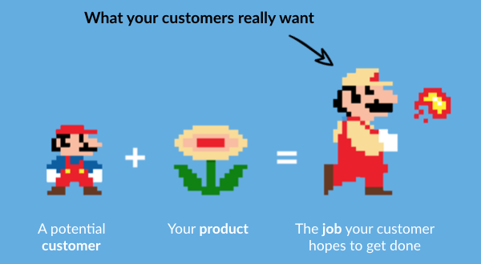

About two years ago I was in the 37signals office listening to a podcast with Jason Fried, Bob Moesta, and Chris Spiek talking about using the JTBD framework to understand why users switch from one product to another.

At that stage of my career I had already done a lot of market research for different products, but once I met JTBD I realized it was a way to understand users’ inner motives and hidden behaviors that you cannot easily reach by other methods.

One thing I have learned at work is that when I want to learn something new, I have to act quickly and put what I have learned to use. I did the same here. Right after a hands-on JTBD workshop I started interviewing ten of my friends.

After that I completed another 90 interviews with different companies and startups at different stages. The interviews covered a mix of products, from enterprise software to consumer apps and even coaching. I also spent a lot of time talking and working with teams that were using JTBD.

After 100 interviews I felt I had something worth sharing. Here it is:

## **Before you run any JTBD research, decide what you expect to learn**

A friend of mine put this well in one of his workshops. Before you get pulled into JTBD interviews, decide which questions you want answered at the end of the research. Do you want to understand why users stopped using your product, or do you want to identify, from your users’ point of view, who the real competitors are?

That does not mean you should ask those questions of users directly. The questions are more of a mental focus: you look for answers by entering different parts of the user’s mind and experience.

## **There is no shortcut to becoming a good interviewer**

The bad news is that most of us are weak at interviewing customers, even if we have a lot of experience talking with them. If I name two problems I have seen again and again in my own behavior, they are these:

1. Asking leading questions

2. Feeling uncomfortable in silence

The good news is that all of us can get better by learning from people who are skilled at this. Three things helped my interviews a great deal:

### **1. Sitting with people who interview better than I do**

I would sit in on real interviews with these people and watch and analyze how they behaved. That helped a lot in learning how to interview properly.

### **2. Recording my own interviews**

Recording yourself has several benefits. First, it lets you judge your real skill. After listening to a few of my own interviews I realized I rarely had a good one, and in most of them I had obvious flaws. That also gave me a chance to improve. Weak interviews are normal; with time and practice you get better.

### **3. A lot of practice**

As with other skills, a lot of practice is what makes you fluent. Sometimes you have to run interviews you do not strictly need, just to practice and learn the texture of the work.

## **Limits of gathering information from an interview**

Many people use interviews to collect JTBD-related data, but the framework has gaps of its own. For example, people do not always recount the details that matter. I also found it hard to extract fine-grained information about purchases that got little attention—for example, buying a $2 app versus a $10,000 enterprise product. Energy spent on a purchase is not necessarily tied to price; it may have more to do with how the person values the product. Someone might gather and analyze far more information for a $40 health product than for a $300 service for their car.

Collecting information to understand the JTBD of a product that does not exist yet is much harder than doing so for a product already on the market. JTBD is often about the space of innovation and is a useful model for creating change in a market. Interviewing is not a very precise method when you want to design a product that does not exist yet. You have to look for ways to understand the behaviors already present in the products and services that stand in for your future product today.

Analyzing JTBD data through interviews or other means is only the first part of the framework. The question is: what do you do with all that information? That is where a large gap appears in how JTBD is used in practice. I agree there are models for shaping the data, such as the timeline and the four forces, but there are other ways to get useful insights from what you have collected. There are also tools that help you tag data and sort interview transcripts.

This is an area I would like to see improve, both in tooling and in how people are taught.

## **Not all jobs have the same weight**

Different people will likely use a product to solve different problems in different ways. The point is that they do not weight all of those jobs equally. In JTBD language this is the “big hire” and the “little hire.” For example, I might use Snapp to make getting around the city easier (big hire), or I might use it to show off in front of friends (little hire).

The big hire is the outcome that gets most of your attention, but the little hire helps you design interactions, in-product messages, and experience so you can create differences that make people choose your product.

## **Apply insights, measure, and iterate**

At first glance these are things we all have in mind, but in practice few people follow through. After JTBD interviews I always return to this loop and to the original reason we ran the interviews. Showing results and insights to a group, getting their interest, and watching them be surprised is not enough. JTBD is only useful when it lets you do something different from what you would have done without the data.

Whether you are designing new products, changing capabilities on an old one, or revising the product’s message and marketing, you need a list of how you will apply what you learned—and then you need to follow it. The Intercom team described a very good example of this [here](https://blog.intercom.io/shareable-map/).

Over several years of working with this I found that JTBD insights can produce very positive change, but there were also times when applying the insights did not help us reach the goal.

## **JTBD is a practical way to orient around behavior, not product features**

After 100 interviews I can say with confidence that JTBD is a valuable framework for looking at markets, products, and marketing. Thinking about why and how customers hire different products has helped me understand customer behavior better and build more customer-centered products.

Source: [Amrita Gurney, VP of Marketing at CrowdRiff](https://blog.markgrowth.com/what-i-learned-from-doing-100-jobs-to-be-done-interviews-3b4078690075)

For more on product discovery, [start here](/en/categories/product-discovery/).
