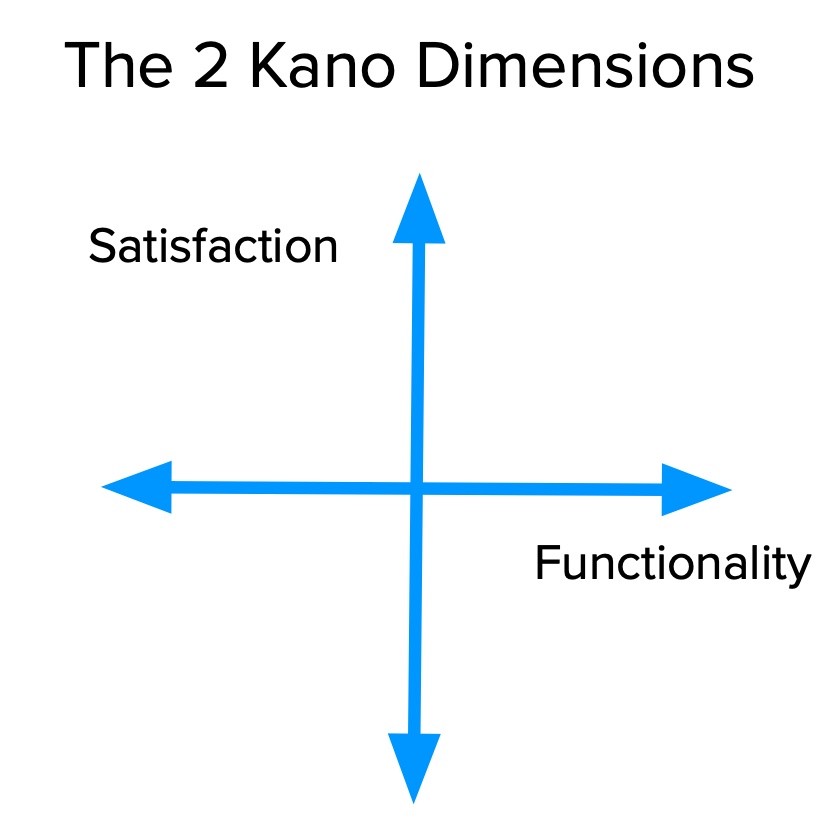
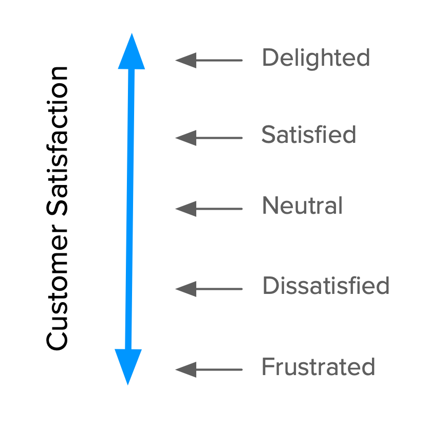
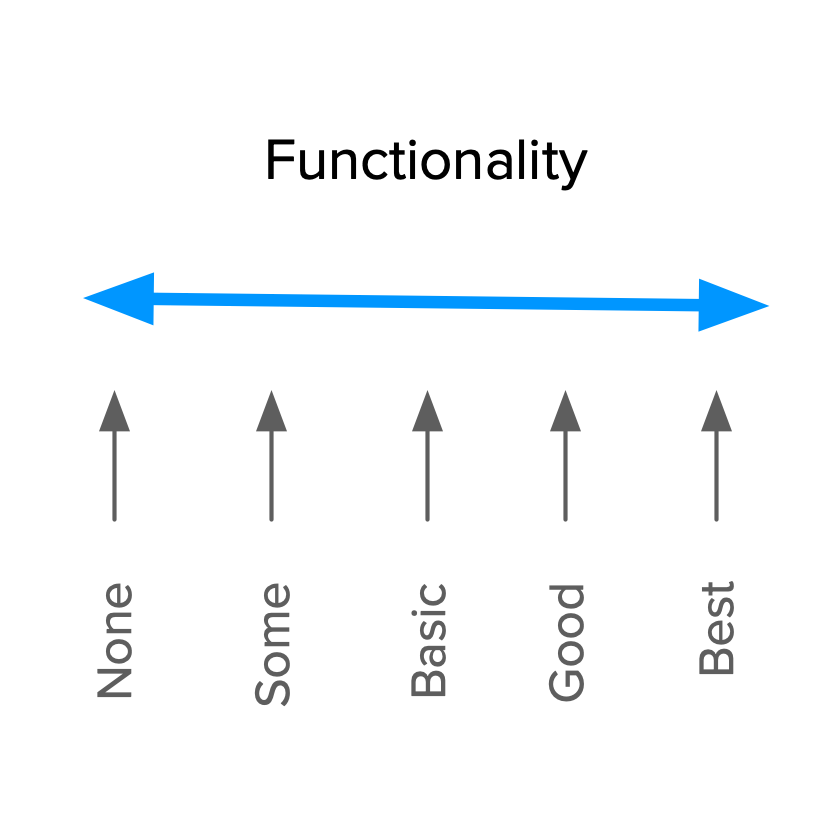
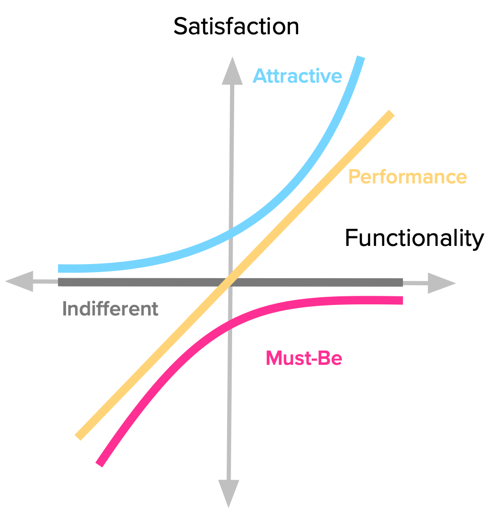
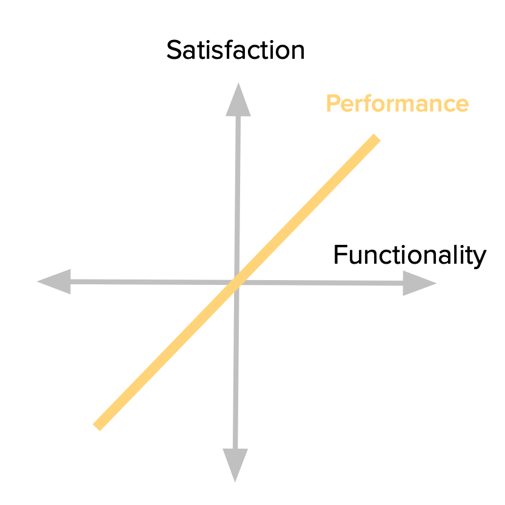
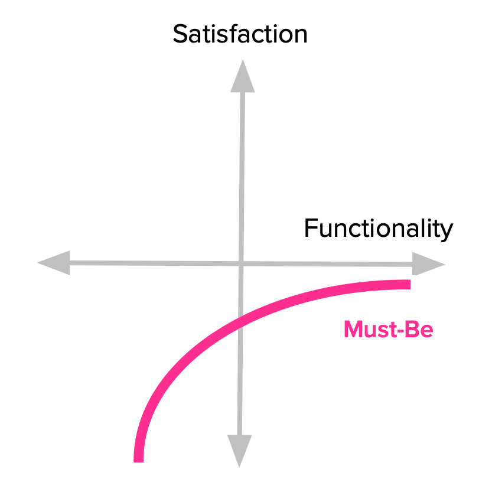
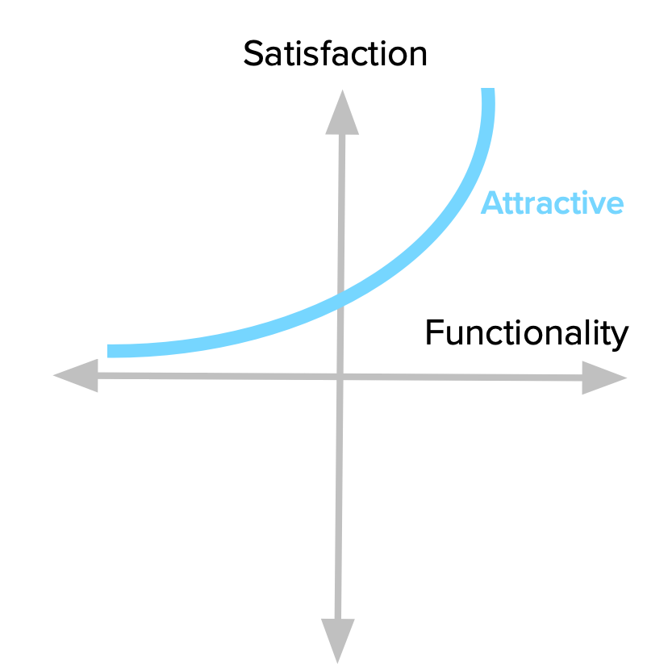
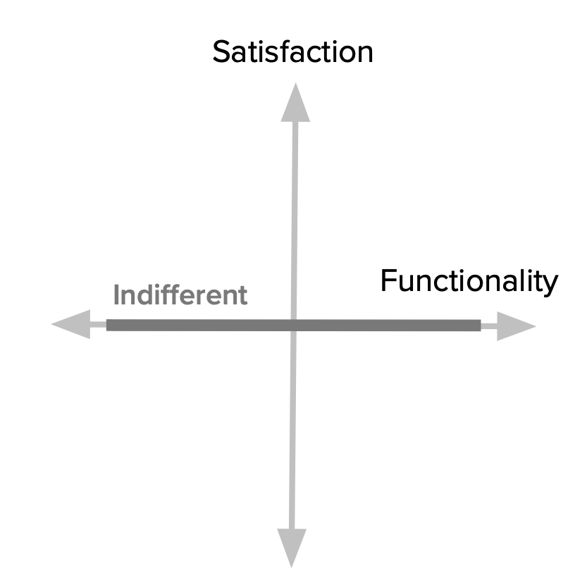
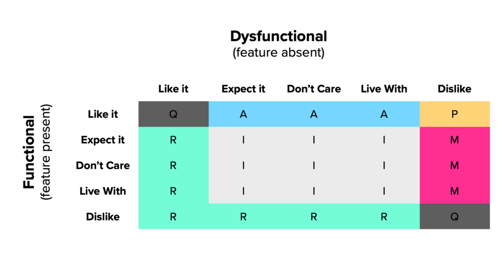
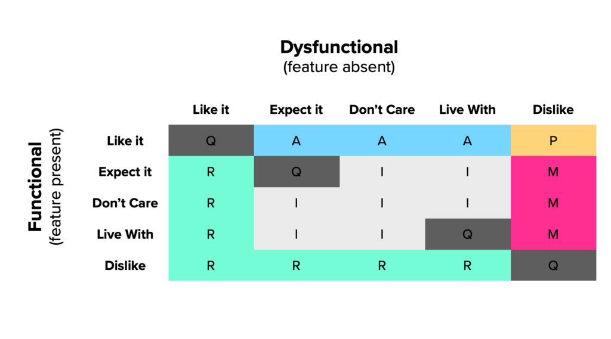

What is the Kano model and how does it help you? **Does your feature backlog look endless**, full of requirements from your team, internal stakeholders, customers, prospects, and anyone else with an opinion about the product (yes, even you)?

You cannot build everything “right now” the way everyone wants. You do not want to put everything in (and you should not). You may have a good sense of what works and what does not, but you want data to support your decisions, to be definite, or to present to the rest of the organization.

**You want to build a product roadmap with the right features.** There are many reasons you might need to include a particular feature, but how do you know which ones will delight your (future) customers and make them prefer you over others?

Building products that satisfy our customers is a very common topic in [UX design](/en/docs/archive/%D8%AC%D8%B1%DB%8C%D8%A7%D9%86-%DA%A9%D8%A7%D8%B1%D8%A8%D8%B1-%DB%8C%D8%A7-user-flow-%DA%86%D8%B7%D9%88%D8%B1-%D8%B7%D8%B1%D8%A7%D8%AD%DB%8C-%D9%85%DB%8C%D8%B4%D9%88%D8%AF/) and product management circles. After all, that is the ultimate goal of our job. But…

- How do we measure satisfaction?

- How do we choose what to build in order to deliver it?

- How do we go from satisfaction to delight?

These questions are not easy to answer, but fortunately there is a very useful tool to guide us through them: **the Kano model**.

This step-by-step, in-depth guide is based on many online sources and some academic research.

## What is the Kano model?

Noriaki Kano, a Japanese researcher and consultant, published a paper in 1984 [Noriaki Kano et al., “Attractive Quality and Must-be Quality,” research summary of a presentation given at Nippon QC Gakka: 12th Annual Meeting (1982), January 18, 1984] with a set of ideas and techniques that help us determine how satisfied our customers (and potential customers) are with product features. These ideas are usually called the Kano model and rest on the following foundations:

- **Customer satisfaction** with our product features depends on the level of performance provided (how much, or how well, they are implemented).

- Features can be classified into four categories.

- You can determine **how customers feel** about a feature through a **questionnaire**.

Let’s look at each of them.

### Satisfaction versus performance in the Kano model

Everything starts with our goal: **satisfaction**. Kano proposes a dimension that runs from complete satisfaction (also called delight and excitement) to complete dissatisfaction (or frustration).

In the image above, the dimension is annotated with different levels of satisfaction. It is important to note that this is not (always) a linear scale, as we will see later.

You might think you always want to be at the top of that scale, right? Well, that is not possible.

This is where Functionality comes in. Also called investment, complexity, or implementation, it shows how much of a particular feature the customer receives, how well we have implemented it, or how much we have invested in developing it.

This dimension runs from no functionality to the best possible implementation. That is why the term investment also fits this idea well. It is a reminder of the cost of doing something specific.

Apart from naming, what really matters is knowing that **these two dimensions together are the basis of the Kano model** and determine how our customers feel about our product features, as we will see in the next section.

### Four categories of features in the Kano model

Depending on how customers react to the level of performance provided, Kano classifies features into four categories.

#### Performance

Some product features behave the way we might intuitively think satisfaction works: the more we provide, the more satisfied our customers become. Because of this proportional relationship between performance and satisfaction, these features are usually called linear, performance, or one-dimensional features in the Kano literature.

When buying a car, gasoline mileage is typically a performance feature. Other examples might be the speed of your internet connection; laptop battery life; or storage space in your Dropbox account. The more you have of each, the more satisfied you are.

Returning to the graphical view of the model, we can see how customers react to this type of feature. Every increase in performance leads to an increase in satisfaction. It is also important to remember that the more performance we add, the larger the investment we have to make (for example the team building it, the resources required, and so on).

#### **Must-be**

Other product features are simply expected by customers. If the product does not have them, it is considered incomplete or simply bad. These features are usually called Must-be, or basic expectations.

Here is the deal with these features: we have to have them, but that does not make our customers more satisfied. **They just will not be dissatisfied.**

We expect our phones to be able to make calls. Our hotel room should have running water and a bed. A car should have brakes. Having any of these does not delight us, but their absence definitely makes us angry at the product or service.

Notice how the satisfaction curve behaves. Even the smallest investment helps increase satisfaction. Also notice that satisfaction never even reaches the positive side of the dimension. No matter what we invest in this feature, we never make our customers more satisfied with the product. The good news is that once you have reached a basic level of expectation, you do not need to keep investing in it.

#### **Attractive**

There are unexpected features that, when provided, create a positive reaction. These are usually called attractive, exciting, or delighters. I tend to prefer the term attractive, because it conveys that we are talking about a scale. We can have reactions from mild attractiveness to absolute delight, and still put everything under the name “attractive.”

The first time we used an iPhone, we did not expect such a fluid touchscreen interface, and it surprised us. Think about the first time you used Google Maps or Google Docs. You know that feeling when you experience something beyond what you know and expect from similar products.

Just remember that our brains do not have to explode for something to fall into this category. It might be anything that makes you go: “Hey, that’s nice!”

This is best explained graphically. Look at how even some levels of performance lead to an increase in satisfaction, and how quickly it rises. That fact is key when examining the investment we make in a particular feature. Beyond a certain point, we are only overdoing it.

#### **Indifferent**

Naturally there are also features toward which we feel indifferent. Ones whose presence (or absence) does not make a real difference in how we react to the product.

These features sit in the middle of the satisfaction dimension (where the horizontal axis crosses it). That means no matter how hard we try, users really do not care. Another way of saying we should really avoid working on these, because they are essentially burning money.

### The natural decay of delight

Now that we have a full picture of all Kano feature categories, it is important to note a basic fact: they are not fixed—they change over time.

What our customers feel about some product features now is not what they will feel in the future. Attractive features become performance and must-be features over time.

Consider the iPhone example again. The fluid touchscreen interaction that amazed us in 2007 is now only a basic expectation.

Go back to any wonderful memory you had with products in the past. How would you feel if the same product were offered to you now? When enough time has passed, you will very likely treat that magical feature as a Performance or Must-be feature.

This decay happens for several reasons, including technological developments and the rise of competitors, all competing to bring the same functionality after the first move.

The important point here is that any analysis we do at a point in time is only a snapshot reflecting the reality of that moment. The further we get from that point, the less relevant it seems. Unlike diamonds, Kano categories are not forever.

### The question pair that reveals customer perception

We have now covered the first two parts of the Kano model: the dimensions of analysis and how they interact to define feature categories.

To reveal how customers perceive our product features, we use the Kano questionnaire, which includes a pair of questions for each feature we want to evaluate:

- How they would feel if they had this feature.

- How they would feel if they did not have this feature.

The first question is the functional form and the second is the dysfunctional form ([Jan Moorman](https://uxmag.com/articles/leveraging-the-kano-model-for-optimal-results) also calls them positive and negative.) These are not open questions. For each “How would you feel if you had or did not have this feature?”, the possible answers are:

- I like it

- I expect it

- I am neutral

- I can tolerate it

- I dislike it

There are things to consider when stating these options, and we will come back to them later.

After asking customers (or potential customers) these two questions and getting their answers, we can now categorize each feature.

#### Evaluation table

One of the great things about the Kano model is that it accounts for both having and not having some functionality. That shows how far something is a real want, a need, or a matter of indifference for our customers.

We do this through an evaluation table that combines functional and dysfunctional answers in its rows and columns (respectively) to arrive at one of the categories described earlier. Each pair of answers leads to one of those categories, plus a few others that come from using this question format.

#### Two new categories

Because we ask about both sides of the same thing, we can tell whether:

- Someone did not fully understand the questions or the features we described.

- What we are proposing is actually the opposite of what they want.

These are not real Kano categories. They are artifacts of the questionnaire (but useful nonetheless).

If someone says they “dislike” the functional version and “like” the dysfunctional version, this person clearly has no interest in what we are offering and perhaps actually wants the opposite. This new category is called Reverse. If most customers tell you some feature is reverse, you can simply swap the functional and dysfunctional questions and score their answers as if you had asked the questions in that order.

When you get contradictory answers to both questions (such as “like” and “like”), you have a Questionable response. For that reason, Fred Pouliot [2] suggested that cells (2,2) and (4,4) of the standard Kano evaluation table also be changed to Questionable. Some of these in your results are expected, but if you get a majority of users with Questionable answers, there is probably something wrong with what you are asking.

#### A (slightly) modified evaluation table

From here on, we use Pouliot’s slightly modified table to classify our answers.

To understand the model better and avoid having to refer to the table every time, we should try to internalize how each category is derived from a pair of answers.

We have already covered where Questionable answers sit (contradictory response pairs). They form a diagonal through the evaluation table, except for the middle cell.

Performance features are the easiest to locate. They are the ones customers like to have and dislike not having. That strong reaction translates the linear “more is better” relationship between the two dimensions.

Must-be features are the remaining ones the customer dislikes not having. Customers range from tolerating to expecting to have this feature.

Attractive features are found when the customer would like to have a feature that is not expected. Another way of saying that what we are proposing is new and attractive.

Then we have indifferent features. These occur for any “I am neutral” or “I can tolerate it” answer, for functional or dysfunctional questions. That is, they occupy the middle cells of the table (discounting any of the categories already described).

Finally, we have Reverse answers, which sit on the two axes where the reactions are either liking the feature or disliking it. By reversing the Functional / Dysfunctional values you can see which category they are the reverse of. Then you can tell whether this is a reverse performance, attractive, or must-be feature.
