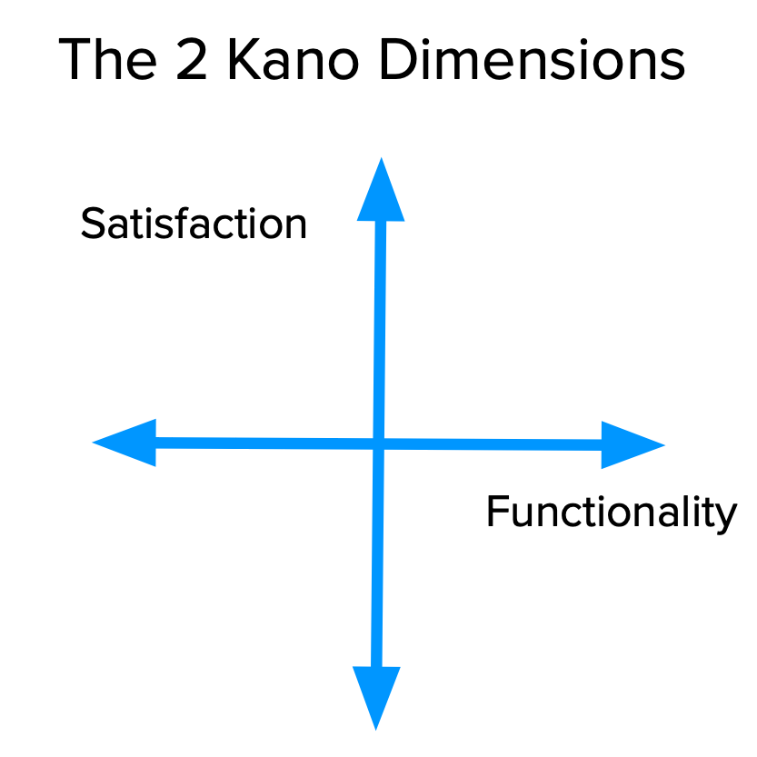
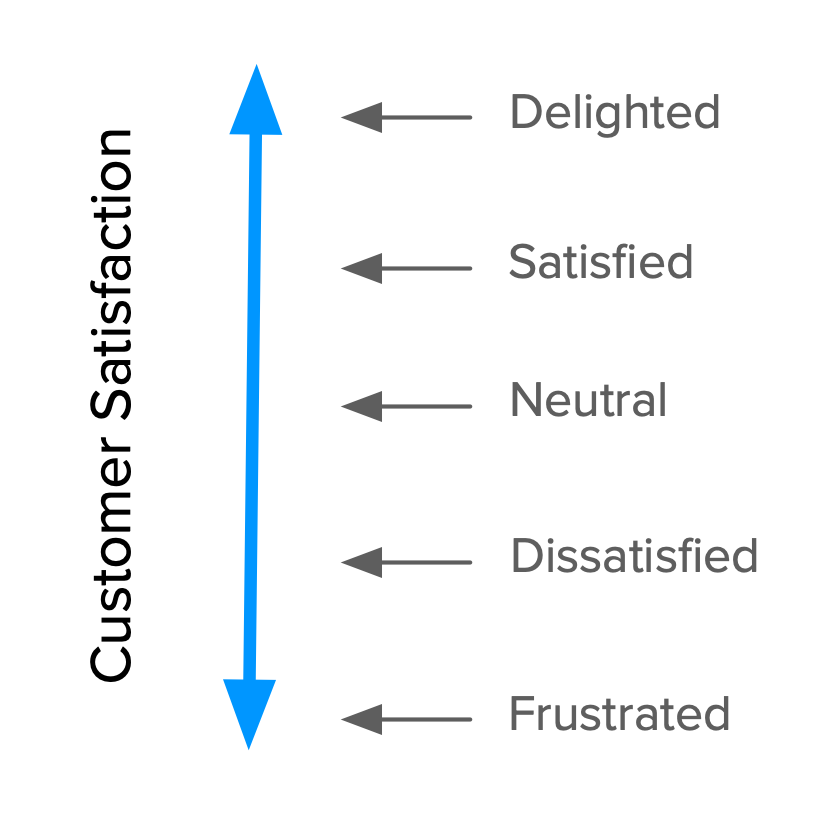
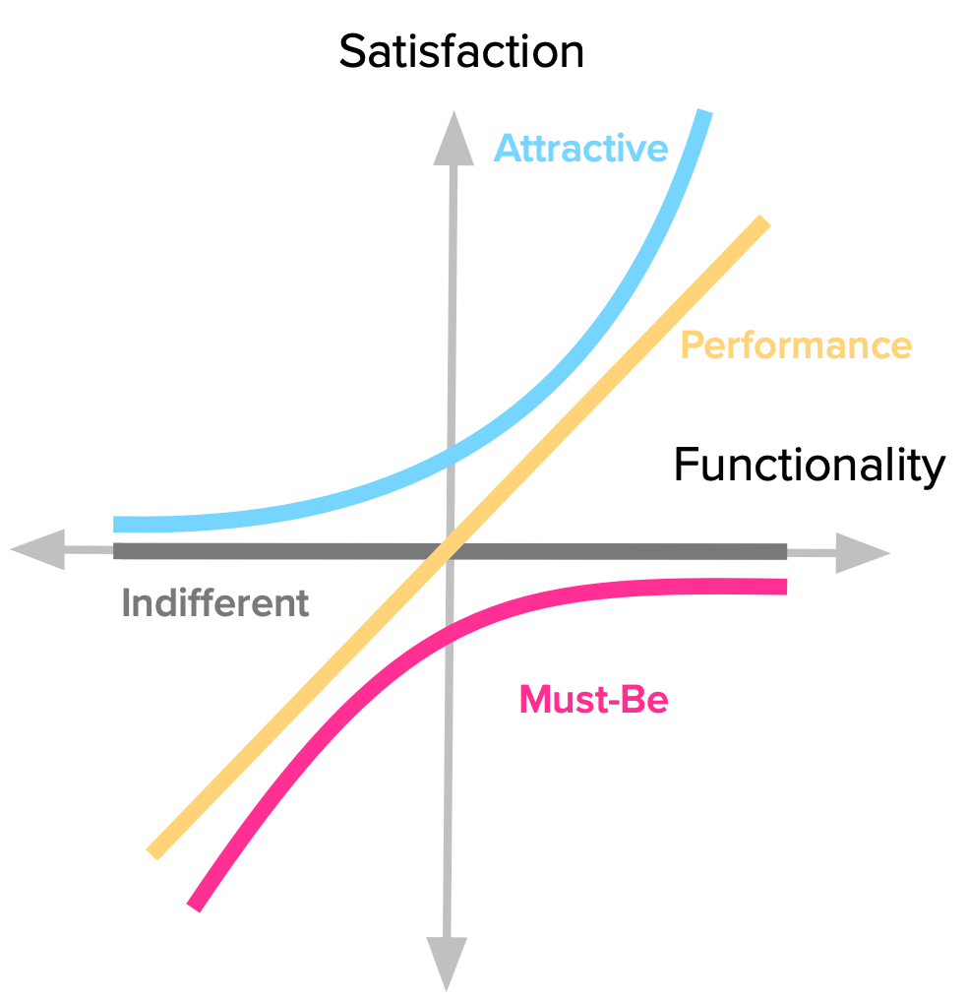
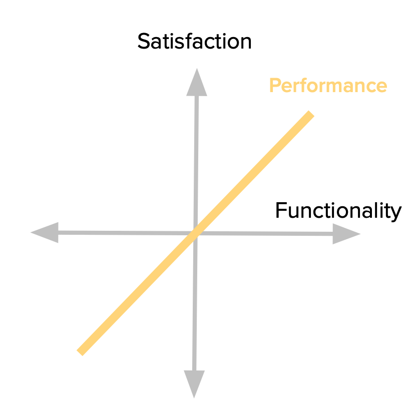

مدل کانو چیست و چه کمکی به شما می‌کند؟ **آیا** **بک لاگ ویژگی های شما بی پایان **به نظر می رسد**** و شامل نیازمندی‌هایی از تیم شما، سهامداران داخلی، مشتریان، مشتریان احتمالی و هر کسی که در مورد محصول نظری دارد؛ می‌شود (بله، حتی خودتان).

شما نمی توانید همه چیز را "در حال حاضر" مانند خواسته های همه بسازید. شما نمی خواهید همه چیز را وارد کنید (و نباید هم وارد کنید). شما ممکن است تصورات بسیار خوبی در مورد اینکه چه چیزی کار می کند و چه چیزی خوب نیست، داشته باشید، اما داده‌هایی برای حمایت از تصمیمات‌تان، قطعی بودن یا ارائه به سایر اعضای سازمان، می‌خواهید.

**شما می خواهید یک نقشه راه محصول با ویژگی های مناسب ایجاد کنید.** دلایل مختلفی وجود دارد که چرا ممکن است نیاز به گنجاندن یک ویژگی خاص داشته باشید، اما برای اینکه بدانید کدام یک مشتریان (آینده) شما را خوشحال می‌کنند و آن را بر دیگران ترجیح می‌دهند، چه می‌کنید؟

ایجاد محصولاتی که مشتریان ما را راضی کند موضوع بسیار رایج در محافل [طراحی UX](https://theminiceo.ir/product-discovery/%d8%ac%d8%b1%db%8c%d8%a7%d9%86-%da%a9%d8%a7%d8%b1%d8%a8%d8%b1-%db%8c%d8%a7-user-flow-%da%86%d8%b7%d9%88%d8%b1-%d8%b7%d8%b1%d8%a7%d8%ad%db%8c-%d9%85%db%8c%e2%80%8c%d8%b4%d9%88%d8%af%d8%9f/) و مدیریت محصول است. بالاخره این هدف نهایی شغل ماست. ولی…

- چگونه رضایت را اندازه گیری کنیم؟

- چگونه انتخاب کنیم که چه چیزی بسازیم تا آن را ارائه دهیم؟

- چگونه از رضایت به لذت برویم؟

پاسخ به این سؤالات آسان نیست، اما خوشبختانه ابزار بسیار مفیدی برای راهنمایی ما در میان آنها وجود دارد: **مدل کانو**.

این راهنمای گام به گام و عمیق بر اساس منابع آنلاین متعدد و برخی تحقیقات علمی تهیه شده است.

## مدل کانو چیست؟

نوریاکی کانو، محقق و مشاور ژاپنی، مقاله ای را در سال 1984 منتشر کرد \[Noriaki Kano et al., “Attractive Quality and Must-be Quality,” research summary of a presentation given at Nippon QC Gakka: 12th Annual Meeting (1982), January 18, 1984\] با مجموعه ای از ایده ها و تکنیک هایی که به ما کمک می کند رضایت مشتریان (و مشتریان بالقوه) خود را از ویژگی های محصول تعیین کنیم. این ایده‌ها معمولاً مدل کانو نامیده می‌شوند و بر پایه‌های زیر هستند:

- **رضایت مشتریان** از ویژگی های محصول ما بستگی به سطح عملکرد ارائه شده (میزان یا میزان اجرای آنها) دارد.

- ویژگی ها را می توان به چهار دسته طبقه بندی کرد.

- شما می توانید از طریق **پرسشنامه** **احساس مشتریان** در مورد یک ویژگی را تعیین کنید.

بیایید به هر یک از آنها بپردازیم.

### رضایت در مقابل عملکرد در مدل کانو

همه چیز با هدف ما شروع می شود: **رضایت**. کانو بُعدی را پیشنهاد می‌کند که از رضایت کامل (که لذت و هیجان نیز نامیده می‌شود) به نارضایتی کامل (یا سرخوردگی) می‌رود.

در تصویر بالا، ابعاد با سطوح رضایت متفاوت مشروح شده است. توجه به این نکته مهم است که این (همیشه) یک مقیاس خطی نیست، همانطور که در ادامه خواهیم دید.

ممکن است فکر کنید که همیشه می خواهید در بالای آن مقیاس باشید، درست است؟ خب امکان ندارد.

اینجاست که Functionality وارد می‌شود. سرمایه‌گذاری، پیچیدگی یا پیاده‌سازی نیز نامیده می‌شود، نشان می‌دهد که مشتری چقدر از یک ویژگی خاص را دریافت می‌کند، چقدر خوب آن را پیاده‌سازی کرده‌ایم یا چقدر در توسعه آن سرمایه‌گذاری کرده‌ایم.

این بعد از هیچ کارکردی به بهترین پیاده سازی ممکن می رسد. به همین دلیل است که اصطلاح سرمایه گذاری نیز برای این مفهوم بسیار خوب است. که یادآوری هزینه انجام کاری مشخص است.

به غیر از نامگذاری، آنچه واقعا مهم است این است که بدانید **این دو بعد در کنار هم اساس مدل کانو هستند** و تعیین می کنند که مشتریان ما در مورد ویژگی‌های محصول ما چه احساسی دارند، همانطور که در بخش بعدی خواهیم دید.

### چهار دسته از ویژگی‌های مدل کانو

کانو بسته به نحوه واکنش مشتریان به سطح عملکرد ارائه شده، ویژگی ها را به چهار دسته طبقه بندی می کند.

#### کارایی یا Performance

برخی از ویژگی‌های محصول به گونه‌ای عمل می‌کنند که ممکن است به طور شهودی فکر کنیم که با رضایت کار می‌کند: هرچه بیشتر ارائه دهیم، مشتریان ما راضی‌تر می‌شوند. به دلیل این رابطه تناسبی بین عملکرد و رضایت، این ویژگی ها معمولاً در ادبیات کانو ویژگی های خطی، عملکرد یا تک بعدی نامیده می شوند.

هنگام خرید خودرو، مسافت پیموده شده بنزین آن معمولاً یک ویژگی عملکرد است. مثال های دیگر ممکن است سرعت اتصال به اینترنت شما باشد. عمر باتری لپ تاپ؛ یا فضای ذخیره سازی در حساب Dropbox شما. هر چه از هر یک از آنها بیشتر داشته باشید، رضایت شما بیشتر می شود.

با بازگشت به نمایش گرافیکی مدل، شاهد پویایی واکنش مشتریان به این نوع ویژگی هستیم. هر افزایش در عملکرد منجر به افزایش رضایت می شود. همچنین مهم است که به خاطر داشته باشید که هرچه عملکرد بیشتری اضافه کنیم، سرمایه گذاری بزرگتری باید در آنجا انجام دهیم (به عنوان مثال تیم سازنده آن، منابع مورد نیاز و غیره).

#### **باید باشد**

سایر ویژگی های محصول به سادگی مورد انتظار مشتریان است. اگر محصول آنها را نداشته باشد، ناقص یا فقط بد در نظر گرفته می شود. این نوع ویژگی ها معمولاً باید Must-be یا انتظارات اساسی نامیده می شوند.

در اینجا معامله با این ویژگی ها است: ما باید آنها را داشته باشیم، اما این باعث نمی شود مشتریان ما راضی تر شوند. **آنها فقط ناراضی نخواهند بود.**

ما انتظار داریم تلفن های ما قادر به برقراری تماس باشند. اتاق هتل ما باید آب لوله کشی و تخت داشته باشد. ماشین باید ترمز داشته باشد. داشتن هر یک از اینها ما را خوشحال نمی کند، اما فقدان آنها قطعا ما را نسبت به محصول یا خدمات عصبانی می کند.

توجه کنید که منحنی رضایت چگونه رفتار می کند. حتی کوچکترین سرمایه گذاری به افزایش رضایت کمک می کند. اما همچنین توجه کنید که چگونه رضایت هرگز حتی به جنبه مثبت بعد نمی رسد. مهم نیست که چه چیزی روی این ویژگی سرمایه گذاری می کنیم، هرگز مشتریان خود را از محصول راضی‌تر نمی کنیم. خبر خوب این است که وقتی به سطح اولیه‌ای از انتظارات رسیدید، نیازی به سرمایه گذاری روی آن ندارید.

#### **جذاب**

ویژگی‌های غیرمنتظره‌ای وجود دارد که در صورت ارائه، واکنش مثبت ایجاد می‌کند. اینها معمولاً جذاب، هیجان‌انگیز یا دلخوش‌کننده نامیده می‌شوند. من تمایل دارم اصطلاح جذاب را ترجیح دهم، زیرا این مفهوم را منتقل می کند که ما در مورد یک مقیاس صحبت می کنیم. ما می‌توانیم واکنش‌هایی از جذابیت ملایم تا لذت مطلق داشته باشیم، و همچنان همه چیز را تحت نام «جذاب» قرار دهیم.

اولین باری که از آیفون استفاده کردیم، انتظار چنین رابط صفحه نمایش لمسی روانی را نداشتیم و ما را غافلگیر کرد. به اولین باری که از Google Maps یا Google Docs استفاده کردید فکر کنید. می دانید، آن احساسی که هنگام تجربه چیزی فراتر از آنچه می دانید و از محصولات مشابه انتظار دارید، دریافت می‌کنید.

فقط به یاد داشته باشید که مغز ما مجبور نیست منفجر شود تا چیزی در این دسته قرار گیرد. ممکن است هر چیزی شما را وادار به رفتن کند: "هی، این خوب است!".

این به بهترین شکل به صورت گرافیکی توضیح داده شده است. نگاه کنید که چگونه حتی برخی از سطوح عملکرد منجر به افزایش رضایت می شود و چقدر سریع افزایش می یابد. این واقعیت کلیدی است برای بررسی سرمایه گذاری که روی یک ویژگی خاص انجام می دهیم. فراتر از یک نقطه خاص، ما فقط بیش از حد آن را می کشیم.

#### **بي تفاوت**

طبیعتاً ویژگی‌هایی نیز وجود دارد که نسبت به آنها احساس بی تفاوتی می‌کنیم. آنهایی که وجود (یا عدم حضور) آنها تفاوت واقعی در واکنش ما به محصول ایجاد نمی کند.

این ویژگی‌ها در وسط بعد رضایت قرار می‌گیرند (جایی که محور افقی آن را قطع می‌کند.) یعنی مهم نیست چقدر تلاش می‌کنیم، کاربران واقعاً اهمیتی نمی‌دهند. این روش دیگری برای گفتن است که ما واقعاً باید از کار روی این موارد اجتناب کنیم، زیرا آنها اساساً آتش زدن پول هستند.

### زوال طبیعی لذت

اکنون که تصویری کامل از همه دسته‌های ویژگی‌های Kano داریم، مهم است که به یک واقعیت اساسی توجه کنیم: آنها ثابت نیستند - در طول زمان تغییر می‌کنند.

آنچه مشتریان ما در مورد برخی از ویژگی های محصول در حال حاضر احساس می کنند، چیزی نیست که در آینده احساس کنند. ویژگی‌های جذاب با گذشت زمان به عملکرد و ویژگی‌های ضروری تبدیل می‌شوند.

مثال آیفون را دوباره در نظر بگیرید. نوع تعامل سیال صفحه لمسی که در سال ۲۰۰۷ ما را شگفت زده کرد، تنها یک انتظار اساسی است.

به هر خاطره شگفت انگیزی که با محصولات گذشته تجربه کرده اید، برگردید. اگر همین محصول الان به شما ارائه شود چه احساسی دارید؟ وقتی زمان کافی سپری شد، به احتمال بسیار زیاد آن ویژگی جادویی را به عنوان یک ویژگی Performance یا Must-be در نظر بگیرید.

این ناامیدی به دلیل عوامل مختلفی است، از جمله تحولات تکنولوژیکی و ظهور رقبا، که همگی برای به ارمغان آوردن عملکرد یکسان پس از اولین حرکت با هم رقابت می کنند.

نکته مهم در اینجا این است که هر تحلیلی که ما در یک نقطه از زمان انجام می دهیم فقط عکسی است که واقعیت آن لحظه را منعکس می کند. هر چه از آن نقطه دورتر شویم، کمتر مرتبط به نظر می رسد. بر خلاف الماس، دسته‌های کانو همیشگی و پایدار نیستند.

### جفت سوالی که ادراک مشتری را آشکار می کند

ما اکنون دو بخش اول مدل کانو را پوشش داده‌ایم: ابعاد تحلیل و تأثیر متقابل آنها برای تعریف دسته‌بندی ویژگی‌ها.

برای اینکه درک مشتری نسبت به ویژگی های محصول خود را آشکار کنیم، باید از پرسشنامه کانو استفاده کنیم که شامل یک جفت سوال برای هر ویژگی است که می خواهیم ارزیابی کنیم:

- در صورت داشتن این ویژگی چه احساسی دارند.

- اگر این ویژگی را نداشتند چه احساسی داشتند.

سوال اول فرم کارآمد و سوال دوم فرم ناکارآمد است ([جان مورمن](https://uxmag.com/articles/leveraging-the-kano-model-for-optimal-results) آنها را مثبت و منفی نیز می نامد.) اگرچه اینها سوالات باز نیستند. برای هر «اگر این ویژگی را داشتید یا نداشتید چه احساسی داشتید؟»، پاسخ های ممکن عبارتند از:

- خوشم می آید

- انتظارش را دارم

- بی طرف هستم

- می توانم آن را تحمل کنم

- آن را دوست ندارم

هنگام بیان این گزینه ها باید مواردی را در نظر گرفت و بعداً به آنها خواهیم پرداخت.

پس از پرسیدن این دو سوال از مشتریان (یا مشتریان بالقوه) و دریافت پاسخ آنها، اکنون می‌توانیم هر ویژگی را دسته‌بندی کنیم.

#### جدول ارزیابی

یکی از چیزهای عالی در مورد مدل کانو این است که هم به دلیل داشتن و هم نداشتن برخی عملکردها است. این نشان می دهد که تا چه حد چیزی برای مشتریان ما خواسته واقعی، مورد نیاز یا بی تفاوت است.

ما این کار را از طریق یک جدول ارزیابی انجام می‌دهیم که پاسخ‌های کاربردی و ناکارآمد را در سطرها و ستون‌های خود (به ترتیب) ترکیب می‌کند تا به یکی از مقوله‌هایی که قبلاً توضیح داده شد برسیم. هر جفت پاسخ به یکی از آن دسته‌ها و چند دسته دیگر منتهی می‌شود که از استفاده از این قالب سؤال به دست می‌آیند.

#### دو دسته جدید

با توجه به این واقعیت که ما از هر دو طرف یک چیز را می‌پرسیم، می‌توانیم بگوییم که آیا:

- شخصی سؤالات یا ویژگی‌هایی را که ما توضیح می‌دهیم کاملاً درک نکرده است.

- آنچه ما پیشنهاد می کنیم در واقع برعکس آن چیزی است که آنها می خواهند.

اینها دسته بندی های کانو واقعی نیستند. آنها صرفاً مصنوعات پرسشنامه هستند (اما با این وجود مفید).

اگر کسی بگوید که نسخه کاربردی را «دوست ندارد» و نسخه ناکارآمد را «دوست دارد»، این شخص به وضوح به چیزی که ما ارائه می‌دهیم علاقه‌ای ندارد و شاید در واقع برعکس آن را می‌خواهد. این دسته جدید Reverse نام دارد. اگر اکثر مشتریان به شما می‌گویند که برخی از ویژگی‌ها معکوس است، می‌توانید فقط سؤالات عملکردی و ناکارآمد را تغییر دهید و پاسخ‌های آن‌ها را طوری نمره دهید که انگار سؤالات را به ترتیب پرسیده‌اید.

وقتی به هر دو سوال پاسخ‌های متناقضی (مانند «پسندیدن» و «پسندیدن») دریافت می‌کنید، یک پاسخ مشکوک دارید. به همین دلیل، Fred Pouliot \[2\] پیشنهاد کرد که سلول های (2،2) و (4،4) از جدول ارزیابی استاندارد کانو به سؤالی نیز تغییر کند. برخی از این موارد در نتایج شما قابل انتظار است، اما اگر اکثر کاربران را با پاسخ‌های مشکوک دریافت می‌کنید، احتمالاً چیزی در چیزی که می‌پرسید وجود دارد.

#### یک جدول ارزیابی (کمی) اصلاح شده

از این به بعد، ما از جدول کمی اصلاح شده پولیو برای طبقه بندی پاسخ های خود استفاده خواهیم کرد.

برای درک بهتر مدل و اجتناب از نیاز به ارجاع هر بار به جدول، باید سعی کنیم نحوه استخراج هر دسته از یک جفت پاسخ را درونی کنیم.

ما قبلاً محل پاسخ‌های سؤال‌انگیز (جفت‌های پاسخ متناقض) را پوشش داده‌ایم. آنها یک مورب را از طریق جدول ارزیابی تشکیل می دهند، به جز سلول میانی.

ویژگی‌های عملکردی ساده‌ترین ویژگی‌ها برای موقعیت هستند. آنها کسانی هستند که مشتریان دوست دارند آنها را داشته باشند و دوست ندارند نداشته باشند. این واکنش شدید، رابطه خطی «هرچه بیشتر، بهتر» را بین این دو بعد ترجمه می‌کند.

ویژگی های ضروری موارد باقیمانده ای هستند که مشتری از نداشتن آنها بدش می آید. مشتریان از تحمل به انتظار برای داشتن این ویژگی می رسند.

ویژگی‌های جذاب زمانی پیدا می‌شوند که مشتری دوست داشته باشد ویژگی‌ای داشته باشد که مورد انتظار نیست. این روش دیگری برای گفتن این است که آنچه ما پیشنهاد می کنیم جدید و جذاب است.

سپس ما ویژگی های بی تفاوت داریم. اینها برای هر پاسخ «من خنثی هستم» یا «من می توانم آن را تحمل کنم»، برای سؤالات عملکردی یا ناکارآمد رخ می دهد. یعنی سلول‌های میانی جدول را اشغال می‌کنند (تخفیف هر یک از دسته‌هایی که قبلا توضیح داده شد).

در نهایت، ما پاسخ‌های معکوس را داریم که در دو محور قرار گرفته‌اند که در آن واکنش‌ها یا دوست داشتن ویژگی یا دوست نداشتن آن است. با برگرداندن مقادیر Functional / Dysfunctional می توانید ببینید که آنها معکوس کدام دسته هستند. سپس می توانید بدانید که آیا این یک ویژگی عملکرد معکوس، جذاب یا باید باشد.
