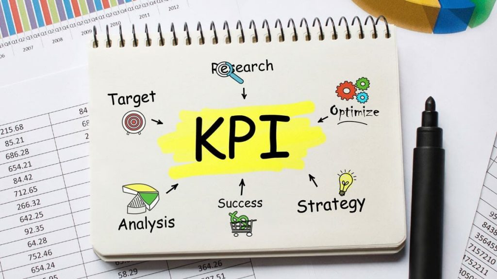

### Key performance indicator (KPI)

You will probably discuss key performance indicators (KPIs) in strategy-planning meetings or performance reviews with the rest of the team. You may also hear them called performance metrics. KPI stands for Key Performance Indicator. KPIs help us understand how well the organization, a unit, or individuals are performing against the quantitative and qualitative strategic goals defined for each.

While KPIs are used in almost every business, few businesses use them well. That is a serious weakness. If a company cannot keep pace with competitors in today’s markets, it will fail quickly. This article looks at how to use KPIs in your organization.

### So what is a KPI?

In general, a KPI is a way to measure the performance of people and, at a larger scale, of an organization or a unit. **A KPI is a numerical measure of performance for any activity that matters to your business.** Managers use key performance indicators to turn vision into measurable goals. For example, a company’s goal might be to become the leading online store. Suppose their main competitors have 20% more online sales. The company then sets a goal of a 25% increase in sales, and the KPI in use is “increase in sales volume.”

KPIs are useful because they make clear where people in the organization should focus. For a salesperson, for example, the choice between focusing on more sales and tidying the workplace is obvious.

The challenge many organizations face is choosing the right KPI from a long list of indicators. Choosing the wrong KPI risks putting the organization on the wrong path and encouraging people to chase something that will not produce progress. Remember: **a KPI matters because it is aligned with organizational goals and measures them. If you choose poorly, you create the risk that those goals will not be met.**

### The difference between a key performance indicator (KPI) and a metric

KPIs are the measures that really matter and deserve attention. A metric is any number you track and use to measure those KPIs. For example, a KPI might be new customers this month, while a metric might be something less important. A KPI also does not have to have financial value. Customer-experience feedback, product performance, sales growth, and similar items can all be KPIs.

## The difference between a key performance indicator (KPI) and a goal

What is the difference between a KPI and a goal (or objective)? A goal is the destination: something the organization has planned to achieve. KPIs show how much progress and action has happened, and therefore how close you are to the goal.

### What are the main benefits of KPIs? (What do KPIs do?)

- Identify and measure the most important outputs of the organization

- Define the organization’s strategic plan along with a schedule for the work

- Show how the organization is progressing against defined strategies

- Measure quantitative and qualitative components of the goals that have been set

- Identify the next actions needed to reach plans and goals

### How do you build a KPI?

Here are five key steps for developing one or more measurable KPIs:

- Clarify your strategic goals: before you start anything, it is better to know why you are doing it. That might be a campaign in a marketing team, or launching a website for a home business. It does not matter what kind of business it is or how large the work is; what matters is that the work is purposeful. We have written about product strategy [here](/en/docs/archive/good-product-strategy/).

- Specify the questions you need to answer: this helps you examine the data you need to collect. Once those questions are clear, you can be sure that every indicator you later define is tied to your strategy. For example, if you run a strategy to increase sales, you might ask: “Where do we make profit?” or “Which processes cost more than they return?”

- Have a precise definition of success: now that you have goals, think about how success for each goal actually happens. Given the goals and the questions from the previous step, you can define success precisely.

- Specify the measures: measures are raw numbers from which you can extract useful information. They are the lowest level of detail in business reports of all kinds. At this stage you should also specify the tools for collecting the measures.

- Define your key performance indicator: finally it is time to define the KPI. Indicators should follow the SMART model. KPIs should be written as simply as possible so that everyone inside the organization can understand them easily.
