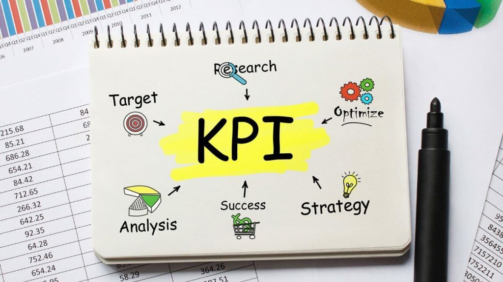

### شاخص کلیدی عملکرد KPI

احتمالا شما در جلسات برنامه ریزی استراتژیک و یا بررسی عملکرد با سایر افراد تیم، در مورد شاخص‌ کلیدی عملکرد (KPI) بحث خواهید کرد. و ممکن است بشنوید که از آنها به عنوان معیارهای عملکرد یاد می‌شود. KPI   مخفف کلمه Key Performance Indicator   است. KPI   به ما در درک میزان خوب بودن عملکرد سازمان، واحد سازمانی و افراد در مقایسه با اهداف کمی و کیفی راهبردی تعریف شده برای هر یک کمک می‌کند.

در حالیکه KPI تقریبا در تمام کسب و کارها مورد استفاده قرار می‌گیرد؛ اما تعداد کمی از این مشاغل از آن به‌طور موثر استفاده می‌کنند. این یک ضعف جدی در کسب و کارهای امروزی است. زیرا این کسب و کارها، اگر در بازارهای رقابتی امروز نتوانند همگام با رقبا باشند، به سرعت شکست خواهند خورد. در این مقاله به بررسی چگونگی استفاده از KPI  در سازمان خود خواهیم پرداخت

### پس KPI چیست؟

به طور کلی می‌توان گفت که KPI روشی برای سنجش عملکرد افراد و در سطح کلان‌تر سازمان و یا یک واحد سازمانی است. **یک** **KPI****، به معیار (اندازه گیری) عددی از عملکرد برای هر فعالیتی که برای کسب و کار شما مهم باشد، گفته می‌شود**. مدیران از شاخص‌های کلیدی عملکرد برای تبدیل چشم‌انداز به اهداف قابل اندازه‌گیری استفاده می‌کنند. برای مثال ممکن است هدف یک مجموعه تبدیل شدن به برترین فروشگاه اینترنتی باشد. فرض کنید رقبای برجسته آن‌ها 20% فروش اینترنتی بیشتری نسبت به این شرکت دارند. در این حالت این شرکت هدفی برای افزایش 25 درصدی فروش تعیین می‌کند و KPI  مورد استفاده "افزایش میزان فروش" می‌باشد.

KPI ها بسیار مفید هستند زیرا مشخص می‌کنند که نیروهای هر مجموعه باید در چه حوزه‌ای متمرکز باشند. به عنوان مثال برای یک فروشنده بین تمرکز برای فروش بیشتر و نظافت محیط کاری خود یک انتخاب وجود خواهد داشت و آن مشخص است.

چالشی که بسیاری از سازمان‌ها با آن روبه‌ رو هستند انتخاب صحیح KPI از میان فهرست چندین شاخص می‌باشد. انتخاب اشتباه KPI این خطر را برای سازمان ایجاد می کند که آن را در مسیر اشتباهی قرار دهد و آن ها را تشویق به حصول چیزی کند که هیچ پیشرفتی برای آن ها حاصل نخواهد کرد. این را به خاطر داشته باشید که **دلیل اهمیت** **KPI** **همسویی آن با اهداف سازمانی و سنجش آن ها می‌باشد** **و اگر اشتباه انتخاب شوند مخاطره عدم تحقق اهداف سازمانی را به وجود خواهند آورد.**

### تفاوت شاخص کلیدی عملکرد (KPI) و سنجه (Metric)

KPIها معیارهای بسیار مهمی هستند که بایستی به آن اهمیت داده شود، اما سنجه یا متریک هر عددی‌ست که شما رصد می‌کنید  و با آن KPIها را اندازه می‌گیرید.  به عنوان مثال یک KPI میتواند مشتریان جدید این ماه باشد در حالیکه متریک میتواند چیز کم اهمیت تری باشد.‍ همچنین KPI  حتما لازم نیست که ارزش مالی داشته باشد، به عنوان مثال دریافت بازخورد تجربه مشتری، عملکرد محصول، افزایش فروش یا مشابه این موارد را نیز میتوان به عنوان KPI در نظر گرفت.

## تفاوت شاخص کلیدی عمکرد (KPI) و اهداف (Goal)

تفاوت بین KPI و هدف (Goal or objective) در چیست؟ هدف یعنی مقصد، چیزی که سازمان برای دستیبابی به آن برنامه‌ریزی کرده است. اما KPIها میزان پیشرفت و عمل انجام شده و در نتیجه میزان نزدیکی به هدف را مشخص می‌کنند.

### مزایای اصلی KPI چیست؟ (KPI ها چه کاری انجام می‌دهند؟)

- مشخص نمودن و اندازه گیری مهمترین خروجی‌های هر سازمان

- تعریف برنامه استراتژیک هر سازمان به همراه زمانبندی انجام برنامه‌ها

- مشخص نمودن روند پیشرفت مجموعه در قالب استراتژی‌های تعریف شده سازمانی

- اندازه گیری مولفه‌های کمی و کیفی اهداف تعیین شده

- مشخص نمودن اقدامات پیشرو برای رسیدن به برنامه‌ها و اهداف

### چگونه KPI بسازیم؟

در ادامه به معرفی 5 اقدام کلیدی برای توسعه یک یا چند KPI  قابل اندازه‌گیری می‌پردازیم:

- اهداف استراتژیک خود را مشخص کنید: قبل از شروع به انجام کاری، بهتر است هدف خود از انجام آن کار را مشخص کنیم. این می‌تواند در قالب یک کمپین در یک تیم بازاریابی باشد و یا راه‌اندازی یک وبسایت کسب و کار خانگی. مهم نیست در چه نوع کسب و کاری است و یا حجم انجام کار چقدر است؛ نکته قابل اهمیت هدفمند بودن انجام آن کار است. پیشتر در مورد استراتژی محصول در [اینجا](https://theminiceo.ir/product-strategy/good-product-strategy/) نوشته‌ایم.

- سوالاتی را که باید آن‌ها پاسخ بدهید، مشخص کنید: این مورد به شما کمک می‌کند تا داده‌های مورد نیاز خود را برای جمع‌آوری اطلاعات مورد بررسی قرار دهید. پس از مشخص شدن سوالاتی که باید به آن‌ها پاسخ دهید، می‌توانید مطمئن باشید که هر شاخصی که متعاقبا تعریف می‌کنید با استراتژی شما مرتبط است. به عنوان مثال اگر یک استراتژی برای افزایش میزان فروش مجموعه خود اجرا کنید، می‌توانید بپرسید: "ما از کجا سود می‌بریم؟" و یا "کدام فرآیندها در مقایسه با بازدهی آن، پرهزینه‌تر است؟"

- تعریف دقیقی از موفقیت داشته باشید: حالا که اهداف خود را مشخص کرده‌اید، باید فکر کنید که موفقیت هر هدف چگونه اتفاق می‌افتد. با توجه اهداف تعیین شده و سوالات پرسیده شده در مرحله قبل، می‌توان تعریف دقیقی از موفقیت ارائه کرد.

- معیارهای اندازه‌‌گیری را مشخص کنید: معیارها اعداد خامی هستند که می‌توان اطلاعات مفیدی را از آن‌ها استخراج کرد. معیارها، پایین‌ترین سطح جزئیات در گزارش‌های انواع کسب و کارها هستند. در این مرحله ابزار جمع‌آوری معیارها نیز باید مشخص باشند.

- شاخص کلیدی عملکرد خود را تعریف کنید: در نهایت زمان تعریف شاخص کلیدی عملکرد فرا رسیده است. شاخص‌ها باید از مدل SMART پیروی کنند. KPI ها باید تا حد امکان ساده نوشته شوند به نحوی که تمام اعضای داخل سازمان به راحتی قادر به درک آن باشند.
