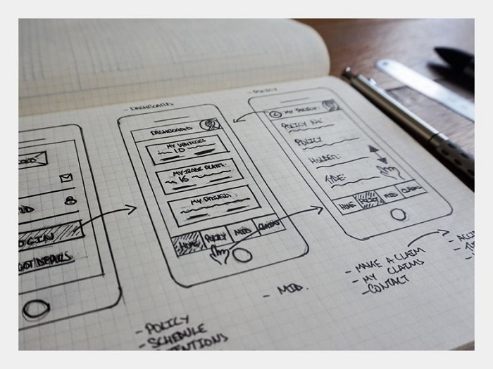
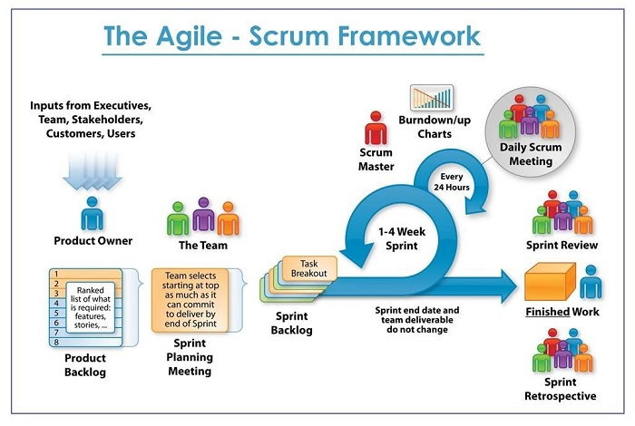
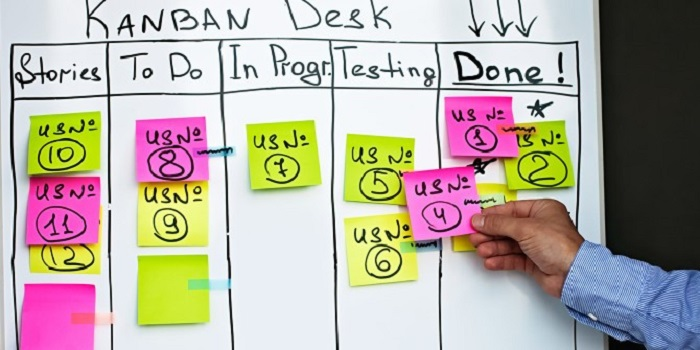

If you are looking for an article that teaches you every product-management tool, I will be honest: this article cannot help you. No single article can cover all product-management tools. This piece is a summary, or better, an introduction to the tools managers use in businesses that have a software product. So experienced product managers can close this page without guilt and go back to the product they manage.

## **A working agreement**

Let me speak plainly. You already know that many people do not know the difference between product management and project management. It probably will not surprise you that I have met many people who do not even have a proper definition of product owner. So we agree here that anything that relates, directly or indirectly, to the product also relates to product management. In fact, product management should be able to change that “thing,” or at least have a say. That is why we call the role a “mini CEO.”

## **Product management tools**

I wanted to talk about “what is a tool?” and “why managers need tools,” and cite a few articles and conferences to show how rich this piece is. Then I thought about it and saw it would be nothing but extra explanation. So we skip that and get to the point.

We can group product-management tools as follows:

### 1. **Roadmap and strategy**

A roadmap is a long-term product-development plan that presents program information to stakeholders. Put another way: writing down the mental plan for product development in a simple form everyone can understand, without unnecessary detail. The product roadmap explains which products and features will be built to realize strategy and vision, who is responsible for building those features, and sometimes an estimate of when those products and features will ship.

There is no rule for preparing a roadmap. There is no single roadmap for companies, even with a similar product. Tools for implementing a roadmap can be paper and pen, marker and whiteboard, a PowerPoint template, Excel—and if you want to play it professionally and reach into your pocket, take a look at Aha! and similar products. I recommend you do not spend money in this area and enjoy a ready-made PowerPoint or Excel roadmap template (a simple search will find one).

### 2. **Information analysis**

The product is built for the customer, and you should always consider the customer’s view before, during, and after building it. A small number of customers or audience members gift you their opinion of the product (positive or negative). But what tool lets you learn the rest of those opinions? Your first answer is probably Google Analytics, which is also free. Despite sanctions, it is the best-known analytics tool in Iran. There are many tools such as Geckoboard, GoodData, and [Amplitude](https://amplitude.com/). Each has its own strengths and weaknesses; for example, I think GoodData has a more attractive design. Overall, Google Analytics’ free features go much further than the others. There are a few other tools that, because of sanctions and the risks that come with them, are better left off the list.

As a product manager you should have a good familiarity with knowledge management and turning data into knowledge, but in the product-manager seat we do not go very deep into “data,” and analyzing “information” is not the whole of the product manager’s job. So we do not interfere in the work of data specialists (data scientists, data analysts, and so on) and simply use the dashboards of the tools above to develop and improve the product.

Suggestion: experience, popularity, prevalence, cost, and similar factors make Google Analytics the suggested choice for Iranian businesses.

### 3. **Product design**

\+ Look, add a page that shows the product list. Remove the logo from the top and write “product list” instead.
\- Should I remove the menu?
\+ No, but put two buttons in a bar for filtering the list and categories
\- Bottom or top?
\+ Bottom of the page
\- Should the items be a grid or linear?
\+ For the MVP let’s keep it linear; later we’ll add grid too...

Finish this conversation between the product manager and the designer yourself. Instead of spending several minutes arguing about transferring the product concept to the designer, you can put what you want on paper and then discuss it in a concrete way.

Let me define three concepts and introduce a tool for each.

#### Wireframe

The overall structure of the product, very simple. That is, it covers little detail. Drawing a wireframe takes little time and pays more attention to the product’s function. At this stage we have a good amount of time to look at user experience (UX) without bias. When the design gets color and visual detail (UI), the mind is pulled from key overall points toward unnecessary detail.

To draw a wireframe we can use pen and printed templates. We can also name [Balsamiq](https://balsamiq.com/) as a practical application. But I suggest drawing wireframes by hand and linking the images together with the Marvel app.

#### Mockup

The same wireframe with UI applied. In a mockup more detail is added to the design, but there is still no product behavior. At this stage color, font, shadows, and so on are prepared by the designer. Sketch, Photoshop, Illustrator, and similar tools are used to produce mockups.

#### Prototype

The closest sample to the expected final product, containing all the flows and details. It is not as functional as a real product, but it is a reasonable, low-cost way to learn stakeholders’ views and their feedback. Keynote, Marvel, InVision, and similar tools are used to build prototypes.

### Project and task management

The right task-management tools are among the most important product-management tools. This side of product management—managing tasks—is so important that some people implicitly treat product management as the same as project management. Project management differs by product type, industry, staff, and so on. You may have heard of the project-management pyramid. At the top of the pyramid are standards, in the middle methodology, and at the base tools. In this section we focus on the lower and middle levels of the pyramid.

#### Waterfall methodology

Running the project as related, sequential processes, where each process starts after the previous stage ends. The project is predictable from the start, and the final product does not differ from the product designed at the beginning.

#### Agile methodology

Splitting the project into smaller parts and doing those parts in short timeboxes (sprints). In this method project complexity is lower, and there is special attention to continuous improvement of the team and the product.
Given how changeable the market is, how easy it is to change the product, product testing, high competition, the need for the product to be market-oriented, and similar factors, agile methodology is recommended for software-product development.

#### Hybrid methodology

A mix of agile and waterfall methodologies. In a separate article we will explain why hybrid is the dominant methodology in platform businesses.
But knowing agile methodology does not put bread on the table. In fact agile is a philosophy, and frameworks are the way of implementing that philosophy—which is what we want to talk about now.

#### Scrum framework

Scrum is the best-known and most widely used framework in Iran. Other frameworks such as Kanban, XP, Crystal, and others are also used; we will not go into those here.
In the figure below we see the product process in the Scrum framework:

As one of the product-management tools, Scrum is a useful framework for software development, especially for small teams. Product Owner and Scrum Master play two key roles in implementing Scrum. The product manager receives requirements, strategy, musts and must-nots, and so on from managers or stakeholders and builds a list of user stories. A user story describes an operation the product is supposed to include. That is, we split the whole intended operation into smaller parts called user stories.

For example, in a mobile-app project we want to add a “login page.” The user story is “the user should be able to log in.” For easier planning we split user stories into smaller tasks. “User login,” “login with Google,” “forgot password,” and so on can be defined as tasks for the user story above.

Tasks are planned and prioritized in a list (the backlog). We split software-development time into smaller parts called sprints. A meeting called Sprint Planning is held at the start of each sprint. The output of sprint planning is a list of tasks that must be done in the coming sprint. Every morning we update our information about the project by sharing information such as tasks done, tasks in progress, problems, requirements, and so on. This daily meeting is run by the Scrum Master and is short (15 minutes). The Scrum Master plays a leadership role, trying to make the Scrum implementation process easier. Two meetings are held at the end of each sprint: the first is the sprint review, which pays more attention to the product, tasks, and stakeholder requirements. The second is called retro and has more of an inward, team-alignment look.

### But the task-management tool

In this part, various products sit among product-management tools, and many categorizations are possible, but first we make a physical sample of a task board. We can build a board and, with a few colored papers, make a task-management board.

There are many software boards for task management with a lot of features. Trello, Asana, Jira, and others are among them. In terms of use and ease, Trello is one of the best, but if you want a more professional board with more features, we recommend Jira.

**But where does the product manager sit in the Scrum process?**
Product management is not a role defined by agile methodology and Scrum. The product manager works independently of methodology and framework. Because everything about the product relates to the product manager, the product-development process also changes the product manager’s work. If we are product managers using agile methodology, we should consider short-term, flexible strategies in product development and apply stakeholder feedback in the best way in future changes.

## Summary

We tried to point simply to the tools needed for product management. So we can conclude that in the product-management toolbox there should at least be a tool for Roadmap / strategy, information analysis, product design, and project management. Having a tool for research / surveys and product testing also improves the product’s situation. Tools such as Excel are an inseparable part of every manager’s needs, which we skipped mentioning. I hope you found this article useful, and we will try to add the topics we left out over time. Please share your comments and questions with us here.
