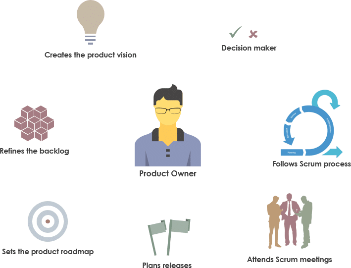
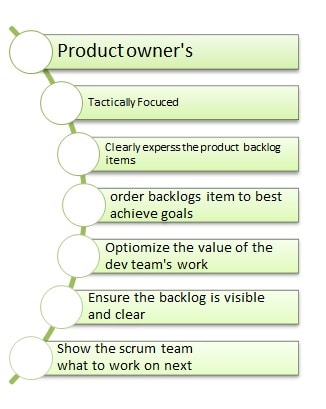
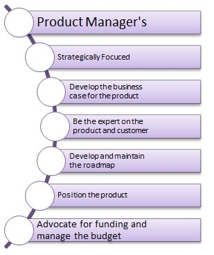

In the [Scrum](https://www.scrum.org/) framework there are three distinct roles: product owner, Scrum Master, and the technical team. In this piece we look at the definition of product owner, their role in developing a software product, and a product owner’s job description.

The first important point is that a product owner (unlike a common misconception) **is a job title. (They are not the project owner, the business owner, or the idea owner.)** The product owner is known as the representative of the client or the business on teams that use Scrum. The product owner is the person who:

- Decides on features.

- Defines the features and capabilities the customer expects.

- Prioritizes the product manager’s requests based on the roadmap.

- Plans each sprint and specifies the backlog items for that sprint.

- Determines which feature is added to the product and when.

- After work is done, decides whether to accept or reject the result.

The product owner must be able to lead the development team so that the outcome of their work carries the greatest possible value for the customer. But how do you create the greatest possible value for the customer? In short, it means the product owner does not let the development team build the wrong product or move in the wrong direction. To do that the product owner must prevent two things:

1. Defining the wrong task: after a new task is defined, the development team may not have a correct understanding of the work they should do. The product owner’s job is to receive the product manager’s request correctly and transfer it to the development team in writing, with precision.

2. Wrong prioritization: wrong prioritization of work by the product owner can have heavy costs for the organization and the client. The product owner must, given the defined roadmap and user need, prioritize all work requested by the product manager correctly so they can create the greatest return for the product.

A good product owner should know **business** strategies, **how to design a product**, **market analysis**, **customer communication**, and **project-management concepts**.

## Managing the product backlog

Perhaps the most important duty of the product owner is managing the product backlog, which includes:

- Fully and clearly defining every item in the backlog for the other Scrum team members (Scrum Master and development team)

- Making sure the product backlog is transparent for the whole team and that the Scrum team has a correct understanding of it

- Making sure the development team and Scrum Master know exactly what should be done when, and what the purpose of doing it is

- Making sure every team member has access to the product backlog and the sprint backlog

- Prioritizing the product backlog for each sprint and specifying how long each item will take

- Receiving implemented items and making sure the work was done correctly (testing each item separately)

- Deciding about each sprint (continue, change the sprint backlog, or, in very rare cases and given the situation, cancel the sprint)

[This article](/en/docs/archive/8-different-ways-to-organize-backlog/) looks at different methods of managing a product backlog effectively.

**The product owner is always one person, and in Scrum’s definition there is no team of product owners.** Note that sometimes some of the product owner’s duties may be done by another person or team—for example defining the backlog when the task is highly technical. In the end, though, responsibility still sits with the product owner.

## Principles for deciding on the product backlog

Another product-owner duty regarding backlogs is deciding whether to do the work, how to prioritize it, and when to do it. Based on the definition of agile methodology, the product owner should make the right decision about the product backlog according to three principles:

1. **Value:** at every stage of product development, the product owner’s job is to get done the work that creates the most value relative to the costs of doing it. That value should be aligned with the wishes of the product manager, the client, and the customer.

2. **Decision-making:** in many cases there are disagreements among the teams involved in developing a product (client, marketing team, development team, and so on). At that time the product owner, given an assessment of the situation and the command they have of the whole project, should take the best decision in the direction of moving the product forward.

3. **Relationships:** in the Scrum framework, interpersonal relationships take priority over documentation. For that reason the product owner, as the link among all teams involved in developing the product, plays a very strong role in coordinating those teams. The product owner should have a full view of the work the development team is doing. That prevents ambiguity and therefore chaos on the team, and if the product manager or stakeholders ask, the product owner can also keep them informed of progress.

## The difference between product manager and product owner

We have written earlier about [the product manager](/en/docs/archive/intro-for-product-managment/). In short, the product manager should set the product’s strategic goals and present a precise vision of the product, and based on strategy and vision specify the roadmap. The product manager should be actively present in launching strategic goals, winning the market, and ongoing support. Product marketing, supporting the sales team, budgeting, long-term forecasting, customer care, and close, ongoing communication with the client are among the other duties of product managers.

Alongside the product manager, the product owner, in close contact with the product manager and sometimes the customer, should make sure acceptable, justified value is delivered to the client or customer at the right time, given ongoing costs.

The product owner has close, continuous contact with the other members of the Scrum team. As the beating heart and central core of Scrum, this person plays a key role in the success of projects.

## Closing words

A product owner must be able to draw a correct **vision** of the product and the development path, so they can see the final picture of the product and share it with teammates. They must have **foresight** so they can make the best decisions for moving the product forward. They must be able to understand customer need at the right time and turn it into an exceptional opportunity. They also specify the product plan. They should always be beside and with the team so they can steer the project correctly.

The product owner is like a **guide**: the person responsible for the product’s success. At the same time, the product owner must be a team player who relies on close collaboration with the other members of the Scrum team, but has no command over them.

The product owner must have enough **authority** and an appropriate level of management support to steer development efforts and to bring stakeholders along. This person must have appropriate **decision-making power**, from finding the right team members to deciding which requirements are added to the product and when.
