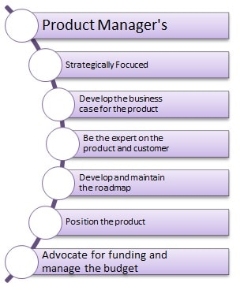

در چارچوب [اسکرام](https://www.scrum.org/)، سه نقش متفاوت وجود دارد. مالک محصول، اسکرام مستر و تیم فنی. که در این مطلب نگاهی خواهیم داشت به تعریف مالک محصول، نقش آن در توسعه یک محصول نرم‌افزاری و شرح وظایف یک مالک محصول.

اولین نکته‌ مهم این است که بدانیم مالک محصول (Product owner) برخلاف تصور، **یک عنوان شغلی است****. (****مالک پروژه، مالک کسب‌وکار یا صاحب ایده نیست.****)** مالک محصول به عنوان نماینده کارفرما یا کسب‌وکار در تیم‌هایی که از چارچوب اسکرام استفاده می‌کنند، شناخته می‌شود. مالک محصول در واقع شخصی است که:

- در مورد فیچرها تصمیم‌گیری می‌کند.

- ویژگی‌ها و قابلیت‌های مورد انتظار مشتری را تعریف می‌کند.

- درخواست‌های مدیر محصول را بر اساس نقشه راه، الویت‌بندی می‌کند.

- برای هر اسپرینت برنامه‌ریزی کرده و بک‌لاگ‌های مربوط به آن اسپرینت را مشخص می‌کند.

- تعیین می‌کند که کدام ویژگی در چه زمانی به محصول اضافه شود.

- پس از انجام یک کار، در مورد پذیرفتن یا رد نتیجه کار، تصمیم‌گیری می‌کند.

مالک محصول باید بتواند تیم توسعه را به نحوی رهبری کند تا حاصل کار آن‌ها، همراه با بیشترین ارزش ممکن برای مشتری باشد. اما چگونه می‌توان بیشترین ارزش ممکن برای مشتری را خلق کرد؟ به طور خلاصه این جمله به این معنا است که مالک محصول اجازه ندهد تیم توسعه، محصول اشتباهی بسازد یا در جهت اشتباه حرکت کند. برای اینکار مالک محصول باید از دو اتفاق پیشگیری کند:

1. تعریف تسک (وظیفه) اشتباه: پس از تعریف یک تسک جدید، ممکن است تیم توسعه برداشت درستی از کاری که باید انجام دهند نداشته باشد؛ وظیفه مالک محصول این است که خواسته مدیر محصول را به درستی دریافت کرده و در به صورت مستند به طور دقیق به تیم توسعه انتقال بدهد.

3. الویت‌بندی اشتباه: الویت‌بندی اشتباه کارها توسط مالک محصول می‌تواند هزینه‌های سنگینی برای سازمان و کارفرما داشته باشد. مالک محصول باید با توجه به نقشه‌راه تعریف شده و نیاز کاربر، تمام کارهای خواسته شده از سمت مدیر محصول را به درستی الویت‌بندی کند تا بتواند بیشترین بازده برای محصول را ایجاد کند.

یک مالک محصول خوب باید از استراتژی‌های **کسب و کار**، **نحوه طراحی محصول**، **تحلیل بازار**، **ارتباط با مشتری** و **مفاهیم مدیریت پروژه** آگاهی داشته باشد.

## مدیریت بک‌لاگ محصول

شاید مهمترین وظیفه مالک محصول، مدیریت بک‌لاگ محصول باشد. که شامل موارد زیر می‌باشد:

- تعریف کامل و شفاف تمام موارد موجود در بک‌لاگ برای دیگر اعضای تیم اسکرام (اسکرام مستر و تیم توسعه)

- اطمینان از اینکه بک‌لاگ محصول برای همه تیم شفاف بوده و تیم اسکرام به درک درستی از بک‌لاگ محصول رسیده است.

- اطمینان از اینکه تیم توسعه و اسکرام مستر دقیقا می‌دانند که چه مواردی در چه زمانی باید به انجام برسند و هدف از انجام اینکار چیست؟

- اطمینان از دسترسی همه اعضای تیم به بک‌لاگ محصول و بک‌لاگ اسپرینت

- الویت بندی بک‌لاگ محصول برای هر اسپرینت و مشخص نمودن میزان زمان انجام هر یک

- دریافت موارد پیاده‌سازی شده و اطمینان از انجام صحیح کارها (تست هر مورد به صورت جداگانه)

- تصمیم‌گیری در مورد هر اسپرینت (ادامه، تغییر بک‌لاگ اسپرینت و یا در موارد خیلی نادر و با توجه به شرایط، لغو اسپرینت)

در [این مطلب](https://theminiceo.ir/product-articles/8-different-ways-to-organize-backlog/) به بررسی انواع روش‌های مدیریت مؤثر بک‌لاگ محصول پرداخته‌ شده است.

**مالک محصول همواره یک نفر بوده و در تعریف اسکرام، تیم مالکان محصول وجود ندارد.** دقت کنید که گاهی ممکن است بعضی از وظایف مالک محصول را شخص یا تیم دیگری انجام دهد. مانند تعریف بک‌لاگ در مواردی که تسک موردنظر تا حد زیادی فنی و تخصصی باشد. اما در نهایت مسئولیت آن با مالک محصول است.

## اصول تصمیم‌گیری برای بک‌لاگ محصول

یکی دیگر از وظایف مالک محصول در مورد بک‌لاگ‌ها، تصمیم‌گیری در مورد انجام کار، الویت بندی انجام و زمان انجام است. مالک محصول بر اساس تعریف متدلوژی اجایل، باید بر طبق سه اصل زیر در مورد بک‌لاگ محصول تصمیم صحیح را بگیرد:

1. **ارزش**: در هر مرحله از توسعه محصول، مالک محصول وظیفه دارد تا کارهایی را به انجام برساند، که بیشترین ارزش را با توجه به هزینه‌هایی که صرف انجام آن کار می‌شود، ایجاد کند. این ارزش باید هم‌راستا با خواسته‌های مدیر محصول و کارفرما و مشتری باشد.

3. **تصمیم‌گیری:** در بسیاری از موارد بین تیم‌های درگیر در توسعه یک محصول (کارفرما، تیم مارکتینگ، تیم توسعه و...) اختلاف نظرهایی وجود دارد. در این زمان، مالک محصول با توجه به ارزیابی شرایط موجود و تسلطی که بر تمام پروژه دارد، می‌باید بهترین تصمیم در راستای پیشبرد محصول را اتخاذ کند.

5. **رابطه:** در چهاچوب اسکرام، روابط بین فردی بر مستندات الویت دارند. از این جهت، مالک محصول به عنوان رابط بین تمام تیم‌های درگیر در توسعه محصول، نقش بسیار پررنگی در هماهنگی این تیم‌ها دارد. مالک محصول باید اشراف کاملی بر کارهایی که تیم توسعه در حال انجام دادن هست، داشته باشد. این امر از ایجاد ابهام و در نتیجه هرج‌ومرج در تیم جلوگیری کرده و همینطور در صورت پرسش از سمت مدیر محصول یا ذینفعان، مالک محصول می‌تواند آنها را نیز در جریان پیشرفت کار قرار دهد.

## تفاوت مدیر محصول و مالک محصول

پیشتر در مورد [مدیر محصول](https://theminiceo.ir/product-skills/intro-for-product-managment/) صحبت کرده‌ایم. اما به صورت خلاصه مدیر محصول باید اهداف استراتژیک محصول را تدوین کند، و چشم‌انداز دقیقی از محصول ارائه کند. و بر اساس استراتژی و چشم‌انداز محصول، نقشه‌راه را مشخص کند. مدیر محصول باید در راه‌اندازی اهداف استراتژیک و کسب بازار و پشتیبانی مستمر حضور فعال داشته باشد. بازاریابی محصول، حمایت از تیم فروش، بودجه‌بندی، پیش‌بینی طولانی مدت، مراقبت از مشتری و همچنین ارتباط نزدیک و مستمر با کارفرما از دیگر وظایف مدیران محصول است.

در کنار مدیر محصول، مالک محصول نیز در ارتباط نزدیک با مدیر محصول و گاها مشتری، می‌باید اطمینان یابد که ارزش قابل قبول و موجهی به کارفرما یا مشتری در زمان مناسب و با توجه به هزینه‌های جاری، ارائه کند.

مالک محصول ارتباط نزدیک و مداومی با سایر اعضای تیم اسکرام دارد. این شخص به عنوان قلب تپنده و هسته مرکزی اسکرام، نقش بسیار کلیدی در موفقیت پروژه‌ها دارد.

## سخن پایانی

یک مالک محصول باید بتواند **چشم‌انداز** درستی از محصول و مسیر توسعه ترسیم کند، که می‌تواند تصویر نهایی محصول را ببیند و آن‌را با سایر هم‌تیمی‌ها به اشتراک بگذارد. **قدرت آینده‌نگری** داشته باشد تا بتواند برای پیشبرد محصول بهترین تصمیم‌ها را بگیرد.  او باید توانایی درک نیاز مشتری را در زمان مناسب و تبدیل آن به یک فرصت استثنایی را داشته باشد. او همچنین نقشه طرح محصول را مشخص می‌کند. همواره کنار و همراه با تیم باشد تا بتواند به درستی پروژه را هدایت کند.

مالک محصول همانند یک **راهبر** است؛ به عنوان فردی که مسئول موفقیت محصول است . در عین حال، مالک محصول باید یک بازیکن تیم باشد که به همکاری نزدیک با دیگر اعضای تیم اسکرام متکی است، اما هیچ گونه تسلطی بر آنها ندارد.

مالک محصول باید دارای **اقتدار** کافی و سطح مناسبی از پشتیبانی مدیریت برای هدایت تلاش‌های توسعه و برای جلب سهامداران باشد. این شخص باید دارای **قدرت تصمیم‌گیری** مناسب باشد. از پیدا کردن اعضای مناسب برای تیم گرفته تا تصمیم گیری در مورد اینکه کدام نیازمندی‌ها در چه زمانی به محصول اضافه شوند.
