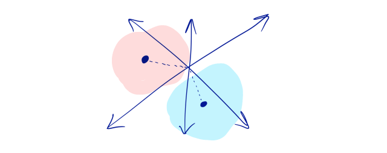

  

Real-estate people say “location, location, location.” You can upgrade your kitchen and bathroom, but if you are in a bad part of town you cannot sell the house well and at a good profit. The same is true for your product. Focusing on capabilities and user experiences with your product is very good, but you should not ignore the high importance of the product position you want to reach.

A product’s position is an abstract concept in space (the space of decision trade-offs). Deciding what new capability to add to your product moves you closer to or further from other similar products in the market.

Your position determines whether you are chosen when the customer chooses. When a customer looks for a solution to their need, are you one of their options? What problems do you solve well, and what problems can you not solve?

**When you know your product’s position, you can say no.** **When you do not know your product’s position well, you say yes to requests easily and without fear.** You add a capability because you are worried about what happens if you do not. In that state you are in a weak position to compete, and you will have many problems in product design.

### Snickers and Milky Way

Let me make this a bit less abstract. What made this topic take shape in my mind and matter more was Snickers and Milky Way. For a period these two products were marketed in a distinct way. Each team entered marketing challenges in which both were competitors in the same competitive space. (Product position in the market: chocolate candy bar)

Both teams did unusual research, and after a while a large gap opened between them.

**Snickers** is like chewy food. It is a bit salty and crunchy, and people use Snickers as a snack when they miss a meal and need a snack. People usually eat Snickers in public.

**Milky Way** melts in your mouth. Milky Way makes you overindulge. People consume it after an emotional event when they need a driving force. People usually eat Milky Way in private or non-public space.

This marketing story is a famous one among marketers. Snickers eventually arrived at the message “**You’re not you when you’re hungry**.” Young people bite into a Snickers during a break in a football game. This message is very different from Milky Way’s, which said “**Lost in a Milky Way**.” That message was shown with the image of a happy young person with their eyes closed, time passing very slowly.

What matters from a product-design point of view is that Snickers cannot create a requested feature that is, say, melty, and win new customers that way. Likewise Milky Way cannot get there by adding a bit more crunch. Those trade-offs are what distinguish them and reveal their competitive sets. These differences also have their effect when the customer chooses.

### **Trade-offs at Basecamp**

Every product has its own version of “melty or chewy.”

At Basecamp we have reached an informal understanding of what our product can be and what it cannot be. That understanding helps us hold our product position.
To show this we can use ideas from mathematics. In product, from a positioning point of view, we can point to something like dimensions and different positions in an n-dimensional space that displays your product’s position in an n-dimensional space of the market and the competitive landscape.

  

### Abstract space

We could have spent months building an online editor with simultaneous multi-person work (like Google Docs). In fact, an online product for real-time multi-person interaction. But our product at Basecamp focuses on asynchronous interactions rather than online and simultaneous ones. Basecamp aims to make your business more orderly and calmer. We want to help you reply to requests when you have time, and send your edit requests to others when you have enough time.

We could have built complete, comprehensive project-management charts that mapped every requirement of every task to the others. But at Basecamp we want to help you make sure key items do not get hidden among less necessary, less important ones. We let you not forget the items that help you carry out the plan and project precisely.

You can store and keep anything in Basecamp. But the best way to use this tool is when you want to share read-only files with others: screenshots, PDFs, copies of files, videos, and so on.

We could have given you customized capabilities so you could implement your team’s working framework precisely in Basecamp. In that case you would have to learn how to do those custom settings, implement all the settings, design the team workflow, and then teach all of that complexity to your team. Instead we tried more to act like sticky notes: something everyone understands easily, with no need to implement and understand processes.

### **Colors in the ocean**

The book *Blue Ocean Strategy* makes this clear. The trade-offs you make and the capabilities you implement move you toward being distinctive in your product position in the market, and also place you in a new position to be chosen by the customer. If we visualize this, you can see the spaces that are more attractive than others given what other products sit next to you in that space. The authors of the book talk about a red ocean. A red ocean is where your competitors make similar decisions about choosing product capabilities; a blue ocean is where there is still room for new things.

### Working with the team

In this year’s strategy we designed an informal table to remind ourselves what kind of product decisions we want to make this year, and we shared it with the team.

| **Less toward** | **More toward** | **Note** |
| --- | --- | --- |
| Within a minute | On your own time | We prefer asynchronous, batched notifications, and the long form. |
| Millimeter planning | Nothing is forgotten | Not forgetting a topic matters more than managing attachments and dependencies. |
| Creating work | Discussing the work | Write the text yourself and ask others for feedback instead of interacting with others in real time. |
| Source and key files | Rendering | Design-in-progress files such as PSD live somewhere else. Code lives on GitHub. You should share files at intermediate or final stages to get feedback. |
| Embodying specific processes | Learning with ease | You can have a better, more precise bug-tracking process in Jira, or put more precise visualization work in InVision, but Basecamp is for every team member to be able to work with it. |
| Personal work | Coordinated work | If other people should not know about it, it does not go in Basecamp. |

The “less toward” and “more toward” template is one of the fast ways to trade off when choosing capabilities to hold your product position.

### Positioning, positioning, positioning

Without a precise picture of what distinguishes you, you wander easily—especially in software, where your hands are free to do almost anything. **Requests for new capabilities come at you every day, and if you cannot say no to them, who knows where you will sit on the competitive map in the future.**

If you have trouble finding your position in the market, do not worry: you are not alone. We wrestled with this at Basecamp too, especially as the variety of Basecamp customers across industries grew. In our case, techniques such as Jobs to Be Done helped a great deal.

Read more: [Five good examples of product positioning](https://consumerbrandbuilders.com/good-product-positioning-examples-abound/)

As Clay Christensen said: **“Questions create the space for answers to appear.”** So at the very least, thinking about your product position helps you get on the right path and continue your work.

For more on product strategy, use [this link](/en/categories/product-strategy/).
