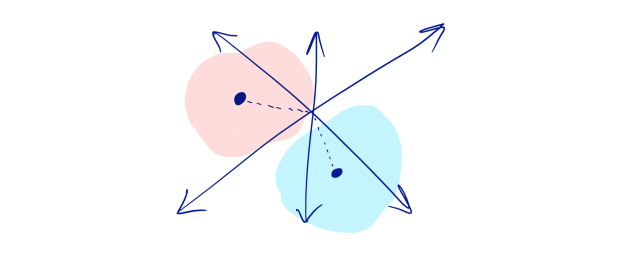

  

املاکی‌ها می‌گویند “موقعیت، موقعیت، موقعیت”. شما می توانید آشپزخانه و سرویس بهداشتی خانه خود را ارتقا بخشید اما اگر در منطقه بدی از شهر قرار داشته باشید،‌ نمی‌توانید خانه را به خوبی و با سود مناسب به فروش برسانید. این موضوع برای محصول شما نیز صادق است. تمرکز بر روی قابلیت‌ها و تجربه‌های کاربر در کار با محصول شما خیلی خوب است اما نباید اهمیت بالای جایگاه محصول که می‌خواهید بدست بیاورید را نادیده بگیرید.

جایگاه یک محصول یک مفهوم انتزاعی در فضا است (فضای سبک سنگین کردن تصمیمات) تصمیم گیری درباره اینکه چه قابلیت جدیدی به محصول خود اضافه کنید شما را نزدیک‌تر یا دورتر از دیگر محصولات مشابه شما در بازار می‌کند.

جایگاه شما تعیین کننده این موضوع است که آیا شما در زمان انتخاب توسط مشتری انتخاب می شوید یا خیر. زمانی که مشتری برای رفع نیاز خود به دنبال یک راه حل می‌گردد، آیا شما یکی از انتخاب های وی هستید؟ چه مشکلاتی را به خوبی حل می‌کنید و چه مشکلاتی را نمی‌توانید حل کنید؟

**زمانیکه جایگاه محصول خود را شناخته باشید، می توانید نه بگویید.** درصورتیکه **زمانیکه جایگاه محصول خود را به خوبی نمی دانید به راحتی و بدون ترس به درخواست‌ها بله می گویید.** شما یک قابلیت را به محصول خود اضافه می کنید چرا که از این نگران هستید که اگر اضافه نکنید چه اتفاقی می افتد. در این حالت شما در جایگاه ضعیفی برای رقابت قرار دارید و از نظر طراحی محصول دچار مشکلات بسیاری خواهید شد.

### اسنیکرز و میلکی وی

اجازه دهید کمی از انتزاعی بودن این موضوع بکاهیم. چیزی که باعث شد این موضوع در ذهن من شکل بگیرد و از اهمیت بیشتری برخوردار شود موضوع اسنیکرز و میلکی وی بود. در یک دوره زمانی این دو محصول به صورت مشخص بازاریابی می شدند. تیم های هر کدام وارد چالش های بازاریابی شدند که در آن هر دو رقبای همدیگر در یک فضای رقابتی به حساب می آمدند. (جایگاه محصول در بازار: شکلات آب‌نبات نواری)

هر دو تیم تحقیقات غیرمعمولی انجام دادند و پس از مدتی فاصله بزرگی بین آن‌ها ایجاد شد.

**اسنیکرز** شبیه غذای جویدنی است. کمی شور و ترد می باشد که مردم زمانی که یک وعده غذایی را از دست می دهند و به اسنک نیاز دارند از اسنیکرز به عنوان اسنک خود استفاده می کنند. مردم معمولا اسنیکرزها را در فضای عمومی مصرف می کنند.

**میلکی وی** در دهان شما آب می شود. میلکی وی شما را وادار به زیاده روی می کند. افراد بعد از یک رویداد احساسی که به یک نیروی محرکه نیاز دارند آن را مصرف می‌کنند. افراد معمولا میلکی وی را در فضای شخصی یا غیرعمومی مصرف می کنند.

این داستان بازاریابی یک داستان معروف میان بازاریابان است. اسنیکرز در نهایت به این پیام رسید که “**زمانی که گرسنه هستید دیگر خودتان نیستید**”. افراد جوان در زمان استراحت بازی فوتبال اسنیکرز گاز می زنند. این پیام بسیار متفاوت تر از پیام میلکی وی که می گفت “**در میلکی وی گم می شوید**”. این پیام با این تصویر نمایش داده می شد که یک فرد جوان خوشحال چشمانش را بسته است و زمان برایش بسیار کند می گذرد.

آنچه از دیدگاه طراحی محصول مهم است این موضوع است که اسنیکرز نمی تواند یک ویژگی درخواست شده را که مثلا آبکی بودن است را ایجاد کند و در رقابت مشتریان جدیدی بدست بیاورد. همچنین میلکی وی نمی تواند با اضافه کردن کمی تردی بیشتر به این موضوع دست یابد. این سبک سنگین کردن‌ها همان چیزی است که آن‌ها را از هم متمایز کرده و مجموعه‌های رقابت پذیر آن‌ها را رو می‌کند. همچنین این تفاوت‌ها در زمان انتخاب شدن توسط مشتری اثر خود را بر جای می‌گذارند.

### **سبک سنگین کردن در بیس کمپ**

هر محصول نسخه “آبکی یا جویدنی”مخصوص به خودش را دارد.

ما در بیس کمپ به درک غیر رسمی از آنچه محصول ما می‌تواند باشد و آنچه نمی‌تواند باشد رسیده‌ایم. این درک در حفظ جایگاه محصول به ما کمک می‌کند.  
برای نشان دادن این موضوع می توان از مباحث ریاضی استفاده کرد. در واقع در بحث محصول از نقطه نظر جایگاه می توان به چیزی همچون ابعاد و جایگاه‌های مختلف در یک فضای n بعدی اشاره کرد که جایگاه محصول شما را در یک فضای n بعدی به نمایش می‌گذارد که حاکی از بازار و فضای رقابتی است.  

  

### فضای انتزاعی

ما می توانستیم ماه ها صرف ساخت یک ویرایشگر آنلاین با قابلیت کار همزمان چند نفر بسازیم (همچون Google Docs). در واقع یک محصول آنلاین برای تعامل چند نفره بسازیم. اما محصول ما در بیس کمپ بر روی تعاملات غیرهمزمان به جای آنلاین و همزمان تمرکز دارد. بیس کمپ به دنبال این است که کسب و کار شما را منظم‌تر و آرام‌تر کند. ما می خواهیم به شما کمک کنیم تا زمانی که وقت دارید به درخواست‌ها پاسخ دهید و همچنین زمانی که وقت کافی دارید درخواست ویرایش خود را برای دیگران ارسال کنید.  

ما می توانستیم نمودار های مدیریت پروژه کامل و جامعی بسازیم که تمامی نیازمندی های هر تسک را به یکدیگر نگاشت می‌کرد. اما ما در بیس کمپ می خواهیم به شما کمک کنیم که مطمئن شوید موارد کلیدی لابلای موارد غیرضروری تر و کم اهمیت تر از چشم شما مخفی نمی‌مانند. ما به شما این امکان را می‌دهیم که آن مواردی که در انجام برنامه و پروژه به صورت دقیق به شما کمک می‌کنند را فراموش نکنید.  

شما می‌توانید هر چیزی را در بیس کمپ ذخیره و نگهداری کنید. اما بهترین روش استفاده از این ابزار زمانی است که می‌خواهید فایل‌های فقط خواندنی را با دیگران به اشتراک بگذارید. اسکرین‌شات ها، pdf ها، کپی از فایل‌ها، ویدیوها و …  

ما می‌توانستیم قابلیت‌های شخصی سازی شده‌ای در اختیار شما قرار دهیم که بتوانید چارچوب کاری تیم خود را بصورت دقیق در بیس کمپ پیاده‌سازی کنید. در این حالت باید یاد بگیرید که چگونه این تنظیمات شخصی سازی را انجام دهید، تمامی تنظیمات را پیاده سازی کنید و جریان کار تیمی را طراحی کنید و سپس همه این موارد و پیچیدگی‌ها را به اعضای تیم خود بیاموزید. اما به جای این ما بیشتر تلاش کردیم شبیه یادداشت‌های پست شونده عمل کنیم. چیزی که هرکسی به راحتی می‌فهمد و نیازی به پیاده سازی و فهمیدن روندها ندارد.  

### **رنگ‌ها در اقیانوس**

کتاب "استراتژی اقیانوس آبی" این موضوع را به خوبی مشخص کرده است. سبک سنگین‌هایی که می کنید و قابلیت‌هایی که پیاده سازی می‌کنید شما را به سمت متمایز شدن در جایگاه محصول خود در بازار برده و همچنین در جایگاه جدیدی برای انتخاب شدن توسط مشتری قرار می‌دهد. اگر این موضوع را بصری سازی کنیم می‌توانید متوجه فضاهایی که جذاب تر از بقیه بخش‌ها هستند با توجه به اینکه چه محصولات دیگری در کنار شما درون این فضا هستند شوید. نویسنده های این کتاب درباره اقیانوس قرمز صحبت می کنند. اقیانوس قرمز جایی است که رقبای شما تصمیمات مشابهی برای انتخاب قابلیت‌های محصول خود می‌گیرند اما اقیانوس آبی آن جایی است که هنوز فضا برای موارد جدید وجود دارد.  

### تعامل با افراد تیم

در استراتژی امسال خود از یک جدول غیر رسمی برای اینکه به خودمان یادآوری کنیم که امسال می خواهیم چگونه تصمیماتی برای محصول خود بگیریم طراحی کردیم و با اعضای تیم به اشتراک گذاشتیم.  

| **کمتر به سمت** | **بیشتر به سمت** | **نظر** |
| --- | --- | --- |
| تا ۱ دقیقه | در زمان خود شما | ترجیح ما غیرهمزمان بودن، اعلان‌های دسته بندی شده و فرم طولانی است. |
| برنامه ریزی میلی متری | هیچ چیزی فراموش نمی شود | فراموش نکردن یک موضوع اهمیت بیشتری تا مدیریت ملحقات و وابسته ها دارد. |
| ایجاد کار | بحث درباره کار | خودت متن رو بنویس و از دیگران بخواه به تو فیدبک بدن به جای اینکه بصورت همزمان با دیگران تعامل داشته باشی. |
| فایل های منبع و کلیدی | رندر کردن | فایل های در دست طراحی همچون  PSD جای دیگری قرار می گیرند. کد در گیت هاب قرار می گیرد. باید فایل های در مراحل میانی یا پایانی را برای دریافت فیدبک به اشتراک بگذارید. |
| تجسم فرایند های خاص | فراگیری به سادگی | شما می توایند فرایند پیگیری باگ بهتر و دقیق تری در Jira داشته باشید یا اینکه کارهای تصویرسازی دقیق تری در InVision قرار دهید اما بیس کمپ برای این است که هر عضوی از تیم از کار کردن با آن سر در بیاورد. |
| کارهای شخصی | کارهای هماهنگ شده | اگر افراد دیگر نباید درباره آن چیزی بدانند پس در بیس کمپ قرار نمی گیرد. |

قالب "کمتر به سمت" و "بیشتر به سمت" یکی از راه های سریع سبک سنگین کردن در انتخاب قابلیت ها برای حفظ موقعیت محصول شما می باشد.  

### جایگاه یابی، جایگاه یابی، جایگاه یابی

بدون داشتن تصویری دقیق از آنچه شما را متمایز می‌کند، به سادگی سرگردان می‌شوید. بخصوص در صنعت نرم افزار که دست شما برای انجام تقریبا هرکاری باز است. **درخواست قابلیت های جدید هر روز به سمت شما می آید و اگر نتوانید به آن‌ها نه بگویید چه کسی می داند که در آینده کجای نقشه فضای رقابت قرار خواهید داشت.**

اگر در پیدا کردن جایگاه خود در بازار با مشکل روبرو شده اید نگران نباشید چراکه تنها نیستید. ما در بیس کمپ هم با این مشکل دست و پنچه نرم کردیم بخصوص زمانیکه تنوع مشتریان بیس کمپ در صنایع مختلف گسترش یافت. در مورد ما بکارگیری تکنیک هایی همچون Jobs to done کمک بسیار زیادی به ما کرد.

بیشتر بخوایند: [پنج نمونه خوب از جایگاه یابی محصول](https://consumerbrandbuilders.com/good-product-positioning-examples-abound/)

بنابر گفته Clay Christensen:  "**سوالات فضایی ایجاد می کنند که پاسخ‌ها پدیدار شوند**." پس در حداقل ترین حالت تفکر درباره جایگاه محصول شما به شما کمک می کند تا در مسیر درست قرار بگیرید و به کار خود ادامه دهید.

برای مطالعه دیگر مطالب در زمینه استراتژي محصول از [این لینک](https://theminiceo.ir/category/product-strategy/) استفاده کنید.
