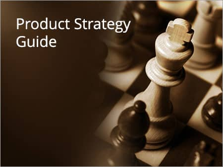

You are probably one of those people who have or have had an idea to pursue. You have seen a product and said to yourself, “Oh, that was my idea. I wanted to build that!” The development of every product starts with an idea; maybe yours.

A good idea may be enough to inspire a product, but the idea itself is not a business. What happens if you do not notice your mistake until after you develop and launch the product, or if you then realize the idea will not succeed financially? If you have a clear product strategy and can implement your idea through it, you do not need to worry about failure.

The question is how to create [the right strategy](/en/docs/archive/strategy-isnt-todo/). Products can have a significant effect on the course of a business. Your product can make your business succeed—or the opposite.

Launching a new product and creating a lasting business are related but not the same. The right product strategy is in fact creating a durable, profitable business around the product, not creating a product.

**Laying out product strategy is like a puzzle.**

Product strategy is in fact organizing and creating a business around an idea. Every product strategy should start small; preparing a long list of product features and user-acquisition methods is not recommended at the start.

Our tendency as people who work in product is to focus ourselves on designing the final product and leave the rest of the team to think about selling it. Or even better, we leave sales or marketing to figure out how to get people to buy a new product.

Here we look at how to persuade people and create a strategy that steers the team onto the right path.

**Step 1: Figure out how you can make money.**

The first step in any good product strategy should focus on the revenue model. You have to determine who will pay for this product and how. There are very few problems that users and consumers are not already paying to solve. First you should find and examine similar products that exist in the market and meet others’ need.

Make a list of every possible solution that meets the same need, and the financial value of that solution (if any). Some solutions will be cheap and perhaps free. There are also expensive ways to meet these needs.

If you want to become a successful business, you have to take financial resources out of competitors’ hands. Knowing what people spend their money on is the only reliable way to determine the commercial potential of your idea. You have to find product–market fit for your product or idea.

**Step 2: Set priorities.**

When you have a list of every option you can think of and every likely price point, you should set your priority for which of them your product will earn revenue from.

If revenue is less than cost, that is not success—unless your goal is to take investors’ money without considering how you will return it.

Take Uber as an example. They had a very good idea: **use unused capacity**. Use the capacity of cars that spend most of their time idle, and let the owners of those cars earn money that way. Uber’s originators offered features that encouraged people to use their service. Next, those features and how each one would enter the market were prioritized. Given market need, time window, the appearance of competitors, society’s reaction, and so on, these priorities were set. As a result they succeeded in acquiring users; use of Uber increased, and with it drivers’ income increased.

**Step 3: Overcome users’ mindset.**

Businesses that dominate a market may have a poor product and not offer good service, but these powers have created barriers to others entering those markets, reducing the chance that someone with a new idea can attract customers.

On top of that, customers’ own behavior can hold new products back. You have to overcome mental biases and consumption patterns that have taken root in their daily lives.

To break these mechanisms, your product strategy must have at least three undeniable reasons why consumers would leave previous companies and use your product.

In the example above, Uber gives you choice (driver and car), control (from the start of the process to the end), and online payment. These are only a few examples of ride-hailing features. No other type of transport offers all of Uber’s features (or those of other ride-hailing services) to its users at the same time; that is why the popularity of this kind of service has grown, they have taken a larger share of the market, and as a result their revenue has also increased. The originators of ride-hailing figured out how to overcome all the different measures created to prevent their business from expanding. (A domestic example is the disagreement between the ride-hailing companies **Snapp and Tapsi** and the taxi organization ([link](http://www.fanavarandaily.ir/index.aspx?pid=10317&articleid=218900)), which eventually led to judicial intervention.) Your product strategy must consider each of the obstacles in front of you and have an answer that forces consumers to change their behavior.

If your product does not have at least three reasons for users to leave the current product and come to you, you are wasting your time. Take another path or find another idea. If your service is cheaper than others, given equal quality, you can say you have a good score relative to competitors—but it is not enough. Many loyal users care about things more important than money. If your product saves time, that may be convincing for most consumers. But it is better to have a third reason (or more) so you attract users who have used others’ services for a long time and do not have a favorable mindset toward a new experience.

**Step 4: Start with small steps.**

If you are planning something large, your first step is to develop the most essential feature. On your prioritized list, find the most essential items and implement them. The prototype may not have many features or even work well, but if you have a good strategy the only way to grow is to put the initial product on the market and get feedback from users. If you are on the right path, you will see it in the feedback.

Look for signals. Know the barriers to market growth and work to remove them. You should be able to do this in a way that comes with profitability. A very important point is not to introduce yourself to the audience in a way that costs you their respect.

Evaluate how much and how you have tried to persuade the customer to pay for your product. Was this hard, or did you have an easy path? Consumers will surprise you. The initial reasons you give users for using the product may not be as tempting and convincing as your product vision suggests. Learn as much as you can about why people buy your product—or do not want to buy it.

**Step 5: Assemble your team.**

Good results include a team of several people with different specialties. Your product-strategy team should include the following skills:

- Production management
- Marketing
- Sales
- Engineering and development
- Research

If the people on your team do not have these skills, or you do not have enough people on the team to fill each role separately—or in other words if you work at a startup—you should write your strategic plan with a different, more comprehensive view. Each discipline has a viewpoint that can see obstacles from its own angle and solve them in its own way.

**How do we build a team?**

Look at what you have learned so far. Which challenges have been more serious than the others? Which obstacles are still standing? And what kind of person or personality is missing from the team to overcome them?

It is unlikely that you will have all the tools you need at the start. A good team includes members who can overcome individual obstacles. The mix of their skills, when used correctly, can fill the gap of the person or role you need.

If you have successfully passed the early steps and received positive feedback, it is time to do larger work. Get your companions ready and focus your vision on larger goals.

Note that on your team there may be people who, if you are not successful enough or do not move with a clear plan and strategy, have the potential to leave; or worse, they stay with you but no longer show the same motivation and enthusiasm, which can have a negative effect on other members.

**Step 6: Cash in the big score.**

At this stage you have found your market, you have left most obstacles behind; you are leading a united team with a clear goal, and your product has even reached revenue. It is time to take large steps.

Your trump card can come from different sources. A few specific, loyal customers, or hundreds of small businesses and thousands of users, may make your set last and continue by using your product or service. Your product strategy should be completed as you move through the product life cycle. Features, capabilities, user access, positioning, pricing, and so on may change over time as you gain experience, relative to the initial model. Most good strategies are created by collecting information and making the wants and goals of your business clearer.

As the strategy evolves, your roadmap also becomes more precise, so you focus on the parts of your business that are profitable and have the highest return for you. Knowing which features to drop and what to say no to becomes more important, because you scale your business to create a balance between revenue and cost and to prevent waste of resources.
