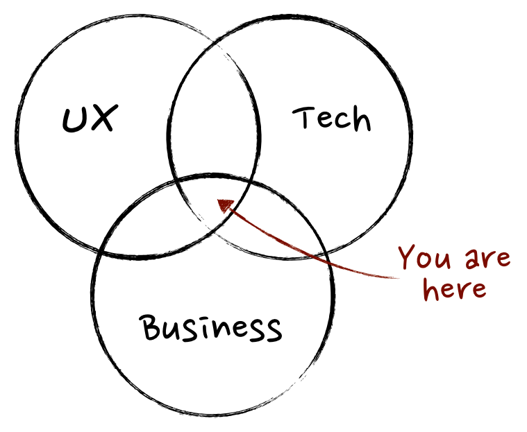
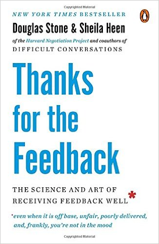

Although product-team members worry about their metrics for measuring the product and the engineering team’s velocity, the product-manager community has not looked much for metrics to examine the performance of product-team members.

A great deal has been published on [Medium](https://productcoalition.com/data-driven-product-management-choosing-the-right-metrics-for-your-product-5b85352b3500) and [Quora](https://www.quora.com/What-is-a-good-KPI-to-measure-the-success-of-your-product-if-you-should-choose-one) about key product-performance metrics. When we talk specifically about KPIs for product-team members we end up with a blend with the product. Or worse, a focus on missed dates or budget problems. In fact it is the product team that brings a product to completion, so of course we should pay attention to their performance and evaluate their progress and setbacks. That evaluation starts with the product manager.

## **Good product people and the Venn diagram**

Before we talk about what kind of people on a product team we can call good or even excellent, we should define for ourselves what a good product-team member is.

The [Mind the Product](http://www.mindtheproduct.com/2011/10/what-exactly-is-a-product-manager/) and [Product Manager HQ](https://www.productmanagerhq.com/2014/06/what-is-a-product-manager/) blogs have given a reasonably good definition of product-team members. They present a Venn diagram of the things a product manager should focus on:

My reading of this diagram is that **product people should be able to align the team toward a strategy or vision.** They develop the concept of their product by talking with customers and product owners. They make sure the team is always working on the most important things. Many people believe the product manager is the only person who should have a diverse set of skills. That is not always true, because a product team with different abilities can create a product that has been reviewed from different angles. By contrast, a product team whose knowledge is vertical cannot produce such a product with the same care, and in the end all the responsibility falls on the product manager.

## Good KPIs

Lean Analysis ([Lean Analysis](http://masteringbusinessanalysis.com/mba074-lean-business-analysis/)) has a very good definition of good metrics that I would like to mention here:

- Not so vague that you have to explain it

- Comparable (for example: new users compared with lost users)

- A ratio or rate (monthly active users)

- Helps you do something and is not merely for information

- Trackable and continuously monitorable

Key performance indicators (KPIs) are a small number (fewer than 5) of good metrics that are meaningful for the team’s success. One of the important things a product manager should do for their product team is share the items each team member is measured against. That way every product-team member knows what you expect of them and tries to improve their performance.

### **Teams succeed together**

A misconception is that a product’s success depends on particular people on the product team. That is not true at all. **A product’s success is based on the work of every team member (along with that team’s managers and the product owners).** Let’s be honest: one hand cannot clap, and a product succeeding is because of the activity of every team member. The product manager is the person who watches everything and everyone from the outside, and without the help and collaboration of every team member they get nothing done.

Deadlines and team-budget matters have nothing to do with product-team members alone. These depend on different factors, including:

- Experience of the engineering team

- Technical skills of the team

- How unknown the project is

- Complexity of the requirements

- How well known the tools in use are

- Growth and maturity of the technology in use

- Expected quality

- Product-acceptance processes, and so on

What is clear is that in the end the whole team hits the deadline or does not—not only the product-team members. One point the product manager should observe is presenting a deadline in collaboration with the product team. They should, as far as they can, seek the views of different people on the product team and then set the schedule.

What I have seen in different companies is that **product-team members get the most credit when the product succeeds and the most blame when it fails.** It is interesting to me that despite this, many people in these companies still say they do not know what a product manager does or what role they play on their team.

## **Qualitative or quantitative product team?**

Now that we can tell the difference between product success and product-team members, how do we decide what to evaluate and measure for product-team members? Are there numbers we can use to monitor and track this?

Unfortunately, measuring a product manager’s soft skills (communication, aligning the team, strategy, and so on) automatically is difficult and complex. We can do this by asking team members directly, using qualitative-research methods to understand how we do our work—exactly like what we do with our customers about their problems.

**There are guidelines for doing good qualitative research**, which I mention here:

- Observe people in their real conditions

- Do not ask them yes/no, templated, or leading questions

- Ask open-ended questions, especially about what they have done in the past

- Observe their activity over different time periods to find behavioral patterns

## **The question you should ask your product team**

Talk with your team as much as you can so you understand how well you are doing your work. Similar to what you do with your customers.

First of all, always try to run retro (retrospective) sessions at the end of sprints with the help of the team’s Scrum Master. These sessions are more for measuring the behavior and performance of team members and less about the product.

Second, you should continuously ask questions about your own performance of the team, one-to-one. Because this is time-consuming and teams do not have a lot of free time to do it every sprint, you can do it every few weeks.

Below is a list of **questions I have found suitable to ask product-team members**:

- What is our strategy for the product, and how do you feel about it?

- What do you think you should do for the product?

- How much do you think the work you do helps reach the product strategy?

- What is your overall feeling about the product and the work you do?

If you have one-to-one sessions with your team members every few weeks, asking these questions should not take more than 15 minutes. Experience shows this work has a good return on investment (the effect it has on team members).

Just as understanding the problems different people have seen in you and pointed out can help you do your responsibility better than before, you should also look for your own incorrect or problematic behavioral patterns. That is the best way to recognize your problems and get ready to take a step toward improving them.

Further reading: [Know the good product manager and the bad product manager](/en/docs/archive/good-bad-product-manager/)

## **Getting better at receiving feedback**

Recently we on our team have focused a great deal on receiving feedback and giving feedback. Feedback both for the growth of team members and for interpersonal relationships.

One teammate introduced a book called *Thanks for the Feedback*. This book helped me see how well I accept my feedback and how much room I still have to improve.

The book is full of different methods for getting the most possible information from feedback received from others—even when feedback does not seem constructive and is more from anger. Personally I recommend this book to everyone who works on a team.

Alongside the questions we ask, **we should be able to receive the feedback given in a way that lets us do something with it.** That is why one-to-one sessions are more effective than surveys and other methods where people give their view anonymously. In these sessions we have the chance to ask follow-up questions and ask for explanation wherever we did not understand.

### **In the end, ask the product team regularly**

As a member of the product team we have the tools we need to measure team and product performance. Asking these questions regularly, every so often, builds a much better, excellent team you can be proud of.

Source: [a piece by Chris Butler, head of AI at Philosophy NYC](https://medium.com/the-mission/product-people-kpis-arent-about-the-product-84c1ac26a471)
