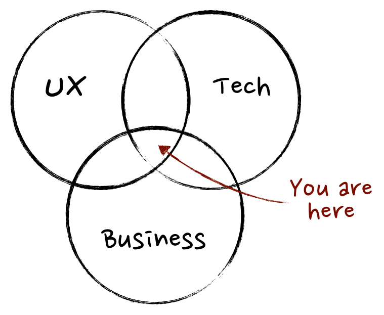

با وجود اینکه اعضای تیم محصول درباره متریک‌های(سنجه ها) خود برای اندازه گیری محصول و سرعت تیم فنی نگران هستند، جامعه مدیران محصول خیلی به دنبال سنجه هایی برای بررسی عملکرد اعضای تیم محصول نبوده‌اند.  

مطالب بسیار زیادی در [مدیوم](https://productcoalition.com/data-driven-product-management-choosing-the-right-metrics-for-your-product-5b85352b3500) و [کورا](https://www.quora.com/What-is-a-good-KPI-to-measure-the-success-of-your-product-if-you-should-choose-one) درباره سنجه های کلیدی عملکرد محصول منتشر شده است. زمانیکه به صورت خاص درباره KPI هایی برای اعضای تیم محصول صحبت می‌کنیم به تلفیقی با محصول می رسیم. یا حتی بدتر، تمرکزی بر روی تاریخ های از دست رفته یا مشکلات بودجه ای. درواقع تیم محصول است که یک محصول را به سرانجام می‌رساند پس قاعدتا بایستی به عملکرد آن‌ها دقت داشت و پیشرفت و پس‌رفت آن‌ها را مورد ارزیابی قرار داد. این ارزیابی از خود مدیرمحصول آغاز می‌شود.  

## **اعضای محصول خوب و نمودار ون**

قبل از اینکه بخواهیم درباره این صحبت کنیم که چه نوع افرادی از تیم محصول را می توانیم خوب یا حتی عالی نام گذاری کنیم باید برای خود تعریفی از یک عضو خوب تیم محصول بیان کنیم.

وبلاگ‌های [Mind the product](http://www.mindtheproduct.com/2011/10/what-exactly-is-a-product-manager/) و  [Product Manager HQ](https://www.productmanagerhq.com/2014/06/what-is-a-product-manager/) تعریف نسبتا خوبی از اعضای تیم محصول ارایه داده‌اند. آن ها نموادر ونی از آن چیزهایی که یک مدیر‌محصول باید روی آن ها تمرکز داشته باشند ارایه کرده اند:

برداشت من از این نمودار این است که **بچه های محصولی باید در همسان‌سازی تیم به سمت رسیدن به یک استراتژی یا چشم انداز توانمند باشند.** آن‌ها مفهوم محصول خود را بوسیله صحبت کردن با مشتریان و صاحبان محصول توسعه می دهند. آن‌ها مطمین می‌شوند که تیم همیشه روی مهمترین موارد کار می‌کند. اغلب افراد بر این باورند که مدیرمحصول تنها کسی است که باید مهارت‌های مختلف و متنوعی داشته باشد. این موضوع همیشه صادق نیست چراکه تیم محصول با توانایی‌های متفاوت می‌توانند محصولی خلق کند که از نظر جنبه‌های مختلف مورد بازبینی و بررسی قرار گرفته است. در مقابل آن تیم محصولی که دانشش بصورت عمودی است نمی‌تواند چنین محصولی را به ظرافت خوبی تولید کند و درنهایت همه مسولیت‌ها بر گردن مدیرمحصول میفتد.  

## KPIهای خوب

تحلیل و آنالیز لین([Lean Analysis](http://masteringbusinessanalysis.com/mba074-lean-business-analysis/)) تعریف خیلی مناسبی درباره متریک های خوب دارد که دوست دارم در اینجا به آن اشاره کنم:

- نه آنقدر مبهم که مجبور به توضیح آن باشید

- قابل مقایسه بودن (به عنوان مثال: کاربران جدید در مقایسه با کاربران از دست رفته)

- نسبت یا نرخ (کاربران فعال ماهانه)

- به شما کمک میکند کاری انجام دهید و صرفا جهت اطلاع نیست

- قابل پیگیری و نظارت مستمر

سنجه‌های کلیدی عملکرد(KPI) تعداد کمی (کمتر از ۵) از سنجه های خوب هستند که برای موفقیت تیم معنی دار هستند. یکی از کارهای مهمی که مدیرمحصول باید برای تیم محصول خود انجام دهد، همین به اشتراک‌گذاری مواردی است که هرکدام از اعضای تیم براساس آن‌ها سنجیده می‌شوند. با این کار همه اعضای تیم محصول می‌دانند که چه انتظاراتی از آن‌ها دارید و سعی در بهبود عملکرد خود می‌کنند.  

### **تیم‌ها با هم موفق می شوند**

تصور غلطی که وجود دارد این است که موفقیت یک محصول وابسته به افراد خاصی از تیم محصول است. این امر به هیچ وجه صحیح نیست. **موفقیت یک محصول بر پایه کاری است که تمام اعضای تیم ( به همراه مدیران آن تیم و صاحبان محصول) انجام می‌دهند.** بیایید صادق باشیم، یک دست صدا ندارد و این که یک محصول موفق شود بخاطر فعالیت‌های تک تک اعضای تیم است. مدیرمحصول کسی است که از بیرون مراقب همه چیز و همه افراد است و بدون کمک و همکاری تک تک اعضای تیم هیچ کاری را از پیش نمی‌برد.

تاریخ‌های تعیین شده برای اتمام کار(deadlineها) و همچنین موارد مربوط به بودجه تیم هیچ ارتباطی با اعضای تیم محصول ندارند. این موارد به فاکتورهای متفاوتی بستگی دارند از جمله:

- تجربه تیم فنی

- مهارت‌های فنی تیم

- میزان ناشناختگی پروژه

- پیچیدگی نیازمندی‌ها

- شناخته شده بودن ابزارهای مورد استفاده

- رشد و بلوغ تکنولوژی مورد استفاده

- کیفیت مورد انتظار

- فرایندهای پذیرش محصول و …

چیزی که واضح است این است که در نهایت کل تیم به تاریخ ضرب‌الاجل(deadline) می‌رسد یا نمی‌رسد نه فقط اعضای تیم محصول. یکی از نکاتی که مدیرمحصول باید رعایت کند ارایه ددلاین با همکاری تیم محصول است. باید تا جاییکه می‌تواند نظر افراد مختلف تیم محصول را جویا شده و سپس زمانبندی را مشخص سازد.  

آن چیزی که من در شرکت های مختلف مشاهده کرده‌ام به این صورت بوده است که **اعضای تیم محصول بیشترین اعتبار را در زمان موفقیت محصول کسب می کردند و بیشترین گناه نیز در زمان شکست به آن‌ها وارد بوده است.** این موضوع برای من خیلی جالب است که با این وجود همچنان خیلی از افراد در این شرکت‌ها اعلام می‌کنند که نمی‌دانند کار یک مدیر محصول چیست و چه نقشی را در تیم آن‌ها ایفا می کند.  

## **تیم محصول کیفی یا کمی؟**

حال که می‌توانیم تفاوت میان موفقیت محصول و اعضای تیم محصول را تشخیص دهیم، چگونه تصمیم بگیریم که چه مواردی را برای اعضای تیم محصول مورد ارزیابی و اندازه‌گیری قرار دهیم؟ آیا اعدادی وجود دارد که بتوانیم بواسطه آن‌ها این موضوع را مورد نظارت و رهگیری قرار دهیم؟

متاسفانه، اندازه‌گیری مهارت‌های نرم یک مدیر‌محصول (برقراری ارتباط، هم‌سو‌سازی تیم، استراتژي و …) بصورت خودکار کاری دشوار و پیچیده است. این کار را می‌توان با پرسش مستقیم از اعضای تیم با استفاده از روش‌های تحقیق کیفی برای درک اینکه چگونه کار خود را انجام می‌دهیم انجام دهیم. دقیقا مشابه با همان کاری که با مشتریان خود درباره مشکلات آن‌ها انجام می‌دهیم.

**دستورالعمل‌هایی برای انجام یک تحقیق کیفی خوب** وجود دارد که به آن‌ها اشاره می کنم:

- افراد را در شرایط واقعی آن‌ها مشاهده کنید

- از آن‌ها سوالات بله/خیر، قالب گرفته و هدایت‌کننده نپرسید

- سوالات با پاسخ باز بپرسید بخصوص درباره آنچه در گذشته انجام داده‌اند

- فعالیت آن‌ها را در بازه های زمانی مختلف مورد مشاهده قرار‌دهید تا الگوهای رفتاری را پیدا کنید

## **سوالی که باید از تیم محصول خود بپرسید**

تا می‌توانید با تیم خود صحبت کنید تا متوجه شوید که چقدر خوب کار خود را انجام می‌دهید. مشابه کاری که با مشتریان خود می کنید.  

اول از همه، همیشه سعی کنید جلسات رترو(Retrospective session) اخر اسپرینت‌ها را به کمک اسکرام مستر تیم انجام دهید. هرچند که این جلسات بیشتر برای سنجش رفتار و عملکرد اعضای تیم است و کمتر درباره محصول.  

دوم اینکه باید بصورت مستمر سوالاتی درباره عملکرد خود از تیم بپرسید البته بصورت تک به تک. از آنجاییکه این کار فرایندی زمان‌بر است و تیم‌ها فرصت خالی زیادی برای انجام این کار در هر اسپرینت را ندارند، می‌توانید این کار را هر چند هفته یکبار انجام دهید.  

در ادامه لیستی از **سوالاتی که پرسیدن آن‌ها از اعضای تیم محصول را مناسب یافتم** مشاهده می‌کنید:

- استراتژي ما برای محصول چیست و چه احساسی درباره آن داری؟

- فکر میکنی چه کاری باید برای محصول انجام دهی؟

- فکر میکنی کارهایی که انجام میدی چقدر به رسیدن به استراتژی محصول کمک میکنه؟

- حس کلی خودت درباره محصول و کاری که انجام میدی چیه؟

اگر هر چند هفته یکبار جلسات تک به تک با اعضای تیم خود داشته باشید، پرسیدن این سوالات نباید بیشتر از ۱۵ دقیقه وقت بگیرد. اما تجربه نشان داده است که این کار بازگشت سرمایه (تاثیری که بر روی اعضای تیم می گذارد) خوبی دارد.  

همانطور که فهمیدن مشکلاتی که افراد مختلف در شما دیده‌اند و به آن‌ها اشاره کرده‌اند می‌تواند به شما کمک کند تا مسولیت خود را بهتر از گذشته انجام دهید، خودتان نیز باید به دنبال پیدا کردن الگوهای رفتاری نادرست یا مشکل دار خود باشید. این بهترین راه برای شناخت مشکلات خود و آماده شدن برای قدم برداشتن در مسیر بهبود آن می باشد.  

مطالعه بیشتر: [مدیر محصول خوب و مدیر محصول بد را بشناسید](https://theminiceo.ir/product-basics/good-bad-product-manager/)

## **بهتر‌شدن در فیدبک گرفتن**

اخیرا ما در تیم خود بر روی فیدبک گرفتن و فیدبک دادن تمرکز بسیاری داشتیم. فیدبک هم برای رشد کارکنان تیم هم برای روابط بین فردی.

یکی از هم تیمی‌ها کتابی به نام Thanks for the feedback را معرفی کرد. این کتاب به من کمک کرد دریابم چقدر فیدبک‌های خود را می پذیرم و هنوز چقدر جای بهبود دارم.  

این کتاب پر از روش‌های مختلف برای دریافت بیشترین اطلاعات ممکن از فیدبک‌های دریافتی از دیگران می باشد. حتی زمانیکه یک فیدبک به نظر سازنده نمی‌آید و بیشتر از روی عصبانیت است. به شخصه خواندن این کتاب را به همه کسانی که در یک تیم کار می‌کنند پیشنهاد می‌کنم.  

در کنار سوال‌هایی که می‌پرسیم **باید بتوانیم فیدبک‌های داده شده را به نحوی دریافت کنیم که بتوانیم برای آن کاری انجام دهیم.** به همین خاطر است که جلسات تک به تک اثربخشی بیشتری در مقایسه با نظرنسجی‌ها و دیگر روش‌های موجود که افراد به صورت ناشناس نظر خود را اعلام می‌کنند از خود نشان می‌دهند. چرا‌که در این جلسات فرصت داریم سوالات دنباله‌دار بپرسیم و هر‌جا که متوجه نشدیم توضیح بخواهیم.  

### **درنهایت بصورت مرتب از تیم محصول بپرسید**

بعنوان عضوی از تیم محصول ابزارهای مورد نیاز خود برای سنجش عملکرد تیم و محصول را داریم. پرسیدن این سوالات به صورت مرتب و هر‌چندوقت یک‌بار باعث ساخت یک تیم خیلی بهتر و عالی می‌شود که می‌توانید به آن افتخار کنید.

منبع:‌ [نوشته ای از کریس باتلر مدیر بخش هوش مصنوعی فیلاسفی ان وای سی](https://medium.com/the-mission/product-people-kpis-arent-about-the-product-84c1ac26a471)
