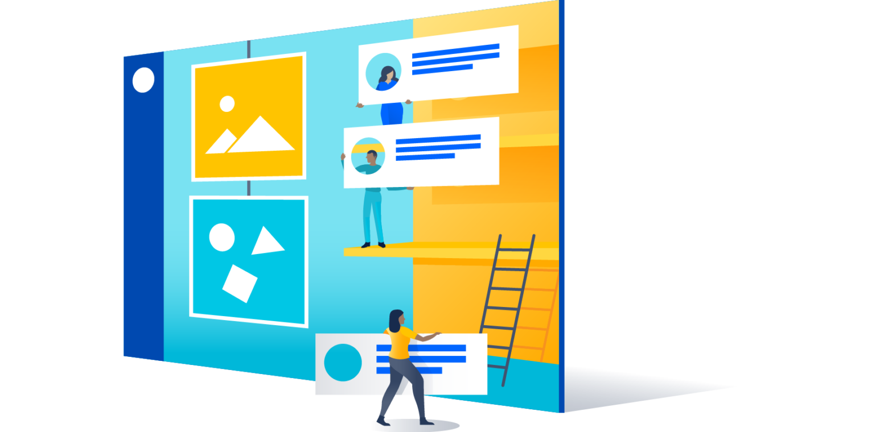
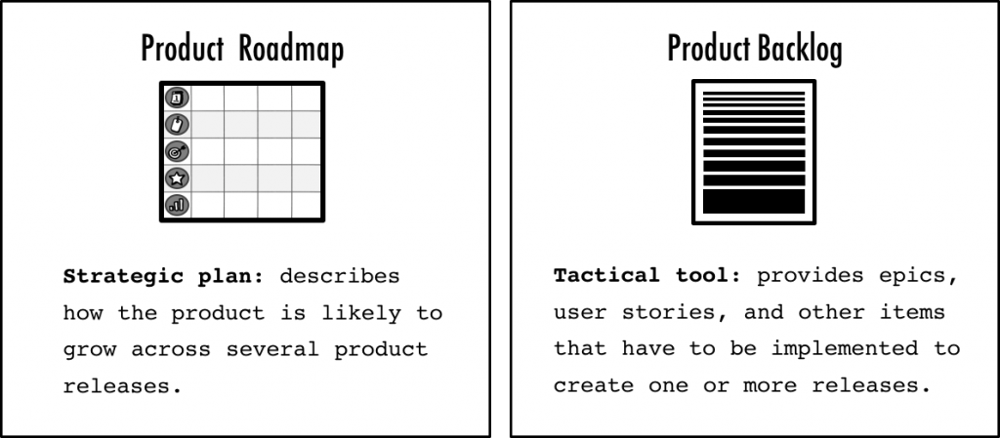

The product backlog is an important tool for recording ideas and requirements. But it is less useful for describing the likely long-term development of the product. That is where the product roadmap comes in. How do the two relate? Is the backlog derived from the roadmap, or the other way around? Should the product owner be responsible for both? Read on for our suggestion.

## **Product roadmap versus backlog**

The product roadmap and the product backlog are two important product-management tools. Each has its strengths and weaknesses: **the roadmap is a strategic planning tool that shows how the product is likely to grow across several major releases.** It keeps the goal continuous, makes stakeholder collaboration easier, helps you obtain funding, and makes it easier to collaborate on developing the product and starting to sell it.

**The product backlog includes the substantial work needed to create products, including epics and user stories, workflow diagrams, UI design sketches, and mockups.** The product backlog is a tactical tool that directs the development team’s work and creates a basis (using a release burndown chart) for tracking project progress. The differences are summarized in the figure below.

Used correctly, the two tools complement each other well. The product roadmap creates an umbrella for the product backlog and **says more about the likely growth of the product, while the backlog contains the details that are essential for creating the product.**

## **Deriving the product backlog from the product roadmap**

I recommend, especially when the product is still new or the market is dynamic, that you derive the backlog from the roadmap. That assumes you have a realistic product roadmap that produces the right inputs for the backlog, such as features and release goals.

You can also use this approach in other cases and **focus your product backlog on the next product release**. That gives you a short backlog that is easy to update and change—assuming you put new product cycles in front of users, collect and analyze user feedback and data, and fold new insights into the backlog. To do this, as in the figure below, use the release goal on your roadmap to examine your product backlog.

Further reading: [What does good product strategy look like? + a Snapp case](/en/docs/archive/good-product-strategy/)

### **Minimize all overlap between roadmap and backlog**

Unfortunately I have found that product roadmaps can contain far too much detail, including epics and user stories, and **some product backlogs look too far into the future. That creates confusion between the two; it leads to a roadmap that is hard to understand, prone to change, and too long and difficult to manage.**

So separate these two tools and use their respective strengths. **Use the roadmap to describe the overall product journey and the backlog to show the details.** Do not add epics and stories to your product roadmap. Instead, always go to high-level features and product capabilities.

## **Keep the product roadmap and product backlog in sync**

Be aware of the product backlog’s effect on the roadmap: **feedback you get from putting product cycles in front of users may, for example, lead you to change the roadmap.** Likewise, if work in sprints does not go as expected, you may have to update the roadmap and, for example, revise the goal and the date. So keeping the roadmap and the product backlog configured together matters. As said earlier, use the roadmap to guide backlog grooming, and when you review the roadmap, take product-backlog changes into account. As a rule of thumb, reviews should happen once a quarter and include representatives of the development team and other important stakeholders.

For more on product-management basics, use [this link](/en/categories/product-basics/).

Source: [a piece from the specialist blog of Roman Pichler, product-management consultant](https://www.romanpichler.com/blog/product-roadmap-product-backlog/)
