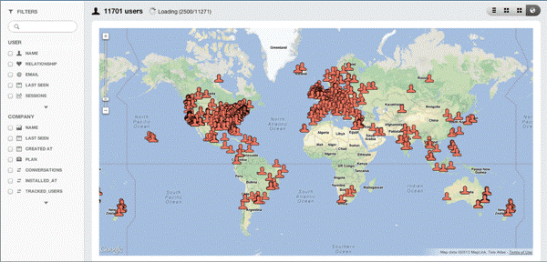
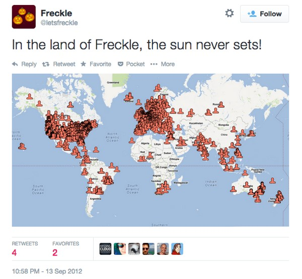
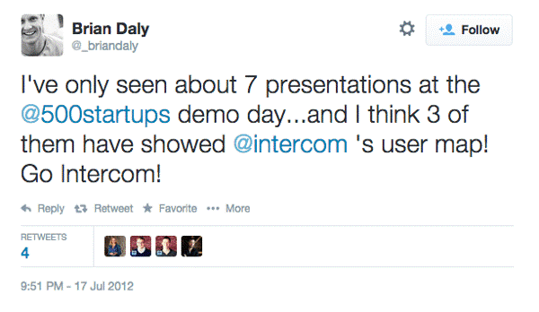
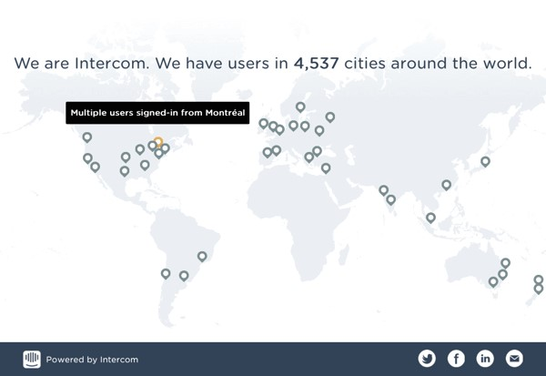
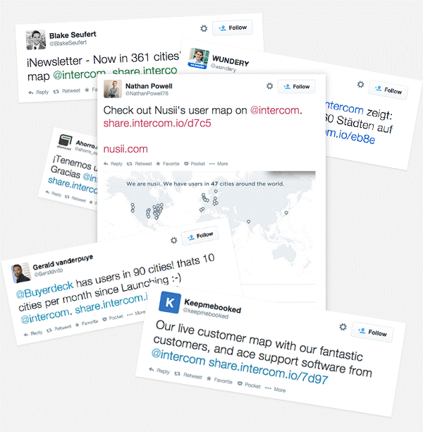

Customers always surprise you with creative ways of using the product. This is not something you plan in advance. They adapt the product to their own need. Peter Drucker is known for the line: “The customer rarely buys what the company thinks it sells.” The point of that quote is that to improve the product you first have to know what the product is actually used for.

Let me explain with an example: not long after Intercom launched, we added a map feature so you could see our customers around the world. I should add that we offered this feature for three years and it became popular for the reasons I explain below—but that was not the use we expected from the product.

This map was a classic “this is really cool but we don’t know why” feature. Given the traffic on the map and the reception from users, we saw it become popular very quickly. But marketing the map as a feature was hard, because it was not easy to say why you should use it.
• To understand where we have the most customers? No—plenty of products already do that.
• To see who is from which city? No—our “user list” does that better.
• To see how many users we have from a particular country? No—again, our “user list” is the better option.
So what does the map do, besides stirring emotion? We looked at three ways it was being used:

1. People like to show it at trade shows and conferences. (Look at the laptop in the photo below!)
2. People like to post it on Twitter:
3. People like to show it to investors:

## Improving a feature based on use

If we had known how customers used the map, we would have tried to build a better map from the start. The following are the kinds of things users paid attention to:
• Geographic accuracy
• Categorization
• Better display of city/country borders
• Showing regions
• Improving other map-related features

All of these “improvements” would have taken us weeks or months and led to a worse product. Because customers are not buying what we think we are selling. For them this is not a map; it is a kind of display that presents particular information graphically.

## **So what would make it better?**

• First and most important: a map that looks good—and looks like the best.
• A map that automatically hides sensitive data and makes users want to share it.
• A map that is easy for customers to share.
So that is exactly what we built. We gave customers the chance to have a beautiful animated map with a unique, shareable URL:

## **A worse map does the job better!**

When you focus only on how a feature is used, and ignore the “category” it sits in or the “type of feature,” you quickly learn how to improve it—and you apply those changes immediately.

To see more customer reactions [click here](https://twitter.com/intercom/timelines/522786257244405760).
Our fourth book, [Intercom on Jobs-to-be-Done](https://www.intercom.com/resources/books/intercom-jobs-to-be-done), is a collection of our best thinking on the topic. The aim of the book is to help you understand how customers need your product, and in the end how the product improves based on experience.
What has your experience been launching or marketing new products? Have you wrestled with similar challenges?
