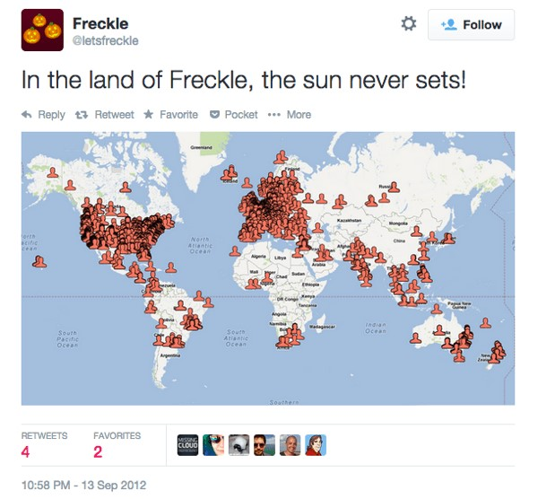

مشتریان همیشه با راه‌های خلاقانه در استفاده از محصول، شما را شگفت زده می کنند. این یک اتفاق از قبل برنامه ریزی شده نیست. آن ها محصول را مطابق نیاز خودشان تطبیق می دهند. پیتر دراکر به خاطر این جمله معروف است که می‌گوید: «مشتری به ندرت آن چیزی که شرکت فکر می کند می فروشد را می خرد.» مفهوم این نقل قول این است که برای بهبود محصول ابتدا باید بدانیم که اصلا محصول برای چه استفاده می‌شود؟

بگذارید این موضوع را با یک مثال توضیح بدهم: چیزی از راه اندازی Intercom نگذشته بود که فیچر نقشه را اضافه کردیم پس شما می‌توانستید مشتریان ما از سراسر جهان را ببینید. لازم است اضافه کنم، ما این فیچر را برای ۳ سال ارائه کردیم و به دلایلی که در زیر توضیح می دهم محبوبیت پیدا کرد، اما خب این آن استفاده‌ای نبود که ما از محصول انتظار داشتیم.

این نقشه یک فیچر کلاسیک از نوع «این بسیار جالب است اما نمیدانیم چرا؟» بود. با توجه به ترافیک روی این نقشه و استقبال کاربران ما فهمیدیم که خیلی زود محبوب شده است. اما انجام بازاریابی برای این نقشه به عنوان یک فیچر سخت بود زیرا نمی‌شد به راحتی گفت، چرا باید از این نقشه استفاده کرد؟  
• بفهمیم در چه جایی بیشترین مشتریان را داریم؟ نه، خیلی از محصولات همین کار را انجام می‌دهند.  
• ببینیم چه کسی از چه شهری است؟ نه، «لیست کاربران» ما این کار را بهتر انجام می‌دهد.  
• ببینیم چند کاربر از یک کشور خاص داریم؟ نه، باز هم «لیست کاربران» ما گزینه‌ی بهتری است.  
خب پس نقشه چه کاری انجام می‌دهد، البته به غیر از این که محرک احساسات باشد؟ ما به ۳ روش استفاده شده نگاه کردیم:

1. آدم‌ها دوست دارند آن را در نمایشگاه ها و همایش‌های تجاری به نمایش بگذارند. (به لپ تاپ عکس زیر توجه کنید!)
2. آدم‌ها دوست دارند آن را در توییتر منتشر کنند:
3. آدم‌ها دوست دارند آن را به سرمایه‌گذاران نشان دهند:

## بهبود فیچر، مبتنی بر استفاده

اگر نحوه‌ی استفاده از نقشه توسط مشتریان را می‌دانستیم، سعی می‌کردیم از همان اول نقشه بهتری بسازیم. موارد زیر انواع چیزهایی است که مورد توجه کاربران قرارگرفته است:  
• دقت جغرافیایی  
• دسته‌بندی  
• نمایش بهتر مرزهای شهر/کشور  
• نمایش دادن مناطق  
• بهبود دیگر ویژگی‌های مرتبط با نقشه

همه این «بهبود»ها هفته ها یا ماه‌ها ار ما وقت خواهد گرفت و به محصول بدتری منجر خواهد شد. چرا که مشتریان آن چیزی که ما فکر می‌کنیم می فروشیم را نمی‌خرند. در واقع برای آن‌ها این یک نقشه نیست، یک جور نمایشگر است که اطلاعات خاصی را به شکل گرافیکی ارائه می‌کند.

## **با این حساب، چه چیزی بهترش خواهد کرد؟**

• اولین و مهمترین نکته این است که نقشه ای که طراحی شده، خوب و بهترین به نظر برسد.  
• نقشه‌ای که داده‌های حساس را بطور خودکار پنهان می‌کند و باعث می‌شود کاربران آن را به اشتراک بگذارند.  
• نقشه‌ای که اشتراک گذاری آن برای مشتریان آسان باشد.  
پس، این دقیقا همان چیزی هست که ما ایجاد کردیم. ما به مشتریان این فرصت را دادیم که یک نقشه انیمیشنی و زیبا را به همراه URL منحصر به فرد و قابل اشتراک گذاری، در اختیار داشته باشند:

## **نقشه بدتر کار را بهتر انجام می دهد!**

وقتی صرفاً روی نحوه استفاده از یک ویژگی متمرکز می‌شوید، و «دسته بندی» موجود در آن یا «نوع فیچر» را نادیده می‌گیرید؛ به سرعت یاد خواهید گرفت که چگونه آن را بهبود ببخشید، و این تغییرات را بلافاصله اعمال خواهید کرد.

برای دیدن عکس العمل های بیشتر مشتریان [اینجا کلیک کنید](https://twitter.com/intercom/timelines/522786257244405760).  
کتاب چهارم ما، [Intercom on Jobs-to-be-Done](https://www.intercom.com/resources/books/intercom-jobs-to-be-done) مجموعه ای از بهترین افکار و ایده‌های ما درباره موضوع است. هدف این کتاب آن است که به شما کمک کند بفهمید نیاز مشتریان به محصول شما چگونه است و در نهایت محصول، چگونه براساس تجربه بهبود پیدا کند؟  
تجربه‌ی شما در لانچ کردن یا بازاریابی محصولات جدید چطور بوده است؟ آیا با چالش‌های مشابه دست و پنجه نرم کرده‌اید؟
