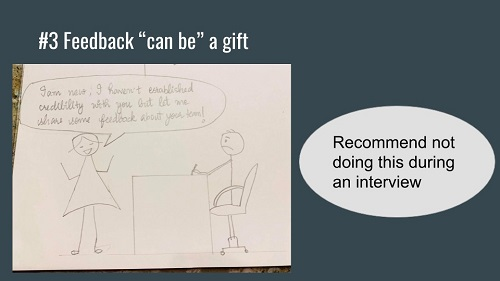
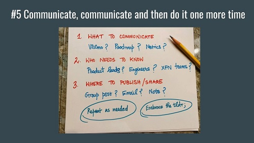
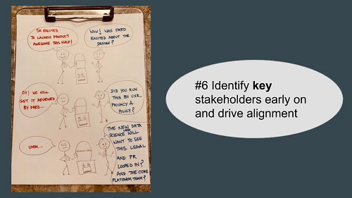
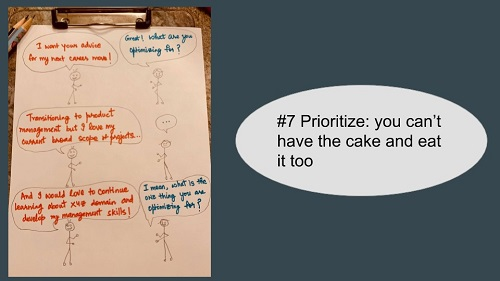
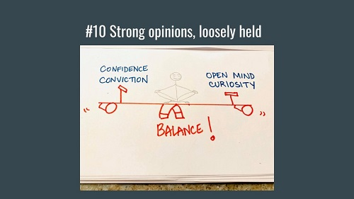
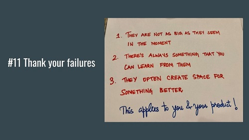

I recently gave a talk at Product School about soft skills — the mix of interpersonal, social, and related abilities. I talked about the simple lessons I have learned over the past ten years. In hindsight, all of these experiences were things everyone already knew. But when I started, capable project managers carried themselves with such cleverness and showmanship that the path they had taken felt long and complicated. Since then I have learned that this work is less about deep technical knowledge, domain expertise, and frameworks, and more about relationships, finding the right balance, and clarity of purpose.  
So here are 12 incomplete, slightly exaggerated sketches for you to learn from.

## 1- Find your team!

As an engineer, I always envied the project managers around me. I thought they had special powers and abilities I did not.  
Now I know that it is always about the people and the relationships we build. So my first lesson is this: find your group. Find people who are as obsessed with solving problems as you are, who have your back, and who make it fun when you do important work together. If there is only one important takeaway from this point, it is this: build your group!

## 2- Know when to focus — and when not to.

Finding the right balance between diving into important details and delegating work to others is not easy. Still, it is an art if you want to ship high-quality products on time. Over time, you will start to develop your own judgment for how to solve the problem in front of you. Sometimes the team relies on you to fill the gaps, and sometimes you rely on capable people to open up the design and the plan.

## 3- Feedback is a gift!

There are three components in a feedback loop: the person giving the feedback and their state (personality, mindset, tone, position, motivation, and role), the feedback itself (content, packaging, format, timing), and the person receiving it (personality and mindset, position and role). These elements have to come together in a coherent way for the feedback to land.

## 4- See the big picture.

Without a clear vision, the root of the decision tree — the “why” — dries up. There will always be disagreement about small decisions that are meant to improve the key outcome. When you are constantly answering low-level questions, ask yourself whether you are still heading in the right direction.

5- **Communicate as much as you can.**

One of a product manager’s key jobs is to communicate at the right time, in the way people need, to clear up confusion. Here are a few things to watch. Remember what your primary audience needs from you, and why they should care. If you use that first 30-second window of attention well (this is where you need a complete, compelling summary), you will earn the next, deeper layer of attention — about five minutes. If you get through that successfully, your audience will stay with you for the next thirty minutes with full attention.

## 6- Identify stakeholders quickly and set the path!

Not everyone in the company needs to be thrilled about your product launch. But you do need to identify the key stakeholders and sponsors early, and make sure they are excited to see your product. Otherwise you may run into trouble.

## 7- Prioritize: don’t try to carry two watermelons in one hand!

When eager product managers come to me about switching into product, I often ask whether they know the one thing they are trying to optimize. They usually say yes, but it goes like this: “I really want to go after product, and I’m happy in my current scope. I talk with different cross-functional teams and work with people from many domains! I’d also like to go deep technically in \[insert domain\].”

Those are actually multiple priorities: switching to product, building technical/domain expertise, and working with several cross-functional teams at the same time. That is not a good setup.

So prioritize, and design your actions around that prioritization.

## 8- Bring your other colleagues into the plans too!

This is similar to bringing key stakeholders along, as mentioned earlier — but it does not stop there. After the initial alignment, keep people in the loop, especially around major milestones, so you do not get stuck in a product review like the one described above.

## **9- Give ideas and decisions time.**

This image speaks for itself, with a line I love: “Honey, let it soak a little.” You do not have to jump in and solve every problem immediately. Sometimes giving an idea time to sit in someone’s mind is exactly what it needs in order to grow.

## 10- Strong opinions, weakly held

Influencing without authority often means you need the conviction and confidence to motivate the people you need so they will invest their time and effort in your vision. But no one really knows how the world will receive your product. You can forecast and form reasonable hypotheses, but that is no guarantee of the outcome we want. And that leads to the second half: “weakly held.” The more we meet critical feedback and new information with curiosity and an open mind, the more we can steer the product in the right direction.

## 11- Be grateful for your failures.

On my path to becoming a product manager I had failures that I am now grateful for. At the time they felt like impossible setbacks and a fundamental worsening of my impostor syndrome. As painful as they were, thanks to those painful lessons I am a little wiser today and in a better place.

## **12- Know your strengths and manage your weaknesses.**

Sometimes we spotlight our weaknesses so much, and become so sensitive about fixing them, that we forget we also have strengths. A little care for growth can put us on a path to getting bigger. Remember to shine.
