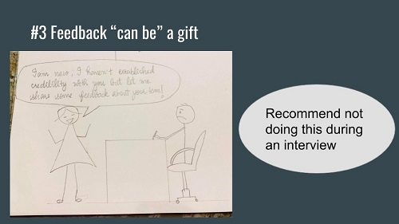
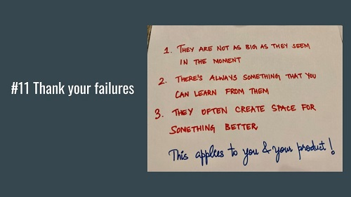

اخیرا ارائه‌ای در مورد مهارت‌های نرم (ترکیبی از مهارت‌های تعاملی، اجتماعی و …) در Product School (مدرسه کسب و کار) داشتم. در مورد دروس ساده‌ای صحبت کردم که در ده سال گذشته فراگرفته‌ام. در گذشته، تمام ‌این تجربیات چیزهایی بودند که همه می‌دانستند. ‌اما زمانی که من شروع کردم، مدیران پروژه توانمند با چنان زیرکی و خودنمایی رفتار می‌کردند که راهی که آن‌ها طی کرده و بدان نقطه رسیده‌اند، بسیار دراز و پیچیده به نظر می‌رسید. از آن زمان بود که دریافتم ‌این ‌امر کمتر در مورد دانش فنی عمیق، تخصص حوزوی و چارچوب‌هاست بلکه بیشتر در مورد روابط، یافتن تعادل صحیح و شفافیت هدف است.  
بنابراین،‌ اینجا 12 طرح ناکامل و مبالغه‌شده را برای یادگیری شما ارائه می‌دهم.

## 1- تیم خود را پیدا کنید!

به عنوان یک مهندس، همیشه به مدیران پروژه اطراف خود غبطه می‌خوردم. چرا که فکر می‌کردم قدرت‌ها و توانایی‌های خاصی دارند که من از آن‌ها محروم هستم.  
اما حالا می‌دانم که ‌این مسئله همیشه در مورد افراد و روابطی است که ما می‌سازیم. پس اولین درس من ‌این است که گروه خود را بیابید. افرادی را بیابید که به ‌اندازه شما شیفته حل مسائل هستند، همیشه هوای شما را دارند و وقتی با آن‌ها کارهای مهمی ‌انجام می‌دهید به شما خوش می‌گذرد. اگر تنها یک مسئله مهم در مورد ‌این نکته وجود داشته باشد آن ‌این است که: گروه خود را بسازید!

## 2- بدانید چه زمانی باید تمرکز کنید و چه زمانی نیازی به تمرکز وجود ندارد.

پیدا کردن تعادل مناسب بین غوطه‌ور شدن در جزئیات مهم و واگذار کردن وظایف به دیگران کار آسانی نیست، با ‌این وجود، ‌این یک هنر است تا بتوانیم محصولات با کیفیت بالا را به موقع فراهم بسازیم. در طول زمان، قادر به شروع توسعه بصیرت خود با روشی خواهید بود که بتوانید با تکیه بر آن روش، مشکل موجود را حل کنید. گاهی اوقات، تیم برای پر کردن خلاءها به شما تکیه می‌کند و گاهی اوقات شما برای گشایش در طرح و نقشه، به افراد توامند تکیه می‌کنید.

## 3- بازخورد یک هدیه است!

سه مولفه در حلقه بازخورد وجود دارند: شخصی که بازخورد می‌دهد و وضعیت وی (شخصیت، قالب ذهنی، لحن، موقعیت، انگیزه و نقش او)، خود بازخورد (محتوا، بسته‌بندی، قالب، زمان‌بندی) و شخصی که به او بازخورد داده می‌شود (شخیصت و قالب ذهنی، موقعیت و نقش او). ‌این المان‌ها باید در یک حالت منسجم کنار هم جمع شوند تا بازخورد تاثیر خود را داشته باشد.

## 4- تصویر و نمای کلی را ببینید.

نداشتن چشم‌اندازی روشن، ریشه درخت تصمیم‌گیری - “چرا” - را خشک می‌کند. همیشه در مورد تصمیم‌های کوچک اختلاف نظر وجود خواهد داشت که باعث می‌شود نتیجه کلیدی بهبود یابد. زمانی که شما دائماً در حال پاسخ به سوالات سطح پایین هستید، از خودتان بپرسید که آیا در مسیر و جهت صحیح قرار گرفته‌اید.

5- **هرچه می‌توانید بیشتر ارتباط برقرار کنید.**

یکی از کارهای کلیدی یک مدیر محصول برقراری ارتباط به‌موقع و مورد نیاز برای رفع سردرگرمی ‌افراد است. در زیر مواردی ذکر شده‌اند که باید به آن‌ها توجه کنید. به خاطر داشته باشید که به مخاطبان اصلی خود برای چه عواملی نیاز دارید و چرا باید آن‌ها به شما اهمیت بدهند. اگر شما از فرصت توجه 30 ثانیه‌ای مخاطب در گام اول استفاده کنید(در این مرحله باید یک خلاصه‌ی کامل و جذاب ارائه کنید.) سطح توجه عمیق بعدی که طول آن 5 دقیقه است را به دست خواهید آورد، و درصورتی که این مرحله را با موفقیت پشت سر بگذارید مخاطب شما تا سی دقیقه‌ی بعدی نیز با توجه کامل شما را همراهی خواهد کرد.

## 6- ذینفعان را به سرعت شناسایی و مسیر را مشخص کنید!

لازم نیست همه افراد شرکت برای راه‌اندازی محصول شما بسیار هیجان زده باشند، ‌اما لازم است که ذینفعان و حامیان اصلی را همان اوایل شناسایی کنید و اطمینان حاصل کنید که آن‌ها از دیدن محصول شما هیجان‌زده هستند، در غیر اینصورت ممکن است به دردسر بیافتید.

## 7- اولویت‌بندی: با یک دست دو هندوانه برندارید!

هنگامی‌که مدیران محصول مشتاق در مورد مراحل تغییر به محصول به من رجوع می‌کنند، اغلب از آن‌ها می‌پرسم که آیا نکته کلیدی را که به دنبال بهینه‌سازی آن هستند، می‌دانند. آنها غالباً می‌گویند بله، ‌اما قضیه به‌این صورت پیش می‌رود: «من واقعاً می‌خواهم به دنبال محصول بروم و در محدوده فعلی که در آن هستم خوشنودم. من با تیم‌های مختلف با عملکرد متقابل صحبت می‌کنم و با افراد بسیاری از حوزه‌های مختلف همکاری می‌کنم! همچنین دوست دارم که بتوانم از لحاظ فنی در \[insert domain\] به صورت عمیق و جدی وارد کار شوم.»

در حقیقت ‌این‌ها اولویت‌های چندگانه هستند: تغییر به محصول، توسعه تخصص فنی/دامنه، کار کردن به صورت همزمان با چندین تیم متقابل عملکردی! و این روند اصلا مطلوب نیست.

پس حتماً اولویت‌بندی کنید و اقدامات خود را بر اساس اولویت بندی خود طراحی کنید.

## 8- دیگر همکارانتان را هم درگیر موضوعات برنامه‌ها کنید!

این شبیه به همراه کردن سهامداران کلیدی است که پیشتر به آن اشاره شد، ‌اما کار به همین جا ختم نمی‌شود. پس از همراه‌ کردن اولیه، افراد را به ویژه برای نقاط عطف اصلی در حلقه نگه دارید، بنابراین در یک بررسی محصول شبیه آنچه که پیشتر به آن اشاره شد، گیر نمی‌افتید.

## **9- به ایده‌ها و تصمیم‌ها فرصت دهید.**

این تصویر به خودی خود و با چنین جملات دوست داشتنی گویاست: «عزیزم، بگذار کمی ‌خیس بخورد.» لازم نیست برای حل همه مشکلات فوراً وارد کار شوید. برخی مواقع، فرصت دادن به‌ایده‌ها در ذهن انسان می‌تواند چیزی باشد که ‌ایده به آن نیاز دارد تا پرورانده شود.

## 10- نظرات قوی، با احتمالی ضعیف

تحت تاثیر قرار دادن بدون اقتدار اغلب بدین معنی است که شما باید اعتقاد و اطمینان به نفس لازم را برای ‌ایجاد انگیزه در افراد موردنظر داشته باشید تا وقت و تلاش آن‌ها را در چشم‌انداز خود سرمایه‌گذاری کنید. ‌اما هیچ‌کس واقعاً نمی‌داند دنیا چگونه محصول شما را قبول خواهد کرد. می‌توان پیش‌بینی کرد و فرضیه‌های معقول داشت، ‌اما‌ این به هیچ وجه تضمینی برای نتیجه مورد نظر ما نیست. و ‌این ما را به بخش دوم هدایت می‌کند، «با احتمالی ضعیف». هرچه بیشتر با کنجکاوی و ذهن باز با بازخورد انتقادی و اطلاعات جدید برخورد کنیم، بیشتر می‌توانیم محصول خود را به سمت صحیح سوق دهیم.

## 11- از شکست‌هایتان ممنون باشید.

در مسیرم برای تبدیل شدن به یک مدیر محصول شکست‌هایی داشته‌ام، که اکنون از آن شکست‌ها متشکر هستم. در آن زمان، آن شکست‌ها عقب‌گردهایی غیرممکن و حالتی اساسی برای وخیم‌تر شدن سندروم شک من به موفقیت، به نظر می‌رسیدند. به همان‌اندازه که آن شکست‌ها دردناک بودند، به لطف آن یادگیری‌های دردناک، ‌امروز کمی‌عاقل‌تر هستم و در موقعیت بهتری قرار دارم.

## **12- نقاط قوت خود را بشناسید و نقاط ضعف خود را مدیریت کنید.**

گاهی اوقات، به قدری نقاط ضعف خود را برجسته می‌بینیم و به منظور رفع ‌این نقاط ضعف بسیار حساس می‌شویم که فراموش می‌کنیم که نقاط قوتی هم داریم. کمی ‌اهمیت دادن به رشد می‌تواند ما را در مسیر بزرگ شدن قرار دهد. به یاد داشته باشید که همیشه بدرخشید.
