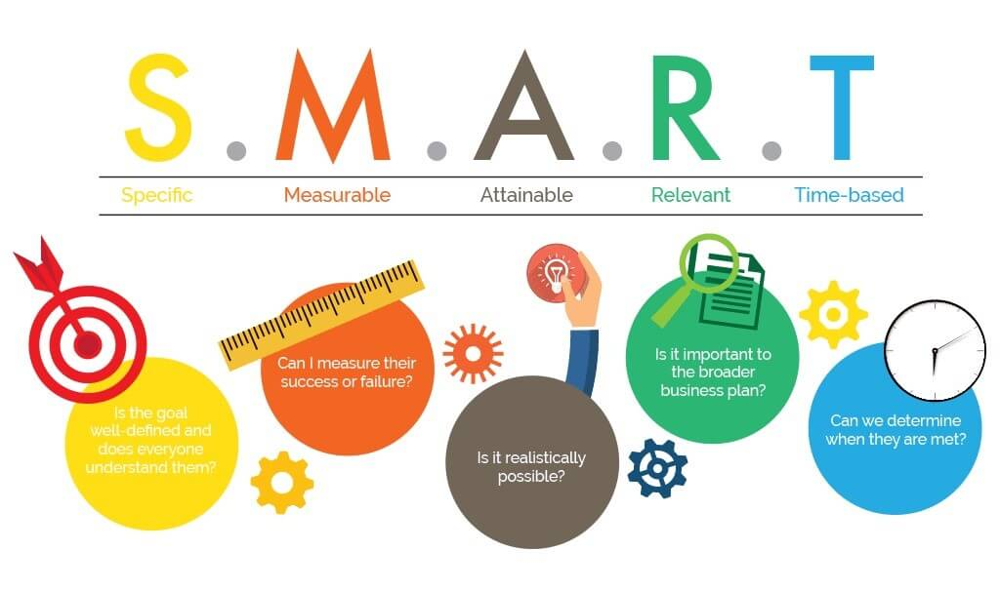

In previous articles we talked about the [key performance indicator (KPI)](/en/docs/archive/key_performance_indicator/) and shared a few examples of KPIs in different businesses. We also noted that one of the common ways to define a KPI is the S.M.A.R.T. model. This article looks at that model.

SMART goal-setting is a highly effective — even essential — way to set goals. SMART is an acronym for:

**S**pecific

**M**easurable

**A**ttainable

**R**elevant

**T**imely / Time Bound: within a defined time frame

**Specific**: As the word suggests, the goal must be fully clear and well defined. All of the details of the goal must be defined for the person setting it. Decide exactly what the result will look like and when you will reach it. The more specific the defined goal, the higher the chance of achieving it. To define a specific goal, you can ask yourself questions like these:

- Who? Who is involved in this goal?

- What? What do I want to achieve?

- Why? What is the purpose of doing this?

- When? Set a specific time for this goal

- Where? Set a specific place for reaching the goal.

For example: “I want a high income” is a vague goal. But “I want to reach a monthly income of 20 million tomans” is a specific goal.

**Measurable**: The goal you set must be tangible and quantitative so you can measure how successful you have been in reaching it. Measurable goals mean you will know what point you will have reached when you get there — what you will see or feel. “Reading 10 books a month” is a measurable goal.

**Attainable**: The goal must be achievable. When you set goals, you are in fact sketching your future. How realistic is that future? Does it match your abilities? “Traveling to Mars by balloon” is an unattainable goal, but “losing 10 kilograms in three months” can happen.

**Relevant**: Your goals should be connected to your values. Does the decision you have made match your personal traits? Did you choose the goal out of interest, or because of other issues such as money, fame and popularity, social conditions, and so on?

**Timely**: This part of the SMART model is about monitoring whether the goal is done within the specified time. If no time is set, starting the work — or reaching the goal — may be postponed again and again.
