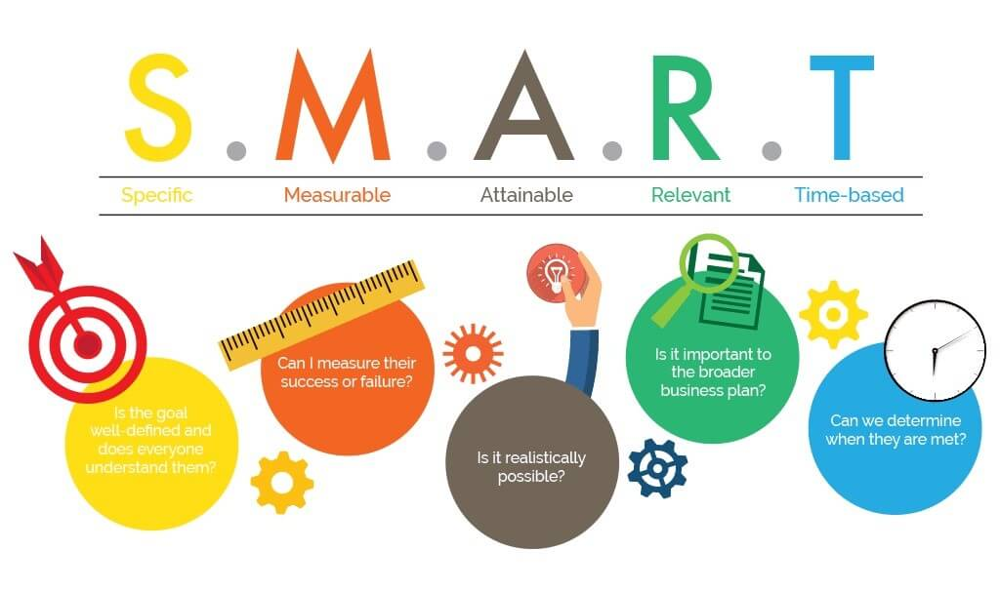

در مطالب قبل در مورد [شاخص کلیدی عملکرد  (KPI)](https://theminiceo.ir/product-articles/key_performance_indicator/) و همچنین چند مثال از شاخص‌های کلیدی عملکرد در کسب و کارهای مختلف صحبت کردیم.  و همچنین اشاره شد که یکی از روش‌های متداول تعریف شاخص کلیدی عملکرد (KPI)  مدل S.M.A.R.T است. در این مقاله به بررسی این مدل می‌پردازیم.

روش هدف‌گذاری SMART  روشی بسیار کارآمد و حتی حیاتی برای تعیین اهداف است. SMART  اختصار کلمات:

**S**pecific: مشخص

**M**easurable: قابل اندازه گیری

**A**ttainable: دست یافتنی

**R**elevant: مرتبط

**T**imely/Time Bound: در محدوده زمانی مشخص

**Specific** **مشخص**: همانطور که از نام کلمه پیداست، هدف باید کاملا مشخص و واضح باشد. تمام جزییات برای هدف باید برای هدف‌گذار تعریف شده باشد.دقیقا تصمیم بگیرید که نتیجه چگونه خواهد بود و چه زمانی به آن دست خواهید یافت. هرچه در هدف تعریف شده مشخص‌تر باشد، احتمال دست‌یابی به آن نیز به همان مقدار افزایش پیدا می‌کند. برای تعریف یک هدف مشخص می‌توان سوالاتی اینچنینی را از خود پرسید:

- چه کسی؟ چه کسی درگیر این هدف است؟

- چه چیزی؟ چه چیزی می‌خواهم بدست بیاورم؟

- چرا؟ هدف از انجام این کار چیست؟

- کِی؟ یک زمان مشخص برای این هدف تعیین کنید

- کجا؟ یک مکان مشخص برای رسیدن به هدف تعیین کنید.

به عنوان مثال: "من می‌خواهم درآمد بالایی داشته باشم" یک هدف نامشخص است. اما "من می‌خواهم به درآمد 20 میلیون تومانی در ماه برسم" یک هدف مشخص است.

**Measurable قابل اندازه گیری:** هدفی که مشخص می‌کنید باید قابل لمس و دارای کمیت باشد تا بتوان میزان موفقیت در رسیدن به هدف را اندازه گرفت. اهداف قابل اندازه گیری به این معنی هستند که در زمان دستیابی به هدف به چه نقطه‌ای خواهید رسید؛ چه چیزی خواهید دید یا احساس خواهید کرد.  "مطالعه 10 کتاب در ماه" هدفی قابل اندازه گیری است.

**A****ttainable** **دست یافتنی:** هدف باید دست یافتنی باشد. هنگامی که در حال تعیین اهداف هستید، در واقع در حال ترسیم آینده خودتان هستید. این آینده تا چه حد واقع‌گرایانه است؟ با توانایی‌های شما انطباق دارد؟ "سفر به مریخ با بالن" یک هدف دست نیافتنی است اما "کاهش 10 کیلوگرم در سه ماه" می‌تواند اتفاق بیافتد.

**Relevant مرتبط:** اهداف شما با ارزش‌های شما باید مرتبط باشند. آیا تصمیمی که گرفته‌اید با خصوصیات فردی شما منطبق است؟ هدف شما از روی علاقه بوده یا بخاطر مسائل دیگر مثل مسائل مالی، شهرت و محبوبیت، شرایط حاکم بر جامعه و ...

**Timely در محدوده زمانی مشخص:** این قسمت از مدل SMART   به منظور نظارت بر انجام هدف در زمان مشخص شده است. اگر زمانی تعیین نشود، ممکن است شروع انجام و یا دستیابی به هدف دائما به تعویق بیافتد.
