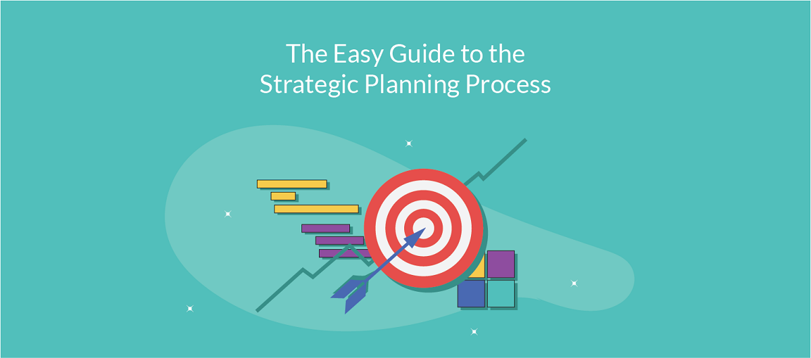
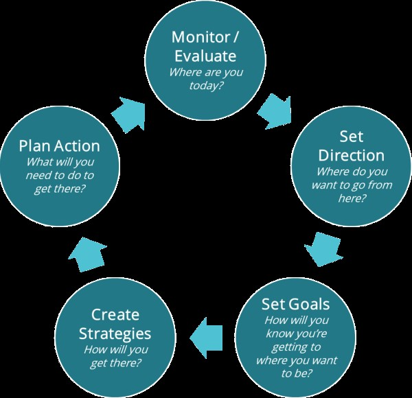

Trying to start a new business or an innovative approach can be exhausting. First you need to know where you want to be, then you need to plan how to get there. All of this while you have never done these things before, which can feel daunting and frustrating. This process can give your strategic planning a direction, help you stay less discouraged, and help you feel that things are under control.

This article will help you understand the strategic planning process for entrepreneurs, give you an overview of each step, and share a few tips for first-time entrepreneurs.

## The strategic planning process

In an applied planning process, you define the short-term work that must be done in order to reach long-term goals.

At a high level, the strategic planning process has five stages, each trying to answer a particular question:

1. Monitor or assess: Where are you today?
2. Direction: From where you are now, where do you want to go?
3. Goal-setting: How will you know you are moving toward where you want to go?
4. Strategy: How will you reach that desired point?
5. Action plan: What do you need to do to get there?

### 1- Monitor or assess

At this stage, entrepreneurs should ask themselves: “Where am I?”

This stage focuses on assessing the current state of the business, or the innovative idea in question, and determining what is working (or not).

**If you want to start a new venture or business**, this is the stage where you should plan around your point of view. What big problems do you want to solve? What resources do you have to solve them? What underserved markets do you want to reach?

**On the other hand, if you want to do strategic planning for an existing business or opportunity,** you should examine whether your current approach is working. Tools such as SWOT / TOWS can be useful and give you a good view of opportunities you have not pursued, as well as weaknesses you need to address.

Now that you have a general understanding of your current position, you need to relate it to where you want to be. You can now define your direction.

### 2- Direction

At this stage, entrepreneurs should ask themselves: “From where I am now, where do I want to go?” The focus of this stage is defining the overall direction and mission of the small business or the innovative idea in question.

**If you want to start a new venture or business,** this is where you should define your mission. What is your overall purpose? What is the top priority you need to reach? Do you need to narrow the scope of your activities so that instead of doing ten things poorly, you do one thing well? This is where you will find that.

**If you are working on an existing business or opportunity,** use what you found in the assessment stage to see whether you need a change in direction. Look precisely at where you are. Which weaknesses do you need to overcome in order to reach high-level goals or the priorities that lead to success? Do you need to change the target market, or change how you work with stakeholders?

Now that you have a high-level directional idea (toward where you want to go), it is time to reach specific goals that sit on that desired direction.

### 3 - Goal-setting

At this stage, entrepreneurs and people with a vision should ask themselves: “What do I need in order to reach the direction I want?” This is the point where your vision becomes **reality**. **What discrete goals do you need to pursue in the short and medium term** in order to reach your desired vision in the long term?

Whether or not you are currently working on a new business and idea, this is the point where you start identifying milestones, or achievable goals you must hit in order to reach the outcome you want. Which small wins will show you that you are on the path to success? What is the most important thing you need to achieve first? This will help you identify what you need in order to reach those goals.

Goals should be SMART (specific, measurable, achievable, relevant, and timely), and you should not set more than 4 to 6 major goals for the next twelve months so you can focus on all of them enough. Depending on the kind of creative idea you are working on, you may want to line your goals up one after another. In that case, you will focus on only one goal at a time.

Now that you have defined your goals, you are ready to define strategies for reaching them.

### 4- Strategy

At this stage, entrepreneurs and people with a vision should ask themselves: “How will I reach that desired point?” This is the point where you are no longer planning around **what** should be done, but thinking about **how** to do it.

It may confuse some people that “one of the stages of the strategic planning process is specifically focused on creating strategies.” The reason is that you need both to formulate strategy well and to execute it well. To do that, in the strategy-formulation stage you can apply what I call “**tactical strategies**” to your innovative idea.

Your strategies should help you identify the best course of action for reaching the goals you set in the goal-setting stage. One of the simplest ways to do this is to identify the strategic areas specific to each goal. That way you can narrow your focus to the paths that are likely to get you to success.

Now that you have defined your strategies, you are ready to plan the next steps and follow them.

### 5- Action plan

At this stage, entrepreneurs and people with a vision should ask themselves: “What do I need to do to reach the desired point?” Here you specify the particular work you must do to reach your goals.

To do this, you should create an action plan based on the strategies you defined. We defined a strategy for reaching each goal, and now you determine the tasks and work that must be done in line with each strategy.

Congratulations — you have finished your strategic planning process! But before you get too comfortable, remember that while you follow your action plan, **you must regularly review progress, see what can be done to reach the desired point, and the whole cycle starts again!**

## Tips for following the strategic planning process

**- Don’t let your strategic planning turn into tactical planning too soon**: Although it can be very tempting, do not jump into operational planning too early. Before you start planning, make sure you know where you want to go!

**- Manage your scope:** If you are like most creative people, you have plenty of ideas. Narrow the range of your initial directions and goals and only address what is first priority. That way you will focus only on what matters and have a much better chance of reaching it.

**- Don’t forget that your strategic plan should be achievable:** Remember that one of the traits of smart goal-setting was “**attainability**.” It is important that your strategic planning be realistic; otherwise the work will be more than you can handle and you will eventually give up.

Author: **Lindsay Phillips**  
Source: [the **startsomethingawesome** website](https://startsomethingawesome.com/strategic-planning-process-for-entrepreneurs/)
