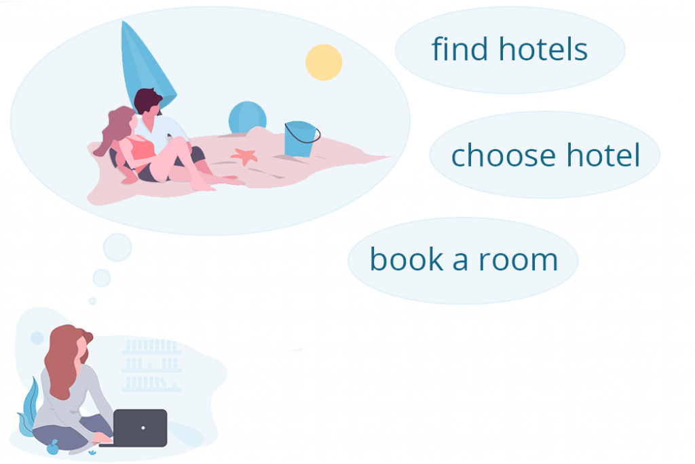
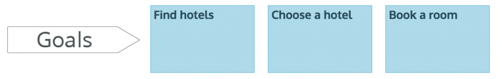
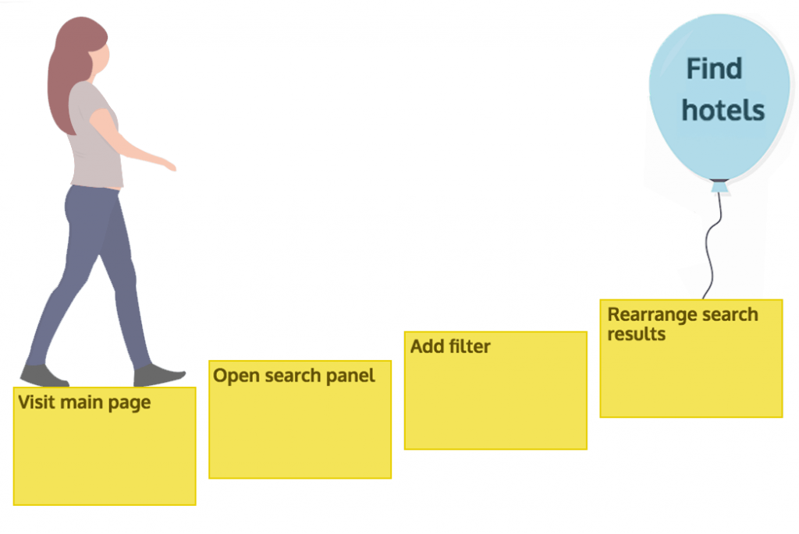
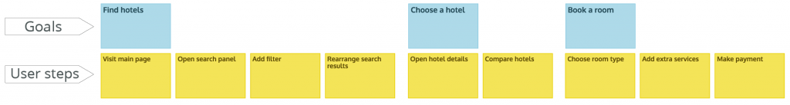
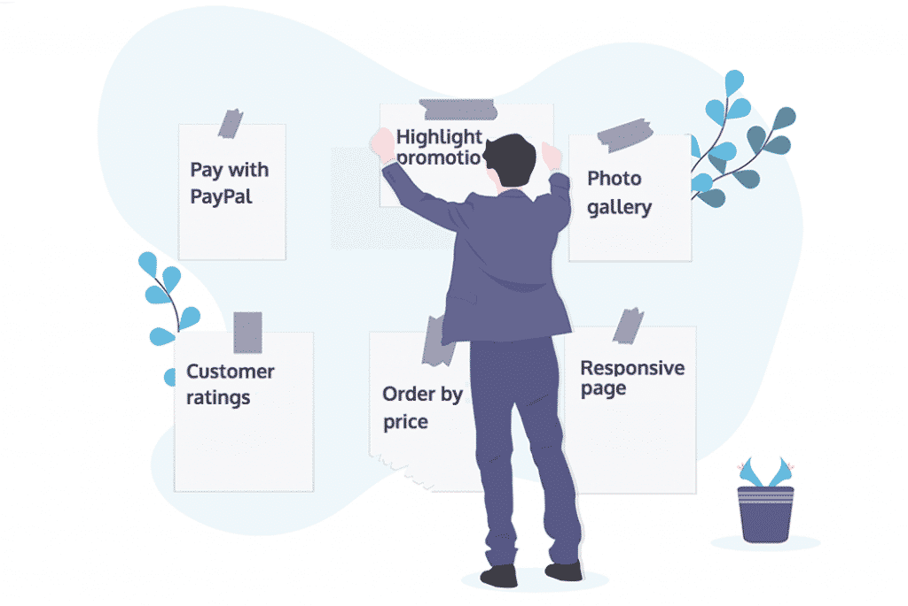
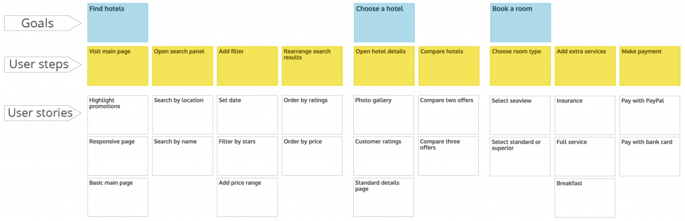
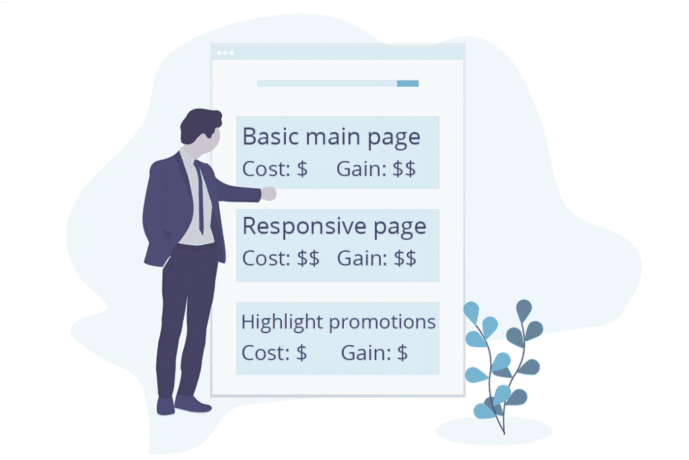
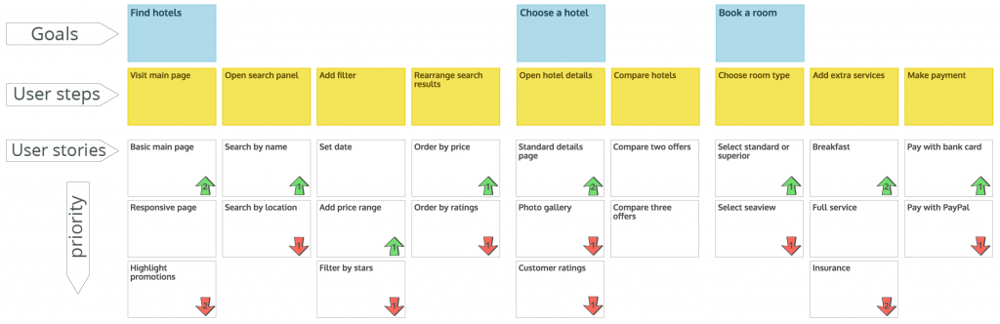
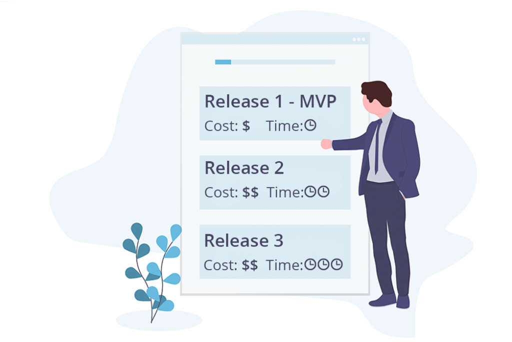
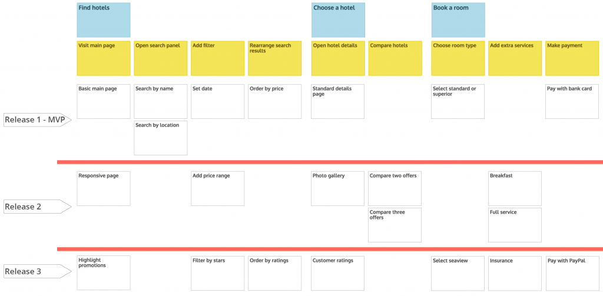

User story mapping is an agile method for designing a product. Designing with story mapping is one of the most powerful ways to create a user-centered product. The product-design process always begins with understanding the user’s problem and goals. That means we specify all the steps the user must go through to reach their goal. In this method you have to follow the natural flow of the user’s movement along the path of doing the activity needed to reach their goal. If an activity can be completed through several different paths, then you have different user stories.

**By arranging user goals, activities, and user stories, you will be able to create an intuitive understanding and a visual backlog that anyone can understand.** That is what we call a user story map. But why does producing such a document matter to us? Your customers need a simple way to confirm your product goals. In addition, your teammates gain a lot from this method, and you can become aware of their ideas and opinions and benefit from them.

**In short, a user story map is a visual aid for sharing a common understanding among team members.**

## User story mapping in 5 steps

The foundation of user story mapping is very simple, and you will learn it easily. If you learn the key early steps, you can easily build your backlog. The first stage of user story mapping is understanding the problem and finding the project goals. Brainstorming is more effective when team members, customers, and potential users take part. Remember that **interactive product design creates a shared understanding and improves products**.

### Step 1- Discover the project goals

The first stage focuses on your potential customers. Briefly determine what goals your users reach by using your product. Write each of these goals on a card and arrange them in a logical order.

For example, on a vacation-services website the goals can include: finding a hotel in Kish, choosing the best hotel, being close to the beach, renting a room for a week.

<figure>

<figcaption>

Specifying the project goals

</figcaption>

</figure>

Read more: [Product positioning + a Basecamp case study](/en/docs/archive/product-positioning/)

### Step 2- Map the user path to the product goal

After collecting the goals, you need to determine the story of the user’s path. Identify the steps the user must take to reach their goal. As in the previous step, write each of these steps on a card and place them in order, one after another, in a separate row.

<figure>

<figcaption>

Determining the steps to reach each goal on the user path

</figcaption>

</figure>

### Step 3- Present solutions with user stories

The next stage is presenting solutions for reaching the steps the user must go through on the path to their goal. In this process you create your user stories. To write user stories you can use the well-known structure

As a user, I want goal, so that step

For example, on that same vacation-services website, one of the user stories can be:

As a user, I want to find a hotel for my vacation, so I start searching for discounts and promotions.

Or as a user I want to find a hotel for next week, so I search for hotels using dates.

By holding brainstorming sessions with your team you will be able to find many different, implementable solutions and place their user stories in the user’s steps toward their goal.

<figure>

<figcaption>

Creating user stories

</figcaption>

</figure>

### Step 4- Organize user stories by priority

If you have run the brainstorming session well, you have collected plenty of good, practical ideas. User stories have different levels of importance. First you should choose the common behavior or the simplest solution for the existing problem. Arrange your user stories by priority and put the most important card at the top of its column. **One way to find priorities is talking with customers.** So put talking with customers and involving their opinions in your work plan.

<figure>

<figcaption>

Prioritizing tasks

</figcaption>

</figure>

### Step 5- Plan the product release structure

First, specify the smallest part of the product that works (MVP). Finding the initial tasks that can be brought to market is hard. **Try to look for the tasks that, by developing them quickly, you can help your user complete one of the stages of their journey.** Focus only on finishing one user journey. After that, divide the rest of your backlog into more understandable parts and mark later releases with horizontal lines. Planning future product releases is one of the most important things both senior managers expect from you and users can find attractive. Managers can use it to calculate the cost and delivery time of later versions.

<figure>

<figcaption>

Specifying future product releases

</figcaption>

</figure>

If you have experience using user story mapping on your team, please share it with us in the comments.

Source: [a post from the StoriesOnBoard blog](https://storiesonboard.com/user-story-mapping-intro.html)
