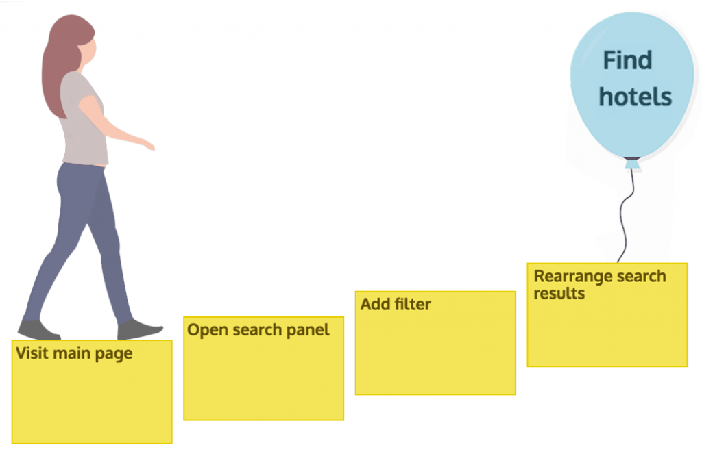
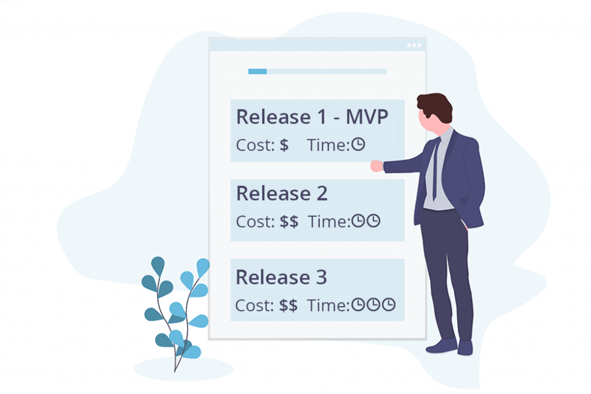

یوزر استوری مپینگ روشی چابک برای طراحی محصول است. طراحی با استفاده از استوری مپینگ یکی از قدرتمندترین راه‌ها برای ایجاد یک محصول کاربر محور به حساب می‌آید. فرایند طراحی محصول همیشه با درک مشکل و اهداف کاربر آغاز می‌شود. به این صورت که تمامی مراحلی که کابر برای رسیدن به هدف خود باید پشت سر بگذارد را مشخص می‌کنیم. در این روش بایستی جریان طبیعی حرکت کاربر در مسیر انجام فعالیت لازم برای رسیدن به هدف خود را دنبال کنید. اگر یک فعالیت را می‌توان از چند مسیر مختلف به ثمر رساند پس یوزر استوری های متفاوتی دارید.  

**با مرتب کردن اهداف کاربر، فعالیت‌ها و یوزر استوری ها قادر خواهید بود درکی شهودی و بکلاگی تصویری ایجاد کنید که هرکسی بتواند آن را درک کند.** این همان چیزی است که ما به آن یوزر استوری‌مپ می‌گوییم. اما چرا تولید چنین داکیومنتی برای ما اهمیت دارد؟ مشتری‌های شما به راهی ساده برای تایید اهداف محصول شما دارند. به علاوه اینکه هم تیمی‌های شما از این روش سودهای زیادی می‌برند و می‌توانید از ایده‌ها و نظرات آن‌ها نیز آگاه و منتفع شوید.

**خلاصه بخواهم بگویم یوزر استوری مپ کمکی بصری برای به اشتراک گذاری فهم عمومی میان اعضای تیم است.**

## یوزر استوری مپینگ در ۵ مرحله

پایه و اساس یوزر استوری مپینگ بسیار ساده است و به راحتی آن را فرا خواهید گرفت. اگر مراحل کلیدی اولیه را یاد بگیرید به راحتی می‌توانید بک لاگ خود را بسازید. مرحله اولیه یوزر استوری مپینگ درک مشکل و پیدا کردن اهداف پروژه است. طوفان فکری زمانی موثرتر است که اعضای تیم، مشتری‌ها و کاربران بالقوه در آن شرکت داشته باشند. به یاد داشته باشید که **طراحی محصول بصورت تعاملی باعث ایجاد درکی یکسان و بهبود محصولات می شود**.  

### مرحله ۱- کشف اهداف پروژه

مرحله اول تمرکز بر روی مشتری‌های بالقوه شما است. بصورت خلاصه معلوم کنید که کاربران شما با استفاده از محصول شما به چه هدف‌هایی می‌رسند. هر کدام از این اهداف را روی یک کارت بنویسید و در یک ترتیب منطقی مرتب کنید.

برای مثال در یک وب سایت خدمات استراحت اهداف می توانند شامل این موارد باشند: پیدا کردن هتل در کیش، انتخاب بهترین هتل، نزدیک بودن به ساحل، اجاره اتاق برای یک هفته.  

<figure>

<figcaption>

مشخص کردن اهداف پروژه

</figcaption>

</figure>

مطالعه بیشتر: [جایگاه یابی محصول + نمونه موردی بیس کمپ](https://theminiceo.ir/product-strategy/product-positioning/)

### مرحله ۲- نگاشت مسیر کاربر در رسیدن به هدف محصول

پس از جمع آوری اهداف باید داستان مسیر حرکت کاربر را معین کنید. مراحلی را که کاربر برای رسیدن به هدف خود باید طی کند را شناسایی کنید. همانند مرحله قبل هر کدام از این مراحل را روی یک کارت نوشته و به ترتیب پشت سر هم در یک ردیف جداگانه قرار دهید.  

<figure>

<figcaption>

تعیین مراحل رسیدن به هر هدف در مسیر کاربر

</figcaption>

</figure>

### مرحله ۳- ارایه راه‌حل‌ها با یوزر استوری

مرحله بعدی ارایه راه حل‌هایی برای دستیابی به مراحلی است که کاربر باید در مسیر رسیدن به هدف خود پشت سر بگذارد. در این فرایند شما یوزر‌استوری‌های خود را ایجاد می‌کنید. می توانید برای نوشتن یوزر‌استوری‌ها از ساختار معروف آن یعنی

As a user, I want goal, so that step

استفاده کنید. به‌عنوان مثال در همان مثال وب سایت خدمات استراحت یکی از یوزر‌استوری‌های می تواند به این صورت باشد:

به‌عنوان کاربر، می‌خواهم برای تعطیلات خود هتل پیدا کنم، پس شروع به جستجو کردن تخفیف‌ها و تبلیغات می‌کنم.

یا به‌عنوان کاربر می‌خواهم برای هفته بعد هتل پیدا کنم پس با استفاده از تاریخ به دنبال هتل می گردم.

با برگزاری جلسات طوفان فکری با تیم خود خواهید توانست راه‌حل‌های مختلف و قابل پیاده‌سازی زیادی را پیدا کرده و یوزر‌‌استوری‌های آن‌ها را در مراحل کاربر برای رسیدن به هدف خود قرار دهید.  

<figure>

<figcaption>

ایجاد یوزر‌استوری‌ها

</figcaption>

</figure>

### مرحله ۴- سازماندهی یوزر استوری بر اساس اولویت آن‌ها

اگر جلسه طوفان فکری را به خوبی برگزار کرده باشید کلی ایده خوب و کاربردی جمع آوری کرده‌اید. یوزر‌‌استوری‌ها سطوح اهمیت متفاوتی دارند. ابتدا باید رفتار رایج یا ساده ترین راه حل برای مشکل موجود را انتخاب کنید. یوزر‌استوری‌های خود را بر‌اساس اولویت مرتب کنید و مهمترین کارت را در بالای ستون خود قرار دهید. **یکی از راه‌های پیدا کردن اولویت‌ها صحبت کردن با مشتری است.** پس صحبت کردن با مشتری و دخالت دادن نظرات آن‌ها را در برنامه کاری خود قرار دهید.  

<figure>

<figcaption>

اولویت‌بندی تسک‌ها

</figcaption>

</figure>

### مرحله ۵- برنامه ریزی ساختار انتشار محصول

ابتدا کوچک‌ترین بخشی از محصول که کار می‌کند را مشخص کنید (MVP). اینکه بتوانید تسک‌های اولیه قابل ارایه به بازار را پیدا کنید کار سختی است. **سعی کنید دنبال آن تسک‌هایی باشید که بتوانید با توسعه سریع آن‌ها به کاربر خود کمک کنید یکی از مراحل سفر خود را کامل کند.** فقط روی تمام کردن یک سفر کاربر تمرکز کنید. پس از آن باقیمانده بک لاگ خود را به بخش‌های قابل درک‌تری تقسیم بندی کنید و با خطوط افقی نسخه های انتشار بعدی را مشخص کنید. این کار یعنی برنامه ریزی انتشارهای آینده محصول یکی از مهم‌ترین چیزهایی است که هم مدیران ارشد از شما انتظار دارند هم برای کاربران می‌تواند جذاب باشد. چرا که مدیران می‌توانند با استفاده از آن هزینه و زمان تحویل نسخه‌های بعدی را محاسبه کنند.  

<figure>

<figcaption>

مشخص کردن انتشارهای آینده محصول

</figcaption>

</figure>

اگر شما در تیم خود تجربه بکارگیری یوزر‌استوری‌مپینگ را دارید حتما در نظرات با ما در‌میان بگذارید.

منبع: [نوشته ای از بلاگ StoriesOnBoard](https://storiesonboard.com/user-story-mapping-intro.html)
