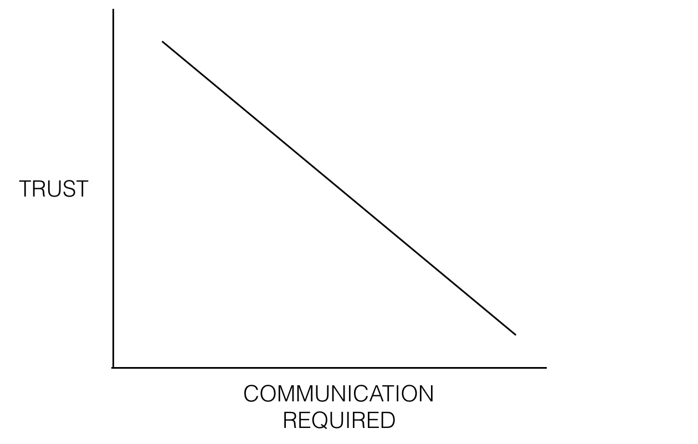

>  "If you look at successful startups, few of them built their product by imitating other startups. Where did these startups find their idea? Startup founders usually solve particular, unsolved problems."
> 
>  Paul Graham, co-founder of the Y Combinator accelerator

Introduction

In the book *The Hard Thing About Hard Things*, Ben Horowitz refers to his own writing about what makes a good product manager. In fact he wrote it several years ago, but it is still practical and full of useful advice.

As I was reading his writing, I reviewed in my mind the things I had seen from the best product managers. Over the years I have managed several hundred product managers / program managers and have worked with many people. I count a large number of them among the best in their field, and some of them became close friends. So I collected my list from the behaviors of the best product managers and product advisors I have seen. These became skills and approaches that are valuable to me, that I try to develop in others, and against which I measure my own growth. I make no claim that this list is correct and comprehensive.

I have left out the basic, obvious items such as “being a complete, reasonable human being,” “treats people with respect,” “gives credit to others,” and so on, and I wrote my list as if I wanted to describe a professional product manager to my friends or colleagues. In truth it is impossible for one person to have all of these traits. If you are reading this to measure yourself, what matters is noticing where you stand relative to it. As soon as you understand that, you only need to focus on it and improve it (9 — invest in your strengths). Also, when I use the term “product management” industry, I mean people who work in the product domain. The best people who wrestle with product, under whatever title they have — product manager, program manager, designer, developer, marketing, or sales. In other words, I mean skill and ability, not merely a job title.

I deliberately wrote this list without order or priority because the value of each trait can differ depending on people, teams, and cultures. So feel free while reading it and assume you are reading a handbook. Still, a friend reminded me that I should still follow my own advice (10 — prioritize). But if I had to choose three important traits, they would probably be 1 — start with why, 13 — curiosity / valuing curiosity, and 18 — has a strong view but holds it weakly. Anyone may take a different path, but in my view these three are so fundamental and important that with them you can learn many of the others.

.

And now the list:

**1) Starts with why.** They always start from the customer and have a clear reason why someone would want to use our product and what problem this product solves for the customer. Simon Sinek summarizes his method well. The product manager writes the comments we expect users to write. They create a mission for the product and, while they are strict about the product’s mission, they are flexible in doing it and getting it done.

**“Be stubborn on your vision, flexible on the details,” Jeff Bezos, CEO of Amazon**

**2) Builds products that solve their own problems.** They know that products we build for ourselves usually turn out great. This advice is often given to CEOs, while it is useful for anyone who builds a product in their life. A product manager, by using the product they have produced, creates empathy between themselves and the customer. They use this product every day and are one of the best testers of the product, and they know the product’s problems almost better than anyone.

**“If you look at successful startups, few of them built their product by imitating other startups. Where did these startups find their idea? Startup founders usually solve particular, unsolved problems,” Paul Graham, co-founder of the Y Combinator accelerator**

**3) Defines goals, measures them, and communicates clearly.** The product manager sets a clear definition of success for every product and every team. These goals are ambitious (to help people’s dreams), realistic (to keep people focused), and measurable (to show people the path). They also have shared goals. Something the team believes in from the heart and wants to reach. They push these goals forward, but they also know that metrics are only evidence of success, not success itself.

**4) Market awareness. They know their market well and know which part of the market their product fits.** They understand the competition and use competitors’ products daily. They regularly share their market knowledge with other team members through news-site material and presentations. They use this information to guide and inform (not dictate) in line with their own products.

**5) Looks for coaches and mentors, and mentors others.** They know that one of the best ways to learn is using the experience of people who have already done work similar to yours. They invest in their relationship with coaches and mentors, take on the burden of scheduling, and are clear about what they want to grow in. They do this by mentoring other growing product managers, and through that they look to strengthen their own views and opinions.

**6) Builds trust. They are both trustworthy and trusting.** They know the difference between trust and blind imitation well, and they look to create a space in which everyone has each other’s back. Through their own behavior they leave a good example of the right behavior, and they work from the hypothesis that everyone has good, clean intentions. They listen and always look to understand people’s viewpoints, perspectives, and vision. Part of this view comes from a desire to live in a world where people trust one another (a utopia).

**7) Understands how the work gets done.** They keep the team focused on ideas they can actually execute. Their knowledge of technical feasibility creates an efficient feedback loop between generating an idea and executing it, which saves technical process. They do not use things like experimentation or machine learning as a crutch (for example, “we’ll just figure out user priorities”). While a product manager is pragmatic, they are not overly focused on their own execution (see number 1 — starts with why) and still strive for technological progress.

**8) Embraces constraints.** Many of the world’s most creative solutions come from deep constraints that would be paralyzing for many people (like the sanctions we have in Iran). The product manager understands the paradox of choice and knows that general statements like “we can do anything” can be counterproductive. They even use intentional, extra constraints during ideation so they can get better feedback, challenge linear thinking, and help unbounded thinking.

**“Not being constrained is the enemy of art,” Pablo Picasso**

**9) Invests in strengths.** A product manager has strengths that set them apart, and they consistently look to reinforce them and progress in them. They are interested in turning their strengths from good to great, and while they are aware of their weaknesses, they do not dwell on them. A product manager’s greatest power is being able to combine their unique skills. They respect other skills (programming, design, and so on), but they do not over-learn them, and they know that a combination of skills is more valuable than titles and labels.

**10) Prioritizes.** They are a natural list-maker and have understood that many complex problems can be solved by writing a list of tasks and doing them in order of priority. They are a stubborn priority-driver, make important business trade-offs on time, and have a good intuitive sense of the quality needed for a particular situation / stage of an idea. They are not afraid to cut their own ideas and features when it leads to a simpler or better customer experience, even things they spent considerable time and effort bringing to fruition.

**“By doing everything, you fail at the most important work,” Ben Horowitz**

They also know that although choosing and cutting features is important, knowing what should be chosen is hard, and they pay more attention to scenarios and experiences than to features. This skill helps them in the approach of building an MVP.

**11) Asks for forgiveness, not permission.** They understand that in large work environments a lot of importance is placed on being willing to take risk, and they remind themselves of this constantly. When they work with colleagues and customers with interest and motivation, they lead by their behavior, and when they make a mistake they ask for forgiveness instead of waiting for permission, and they expect others to do the same.

**12) Grows with change and ambiguity.** While few people love a high degree of uncertainty and ambiguity, they accept them as natural consequences of the process of creating innovation and perform very well in these conditions. In these uncertain, ambiguous times they continuously help others, and wherever possible they create trust and confidence.

**13) Is curious and values curiosity.** They are highly curious and seek learning throughout their life. They welcome intellectual diversity and see opposing views as an opportunity to learn and generate a new idea.

**14) Is data-driven.** They try to collect and understand data so they can use it in decisions. They do this wherever they can, informally, effectively, and using their own tools (as opposed to complex, hard, or expensive processes). While they love data, they do not pay too much attention to it and know that it is “only one input”; even the best studies, experiments, surveys, and analyses often show only part of the story. When we reach the law of diminishing returns on collecting data, they use their sixth sense and are able to decide with incomplete information. When they do not have enough information in the data-collection stage, they can decide with their sixth sense despite incomplete information.

**15) Removes complexity.** They are always breaking problems down so they can find the key questions and solutions. Whenever they share information, instead of paying attention to how much information they can present, they pay attention to what information their audience needs. They are forward-looking and anticipate future problems, but they still focus on likely risks, not a complete set of what might happen. They love summarizing.

**“I didn’t have time, otherwise I would have written a shorter letter” (Mark Twain, American writer)**

**16) Values creating versus talking, influencing versus activity, and producing versus criticizing.** They are pragmatic and avoid long discussions about solutions that would take only a day to prototype, while they could be answered with a few simple questions to the customer. They prefer to choose a good idea they can execute excellently rather than choosing an extraordinary idea they are weak at executing. They have no problem doing the menial work no one else does, and they constantly pay attention to the team’s needs and how to meet them.

**17) Can be high-level or detailed at the right time.** They find the right “zoom level” for a particular situation and can easily operate at a precise picture or a larger picture. When progress is needed they “don’t take even one step back,” and when a wider view becomes more useful they do not get lost in details. At Pathwise, we call this “systems thinking.”

**18) They have a strong viewpoint that they hold weakly.** Whenever they need to move forward in uncertain conditions, they express a strong viewpoint but hold it weakly. This benefits everyone involved in the product, while suppressing overconfidence and stimulating discussion, and it also specifies a default direction. They challenge their assumptions through a logical process and invite others to do the same. With enough evidence and data, they change course toward new ideas and concepts and start the cycle again.

**19) Creates concepts that can be very powerful and are always fit for purpose.** They are a content creator — not only for documentation goals but as a tool for communicating, providing repeatable instructions, and offering needed guidance. They understand the importance of details, but they know these are only tools for making the work easier, and they always consider the best tool for the job.

**20) Gives feedback and takes feedback.** They try to provide useful feedback without ulterior motives and with the intention of improving the situation. They always think “what would be useful?” not “what do I want to say?” They give and take feedback about the product, and their goal is for the product to get attention, not people. They know that being clear with people and being kind to them are not in conflict, and in fact it can be a kind act that happens with authenticity. Because they know the importance of feedback, they share their own activities frequently. They do not wait for a perfect, complete presentation; they try to share their knowledge at the first possible opportunity.

Adapted from [a post by Lawrence Ripsher](https://hackernoon.com/what-makes-a-great-product-manager-3c1d03b90356), product manager at Pinterest

Which of the items above do you think matter more?

Author: Lawrence Ripsher  
Source: [the hackernoon website](https://hackernoon.com/what-makes-a-great-product-manager-3c1d03b90356)
