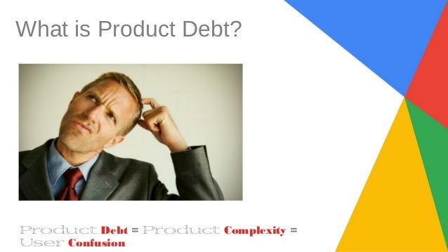

**Product perfection** is not reached when there is nothing left to add, but when there is no longer a feature left to remove from the product’s capabilities.

I remember launching Google’s new filter feature in the AdSense product. At the time we had hundreds of thousands of website publishers who did a lot of work using our user interface. They might download a revenue report from running AdSense ads, set ads to match their website’s style, and specify their preferred content priorities for their site’s ads.

Unfortunately, less than two percent of existing users became interested in the feature we launched. A few weeks after launch I asked myself whether we should turn this feature off. On one hand, a few hundred people had benefited from the effort we had put in, but for hundreds of other users we had created complexity. In addition, we had expanded the product and engineering surface for later tests and designs. In a way, we had created **product debt**.

## Product debt

Product debt is different from technical debt (a word that makes engineers shudder). Technical debt means going back and rewriting a significant amount of code because it was not built at scale or was written in an unsuitable language. Creating code is much more fun than rewriting or improving it.

Read more: [Strategy is not a to-do list!](/en/docs/archive/strategy-isnt-todo/)

Product debt includes a set of good features that are used by only a tiny fraction of the user population. Product debt introduces all kinds of complexity, from early design stages through development and use. Imagine a publisher wants to filter ads based on language, geography, keywords, demographics, and platform. Each of these filters has to be considered in combination with the others, which creates an exponential combined effect.

A new type of filter that benefits only a small part of the population has to be redone for every later change in other filters, or for every new filter. As a result, designers have to invent new ways to communicate the complexity that has been created. QA teams have to design tests so everything works correctly. Product managers have more details for new capabilities. Last and most important, users have to use the product with increasing complexity.

## **How much does it cost to carry product capabilities?**

In retail there is a concept called “carrying cost,” which includes all the costs of warehousing equipment, including warehouse costs, staff, shipping, and depreciation of goods. Carrying costs emphasize the idea that more product is not always better, because it comes with more costs.

Startups have a similar idea of “carrying cost” for product. Every product and engineering organization must clearly decide which product carrying costs they will bear. What fraction of users should use a feature for that feature to remain? Or what fraction of revenue-generating users, or what fraction of total revenue?

By removing features that do not meet these criteria, you ensure that product-development organizations can continue on their path faster, reduce their product debt, and deliver a more complete experience to their users — one in which nothing else can be removed.

Source: [a post by Tomasz Tunguz, a managing director at Redpoint](https://tomtunguz.com/perfection-nothing-to-take-away/?utm_content=buffer014c6&utm_medium=social&utm_source=twitter.com&utm_campaign=buffer)
