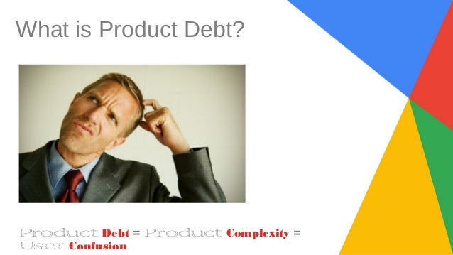

**کمال محصول** وقتی که چیزی برای اضافه کردن وجود ندارد بدست نمی آید، بلکه وقتی بدست می آید که از قابلیت‌های محصول دیگر فیچری برای حذف کردن وجود ندارد.

من لانچ کردن فیچر فیلتر جدید گوگل را در محصول Adsense  به یاد می‌آورم. در آن زمان ما صدها هزار ناشر وبسایت داشتیم که با استفاده از واسط کاربری ما کارهای زیادی انجام می‌دادند. ممکن است گزارش درآمد حاصل از اجرای تبلیغات Adsence را دانلود کنند، تبلیغات مطابق با استایل وبسایت خود را تنظیم کنند و اولویت دلخواه محتوای تبلیغات وب سایت شان مشخص کنند.

متاسفانه کمتر از دو درصد کاربران فعلی به فیچری که ما لانچ کردیم علاقه مند شدند. چند هفته پس از لانچ از خودم پرسیدم که آیا باید این فیچر را غیرفعال کنیم؟ از طرفی چند صد نفر از زحماتی که کشیده بودیم  بهره مند شده بودند اما برای صدها کاربر دیگر پیچیدگی ایجاد کرده بودیم. علاوه براین، ما سطح محصول و مهندسی را برای تست و طراحی های بعدی گسترده تر کرده بودیم. به نوعی ، ما **بدهی محصول** ایجاد کرده بودیم.

## بدهی محصول

بدهی محصولات متفاوت از بدهی فنی است (کلمه ای که از لرزه به اندام مهندسان می اندازد). بدهی فنی به معنای بازگشت مجدد و بازنویسی مقادیر قابل توجهی از کد است زیرا آنها در مقیاس ساخته نشده اند یا به زبانی نامناسب نوشته شده اند. ایجاد کد بسیار سرگرم کننده تر از بازنویسی یا بهبود بخشیدن آن است.

بیشتر بخوانید: [استراتژی لیستی از کارهایی که باید انجام شوند نیست!](https://theminiceo.ir/product-strategy/strategy-isnt-todo/)

بدهی محصول مجموعه ای از فیچرهای خوب را در برمیگیرد، اما توسط کسری ناچیز از جمعیت کاربر استفاده می‌شود. بدهی محصول انواع پیچیدگی‌های، از مراحل اولیه طراحی تا توسعه و کاربرد که ایجاد می شود را معرفی می کنند. تصور کنید ناشر می خواهد تبلیغات را بر اساس زبان، جغرافیا، کلمات کلیدی، جمعیتی، بستر فیلتر کند. هر کدام از این فیلترها را باید در ترکیب با بقیه فیلترها در نظر گرفت که اثر ترکیبی نمایی ایجاد می کند.

یک نوع فیلتر جدید که فقط از بخش کمی از جمعیت سود می برد، باید برای هر تغییر بعدی در سایر فیلترها یا هر فیلتر جدید دوباره شود. حاصل این اتفاق طراحان باید راه های جدیدی برای ارتباط با پیچیدگی های ایجاد شده ابداع کنند. تیم های کنترل کیفیت باید آزمایش هایی را طراحی کنند تا همه چیز به درستی کار کند. مدیران محصول برای قابلیت‌های جدید ریزه کاری های بیشتری دارند. آخرین و مهمتر از همه، کاربران مجبورند با افزایش پیچیدگی از محصول استفاده کنند.

## **هزینه حمل قابلیت‌های محصول چقدر است؟**

در خرده فروشی مفهومی به نام "هزینه حمل" وجود دارد که شامل تمام هزینه های انبار تجیهزات می شود از جمله هزینه های انبار ، کارکنان ، حمل و نقل و استهلاک کالا. هزینه های حمل بر این ایده تاکید دارند که محصول بیشتر همیشه بهتر نیست، زیرا هزینه های بیشتری به همراه است.

استارت‌آپ‌ها ایده ای مشابه "هزینه حمل" برای محصول دارند. هر محصول و سازمان مهندسی باید به طورواضح تصمیم بگیرد کدام هزینه های حمل محصول را متحمل شوند. چه کسری از کاربران باید از یک فیچر استفاده کنند تا آن فیچر باقی بماند؟ یا چه کسری از کاربران درآمد زا یا چه کسری از درآمد کل؟

با حذف فیچرهایی که این معیارها را برآورده نمی کنند، تضمین می شود که سازمان های توسعه محصول بتوانند با سرعت بیشتری به مسیر خود ادامه دهند، بدهی محصول خود را کاهش دهند و  تجربه کاملتری را به کاربران خود تحویل دهند، که در آن هیچ چیز دیگری قابل حذف نیست.

منبع : [نوشته ای از Tomasz Tunguz مدیر اجرایی در Redpoint](https://tomtunguz.com/perfection-nothing-to-take-away/?utm_content=buffer014c6&utm_medium=social&utm_source=twitter.com&utm_campaign=buffer)
