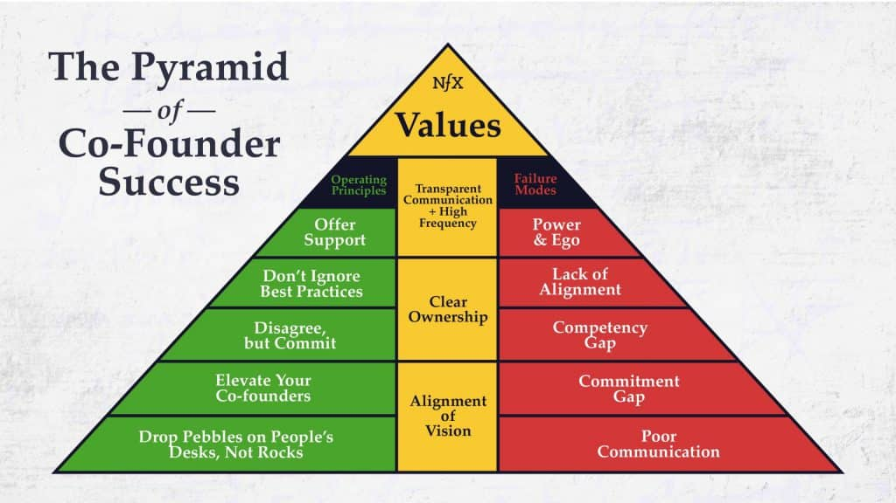

One of the most essential needs of a startup is a co-founder. They are your partner in launching the business and are usually also a shareholder in the company.

If you have thought many times about launching a startup and have never succeeded, the first reason for your failure has probably been the absence of a co-founder. Someone who, step by step with you, puts the idea to the test of criticism, and does everything from the simplest, most mundane tasks to the most complex legal work so the project can take one step forward.

If you become tired and exhausted, they urge you to continue, and if they hesitate somewhere, you pull them forward. As you can see, here the meaning of co-founder is a little deeper and broader than the meaning of “partner” or co-founder in traditional businesses, and in practice the person’s knowledge and companionship matter more than their capital.

[Launching a business](/en/docs/archive/survival-guide-for-product-managers-intro/) in many parts is similar to starting a shared life. From the time you think about forming a family, to finding the right person and beginning and continuing life, you have to go through many stages. Stages that each include important factors, and you cannot pass them casually or simply. **Finding a co-founder is like finding the right person to start a shared life.**

- A life partner should complement you; a business partner should also cover your gaps and weaknesses well.
- In a shared life, both people need a proper understanding of each other’s situation; in launching a business, each should also be at a similar level in their own specialty.
- In a shared life, two people need to know each other’s personality and ethical traits; a business partner should also know your ethical traits at work.
- Before forming a shared life, two people are in contact for a while in order to get to know each other. Before forming a business with another person, you should be in contact in the work domain for a while so you can discover each other’s capabilities and traits.
- Before forming a shared life, two people prove themselves to each other; your business partner should also show you their capabilities and win your regard.

<figure>

- <figure>
    
    
    
    <figcaption>
    
    A suitable co-founder should have traits that make a good partnership.
    
    </figcaption>
    
    </figure>
    

</figure>

## Knowing a co-founder’s strengths and weaknesses

Typically, people who are experiencing a startup for the first time face different challenges. Challenges among founders that require them to become more aligned with one another.

The more time they spend together and experience different issues, the more easily they will understand whether they can work with each other at all. For two people to know their strengths and weaknesses, they need a long-term relationship. That relationship can start through collaborating in one part of a company, and even through starting a startup.

Being colleagues and working side by side can, to some extent, familiarize you with each other’s character. But nothing makes you as familiar with each other as launching a startup.

To find the right co-founder, you have to pay costs. That cost can be the amount of time you spend together launching a new business.

Since you are going to launch a startup full of ambiguity and dark spots, it is better if at least one of the founders has previous experience launching a startup, whether successful or failed. Or at least one of the founders should have worked in a startup in a job role.

These are all items that can count as a plus. Of course there is no requirement to have this experience. This does not mean that anyone who does not have these conditions is not a good person to become a co-founder.

One of the things you can do to get to know the other person as a startup co-founder is taking part in group activities. For example, different startup events are held every month at various centers. By attending them, you can evaluate the other person in a simulated, real situation. You can also examine teamwork side by side.

* * *

This piece is part of the book *Human Blockers*. In this book, two years of experience hiring people on a low budget and with startup problems is examined, and in the form of a step-by-step guide it teaches less-experienced Iranian entrepreneurs the hiring, attracting, and retaining process in a compact way. To pre-order and support this book’s campaign, visit the Hamboodgah site.

[Buy the book](/en/docs/books/human-blockers/)

Sources

[Co-Founder, Co-founder, or cofounder? Which one is correct?](https://livexp.com/blog/the-exact-connotation-of-the-words-co-founder-co-founder-or-cofounder/#:~:text=Whether%20the%20correct%20word%20is,to%20as%20a%20joint%20founder.)
