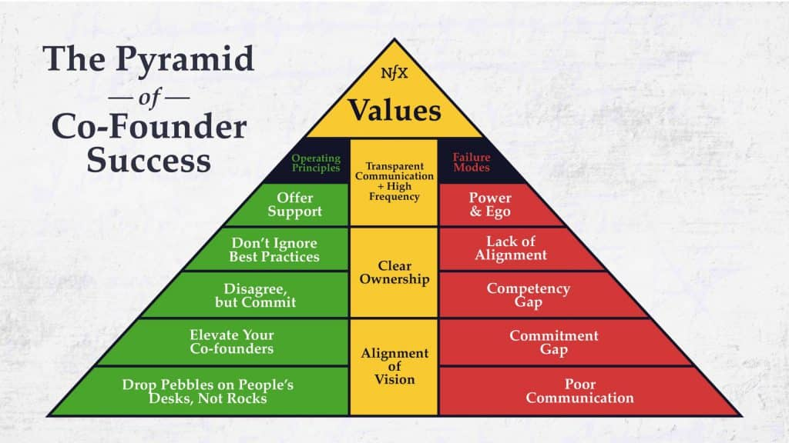

یکی از کلیدی‌ترین نیازهای یک استارتاپ هم بنیان گذار یا Co Founder است. اون شریک شما در راه اندازی کسب و کار بوده و معمولا سهام دار شرکت نیز است.

اگر تا به حال بارها به فکر راه اندازی یک استارتاپ افتاده‌اید و هیچ وقت موفق نشده‌اید احتمالا اولین دلیل ناکامی‌تان، نبود یک هم‌بنیان‌گذار بوده است. کسی که پا به پای شما ایده را در بوته نقد قرار دهد، از ساده‌ترین و پیش پا افتاده‌ترین امور تا پیچیده‌ترین کارهای حقوقی را انجام دهد تا کار یک قدم جلو برود.

اگر شما خسته و درمانده شدید او شما را ترغیب به ادامه راه کند و اگر او جایی مردد شد شما او را به پیش بکشید. همان طور که می‌بینید اینجا معنی هم‌بنیان‌گذار کمی عمیق‌تر و وسیع‌تر از معنای «شریک» یا co founder در کسب و کارهای سنتی است و عملا دانش و همراهی فرد حرف مهمتری نسبت به سرمایه او را می‌زند.

ر[اه اندازی یک کسب و کار](https://theminiceo.ir/product-basics/survival-guide-for-product-managers-intro/) در بخش‌های زیادی مشابه آغاز زندگی مشترک است. از زمانی که فکرکردن در مورد تشکیل خانواده تا پیدا کردن فرد مناسب و آغاز و ادامه‌ی زندگی مراحل زیادی را باید پشت سر بگذارید. مراحلی که هر کدام شامل فاکتورهای مهمی هستند و نمی‌توان سرسری و ساده از کنار آن‌ها گذشت. **پیدا‌کردن co-founder مانند پیدا کردن فرد مناسب برای آغاز زندگی مشترک است**. 

- شریک زندگی باید مکمل شما باشد، شریک تجاری نیز بایستی کمبودها و نقاط ضعف شما را به خوبی پوشش دهد.
- در زندگی مشترک، هر دو نفر بایستی درک درستی از اوضاع طرف مقابل داشته باشند، در راه اندازی کسب و کار نیز هر کدام باید از نظر تخصص خود در سطح نزدیک به هم باشند. 
- در زندگی مشترک، دو نفر باید با ویژگی‌های شخصیتی و اخلاقی یک‌دیگر آشنا باشند، شریک تجاری نیز باید ویژگی‌های اخلاقی شما را در کار بشناسد. 
- قبل از تشکیل زندگی مشترک، دو نفر برای مدتی با هم در ارتباط هستند تا به شناخت برسند. قبل از شکل‌دهی یک کسب و کار با شخصی دیگر، باید مدتی در زمینه‌ی کاری با هم در ارتباط باشید تا به توانمندی‌ها و ویژگی‌های یک‌دیگر پی ببرید. 
- قبل از تشکیل زندگی مشترک، دو نفر به اثبات خود برای یک‌دیگر می‌پردازند، شریک تجاری شما نیز باید توانمندی‌های خود را به شما نشان دهد و نظر شما را جلب کند. 

<figure>

- <figure>
    
    
    
    <figcaption>
    
    یک کوفاندر co-founder مناسب باید ویژگی‌هایی داشته باشد تا یک شراکت خوب را برقرار کند.
    
    </figcaption>
    
    </figure>
    

</figure>

## شناخت نقاط قوت و ضعف co founder

به صورت معمول، افرادی که برای اولین بار تجربه‌ی یک استارتاپ را دارند، با چالش‌های متفاوتی روبه‌رو می‌شوند. چالش‌هایی میان بنیان‌گذاران که نیازمند هماهنگ شدن بیش‌تر آن‌ها با یک‌دیگر است.

هر چه زمان بیش‌تری کنار یک‌دیگر باشند و مسائل مختلف را تجربه کنند، راحت‌تر خواهند فهمید که آیا اصلا می‌توانند با یک دیگر کار کنند یا نه. برای این‌ که دو نفر نقاط ضعف و قوت خود را بشناسند، نیازمند ارتباط طولانی مدتی هستند. این ارتباط می‌تواند به واسطه‌ی همکاری در یک بخش از یک شرکت و حتی به واسطه‌ی آغاز یک استارتاپ شروع شود.

این که همکار هم باشید و در کنار هم کار کنید می‌تواند تا حدودی شما را با اخلاق یک‌دیگر آشنا سازد. اما هیچ کاری به اندازه راه اندازی یک استارتاپ سبب آشنا شدن با یک‌دیگر نمی‌شود. 

برای این‌ که co founder مناسب خود را پیدا کنید، باید هزینه‌هایی بپردازید. این هزینه می‌تواند همان مدت زمانی باشد که با یک‌دیگر صرف راه اندازی یک کسب و کار جدید می‌کنید.

از آن‌ جایی‌که قرار است یک استارتاپ سرشار از ابهام و نقاط تاریک راه‌اندازی کنید، پس چه بهتر که حداقل یکی از بنیان‌گذاران تجربه‌ی قبلی راه اندازی استارتاپ، چه موفق، چه شکست خورده را داشته باشد. یا حداقل یکی از بنیان‌گذاران در یک استارتاپ در یک موقعیت شغلی مشغول به کار بوده باشد.

این‌ها همه‌ مواردی هستند که می‌توانند یک امتیاز مثبت به حساب بیایند. البته هیچ الزامی در داشتن این تجربه نیست. این سخن به معنی آن نیست که هر کس این شرایط را نداشته باشد، فرد خوبی برای هم‌بنیان‌گذار شدن نیست.

یکی از کارهایی که می‌توانید برای شناخت طرف مقابل خود به عنوان هم بنیان گذار استارتاپ انجام دهید، شرکت در فعالیت‌های گروهی است. به عنوان مثال، هر ماه رویدادهای استارتاپی متفاوتی در مراکز مختلف برگزار می‌شوند. می‌توانید با شرکت کردن در آن‌ها، طرف مقابل را در یک شرایط شبیه‌سازی شده و واقعی مورد ارزیابی قرار دهید. هم‌چنین می‌توانید کار تیمی در کنار یک‌دیگر را مورد بررسی قرار دهید.

* * *

این نوشته بخشی از کتاب «موانع انسانی» است. در این کتاب سعی شده تجربه ۲ ساله برای استخدام منابع انسانی با بودجه کم و مشکلات استارتاپی بررسی شود و در قالب یک راهنمای گام به گام به کارآفرینان کم تجربه ایرانی فرآیند استخدام و جذب و نگهداشت را به صورتی فشرده آموزش دهد. برای پیش خرید و کمک به کمپین این کتاب به سایت همبودگاه مراجعه کنید.

[خرید کتاب](https://theminiceo.ir/downloads/human-blockers/)

منابع

[Co-Founder, Co-founder, or cofounder? Which one is correct?](https://livexp.com/blog/the-exact-connotation-of-the-words-co-founder-co-founder-or-cofounder/#:~:text=Whether%20the%20correct%20word%20is,to%20as%20a%20joint%20founder.)
