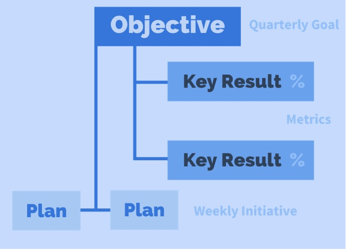
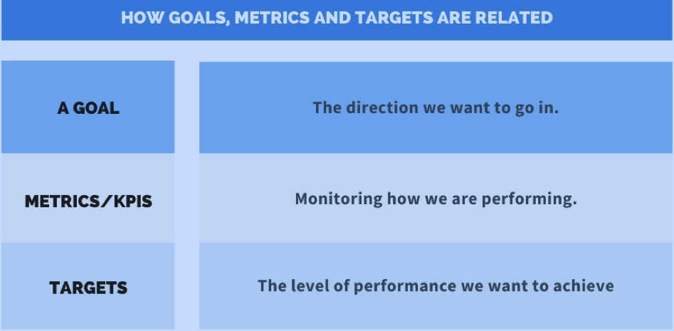
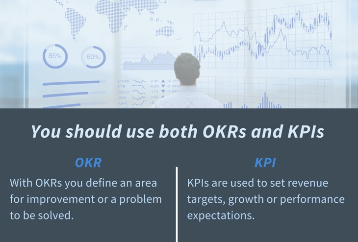
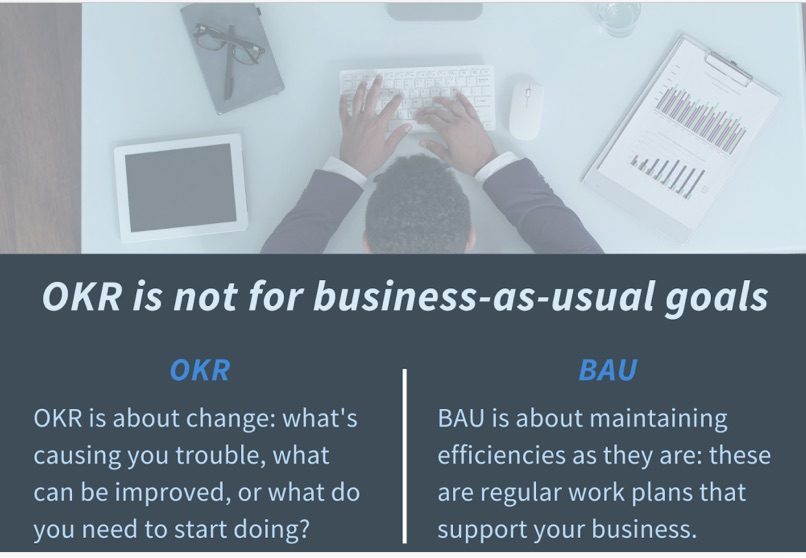
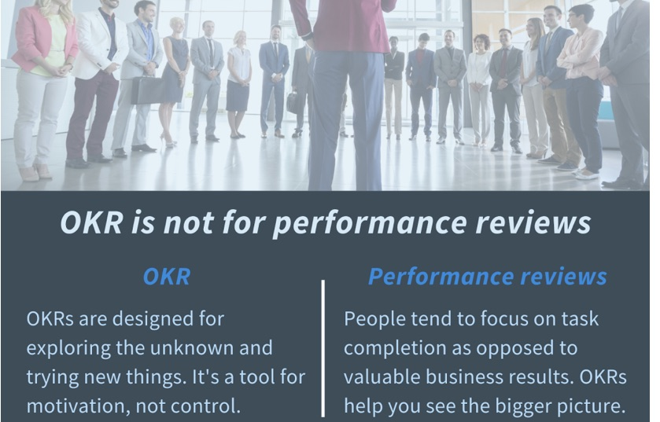
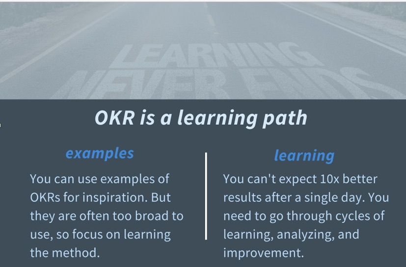
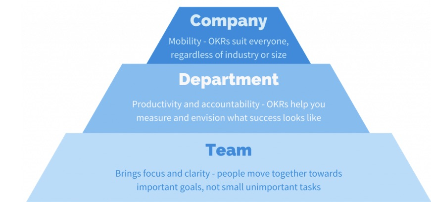
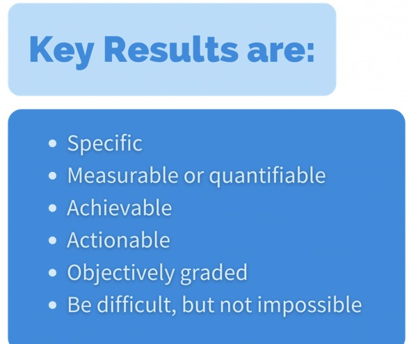
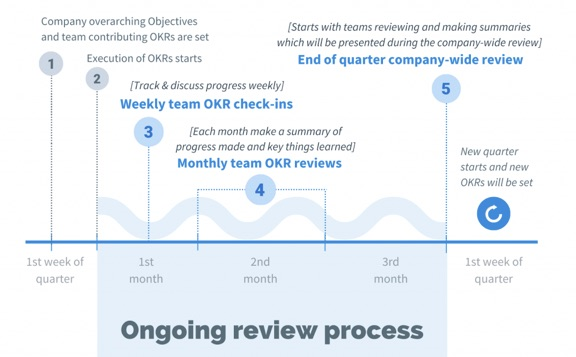

In the dynamic world of product development, teams constantly face the challenge of setting clear, measurable goals and aligning efforts to achieve them. How can you be sure that all team members are moving in one direction and focusing on the most important priorities? One of the powerful and popular frameworks for answering this challenge is **OKR**, or **Objectives and Key Results**. But what exactly **is OKR**, and how can it help your product grow and succeed?

In this article, we will fully examine **what OKR is**, what benefits it has for product teams, how we can do effective **OKR setting**, and we will review a few **OKR examples for product** together.

## What is OKR? Explaining objectives and key results

**OKR** is a collaborative goal-setting framework that helps people, teams, and organizations set challenging, ambitious goals and measure their progress toward them. This framework was introduced by Andy Grove at Intel and later became world-famous through Google, and is now used by many successful companies around the world.

An OKR is made of two main parts:

1. **Objective:**
    - **What it is:** The objective is a qualitative, inspiring, memorable statement that specifies “what” we want to achieve. Objectives should be significant, tangible, action-oriented, and preferably motivating.
    
    - **Example:** “Deliver the best mobile user experience in our industry.”

3. **Key Results:**
    - **What they are:** Key results are quantitative, measurable metrics that show “how” we know we have reached our objective, or how close we have come to it. For each objective, usually 2 to 5 key results are defined. Key results should be Specific, Measurable, Achievable, Relevant, and Time-bound (they are in a way SMART).
    
    - **Example for the objective above:**
        - Increase the mobile-app user-satisfaction score from 3.5 to 4.5 (out of 5) by the end of the quarter.
        
        - Reduce the mobile-app user churn rate by 20%.
        
        - Increase daily app downloads to 1,000.

The important point is that OKRs focus on *results*, not merely *activities* or tasks (Initiatives/Tasks). Tasks are the work we do to achieve key results.

## Why are OKRs important for product growth?

Using the OKR framework correctly can have significant positive effects on your product’s growth and development:

- **Focus and Alignment:** OKRs help the product team (and the whole organization) focus on the most important priorities and align their efforts in one direction. When everyone knows what the main objectives are, everyday decisions will also be more informed.

- **Transparency:** OKRs are usually shared across the organization. This transparency means everyone is informed of one another’s objectives and understands how their work helps larger goals.

- **Accountability:** Measurable key results make progress transparent for everyone and make teams and people more accountable for reaching their objectives.

- **Flexibility and Agility:** OKRs are often set quarterly. These shorter intervals allow teams to adapt faster based on learnings and market changes and to revisit their objectives.

- **Motivation and Engagement:** Setting challenging but achievable goals (Stretch Goals) can encourage teams to try more and strengthen a sense of success and participation in them.

- **Measuring progress toward large goals:** OKRs turn large, long-term product visions into smaller, manageable, measurable steps.

## How do we set effective OKRs for product? (OKR-setting guide)

**OKR setting** is a process that needs care and participation. Here are the stages and key points for effective **OKR setting** for product:

1. **A combined approach (top-down and bottom-up):**
    - High-level company OKRs specify the overall direction. Then product teams (and other teams) set their OKRs in a way that helps these macro objectives. It is important that teams take part in defining their own OKRs so they feel more ownership.

3. **Writing inspiring, clear Objectives:**
    - Objectives should be qualitative, brief, memorable, and challenging.
    
    - They should clearly state where the team wants to go.
    
    - Example: “Create an outstanding onboarding experience for new users.”

5. **Defining measurable, outcome-oriented Key Results:**
    - Each key result should be quantitative and clearly show success (use numbers and percentages).
    
    - Focus on *results*, not *activities*. (For example, “increase new-user activation rate to 70%” is a result, but “launch an email campaign for new users” is an activity).
    
    - Make sure your metrics are trackable.

7. **A limited number of OKRs:**
    - Try to focus on 3 to 5 main objectives for each time interval (for example each quarter). Too many OKRs destroy focus.

9. **Setting a Timeframe:**
    - OKRs are usually set for one quarter (three months). This interval is long enough to reach meaningful results and short enough to keep agility.

11. **Regular Review and Tracking:**
    - OKRs should not be abandoned after they are set. Progress toward key results should be reviewed regularly (for example weekly or biweekly). At the end of each cycle, OKRs should also be scored and the learnings used for the next period.

13. **Separating OKRs from individual performance evaluation (optional but recommended):**
    - To encourage teams to set challenging, ambitious goals, it is better that OKRs not be tied directly to individual performance evaluation and rewards. The main goal of OKR is alignment and growth, not judging people.

## OKR examples for product

Here are a few **OKR examples for product** so you get a better understanding of how to do **OKR setting**:

**Example 1: Improving the onboarding experience and activating new users**

- **Objective:** Deliver an outstanding entry experience for new users and increase their activation in the product quickly.

- **Key Results:**
    1. Increase the new-user profile-completion rate from 40% to 70% by the end of the quarter.
    
    3. Reduce the bounce rate of new users on the initial dashboard page from 50% to 30% by the end of the quarter.
    
    5. Increase the number of users who take the first key action (Core Action) in the first 7 days from 200 to 500 users by the end of the quarter.

**Example 2: Increasing user engagement with a particular feature**

- **Objective:** Turn the “advanced report analysis” feature into one of the most used and most valuable parts of the product for professional users.

- **Key Results:**
    1. Increase weekly active users (WAU) of the “advanced report analysis” feature from 500 to 1,000 users.
    
    3. Increase the average number of reports generated by each active user of this feature from 2 to 4 reports per week.
    
    5. Receive a satisfaction score of at least 4.2 out of 5 for this feature in the quarterly user survey.

**Example 3: Preparing for a successful launch of a new product (MVP)**

- **Objective:** Ensure full readiness for launching the MVP of the “smart project management” product and create initial interest in the target market.

- **Key Results:**
    1. Attract at least 1,000 high-quality early-adopter pre-registrations until one week before the launch date.
    
    3. Complete and successfully test all essential MVP features as defined, two weeks before launch.
    
    5. Fully prepare and train the support and sales team to answer questions related to the MVP.

## Common mistakes in setting and implementing OKRs

To fully benefit from the power of OKRs, avoid these common mistakes:

- **Setting too many OKRs:** leads to losing focus.

- **Setting key results that are actually activities, not results (Task-based KRs):** Remember, KRs should measure output and impact.

- **Not tracking and regularly reviewing progress:** OKRs without tracking are useless.

- **Using OKRs directly for individual performance evaluation and rewards:** this causes people to choose more conservative goals.

- **“Set and forget”:** OKRs should be part of the team’s culture and everyday conversation.

- **Goals that are too conservative, or too ambitious and unreachable:** you have to find an appropriate balance.

## Conclusion: OKR, the fuel for your product’s continuous growth

The answer to the question **“What is OKR?”** shows that this framework is more than a simple goal-setting tool; OKR is a culture and a system for creating focus, transparency, alignment, and accountability on your product team. By **setting OKRs** correctly and tracking them continuously, you can keep your product’s growth engine running and continuously move toward larger goals.

If you have not used OKRs so far, we recommend you start simply, learn from your mistakes, and optimize the process on your team. The real power of OKR lies in continuous execution and commitment to it.

**Do you use OKRs on your product team? Share your experiences, challenges, and successes about setting OKRs and OKR examples for product with us and other readers in the comments.**

Read more: [https://www.whatmatters.com/faqs/okr-meaning-definition-example](https://www.whatmatters.com/faqs/okr-meaning-definition-example)

* * *

Objectives and Key Results (OKR) is a critical-thinking framework and a goal-setting method that helps companies align goals and make sure everyone is jointly working on the goals that truly matter.

OKRs can be implemented using spreadsheets or, commonly, with OKR software.

The OKR method is a simple process for setting and aligning company and team goals (realistic objectives) and connecting each objective with 3–5 measurable results (key results) to measure progress.

For example, *increase \_\_\_\_\_ from X to Y.* *Reduce \_\_\_\_\_\_ by X percent.* *Improve \_\_\_\_\_ by X percent.* Key results can be measured on a 0 to 100 percent scale or any numerical unit (for example: dollar amount, %, items, and so on).

As you progress on each key result, progress on the objective moves forward on a 0 to 100 percent scale. Objectives are also supported by your weekly initiatives and activities (plans) that you do to advance progress on an objective. Plans should be created weekly and linked to your objectives.

#### **Examples of OKRs**

Now that we have a better understanding of what makes a good OKR, let’s run through a few examples and see what is good or what can be improved.

**Example 1:  
Objective: Make the company go viral**

Key results:

1.    Generate 100,000 views on our YouTube channel

3.   Get 10,000 new followers on Instagram

5. Increase organic search traffic to our website by 20 percent

This is a good example of an OKR. The objective is aspirational and pushes the company forward, while the KR is numerical and quantitatively determines the success of the overall objective. Inappropriate key results for this objective could include the following:

Inappropriate key results:

1. Make videos for YouTube,

3. Get more Instagram followers

5. Improve SEO

**Example 2:**

**Objective: Design, create, and launch a new product**

Key results:

1. Interview 50 existing customers about what they want to see for a new product line

3. Create the new product

In this case the OKR could use some work. Reaching the objective is probably not possible in one quarter. And although the first KR in this example is good, the second result is not measurable.

**Example 3:**

**Objective: Implement a new outbound email campaign**

Key results:

1. Write email copy to send to outbound leads

3. Get a list of outbound leads

5. Send email to everyone on the list

Unfortunately this is not considered an OKR but a project with a task list. Remember that objectives are large and aspirational, and the KR is also a quantitative measure of that objective. Start using OKRs in your company

What is goal-setting? OKRs act as a goal-setting method. But before you go deeper into them, you really need to know what the term “goal” actually means.

You have probably heard various terms such as goals, targets, OKRs, and key performance indicator (KPI) metrics. In many cases, these terms get mixed together. Each of them should be defined so there is really no confusion.

### What are Goals?

Goals in a business are the things the company intends to achieve in the future. A Goal is a result you want to obtain. At their core, Goals are entirely about commitment. They give the business direction and help you focus on what matters.

Goals can be macro (directional) and focus on the company’s largest objectives, or they can be operational and focus on the priorities of a special-function team. Depending on the level, goals can also have particular places based on development needs.

Goals should be known by everyone in the company, and planned initiatives should help your team move toward those goals.

### Goals versus Objectives

The border between Goals and Objectives is so thin that it basically does not exist. Both represent a desired result or achievement. There are various theories that say Goals are usually longer-term and cover the overall picture, and Objectives are more specific, more practical, and shorter-term.

Separating Goals from Objectives may relate to some goal-setting methods, but it is definitely not needed when using OKRs. Here we consider both as one! Trying to separate these two terms actually has no value for you, so why should you bother.

**What Goals are not**

#### What are indicators / KPIs and targets?

**KPIs** and indicators and targets are important terms for understanding how your company works. KPI and indicators are business measures and mean the same thing. These measures represent the company’s performance.

Tracking the company’s KPI helps you understand whether the company is in a healthy state or not. Determining what you should measure in your company is important. Depending on what your company does, churn rate, MQL, NPS, and so on can be considered KPIs.

**Targets** are the performance levels you set for your indicators / KPIs. For example, sales people can set their target for the number of customer meetings in a month. While the indicator is the number they actually obtained.

**The difference between Goals and KPI and targets** is that Goals are something you want to reach, while KPI shows where you are and how many of the goals you need to reach daily to keep the company going.

If the company’s KPIs are performing well, you do not need to take extra actions about them. Goals are the things that are in the spotlight, and all the different actions are for reaching those things. KPI and targets represent the current state, while Goals guide you toward where you want to go.

Goals can also be set for the company’s strategic path. This means Goals come from KPIs that do not meet their targets, or from strategic decisions (that is, expanding to a new country / region, or deciding what the company should focus on for differentiation).

**Your Goals are specified; what’s next?**

**Goals** are driven by plans. If Goals answer the “where” question, then initiative is the “how” part. We like to use the term initiatives, but you may use various terms such as — plans, tasks, (key) actions, projects, and so on.

Goals are definitely not just a list of initiatives, because completing them does not mean the output is what was expected.

Initiatives are important because if you do not focus on your goals and do not have a plan for how to reach them, the chance of your failure is very high. Whenever your goals are not moving forward, you should change what you are doing or try new initiatives.

When you are trying to reach new heights, having readiness and an open mindset to change methods or try new things in your company is very important.

**What OKRs are not...**

Now that you have reached an understanding of metrics, KPIs, and Goals, let’s examine what OKR is not. OKRs are not KPIs.

OKRs are not KPIs.

**KPIs (key performance indicators)** are often used to set revenue goals, expectations related to growth or performance (number of deals closed, website visits, daily active users, number of new paying customers, customer LTV, and so on). So let’s say you want to earn $100,000 in revenue over three months, which is a 30 percent increase compared with the previous quarter. This is your KPI target.

But just dreaming of numbers will not work, so what do you need to improve, fix, or innovate in your work to reach this number, and what do you regularly measure to know whether you are progressing or not? This can be focused on your objective and key results.

Using OKRs you specify an area to improve or a problem to solve, and you set the key results that measure your progress toward the objective. Writing measurable [key results](https://weekdone.com/resources/outputs-vs-outcomes) that you can update regularly, preferably weekly, is important.

Don’t worry, you are not the first person who has been [confused about the difference between OKR and KPI](https://weekdone.com/okr-comparison/okr-vs-kpi).

**OKR is not a new framework for organizing everything you do**

In an effort to put everyone in one direction and focus everyone’s attention on what matters most, it may be tempting to organize *everything* teams do with a hierarchical view of job responsibilities.

This hierarchical view is usually a cascade structure of cascade outputs (also known as tasks, activities) and KPI goals. And these are not OKRs.

Because OKRs are supposed to bring *higher alignment and productivity for teams*, companies decide to call their cascade tasks (output) OKRs and do not bother changing how they work.

Note that if you do not change your mindset about goals, your teams, before they start, under the name of OKR, will continue doing the same work they have been doing so far. And the only difference is that now they have a hierarchical display of their tasks and KPI goals. This method changes nothing in your business’s current state.

##### ***So what is the difference between usual operations work and OKR?***

Every team (or department) in your company has its own duty and responsibilities so your business does not fail. These are the work plans and weekly / monthly / quarterly / annual goals that fall under their job description, the same baseline scenario (BAU) that includes everything the team does to *maintain* efficiency and reach KPI goals.

BAU for a sales team is making calls, sending emails, and meeting customers, and so on. For marketing, BAU can be communicating the value of your product to attract potential buyers.

For production, it is maintaining efficiency at every stage of the production cycle. As long as it relates to maintaining the things you currently are or have, this is the same baseline scenario (BAU). If you are looking to change, grow, and improve what you currently have, that is the job of OKRs.

If things are going well, maintaining efficiency is very important, and if you do not intend to increase revenue or improve your internal processes, BAU goals and plans are usually enough.

However, if things are not going well, or if you recognize the need for progress, you should think about what needs to be fixed, or what can change, or what kind of new opportunities you can pursue. This is where you turn to OKRs.

In the OKR method, the company objective is the center of focus for a quarter — either a problem to solve or an entirely new challenge to take on. Its purpose is to provide direction and explain your aspirations. Every team in the organization can have its own objectives (usually 1 and at most 3 per team) to reach the company’s main objective.

So writing objectives for OKR requires analyzing and understanding your business’s current state: what is causing you trouble, what can be improved or changed, or what needs to be started?

**OKR is not a tool for performance management**

OKR is a forward-looking method of goal-setting that fuels teamwork and accountability. But if you want more collaboration and for your teams to really be invested in their work, you should never use OKR for personal performance management.

OKRs are designed for exploring unknowns and chasing possibilities that may put you in a better future. OKRs are not for organizing usual job responsibilities.

Performance reviews are stressful for both managers and employees, so these items are often ignored or done superficially.

And because they are usually organized 1:1, people put their focus on completing tasks and the bigger picture is not paid attention to. If you like to improve and grow your business, a performance review is not enough.

Some companies have completely rejected personal performance reviews because they have learned how to focus teams on the results the organization needs. When these results are specific and clear enough and have enough motivation as well, teams make better decisions about prioritizing goals and managing their time.

OKR is not designed for performance management, and you should not think you can somehow adjust this method to reach this goal. Instead, you should learn how to use the collective intelligence of your teams and help them *focus on the results the organization needs*.

**OKR is not a template**

Many people seem to assume that OKR is a database of ready-made answers, and if you specify your industry or application domain you can simply choose the right OKRs from a list.

This almost suggests a conspiracy theory: as if some companies have access to this database and others do not. Rest assured, such a database does not exist. However, the power of human knowledge and intelligence exists, and fortunately you can learn how to write good OKRs.

There are many OKR samples on the internet that you can use as a reference and source of inspiration. That is fine. But the issue is that many of these examples are out of context, very broad, and it is foolish to assume they will immediately work in your business.

No one knows your business better than you, so no one can really tell you what you should focus on.

The good news is that if you want to improve your business and change your mindset about the goal-setting process, you will certainly succeed. Whenever there is a desire, there is also a path to it.

You cannot make a 10x leap to a better result in one day. You have to go through cycles of learning, analyzing, and getting better at it. This is just like gaining muscle structure: you have to work a little every day so you can do weightlifting and take part in the Olympics.

To use the collective intelligence of your teams, you have to have meaningful discussions when setting and reviewing your quarterly OKRs.

### Benefits of OKRs

OKR allows you to set your organization’s most important goals in an organized, focused, transparent way and communicate them. Especially if you have a problem reaching goals and productivity, OKR can be useful, or if your team is growing, your old methods no longer reduce it.

No matter what your starting point with OKR is, the main benefit of using OKRs is a unified company in which everyone knows exactly what they should do and feels motivated to do it.

### Getting started with OKR

The basic structure of OKR is relatively simple. You can define OKRs in a spreadsheet or special OKR software. To start, follow these 5 steps.

**1. Set your objectives**

As you start setting your first OKRs, you start by setting an objective for your company. (As you get more comfortable using OKR, you can add more objectives, but never set more than 5.)

Communicate and explain this objective to your functional teams (for example product development, marketing, sales, and so on) and ask teams to set their own objectives in line with the company objective. Each team should think about how it can help advance the company’s objectives.

Remember, objectives should be ambitious, qualitative, time-bound, and actionable.

**2. Define your key results**

Under each team set, 3–4 measurable main results are set. The job of key results is measuring how close you are getting to the team’s objective. Company objectives do not need key results because these objectives are moved forward by team OKRs.

Measurable key results can be set in different ways:

- *Increase \_\_\_\_\_\_ from X to Y*

- *Reduce \_\_\_\_\_\_ by X%*

- *Improve \_\_\_\_\_\_ by X%*

By moving the needle on key results, you drive the objective forward. Key results can be based on growth, performance, revenue, or engagement.

**3. Update your OKRs**

Although you should set team OKRs quarterly, it is important to review your OKRs every week. That way you can make sure you are following your objectives and, if needed, give feedback to team members.

**4. Plan your activities**

It is also important to include OKR in your weekly activities. Every week think about which projects and plans you need to focus on to reach these objectives, and write them down. That way you can see how all your efforts help you reach your objectives. You may need to use [backlog prioritization methods](/en/docs/archive/8-different-ways-to-organize-backlog/) for better planning.

**5. Review your OKRs**

At the end of each quarter, every team should look at completing their OKRs. See what you did well and what you can fix. From there you can start planning your team’s next OKRs.

Across the whole company, you should have an OKR review 2–3 times each quarter to share your thoughts and knowledge.

### Writing good objectives

**How do you write a good objective for your OKRs?**

Before writing an OKR you need a good understanding of what you want to accomplish. First focus on your objective. Think about potential goals you want to accomplish this quarter and ask yourself the following questions:

1. Does this objective help achieve the company’s goals?

3. Is this objective inspiring?

5. Does this objective provide business value?

7. Is this objective really achievable in one quarter of a year?

9. Is this solving a problem our team faces?

11. Is this objective executable and achievable only by us?

It is also important to follow the objectives:

**Objectives should not be easy.**

If you are starting your work with OKRs, reaching 100% of your objective every quarter is very normal. This work helps support team morale and motivates people to set more ambitious goals in the next three months.

If an objective is fully achieved well before the end of the quarter, you were not thinking big enough. And if you did not get close to it, you may have set an annual objective instead.

When you get more comfortable with OKRs, you will want to make them more ambitious. When you hit 65–70% of an ambitious objective, it is still considered quite a success! That is why you should expect to achieve only 2/3 of your objective each quarter.

**Objectives are not projects with sub-tasks.**

Objectives are a dream. They are not one-off activities that are considered a task or a plan.

So if we want to write an objective for increasing company revenue, the following can be good:

*In Q3 increase product reach in Germany*

This objective works, because it is aspirational, time-bound, and helps the company progress.

An example of an inappropriate objective would be:

*Write a product marketing plan for Germany*

This objective is inappropriate because it is not time-bound, inspiring, and forward-looking.

About objectives, everything is about quality. They should describe the desired result. For example: *Understand customer needs* is a good objective because it is clear and aspirational. Unlike key results, you do not need objectives to be measurable.

Keep in mind that objectives should also be limited quarterly or annually. If you set annual objectives, you should break them into quarterly objectives.

### Setting key results

Key results measure how much you reach your quarterly objectives. After analyzing your main priorities and deciding to focus on a particular objective, you should decide on your key results. Remember that key results are the method you use to evaluate measuring your objective.

Key results should be specific, measurable (quantitative), achievable, practical, objectively graded, and difficult but not impossible.

**It is also important to think about how key results are not:**

**They are not binary (paired).**

Key results should be numerical and updated throughout the quarter. If your key result is binary, it may be a task or a plan and not a key result, which leads us to the next point.

**They are not tasks that must be completed.**

While plans and projects *are* important in supporting your objectives, key results are measurable business results and should be treated that way.

A few good examples of key results for the objective: *Increase product reach in Germany* include the following:

1. Increase the Germany sign-up to MQL rate from 15 to 20%

2. Increase Germany MQLs from 300 to 500

3. Increase German SQLs from 200 to 300

These examples are measurable (quantitative), objectively graded, and at the same time challenging, but they should be achievable.

**An example of an incorrect key result is**:

*1. Launch a new line of business*

This key result is not numerically measurable and it is not objectively clear how it helps the objective. This can be considered a project, or it can be rewritten in a separate objective.

Remember that objectives are big dreams and the KR is a quantitative measure of those objectives.

### The OKR review process

Without ongoing team reviews, it is hard to understand whether you are on your path or moving off path.

As S. Kierkegaard said: “Life can only be understood backwards. But it must be lived forwards.” This means that to be able to make good decisions about the team’s and company’s direction in the future and focus, we have to examine the work we have done before and the achievements we have had.

OKR reviews are done in different ranks and at different levels:

- [Weekly check-in](https://weekdone.com/resources/the-okr-weekly-check-in) at the team level. Weekly OKR reviews are for talking about progress and the work that has been done so far, what will be done next, or if a problem has probably come up.

- Monthly at the team and / or company level. It is good to have a monthly review so teams talk about their progress routine and make sure everyone is moving toward high-level goals.

- [End of quarterly review](https://weekdone.com/resources/how-to-conduct-a-successful-quarterly-review). This is the most important review level and includes reviewing the quarterly OKR meeting. This meeting is first held at the team level and then across the whole company. If monthly reviews have been done, this can be a summary of those reviews.

### OKR and weekly planning and check-in

Weekly planning is a method for tracking your company’s weekly activities. This is an important part of the OKR planning process that is often ignored. Alongside objectives and key results, you should also keep your weekly plans or initiatives in mind and think about how what you do each week can help you reach larger goals.

By running weekly planning alongside OKR, you can directly understand that high-level plans are achieved each week and see their connection to the company’s long-term goals. This work can act as an alternative to weekly standup meetings with a simple, fast check-in. That way you can know what plans were set at the beginning of the week and what plans were done at the end of the week.

Weekly planning allows your team, while keeping long-term goals in mind, to focus on the most important plans. Goal success increases when weekly planning is used actively because people regularly review and update their OKRs.

### Aligning and linking OKRs

Aligning OKRs is entirely essential in the OKR process. However, aligning your OKRs is one of the hardest concepts to understand.

The purpose of aligning OKRs is unifying your company so teams move in one direction. Everyone should know what is happening and how it relates to the company’s largest goals. Goal alignment is the theory of doing this, not the practical execution of it.

Aligning OKRs requires that you really be familiar with your company’s structure and the level of setting goals.

As a rule, goals can be set at two main levels: company level (for directional macro goals) and team level (for practical goals and key results). Having extra levels or team groups may have a benefit for larger companies, but it is not necessary for small and medium companies.

### OKR best practices and tips

While the OKR structure is relatively simple, that does not mean implementing them is easy. It usually takes 2–4 quarters for companies to start using OKRs the right way. Learn more about OKR best practices to shorten the learning curve:

**Set good OKRs from the start**

**Set OKRs before the quarter starts**

Start your OKR settings before the quarter starts! This is especially important for company-level goals. OKRs can take a lot of time, planning, and agreement (especially if it is the first time you are setting them). It is better to start planning 2–4 weeks before the quarter starts. That way when it starts you are ready.

**State the objectives**

Share the objectives with the rest of the company and talk about their importance. Leaders should meet together and discuss their team’s OKRs.

**Align team OKRs with company objectives.**

Often when talking about OKR, people get excited about offering new ideas. But it is important not to forget why you are setting them in the first place: unification! Make sure most OKRs at the team level are aligned with company goals. That way everyone moves in a single direction.

**Use OKR examples**

There are many wrong methods for writing OKRs. When you are just learning, it is good to have a few examples for reference.

**Execute your OKRs**

**Do a weekly review**

It is important to align your weekly activities with your goals. This work helps employees stay engaged when working with OKRs and makes sure their activities help the company’s progress. You can read more about this in the [weekly planning and check-ins](https://weekdone.com/resources/objectives-key-results#planningcheck) section.

**Hold weekly team OKR meetings**

Setting new weekly items as well as updating the team’s KRs is important. Review each team member’s weekly items and make sure their plans are completed. Here you can also agree on what you need to do to advance your OKRs in the next week.

**Review your OKRs with your company**

**Whole-company review at the end of the quarter**

At the end of the quarter, do company-related reviews. It is important to make sure everyone takes part in the review process. That way everyone can see how far the team has progressed.

**OKR reviews for teams**

Teams should review their OKRs and note every lesson they have learned. Team managers should consolidate this information and share it in the company-wide review.

**Setting the next OKRs**

As mentioned above, you should already be planning for your next quarters’ OKRs 2–4 weeks before they start. When you start planning, think about how your previous OKRs performed so you can use OKRs more effectively in the coming quarter.

**Common OKR mistakes**

**Your objectives are not challenging enough, or they are not challenging**

You may think your team completing 100% of their objectives is excellent! However, this can actually mean you have set objectives that are too easy. Objectives should be ambitious, but not so difficult that they put employees under pressure to reach more goals.

If you set objectives ambitiously enough, reaching 70–80% of them can be a great success.

**Setting and forgetting OKRs**

You should regularly update the progress of your key results. OKRs should be discussed every week. Create a weekly ritual around OKRs to review them with your team. Otherwise, at the end of the quarter, you may notice you have gone off path.

**Too many objectives or key results**

Too many objectives or key results can reduce your attention to priorities. Teams should have a maximum of 3 objectives per quarter with a maximum of 3–5 key results per objective. That way, the amount of work will be too much, unmanageable, and very confusing.

**Your key results are not measurable**

Key results (KR) should be numerical. They are what make it possible to track progress toward your objective. Key results help define success and help you understand when you can say “oh we did very well.” The KR does not *drive* the objective; in fact you *define how the objective succeeds*.

**Not keeping the big-picture objective in mind**

This problem arises when team-level objectives do not match company objectives. Or when individual weekly plans do not contribute to reaching team goals.

Employees should understand how their activities help team goals as well as company goals. When creating OKRs, be sure to hold a meeting so you can move everyone in a single direction.

Source: https://weekdone.com/resources/objectives-key-results
