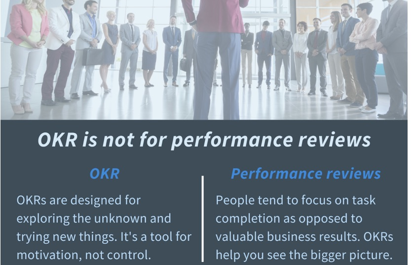

در دنیای پویای توسعه محصول، تیم‌ها همواره با چالش تعیین اهداف واضح، قابل اندازه‌گیری و همسو کردن تلاش‌ها برای دستیابی به آن‌ها روبرو هستند. چگونه می‌توان مطمئن شد که همه اعضای تیم در یک جهت حرکت می‌کنند و بر مهم‌ترین اولویت‌ها تمرکز دارند؟ یکی از چارچوب‌های قدرتمند و محبوب برای پاسخ به این چالش، **OKR** یا **اهداف و نتایج کلیدی (Objectives and Key Results)** است. اما **OKR چیست** دقیقاً و چگونه می‌تواند به رشد و موفقیت محصول شما کمک کند؟

در این مقاله، به طور کامل بررسی خواهیم کرد که **OKR چیست**، چه مزایایی برای تیم‌های محصول دارد، چگونه می‌توانیم به **تنظیم OKR** مؤثر بپردازیم و چند **مثال OKR برای محصول** را با هم مرور خواهیم کرد.

## OKR چیست؟ تشریح اهداف و نتایج کلیدی

**OKR** یک چارچوب هدف‌گذاری مشارکتی است که به افراد، تیم‌ها و سازمان‌ها کمک می‌کند تا اهداف چالش‌برانگیز و بلندپروازانه‌ای را تعیین کرده و پیشرفت خود را به سمت آن‌ها اندازه‌گیری کنند. این چارچوب توسط اندی گروو در اینتل معرفی شد و بعدها توسط گوگل به شهرت جهانی رسید و اکنون توسط شرکت‌های موفق بسیاری در سراسر جهان استفاده می‌شود.

یک OKR از دو بخش اصلی تشکیل شده است:

1. **هدف (Objective):**
    - **چیستی:** هدف، یک بیانیه کیفی، الهام‌بخش و به‌یادماندنی است که مشخص می‌کند "چه چیزی" می‌خواهیم به دست آوریم. اهداف باید قابل توجه، ملموس، عمل‌محور و ترجیحاً انگیزاننده باشند.
    
    - **مثال:** "ارائه بهترین تجربه کاربری موبایل در صنعت خودمان."

3. **نتایج کلیدی (Key Results):**
    - **چیستی:** نتایج کلیدی، معیارهای کمی و قابل اندازه‌گیری هستند که نشان می‌دهند "چگونه" متوجه می‌شویم که به هدف خود رسیده‌ایم یا چقدر به آن نزدیک شده‌ایم. برای هر هدف معمولاً ۲ تا ۵ نتیجه کلیدی تعریف می‌شود. نتایج کلیدی باید مشخص (Specific)، قابل اندازه‌گیری (Measurable)، قابل دستیابی (Achievable)، مرتبط (Relevant) و دارای محدودیت زمانی (Time-bound) باشند (به نوعی SMART هستند).
    
    - **مثال برای هدف بالا:**
        - افزایش امتیاز رضایت کاربران اپلیکیشن موبایل از ۳.۵ به ۴.۵ (از ۵) تا پایان فصل.
        
        - کاهش نرخ خروج کاربران از اپلیکیشن موبایل به میزان ۲۰٪.
        
        - افزایش تعداد دانلودهای روزانه اپلیکیشن به ۱۰۰۰ عدد.

نکته مهم این است که OKRها بر _نتایج_ تمرکز دارند، نه صرفاً _فعالیت‌ها_ یا وظایف (Initiatives/Tasks). وظایف، کارهایی هستند که برای دستیابی به نتایج کلیدی انجام می‌دهیم.

## چرا OKRها برای رشد محصول مهم هستند؟

استفاده صحیح از چارچوب OKR می‌تواند تأثیرات مثبت قابل توجهی بر رشد و توسعه محصول شما داشته باشد:

- **تمرکز و همسویی (Focus and Alignment):** OKRها به تیم محصول (و کل سازمان) کمک می‌کنند تا بر مهم‌ترین اولویت‌ها تمرکز کرده و تلاش‌های خود را در یک راستا همسو کنند. وقتی همه بدانند اهداف اصلی چیست، تصمیم‌گیری‌های روزمره نیز آگاهانه‌تر خواهد بود.

- **شفافیت (Transparency):** OKRها معمولاً در سراسر سازمان به اشتراک گذاشته می‌شوند. این شفافیت باعث می‌شود همه از اهداف یکدیگر مطلع باشند و درک کنند که چگونه کار آن‌ها به اهداف بزرگ‌تر کمک می‌کند.

- **مسئولیت‌پذیری (Accountability):** نتایج کلیدی قابل اندازه‌گیری، پیشرفت را برای همه شفاف می‌کند و تیم‌ها و افراد را نسبت به دستیابی به اهدافشان مسئولیت‌پذیرتر می‌سازد.

- **انعطاف‌پذیری و چابکی (Flexibility and Agility):** OKRها اغلب به صورت فصلی (Quarterly) تنظیم می‌شوند. این بازه‌های کوتاه‌تر به تیم‌ها اجازه می‌دهد تا بر اساس یادگیری‌ها و تغییرات بازار، سریع‌تر خود را تطبیق داده و اهدافشان را بازنگری کنند.

- **ایجاد انگیزه و تعهد (Motivation and Engagement):** تعیین اهداف چالشی اما قابل دستیابی (Stretch Goals) می‌تواند تیم‌ها را به تلاش بیشتر ترغیب کرده و حس موفقیت و مشارکت را در آن‌ها تقویت کند.

- **اندازه‌گیری پیشرفت به سوی اهداف بزرگ:** OKRها چشم‌اندازهای بزرگ و بلندمدت محصول را به گام‌های کوچک‌تر، قابل مدیریت و قابل اندازه‌گیری تبدیل می‌کنند.

## چگونه OKRهای مؤثر برای محصول تنظیم کنیم؟ (راهنمای تنظیم OKR)

**تنظیم OKR** یک فرآیند است که نیاز به دقت و مشارکت دارد. در اینجا مراحل و نکات کلیدی برای **تنظیم OKR** مؤثر برای محصول آورده شده است:

1. **رویکرد ترکیبی (از بالا به پایین و از پایین به بالا):**
    - OKRهای سطح بالای شرکت، جهت‌گیری کلی را مشخص می‌کنند. سپس تیم‌های محصول (و سایر تیم‌ها) OKRهای خود را به گونه‌ای تنظیم می‌کنند که به این اهداف کلان کمک کند. مهم است که تیم‌ها در تعریف OKRهای خود مشارکت داشته باشند تا احساس مالکیت بیشتری کنند.

3. **نوشتن اهداف (Objectives) الهام‌بخش و واضح:**
    - اهداف باید کیفی، مختصر، به‌یادماندنی و چالشی باشند.
    
    - باید به وضوح بیان کنند که تیم به کجا می‌خواهد برسد.
    
    - مثال: "ایجاد تجربه آنبوردینگ بی‌نظیر برای کاربران جدید."

5. **تعریف نتایج کلیدی (Key Results) قابل اندازه‌گیری و نتیجه‌محور:**
    - هر نتیجه کلیدی باید کمی باشد و موفقیت را به وضوح نشان دهد (از اعداد و درصد استفاده کنید).
    
    - بر _نتایج_ تمرکز کنید، نه _فعالیت‌ها_. (مثلاً "افزایش نرخ فعال‌سازی کاربران جدید به ۷۰٪" نتیجه است، اما "راه‌اندازی کمپین ایمیلی برای کاربران جدید" یک فعالیت است).
    
    - اطمینان حاصل کنید که معیارهای شما قابل ردیابی هستند.

7. **تعداد محدود OKR:**
    - سعی کنید برای هر بازه زمانی (مثلاً هر فصل) روی ۳ تا ۵ هدف اصلی تمرکز کنید. تعداد زیاد OKR باعث از بین رفتن تمرکز می‌شود.

9. **تعیین بازه زمانی (Timeframe):**
    - OKRها معمولاً برای یک فصل (سه ماه) تنظیم می‌شوند. این بازه به اندازه کافی طولانی است که بتوان به نتایج معناداری دست یافت و به اندازه کافی کوتاه است که بتوان چابکی را حفظ کرد.

11. **مرور و بازبینی منظم (Regular Review and Tracking):**
    - OKRها را نباید پس از تنظیم، رها کرد. پیشرفت به سمت نتایج کلیدی باید به طور منظم (مثلاً هفتگی یا دوهفتگی) بررسی شود. در پایان هر چرخه نیز باید به OKRها امتیاز داده و از یادگیری‌ها برای دوره بعد استفاده کرد.

13. **جدا کردن OKR از ارزیابی عملکرد فردی (اختیاری اما توصیه شده):**
    - برای تشویق تیم‌ها به تعیین اهداف چالشی و بلندپروازانه، بهتر است OKRها مستقیماً به ارزیابی عملکرد فردی و پاداش‌ها گره نخورند. هدف اصلی OKR، همسوسازی و رشد است، نه قضاوت افراد.

## مثال OKR برای محصول

در اینجا چند **مثال OKR برای محصول** آورده شده است تا درک بهتری از نحوه **تنظیم OKR** پیدا کنید:

**مثال ۱: بهبود تجربه آنبوردینگ (Onboarding) و فعال‌سازی کاربران جدید**

- **هدف (Objective):** ارائه تجربه ورود فوق‌العاده برای کاربران جدید و افزایش سریع فعال‌سازی آن‌ها در محصول.

- **نتایج کلیدی (Key Results):**
    1. افزایش نرخ تکمیل پروفایل کاربران جدید از ۴۰٪ به ۷۰٪ تا پایان فصل.
    
    3. کاهش نرخ پرش (Bounce Rate) کاربران جدید در صفحه داشبورد اولیه از ۵۰٪ به ۳۰٪ تا پایان فصل.
    
    5. افزایش تعداد کاربرانی که اولین اقدام کلیدی (Core Action) را در ۷ روز اول انجام می‌دهند از ۲۰۰ به ۵۰۰ کاربر تا پایان فصل.

**مثال ۲: افزایش تعامل (Engagement) کاربران با یک ویژگی خاص**

- **هدف (Objective):** تبدیل ویژگی "تحلیل پیشرفته گزارش‌ها" به یکی از پرکاربردترین و ارزشمندترین بخش‌های محصول برای کاربران حرفه‌ای.

- **نتایج کلیدی (Key Results):**
    1. افزایش تعداد کاربران فعال هفتگی (WAU) ویژگی "تحلیل پیشرفته گزارش‌ها" از ۵۰۰ به ۱۰۰۰ کاربر.
    
    3. افزایش میانگین تعداد گزارش‌های تولید شده توسط هر کاربر فعال این ویژگی از ۲ به ۴ گزارش در هفته.
    
    5. دریافت امتیاز رضایت حداقل ۴.۲ از ۵ برای این ویژگی در نظرسنجی فصلی کاربران.

**مثال ۳: آماده‌سازی برای عرضه موفق یک محصول جدید (MVP)**

- **هدف (Objective):** اطمینان از آمادگی کامل برای عرضه MVP محصول "مدیریت پروژه هوشمند" و ایجاد علاقه اولیه در بازار هدف.

- **نتایج کلیدی (Key Results):**
    1. جذب حداقل ۱۰۰۰ پیش‌ثبت‌نام (Early Adopter) باکیفیت تا یک هفته قبل از تاریخ عرضه.
    
    3. تکمیل و تست موفقیت‌آمیز تمام فیچرهای اساسی MVP طبق تعریف، دو هفته قبل از عرضه.
    
    5. آماده‌سازی و آموزش کامل تیم پشتیبانی و فروش برای پاسخگویی به سوالات مرتبط با MVP.

## اشتباهات رایج در تنظیم و پیاده‌سازی OKR

برای بهره‌برداری کامل از قدرت OKRها، از این اشتباهات رایج دوری کنید:

- **تنظیم OKRهای بیش از حد زیاد:** منجر به از دست رفتن تمرکز می‌شود.

- **تنظیم نتایج کلیدی که در واقع فعالیت هستند نه نتیجه (Task-based KRs):** به یاد داشته باشید، KRها باید خروجی و تأثیر را اندازه‌گیری کنند.

- **عدم پیگیری و مرور منظم پیشرفت:** OKRها بدون پیگیری بی‌فایده‌اند.

- **استفاده مستقیم از OKRها برای ارزیابی عملکرد فردی و پاداش:** این کار باعث می‌شود افراد اهداف محافظه‌کارانه‌تری انتخاب کنند.

- **"تنظیم کن و فراموش کن":** OKRها باید بخشی از فرهنگ و گفتگوی روزمره تیم باشند.

- **اهداف بیش از حد محافظه‌کارانه یا بیش از حد بلندپروازانه و غیرقابل دسترس:** باید تعادل مناسبی پیدا کرد.

## نتیجه‌گیری: OKR، سوخت رشد مداوم محصول شما

پاسخ به سوال "**OKR چیست؟**" نشان می‌دهد که این چارچوب چیزی فراتر از یک ابزار هدف‌گذاری ساده است؛ OKR یک فرهنگ و یک سیستم برای ایجاد تمرکز، شفافیت، همسویی و مسئولیت‌پذیری در تیم محصول شماست. با **تنظیم OKR** به صورت صحیح و پیگیری مستمر آن، می‌توانید موتور رشد محصول خود را روشن نگه دارید و به طور مداوم به سمت اهداف بزرگ‌تر حرکت کنید.

اگر تاکنون از OKR استفاده نکرده‌اید، توصیه می‌کنیم به سادگی شروع کنید، از اشتباهات خود بیاموزید و فرآیند را در تیم خود بهینه کنید. قدرت واقعی OKR در اجرای مداوم و تعهد به آن نهفته است.

**آیا شما از OKR در تیم محصول خود استفاده می‌کنید؟ تجربیات، چالش‌ها و موفقیت‌های خود را در مورد تنظیم OKR و مثال OKR برای محصول با ما و دیگر خوانندگان در بخش دیدگاه‌ها در میان بگذارید.**

مطالعه بیشتر: [https://www.whatmatters.com/faqs/okr-meaning-definition-example](https://www.whatmatters.com/faqs/okr-meaning-definition-example)

* * *

اهداف و نتایج کلیدی (OKR) یک چارچوب تفکر انتقادی و روش تعیین هدف است که به شرکت ها کمک می کند تا اهداف را هماهنگ کرده و اطمینان حاصل کنند که همه به طور مشترک روی اهدافی کار می کنند که واقعاً مهم هستند.

OKRها را می توان با استفاده از صفحات گسترده (spreadsheets)  یا معمولاً با یک نرم افزار OKR پیاده سازی کرد.

روش OKR یک فرآیند ساده برای تنظیم و همسویی اهداف شرکت و تیم (اهداف واقعگرایانه) و اتصال هر هدف با 3-5 نتیجه قابل اندازه گیری (نتایج کلیدی) برای اندازه گیری پیشرفت است‌‌‌‌‌‌‌‌‌‌‌‌‌‌‌‌.

 به عنوان مثال ، _\_\_\_\_\_ را از X به Y افزایش دهید._ _\_\_\_\_\_\_  را تا  X  درصد کاهش دهید._   _\_\_\_\_\_ را تا X  درصد  بهبود دهید‌._ نتایج کلیدی را می توان در مقیاس ۰ تا ۱۰۰ درصد  یا هر واحد عددی اندازه گیری کرد (به عنوان مثال: مقدار دلار ،٪ ، اقلام و غیره .

با پیشرفت در هر نتیجه کلیدی ، پیشرفت در هدف در مقیاس ۰ تا ۱۰۰ درصد به جلو حرکت می کند. اهداف نیز به وسیله ابتکارات و فعالیتهای هفتگی شما (طرحهایی) که برای پیشبرد پیشرفت یک هدف انجام می دهید پشتیبانی می شوند. برنامه ها باید به صورت هفتگی ایجاد شوند و با اهداف شما مرتبط شوند.

#### **مثالهایی از OKRها**

اکنون که درک بهتری از آنچه که یک OKR خوب را ایجاد می کند ، داریم، اجازه بدهید  چند مثال را اجرا کنیم و ببینیم چه چیزی خوب است یا چه چیزی می تواند بهبود یابد.

**مثال ۱:  
هدف:  وایرال کردن شرکت**

نتایج کلیدی:

1.    ۱۰۰،۰۰۰  بازدید در کانال یوتیوب ما ایجاد کنید

3.   ۱۰،۰۰۰  دنبال کننده جدید در اینستاگرام دریافت کنید

5. افزایش ترافیک جستجوی ارگانیک به وب سایتمان تا ۲۰ درصد

این نمونه خوبی از OKR است. هدف آرمانی است و شرکت را به سمت جلو سوق می دهد در حالی که KR عددی است و موفقیت هدف کلی را از نظر کمی تعیین می کند. نتایج کلیدی نامناسب برای این هدف می تواند شامل موارد زیر باشد :

نتایج کلیدی نامناسب: 

1. برای یوتیوب فیلم بسازید ،

3. دنبال کنندگان اینستاگرام بیشتری دریافت کنید

5. ‌‌SEO را بهبود ببخشید

**مثال ۲:**

**هدف:  طراحی ، ایجاد و راه اندازی محصول جدید**

نتایج کلیدی:

1. با 50 مشتری موجود در مورد آنچه که می خواهند برای یک خط تولید جدید ببینند مصاحبه کنید

3. محصول جدید ایجاد کنید

در این حالت OKR می تواند از برخی کارها استفاده کند. دستیابی به هدف احتمالاً در یک کوارتر زمانی ممکن نیست. و گرچه اولین KR که در این مثال آمده خوب است ، نتیجه دوم قابل اندازه گیری نیست.

**مثال ۳:**

**هدف: پیاده سازی کمپین ایمیل خروجی جدید**

نتایج کلیدی: 

1. کپی ایمیل را برای ارسال به لیدهای خروجی ، بنویسید

3. لیستی از لیدهای خروجی را دریافت کنید

5. برای همه افراد موجود در لیست ایمیل ارسال کنید 

متاسفانه این یک OKR محسوب نمی شود بلکه یک پروژه با لیست وظایف است. به یاد داشته باشید اهداف ، بزرگ و آرمانی هستند و KR نیز اندازه گیری کمی آن هدف است.استفاده از OKR را در رکت خود شروع کنید

هدف گذاری چیست؟ OKR ها به عنوان یک روش تعیین هدف عمل می کنند. اما قبل از اینکه به عمق بیشتری به آنها بپردازید ، باید واقعاً بدانید که اصطلاح "هدف" در واقع به چه معناست. 

احتمالاً اصطلاحات مختلفی مانند golals ، targets ، OKR ها و معیارهای شاخص های کلیدی عملکرد (KPI)  را شنیده اید. در بسیاری از موارد ، این اصطلاحات با هم تلفیق می شوند. هر یک از آنها باید تعریف شود تا واقعا هیچ سردرگمی وجود نداشته باشد

### Goals (اهداف)‌‌ چیست؟

Goals در یک کسب و کار مواردی است که شرکت قصد دارد در آینده به آن دست یابد. یک Goal نتیجه ای است که می خواهید بدست آورید. در هسته اصلی آنها ، Goals کاملاً مربوط به تعهد است.  به  کسب و کار جهت می دهند و به شما کمک می کنند تا روی موارد مهم تمرکز کنید. 

Goals می توانند کلان (جهت دار) باشند و روی بزرگترین اهداف شرکت‌،تمرکز کنند، یا عملیاتی باشند و بر اولویت های سطح تیم ویژه‌عملکرد تمرکز کنند. بسته به سطح، اهداف نیز می توانند بر اساس نیازهای توسعه‌،جایگاه‌های خاصی را داشته باشند. 

اهداف باید توسط همه افراد شرکت شناخته شود و ابتکارات برنامه ریزی شده باید به تیم شما کمک کند تا به سمت آن اهداف برود. 

### Goals در مقابل Objectives

مرز بین Goals و Objectives به قدری نازک است که اساساً وجود ندارد. هر دو نماینده یک نتیجه یا دستاورد مطلوب هستند. نظریه های مختلفی وجود دارد که می گویند Goals معمولاً بلند مدت تر هستند و تصویر کلی را پوشش می دهند و Objectives مشخص‌تر،عملی‌تر و کوتاه مدت‌تر است.

تفکیک Goals از Objectives ممکن است مربوط به برخی از روشهای تعیین هدف باشد اما قطعاً در هنگام استفاده از OKR نیازی به آن نیست. ما در اینجا هردو را یکی درنظر میگیریم!  تلاش برای جداسازی این دو اصطلاح در واقع ارزشی برای شما ندارد ، پس چرا باید خود را به زحمت بیاندازید.

**Goals** **(اهداف)‌‌‌** **چه چیزی نیستند**

#### شاخص‌ها/ KPI و targets چیست؟

**KPI ها** و شاخص ها و targets اصطلاحات مهمی برای درک چگونگی عملکرد شرکت شما هستند.KPI  و شاخص‌ها‌، سنجه‌های کسب‌و‌کارهستند و معنی یکسانی دارند . این سنجه‌های نشان دهنده عملکرد شرکت است. 

ردیابی KPI  شرکت به شما کمک می کند بفهمید آیا این شرکت در وضعیت سالمی به سر می برد یا نه. این که تعیین کنید چه مواردی را باید در شرکت خود اندازه گیری کنید حائز اهمیت است. بسته به کاری که شرکت شما انجام می دهد، نرخ ریزش ،MQL ، NPS  و‌غیره را می توان به عنوان KPI در نظر گرفت. 

**targets** ، سطوح عملکردی هستند که برای   شاخص‌ها/ KPI خود تعیین می کنید. به عنوان مثال ، نیروهای فروش می توانند target خود را برای تعداد جلسات مشتری در ماه تعیین کنند. در حالی که شاخص،عددی است که آنها در واقع بدست آورده اند.

**تفاوت بین Goals و KPI و targets** این است که Goals چیزی است که شما می خواهید به آن برسید ، در حالی که  KPIنشان دهنده این است که شما کجا هستید و اینکه برای ادامه کار شرکت روزانه به چه تعداد از اهداف باید برسید. 

اگر KPI های شرکت عملکرد خوبی دارند نیازی به انجام اقدامات اضافی درباره آنها نیست‌‌‌‌‌‌ . ٰ Goals چیزهایی هستند که در کانون توجه قرار دارند و همه اقدامات مختلف برای دستیابی به آن چیزها هستند‌. KPI  و targets نشان دهنده وضعیت فعلی هستند ، در حالی که Goals شما را به سمتی هدایت می کنند که می خواهید بروید. 

همچنین می توان برای مسیر استراتژیک شرکت Goals تعیین کرد. این بدان معناست که Goals از KPI حاصل می شوند که targets  خود را برآورده نمی کنند یا از تصمیمات استراتژیک (یعنی گسترش به یک کشور / منطقه جدید ، یا تصمیم گیری در مورد تمرکز شرکت برای تمایز) حاصل می شوند.  

**اهداف (****Goals****)‌‌‌‌ شما مشخص شده است ، بعدی چیست؟**

**اهداف (Goals)‌‌‌‌** توسط برنامه ها پیش می روند. اگر اهداف (Goals)‌‌‌‌ به سوال "کجا" پاسخ دهند ، سپس ابتکار عمل قسمت‌‌‌"چگونگی" است. ما دوست داریم از اصطلاح ابتکارات استفاده کنیم ، اما شما ممکن است از اصطلاحات مختلفی مانند - برنامه ها ، وظایف ، اقدامات (کلیدی) ، پروژه ها و غیره استفاده کنید.

اهداف قطعاً فقط لیستی از ابتکارات نیستند زیرا تکمیل آن به معنای این نیست که خروجی همان است که انتظار می رفت‌‌‌‌‌‌‌.

ابتکارات از این جهت مهم است که اگر بر اهداف خود تمرکز نکنید و برنامه ای برای چگونگی دستیابی به آنها نداشته باشید ، احتمال شکست شما بسیار زیاد است. هر زمان که اهداف شما رو به جلو نیستند ، باید کاری را که انجام می دهید تغییر دهید یا ابتکارات جدید را امتحان کنید.

 زمانی که شما در حال تلاش برای رسیدن به ارتفاعات جدیدی هستید،‌‌داشتن یک آمادگی و ذهنیت باز برای تغییر روش ها یا امتحان چیزهای جدید در شرکت شما بسیار مهم است‌.

**OKR** **ها چه چیزی نیستند** **...**

اکنون که به درک معیارها ، KPI ها و اهداف (Goals)‌‌‌‌ رسیده اید ، بیایید بررسی کنیم که OKR چه چیزی نیست. OKR ها KPI نیستند.

OKR ها KPI نیستند.

**KPI** **ها (شاخص های کلیدی عملکرد)** اغلب برای تعیین اهداف درآمدی ، انتظارات مربوط به رشد یا عملکرد (تعداد معاملات بسته شده ، بازدید از وب سایت ، کاربران فعال روزانه ، تعداد مشتریان پرداخت کننده جدید ، LTV مشتری و غیره) استفاده می‌شوند. بنابراین بیایید بگوییم شما می خواهید در طی سه ماه ۱۰۰،۰۰۰ دلار درآمد کسب کنید که نسبت به سه ماهه قبل ۳۰ درصد افزایش داشته است. این هدف KPI شماست.

اما فقط خواب اعداد را دیدن کارساز نخواهد بود ، بنابراین برای رسیدن به این تعداد به چه چیزی برای بهبود ، اصلاح یا نوآوری در کار خود نیاز دارید و مرتباً چه چیزی را اندازه گیری می کنید تا بدانید آیا در حال پیشرفت هستید یا نه‌‌‌‌‌‌؟ این می تواند روی نتایج عینی و کلیدی شما متمرکز باشد.

با استفاده از OKR ها یک منطقه برای بهبود یا مشکلی برای حل تعیین می کنید و نتایج کلیدی را که پیشرفت شما را به سمت هدف اندازه گیری می کند تعیین می کنید. نوشتن [نتایج کلیدی](https://weekdone.com/resources/outputs-vs-outcomes) قابل اندازه گیری که می توانید بطور منظم ، ترجیحاً به صورت هفتگی به روز کنید ، مهم است. 

نگران نباشید ، شما اولین کسی نیستید که در مورد تفاوت بین [OKR و KPI گیج شده است](https://weekdone.com/okr-comparison/okr-vs-kpi) .

**OKR**  **یک چارچوب جدید برای سازماندهی هر کاری که شما انجام می دهید نیست**

در یک تلاش برای قرار دادن همه در یک جهت و متمرکز کردن توجه همه به چیزی که بیشترین اهمیت را دارد ، ممکن است سازماندهی _همه کارهایی که_ تیم ها انجام می دهند با نگاه سلسله مراتبی مسئولیت های شغلی ، وسوسه انگیز باشد .

 این دیدگاه سلسله مراتبی معمولاً یک ساختار آبشار از خروجی های آبشار (معروف به وظایف ، فعالیت ها) و اهداف KPI است. و اینها OKR نیستند.

از آنجا که قرار است OKR ها هماهنگی و بهره وری بالاتری را برای تیم ها به ارمغان بیاورند ، شرکت ها تصمیم می گیرند وظایف آبشار (خروجی) خود را OKR بخوانند و زحمت تغییر روش کار را ندارند. 

توجه داشته باشید که اگر طرز فکر خود را در مورد اهداف تغییر ندهید ، تیم های شما قبل از شروع به کار،به نام OKR ، همان کاری را که تا به حال انجام می دادند‌،ادامه می دهند. و تنها تفاوت در این است که اکنون آنها نمایشی سلسله مراتبی از وظایف و اهداف KPI خود دارند. این روش چیزی را در وضعیت فعلی کسب و کار شما تغییر نمی دهد.

##### **_بنابراین چه تفاوتی بین کارعملیات معمول و_** **_OKR_** **_وجود دارد؟_** 

هر تیم (یا دپارتمان) در شرکت شما وظیفه و مسئولیت های خود را بر عهده دارد تا کسب و کار شما شکست نخورد. اینها برنامه های کاری و اهداف هفتگی / ماهانه / سه ماهه / سالانه است که تحت شرح شغل آنها قرار می گیرد ، همان سناریو پایه  (BAU ( که شامل هر کاری ست که تیم برای _حفظ_ کارایی و دستیابی به اهداف KPI انجام می دهد. 

BAU  برای یک تیم فروش ، ،‌‌ برقراری تماس ، ارسال ایمیل و ملاقات با مشتریان و غیره است. برای بازاریابی، BAU می‌تواند انتقال ارزش محصول شما برای جذب خریداران بالقوه باشد. 

برای تولید ، حفظ کارایی در هر مرحله از چرخه تولید است. تا زمانی که به حفظ چیزهایی که در حال حاضر هستید یا دارید مربوط می شود ، این همان سناریو پایه  (BAU ( است. اگر به دنبال تغییر ، رشد و بهبود آنچه درحال حاضر دارید‌، هستید ، این وظیفهOKR ها است.  

اگر اوضاع خوب باشد ، حفظ کارایی بسیار مهم است و اگر قصد افزایش درآمد یا بهبود روندهای داخلی خود را ندارید ، اهداف  و برنامه‌های  BAU معمولاً کافی است. 

با این حال ، اگر اوضاع خوب خوب نیست یا اگر شما نیاز به پیشرفت را تشخیص می دهید ، باید به این فکر کنید که چه چیزی نیاز به اصلاح دارد ، یا چه چیزی می تواند تغییر کند یا چه نوع فرصت های جدیدی را می توانید دنبال کنید. اینجاست که به OKR ها مراجعه می کنید. 

در روش OKR ، هدف شرکت مرکز تمرکز برای یک کوارتر - یا یک مشکل برای حل و یا یک چالش کاملا جدید برای انجام است. هدف آن ارائه جهت و توضیح آرزوهای شما است. هر تیم در سازمان می‌تواند اهداف خاص خود را (معمولاً 1 و حداکثر 3 برای هر تیم) برای رسیدن به  هدف اصلی شرکت داشته باشد.

 بنابراین ، نوشتن اهداف برای OKR نیاز به تجزیه و تحلیل و درک وضعیت فعلی کسب و کار شما دارد: چه چیزی باعث دردسر شما می شود ، چه چیزی می تواند بهبود یابد یا تغییر کند ، یا اینکه برای شروع چه کاری لازم است؟

**OKR  ابزاری برای مدیریت عملکرد نیست** 

OKR  روشی آینده نگرانه برای تعیین هدف است که به کار گروهی و پاسخگویی دامن می زند. اما اگر می خواهید همکاری بیشتری داشته باشید و تیم هایتان واقعاً در کارشان سرمایه گذاری کرده باشند ، هرگز نباید از OKR برای مدیریت عملکرد شخصی استفاده کنید.

OKR ها برای کاوش در موارد ناشناخته و تعقیب امکاناتی که ممکن است شما را در آینده ای بهترقراردهد طراحی شده اند.OKR ها برای سازماندهی مسئولیت های شغلی معمول نیستند.

بررسی عملکرد هم برای مدیران و هم برای کارمندان استرس آور است ، بنابراین،این موارد اغلب نادیده گرفته می شوند یا به صورت سطحی انجام می شوند.

 و از آنجا که آنها معمولاً به صورت 1: 1 سازماندهی می شوند ، مردم تمرکز خود را روی تکمیل وظایف قرار می دهند و به تصویر بزرگتر توجهی نمی شود. اگر دوست دارید کسب‌و‌کار خود را بهبود بخشیده و رشد دهید ، بررسی عملکرد کافی نیست. 

بعضی از شرکت ها بررسی عملکرد شخصی را کاملاً رد کرده اند زیرا آنها آموخته اند که چگونه تیم ها را بر روی نتایج مورد نیاز سازمان متمرکز کنند. وقتی این نتایج به اندازه کافی مشخص و واضح باشد و انگیزه کافی هم داشته باشند ، تیم ها تصمیم گیری بهتری را در مورد اولویت بندی اهداف و مدیریت وقت خود انجام می دهند.

OKR  برای مدیریت عملکرد طراحی نشده است و شما نباید فکر کنید که می توانید به نوعی این روش را برای رسیدن به این هدف تنظیم کنید. درعوض ، شما باید یاد بگیرید که چگونه از هوش جمعی تیم های خود استفاده کنید و به آنها کمک کنید تا روی نتایج مورد نیاز سازمان متمرکز شوند .

**OKR**  **یک الگو نیست** 

به نظر می رسد بسیاری از مردم تصور می كنند كه OKR پایگاه داده ای از پاسخ های آماده است و اگر صنعت یا حوزه كاربردی خود را مشخص كنید می توانید به سادگی OKR های مناسب را از لیست انتخاب كنید. 

این تقریباً یک تئوری توطئه را پیشنهاد می کند: گویی برخی از شرکت ها به این پایگاه داده دسترسی دارند و برخی دیگر این امکان را ندارند. مطمئن باشید ، چنین پایگاه داده ای وجود ندارد. با این وجود ، قدرت دانش و هوش انسان وجود دارد و خوشبختانه شما می توانید یاد بگیرید که چگونه OKR های خوبی بنویسید.

نمونه بسیاری از OKR ها در اینترنت وجود دارد که می توانید از آنها به عنوان مرجع و منبع الهام استفاده کنید. مشکلی ندارد اما مسئله این است که بسیاری از این مثالها خارج از متن هستند ، بسیار گسترده هستند و احمقانه است که تصور کنیم بلافاصله در کسب‌و‌کار شما کار می کنند. 

هیچ کس بهتر از شما کسب‌و‌کار شما را نمی داند بنابراین هیچ کس واقعاً نمی تواند به شما بگوید که باید روی چه چیزی تمرکز کنید. 

خبر خوب این است که اگر می‌خواهید کسب‌و‌کار خود را بهبود ببخشید و طرز فکر خود را در مورد روند تعیین هدف تغییر دهید ، مطمئناً موفق خواهید شد. هروقت تمایلی هست، راه رسیدن به آن هم هست. 

در یک روز نمی توانید یک جهش 10 برابری به نتیجه بهتر داشته باشید. شما باید چرخه های یادگیری ، تجزیه و تحلیل و بهتر شدن در آن را طی کنید. این درست مثل به دست آوردن ساختار عضلانی است: شما باید هر روز کمی کار کنید تا بتوانید وزنه برداری را انجام دهید و در المپیک شرکت کنید. 

برای استفاده از هوش جمعی تیم های خود ، باید هنگام تنظیم و بررسی OKR های سه ماهه خود ، بحث های معنی داری داشته باشید.

### مزایای OKR ها

OKR  به شما امکان می دهد مهمترین اهداف سازمان خود را به صورت سازمان یافته ، متمرکز و شفاف تنظیم کنید و به آنها انتقال دهید‌. به خصوص  اگردر رسیدن به اهداف و بهره وری مشکلی دارید OKR می تواند مفید باشد یا اگر تیمتان در حال رشد باشد‌، روش های قدیمی شما دیگر باعث کاهش آن نمی شوند‌.

مهم نیست که OKR  نقطه شروع شما باشد ، مزیت اصلی استفاده از OKR ها،یک شرکت واحد است که در آن همه دقیقاً می دانند که چه کاری باید انجام دهند وبرای انجام آن احساس انگیزه می کنند.

### شروع کار با  OKR

ساختار اولیه OKR نسبتاً ساده است. می توانید OKR ها را در یک صفحه گسترده یا نرم افزار ویژه OKR تعریف کنید. برای شروع این 5 مرحله را دنبال کنید.

**۱.  اهداف خود را تعیین کنید**

همانطور که شروع به تنظیم اولین OKR ها می کنید با تعیین یک هدف برای شرکت خود شروع می کنید.  (همانطور که با استفاده از OKR راحت تر می شوید ، می‌توانید اهداف بیشتری اضافه کنید ، اما هرگز بیش از ۵ تا تعیین نکنید.)

این هدف را برای تیم های کاربردی خود (مثلاً توسعه محصول ، بازاریابی ، فروش و غیره) ابلاغ کرده و توضیح دهید و از تیم ها بخواهید اهداف خود را مطابق با هدف شرکت تنظیم کنند. هر تیم باید فکر کند که چگونه می تواند به پیشبرد اهداف شرکت کمک کند.

به یاد داشته باشید ، اهداف باید بلند پروازانه ، کیفی ، دارای محدودیت زمان و قابل اجرا باشند.

**۲. نتایج کلیدی خود را تعریف کنید**

تحت هر مجموعه تیم ۳-۴ نتیجه اصلی قابل اندازه گیری تنظیم شده است‌. وظیفه نتایج کلیدی ‌، اندازه گیری میزان نزدیک شدن شما به هدف تیم است. اهداف شرکت نیازی به نتایج کلیدی ندارند زیرا این اهداف توسط OKRهای تیم به جلو منتقل می شوند.

نتایج کلیدی قابل اندازه گیری را می توان به روش های مختلف تنظیم کرد:

- _\_\_\_\_\_\__ _را از_ _X_ _به_ _Y_ _افزایش دهید_

- _\_\_\_\_\_\__ _را با_ _X__٪ کاهش دهید_

- _\_\_\_\_\_\__ _را تا_ _X__٪ بهبود دهید_

با حرکت سوزن روی نتایج کلیدی ، شما هدف را به جلو هدایت می کنید. نتایج کلیدی می تواند بر اساس رشد ، عملکرد ، درآمد یا تعامل باشد.

۳**.** **OKR** **های خود را به روز کنید**

اگرچه باید OKR های تیمی را به صورت فصلی تنظیم کنید ، اما مهم است که هر هفتهOKR‌ های خود بررسی کنید. به این ترتیب می توانید اطمینان حاصل کنید که اهداف خود را دنبال می کنید و در صورت لزوم به اعضای تیم بازخورد می دهید.

**۴. فعالیت های خود را برنامه ریزی کنید**

همچنین مهم است که OKR را در فعالیتهای هفتگی خود بگنجانید. هر هفته به این فکر کنید که برای رسیدن به این اهداف باید روی چه پروژه ها و برنامه هایی تمرکز کنید و آنها را بنویسید. از این طریق می توانید ببینید که چگونه همه تلاش‌هایتان به شما در رسیدن به اهداف خود کمک می کند. شاید لازم داشته باشید برای برنامه ریزی بهتر از [روش‌های اولویت بندی بک لاگ](https://theminiceo.ir/product-articles/8-different-ways-to-organize-backlog/) استفاده کنید.

۵**.** **OKR** **های خود را مرور کنید**

در پایان هر کوآرتر ، هر تیم باید به انجام OKR های خود نگاه کند. ببینید چه کاری را خوب انجام داده اید و چه چیزهایی را می توانید اصلاح کنید. از آنجا می توانید برنامه ریزی برای OKR های بعدی تیم خود را شروع کنید.

در کل شرکت ، شما باید در هر کوارتر ۲-۳ بار بررسی OKR داشته باشید تا افکار و دانش خود را به اشتراک بگذارید.

### نوشتن اهداف خوب

**چگونه یک هدف خوب برای OKR های خود می نویسید؟**

قبل از نوشتن OKR شما نیاز به درک خوبی از آنچه می خواهید به انجام برسانید دارید. ابتدا بر هدف خود تمرکز کنید. به اهداف بالقوه ای که می خواهید در این کوارتربه انجام برسانید فکر کنید و سوالات زیر را از خود بپرسید:

1. آیا این هدف به دستیابی به اهداف شرکت کمک می کند؟

3. آیا این هدف الهام بخش است؟

5. آیا این هدف ارزش تجاری فراهم می کند؟

7. آیا این هدف در یک چهارم سال واقعاً قابل دستیابی است؟

9. آیا این حل مسئله ای است که تیم ما با آن روبرو است؟

11. آیا این هدف فقط توسط ما قابل اجرا و دستیابی است؟

همچنین مهم است که اهداف را دنبال کنید:

**اهداف نباید آسان باشد.**

اگر کار خود را با OKR آغاز می کنید ، دستیابی به 100٪ هدف خود در هرکوآرتر بسیار عادی است‌.  این کاربه حمایت از روحیه تیم کمک می کند و به افراد انگیزه می دهد تا اهداف بلند پروازانه تری را در سه ماه آینده تعیین کنند.

اگر یک هدف به خوبی قبل از پایان کوآرتر محقق شود ، شما به اندازه کافی بزرگ فکر نمی کردید. و اگر به آن نزدیک نشدید ممکن است به جای آن یک هدف سالانه تعیین کرده باشید.

وقتی که با OKR ها راحت تر می شوید ، می خواهید آنها را بلند پروازانه تر کنید. وقتی ۶۵-۷۰٪  یک هدف بلندپروازانه را می زنید ، بازهم کاملاً یک موفقیت محسوب می شود! به همین دلیل شما باید انتظار داشته باشید که فقط ۲/۳ از هدف خود را در هر کوآرتربدست آورید.

**اهداف ،پروژه هایی با وظایف فرعی نیستند****.**

اهداف ، رویایی هستند‌. فعالیتهای یک بار مصرف نیستند که به عنوان وظیفه یا برنامه در نظر گرفته شوند.

بنابراین اگر می خواهیم برای افزایش درآمد شرکت یک هدف بنویسیم ، موارد زیر می‌تواند خوب باشد:

_در_ _Q3_ _میزان دسترسی محصول در آلمان را افزایش دهید_

این هدف کار می کند ، زیرا آرمانی است ، محدود به زمان است و به پیشرفت شرکت کمک می کند.

یک مثال از یک هدف نامناسب این خواهد بود:

_یک برنامه بازاریابی محصول، برای آلمان بنویسید_

این هدف نامناسب است زیرا محدود به زمان ، الهام بخش و آینده نگر نیست.

درباره اهداف ، همه چیز در مورد کیفیت  است. آنها باید نتیجه مطلوب را توصیف کنند. به عنوان مثال:  _درک نیازهای مشتری_ هدف خوبی است زیرا واضح و آرمانی است. برخلاف نتایج کلیدی ، شما نیاز ندارید اهداف قابل اندازه گیری باشند.

بخاطر داشته باشید که اهداف نیز باید به صورت فصلی یا سالانه محدود شوند. اگر اهداف سالیانه را تعیین می کنید ، باید آنها را به اهداف فصلی تقسیم کنید.

### تنظیم نتایج کلیدی

نتایج کلیدی میزان رسیدن شما به اهداف سه ماهه را اندازه گیری می کند. بعد از تجزیه و تحلیل اولویت های اصلی خود و تصمیم به تمرکز بر روی یک هدف خاص ، باید در مورد نتایج کلیدی خود تصمیم بگیرید. به یاد داشته باشید نتایج کلیدی روشی است که شما برای اندازه گیری هدف خود ارزیابی می کنید.

نتایج کلیدی باید مشخص ، قابل اندازه گیری (کمی) قابل دستیابی ، عملی ، با درجه بندی عینی و دشوار باشد اما غیرممکن نباشد.

**همچنین مهم است که به این فکر کنید که نتایج کلیدی چگونه نیستند****:**

**آنها باینری(جفتی) نیستند**.

نتایج کلیدی باید عددی باشد و در طول کوآرتر به روز شود. اگر نتیجه کلید شما باینری باشد ، ممکن است یک کار یا برنامه باشد و نه یک نتیجه کلیدی.،که ما را به سمت نقطه بعدی سوق می دهد.

**آنها وظایفی که باید تکمیل شوند نیستند**. 

در حالی که برنامه ها و پروژه _ها_ در حمایت از اهداف شما مهم _هستند_ ، نتایج کلیدی نتایج تجاری قابل اندازه گیری هستند و باید به همین روال با آنها رفتار شود.

چند مثال خوب از نتایج کلیدی برای هدف:  _افزایش دسترسی محصول در آلمان_ شامل موارد زیر است:

۱.افزایش نرخ ثبت نام آلمان به MQL از ۱۵ به ۲۰٪

۲. MQL های آلمان را از ۳۰۰ به ۵۰۰ افزایش دهید

۳. SQLهای آلمانی را از ۲۰۰ به ۳۰۰ افزایش دهید

این نمونه ها قابل اندازه گیری (کمی) هستند ، از نظر عینی درجه بندی می شوند و در عین حال چالش برانگیز هستند ، اما باید قابل دستیابی باشند.

**یک مثال از یک نتیجه کلیدی نادرست این است**:

_۱**. خط جدیدی از تجارت را راه اندازی کنید**_

این نتیجه کلیدی از نظر عددی قابل اندازه گیری نیست و از نظرعینی مشخص نیست که چگونه به هدف کمک می کند. این می تواند به عنوان یک پروژه در نظر گرفته شود ، یا می تواند در یک هدف جداگانه بازنویسی شود.

به یاد داشته باشید که اهداف رویاهای بزرگ هستند و KR یک اندازه گیری کمی از آن اهداف هستند. 

### فرآیند بررسی OKR

بدون بررسی های مداوم تیم ، دشوار است که بفهمید در مسیر خود هستید یا خارج از مسیر حرکت می کنید.

همانطور که S. Kierkegraad گفت: " فقط با نگاه  به گذشته می توان زندگی را درک کرد. اما باید روبه به جلو زندگی کرد. " این بدان معناست که برای اینکه بتوانیم تصمیمات خوبی درباره جهت گیری تیم و شرکت در آینده بگیریم و تمرکز کنیم باید کارهایی را که قبلاً انجام داده ایم و دستاوردهایی که داشته‌ایم را بررسی کنیم. 

بررسی های OKR در رده های مختلف و در سطوح مختلف انجام می شود:

- [چک هفتگی در](https://weekdone.com/resources/the-okr-weekly-check-in) سطح تیم.  بررسی های هفتگی OKR برای صحبت درباره پیشرفت و کارهایی که تا کنون انجام شده ،آنچه در مرحله بعدی انجام می شود و یا اگر احتمالا مشکلی پیش آمده باشد،می باشد.

- ماهانه در سطح تیم و / یا شرکت. خوب است که بررسی ماهانه داشته باشید تا تیم ها در مورد روال پیشرفت خود صحبت کنند و مطمئن شوید که همه به سمت اهداف سطح بالا حرکت می کنند.  

- [پایان بررسی سه ماهه](https://weekdone.com/resources/how-to-conduct-a-successful-quarterly-review) . این مهمترین سطح بررسی است و شامل بررسی جلسه سه ماهه OKR است. این جلسه ابتدا در سطح تیمی و سپس در کل شرکت برگزار می شود. اگر بررسی های ماهانه انجام شده باشد ، این می تواند خلاصه ای از آن بررسی ها باشد.

### OKR  و برنامه ریزی هفتگی و اعلام حضور

برنامه ریزی هفتگی روشی برای ردیابی فعالیت های هفتگی شرکت شما است. این یک بخش مهم از روند برنامه ریزی OKR است‌ که اغلب نادیده گرفته می‌شود. در کنار اهداف و نتایج کلیدی ، شما همچنین باید برنامه ها یا ابتکارات هفتگی خود را در ذهن داشته باشید و به این فکر کنید که کاری که هر هفته انجام می دهید چگونه  می‌تواند در دستیابی به اهداف بزرگتربه  شما کمک کند.

با اجرای برنامه ریزی هفتگی در کنار OKR ، می توانید مستقیما بفهمید که برنامه های سطح بالا هر هفته حاصل می‌شوند وارتباط آنها با اهداف بلند مدت شرکت را می بینید. این کار می‌تواند به عنوان جایگزینی برای جلسات استندآپ هفتگی با اعلام حضور ساده وسریع عمل کند. با این کار می توانید بدانید که در ابتدای هفته چه برنامه هایی تعیین شده است و در پایان هفته چه برنامه هایی انجام شده است.

برنامه ریزی هفتگی به تیم شما اجازه می دهد تا درحالیکه اهداف بلند مدت را در ذهن دارد، روی مهمترین برنامه ها متمرکز شود. موفقیت اهداف زمانی افزایش می یابد که برنامه ریزی هفتگی به طور فعال استفاده شود زیرا افراد مرتباً OKR های خود را بررسی و به روز می کنند.

### هم راستایی و پیوند دادن OKR ها

هم راستایی OKR ها  در فرآیند OKR کاملاً ضروری است. با این حال ، هم راستایی OKR های شما یکی از دشوارترین مفاهیم برای درک است.

هدف از هم راستایی OKR متحد کردن شرکت شما است تا تیم ها در یک جهت حرکت کنند. همه باید بدانند که چه اتفاقی می افتد و ارتباط آن با بزرگترین اهداف شرکت چگونه است.  هم راستایی هدف ،تئوری انجام این کار است ، نه اجرای عملی آن. 

هم راستایی OKR مستلزم آن است که شما واقعاً با ساختار شرکت خود و سطح تعیین اهداف آشنا باشید.

به عنوان یک قاعده ، اهداف را می توان در دو سطح اصلی تنظیم کرد: سطح شرکت (برای اهداف کلان جهت دار) و سطح تیم (برای اهداف عملی و نتایج کلیدی). داشتن سطوح اضافی  یا گروههای تیمی ممکن است برای شرکتهای بزرگترمنفعتی داشته باشد اما،برای شرکت های کوچک و متوسط ​​لازم نیست.

### بهترین روشها و نکات OKR

در حالی که ساختار OKR نسبتاً ساده است ، اما به این معنا نیست که اجرای آنها آسان است. معمولاً 2-4 کوآرتر طول می کشد تا شرکت ها از روش های صحیح ،استفاده از OKR را شروع کنند.  بهترین روشهای OKR  برای کوتاه کردن منحنی یادگیری را بیشتر بیاموزید:

**OKR** **های خوب را از ابتدا تنظیم کنید**

**قبل از شروع کوآرتر ،** **OKR** **ها را تنظیم کنید**

قبل از شروع کوآرترتنظیمات OKR خود را شروع کنید! این  امربه ویژه برای اهداف در سطح شرکت مهم است. OKR‌ ها می توانند زمان ، برنامه ریزی و توافق زیادی را صرف کنند (مخصوصاً اگر اولین بار است که آنها را تنظیم می کنید. بهتر است 2-4 هفته قبل از شروع کوآرتر برنامه ریزی را شروع کنید. به این ترتیب وقتی که شروع شود شما آماده اید.

**اهداف را بیان کنید**

اهداف را با بقیه شرکت در میان بگذارید و در مورد اهمیت آنها صحبت کنید. رهبران باید با هم ملاقات کرده و درباره OKR های تیم خود بحث کنند.

**OKR****‌** **های تیم را با اهداف شرکت هماهنگ کنید**.

غالباً وقتی صحبت از OKR می شود ، افراد با ارائه ایده های جدید هیجان زده می شوند. اما مهم است که فراموش نکنید چرا در وهله اول آنها را تنظیم می کنید: یکسان‌سازی! اطمینان حاصل کنید که اکثر OKR ها در سطح تیم به اهداف شرکتی هم راستا هستند. به این ترتیب همه در یک جهت واحد حرکت می کنند.

**از مثالهای** **OKR** **استفاده کنید**

روشهای غلط زیادی برای نوشتن OKR وجود دارد. وقتب تازه در حال یادگیری هستید ، خوب است که چند مثال برای مرجع داشته باشید. 

**OKR** **های خود را اجرا کنید**

**بررسی هفتگی را انجام دهید**

مهم است که فعالیتهای هفتگی خود را با اهداف خود هماهنگ کنید. این کاربه کارکنان کمک می کند تا هنگام کار با OKR ها درگیر شوند و اطمینان حاصل می کند که فعالیت های آنها به پیشرفت شرکت کمک می کند. می توانید اطلاعات بیشتر در این مورد را در بخش [برنامه ریزی هفتگی و اعلام حضورها](https://weekdone.com/resources/objectives-key-results#planningcheck) بخوانید .

**جلسات هفتگی تیم** **OKR** **را برگزار کنید**

تنظیم موارد هفتگی جدید و همچنین به روزرسانی KR‌های تیم مهم است. موارد هفتگی هر یک از اعضای تیم را بررسی کرده و از اتمام برنامه های آنها اطمینان حاصل کنید. در اینجا همچنین می توانید در مورد آنچه برای پیشبرد OKR های خود در هفته آینده باید انجام دهید ، توافق کنید. 

**OKR** **های خود را با شرکت خود بررسی کنید**

**بررسی کل شرکت در پایان کوآرتر**

در پایان کوآرتر بررسی های مربوط به شرکت را انجام دهید. مهم است که اطمینان حاصل کنید همه در فرایند بررسی شرکت می کنند. به این ترتیب همه می توانند ببینند تیم تا چه حد پیشرفت کرده است. 

**بررسی های** **OKR** **برای تیم ها**

تیم ها باید OKR های خود را بررسی کرده و هر درسی را که یاد گرفته اند یادداشت کنند. مدیران تیم باید این اطلاعات را تلفیق کرده و آنها را در بازبینی گسترده شرکت به اشتراک بگذارند.

**تنظیم** **OKR** **های بعدی**

همانطور که در بالا ذکر شد ، شما در حال حاضر باید برنامه ریزی برای OKR های کوآرترهای بعدی خود را 2-4 هفته قبل از شروع انجام دهید. با شروع برنامه ریزی ، به چگونگی عملکرد OKR های قبلی خود فکر کنید تا بتوانید در کوآرتر آینده از OKR ها به طور موثرتری استفاده کنید.

**اشتباهات معمول** **OKR**

**اهداف شما به اندازه کافی چالش برانگیز هستند یا چالش برانگیز نیستند**

ممکن است فکر کنید تیم شما که 100٪ اهداف خود را انجام می دهد عالی است! با این حال ، این در واقع می تواند به این معنی باشد که اهدافی بیش از حد آسان تعیین کرده اید. اهداف باید بلند پروازانه باشند ، اما نه آنچنان دشوار که کارمندان را تحت فشار قرار دهند تا به اهداف بیشتری برسند.

اگر اهداف را به انداره کافی بلندپروازانه تعیین کنید ، دستیابی به 70-80٪ از آنها می تواند موفقیت بزرگی باشد.

**تنظیم و فراموش کردن** **OKR** **ها**

شما باید پیشرفت نتایج کلیدی خود را مرتباً به روز کنید.OKR ‌ها هر هفته باید مورد بحث قرار گیرند. یک آیین هفتگی در اطراف OKR ها ایجاد کنید تا آنها را با تیم خود مرور کنید. در غیر این صورت ، در پایان کوآرتر، ممکن است متوجه شوید که از مسیر خارج شده اید.

**زیاد‌‌ بودن اهداف یا نتایج کلیدی**

اهداف یا نتایج کلیدی بیش از حد می توانند توجه شما را به اولویت ها کاهش دهند. تیم ها باید حداکثر 3 هدف در هر سه ماه با حداکثر 3-5 نتیجه کلیدی در هر هدف داشته باشند. به این ترتیب ، میزان کار بسیارزیاد،غیر قابل کنترل و بسیار گیج کننده خواهد بود.

**نتایج کلیدی شما قابل اندازه گیری نیستند**

نتایج کلیدی (KR) باید عددی باشد. آنها همان چیزی هستند که امکان پیگیری پیشرفت به سمت هدف شما را فراهم می کند. نتایج کلیدی به تعریف موفقیت کمک می کند و به شما کمک می کنند تا بفهمید چه زمانی می توانید بگویید "اوه ما خیلی خوب کار کردیم. KR هدف را هدایت نمی کند ، در حقیقت شما چگونگی موفقیت هدف را تعریف می کنید .

**نگه نداشتن تصویرهدف بزرگ در ذهن**

این مشکل زمانی ایجاد می شود که اهداف سطح تیم با اهداف شرکت مطابقت نداشته باشد. یا وقتی برنامه های هفتگی منفرد در دستیابی به اهداف تیم سهیم نیستند.

کارکنان باید درک کنند که چگونه فعالیت های آنها به اهداف تیم وهمچنین اهداف شرکت کمک می کند. هنگام ایجاد OKR حتماً جلسه ای تشکیل دهید تا بتوانید همه را در یک جهت واحد حرکت دهید.

منبع: https://weekdone.com/resources/objectives-key-results
