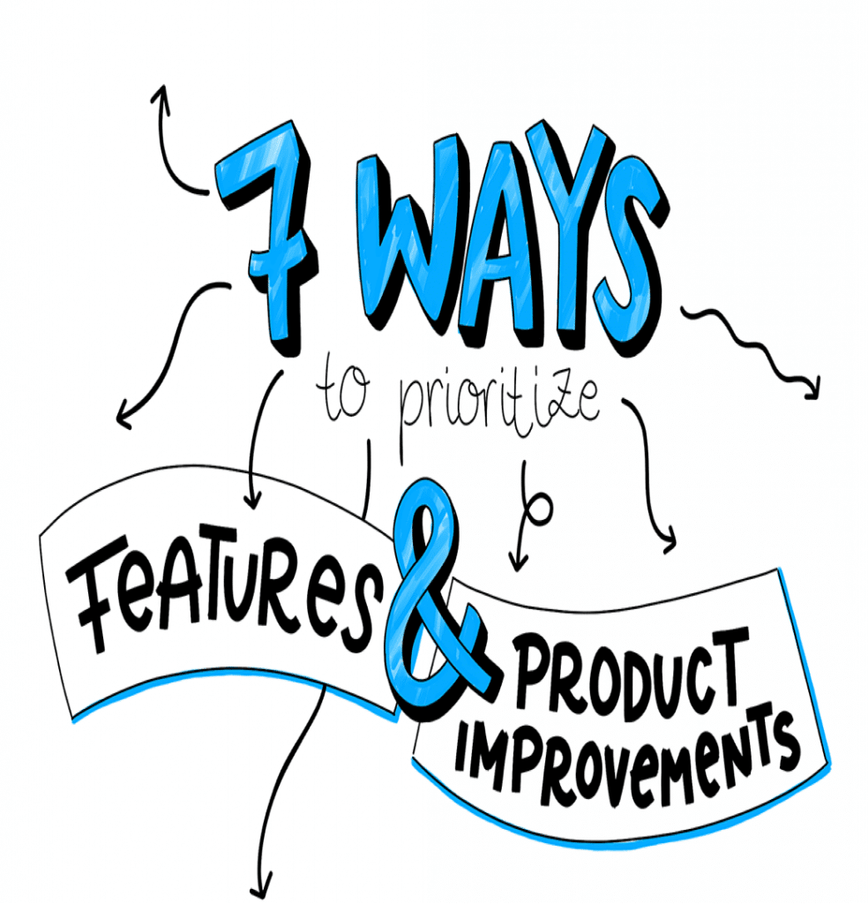
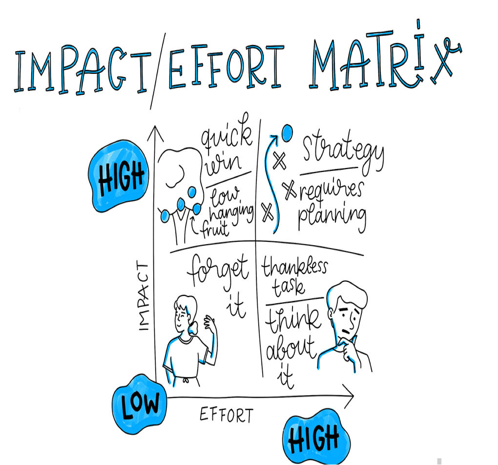
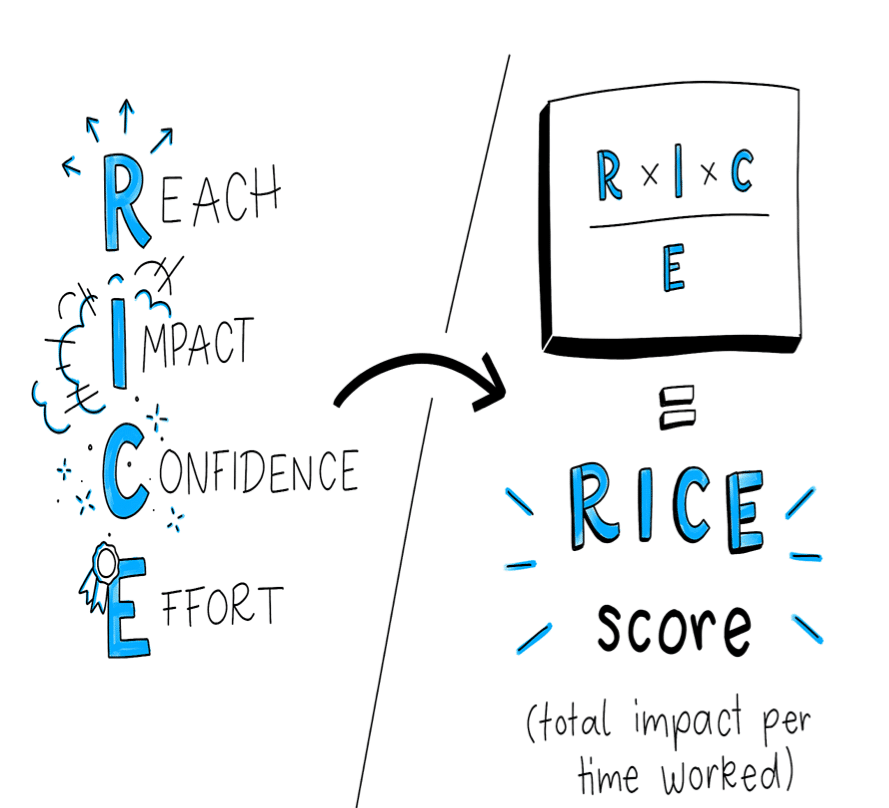
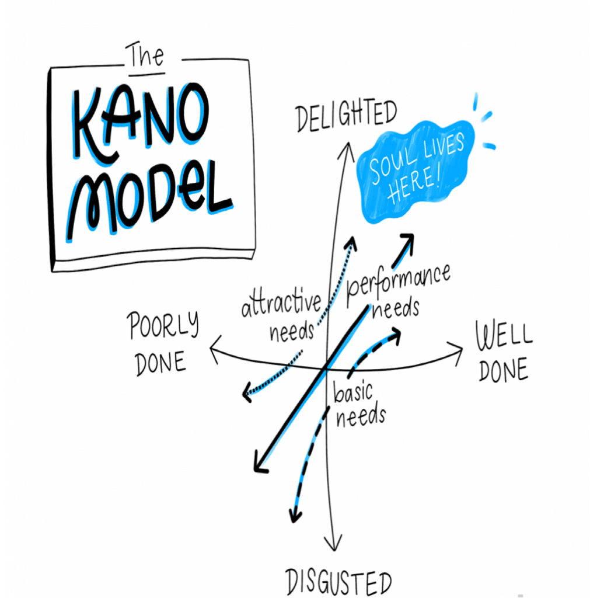

A limited number of companies fail because of a lack of good ideas. Meanwhile, choosing the wrong idea can sink your ship faster than hitting a mountain on a dark night. In fact, according to CB Insights (respected bodies that issue ISO standard certificates), [the number-one reason startups fail](https://www.cbinsights.com/research/startup-failure-reasons-top/) is that they built the wrong thing and there was no need for it in the market.

But that does not mean you should sit and *not* choose any feature or product to build. Choosing the right features to build means prioritizing the most important, most realistic, and most urgent items in current conditions from your long list of good ideas.

This is not a small, unimportant job. And most project managers agree that the hardest part of their work is deciding which feature deserves the team’s limited time, resources, money, and energy.

In this guide, we want to introduce you to all the factors that get in the way of prioritizing features, and then collect the best strategies for how to actually prioritize features in the best possible way.

What is in this article:

- **Prioritizing features starts with a shared vision and goal**
- **A few methods that do not lead to prioritizing features**
- **7 practical methods for prioritizing features**

             1. Put features into themes to avoid incomplete selection.

        2. Break product features down by feasibility, desirability, and viability.

        3. Score options on an effort / impact scale.

         4. Go deeper with the RICE method.

             5. Use a priority scorecard to score features based on custom criteria.

             6. Use the Kano method to prioritize features based on desire.

        7. Prioritize features based on constraints.

- **Final thoughts on prioritizing features**

**Prioritizing features starts with a shared vision and goal**

One of the hardest parts of prioritizing features is that decisions are not only about the product and often have a personal dimension. Every feature, angle, approach, and idea reflects someone’s effort and opinion.

This becomes even more complex when you are dealing with stakeholders with different levels of investment and control over a project.

Setting aside a UX designer’s idea for a different flow may not be that hard. But how do you not prioritize the CEO’s suggestion to move to a different framework?

Still, to succeed, prioritization cannot be personal. Keep in mind that you are not choosing someone’s idea over someone else’s idea. You are choosing the *right* feature for your company’s strategy and goals.

As Richard Banfield, author of *Product Leadership: How Top Product Managers Launch Great Products and Build Successful Teams*, writes:

If the team does not agree on the big picture, they certainly will not agree on a single feature.

Before you can discuss the merits of each feature, the big picture of the company’s strategy and goals must be clear. Otherwise it is like arguing about whether to take a car or a boat when you do not even know where you want to travel.

Still, while prioritizing features starts with a shared vision, that is not the end of the path.

Even if you have all agreed on a shared view, decision deadlock still happens. When you prioritize features, you have to act as a collaborative leader — a role that *Harvard Business Review* describes as: “[leaders with] the ability to engage people and groups that are outside a person’s formal control and motivate them to work toward shared goals — despite differences in beliefs, cultural values, and operating norms.”

It is necessary, and entirely correct, to treat everyone on your team as equals, but not all of them can have a say on prioritizing features. How would that even be possible? Yes, you work with good, smart people, but not everyone has the background needed to make major product decisions.

**A few methods that do not lead to prioritizing features**

All right, so far we know that prioritization needs a shared company vision. And we also know that someone is needed who makes hard choices and prevents the deadlock of “design by committee.”

But before we get to practical methods for prioritizing features, there are a few more red flags you should watch for:

**Firm reactions**: We have all, because of some personal experience, forced people to carry out their own agenda. Maybe your CEO logged in and saw something they do not like, or had negative feedback from an investor and forced you to accept their view.

Although jumping off specified priorities is easy, these things should always be anticipated by data or user research before allocating resources and time.

- **Sales and support requests:** People on the front line of your company, when they hear a complaint, share it with you. Although this *can* be a powerful method for finding features to prioritize, you still tend to choose based on your own trends.
- Be careful that requests are not personal. Before you let them interrupt your roadmap, do the necessary diligence to see whether this customer is your ideal customer and whether the request is real.

• **Return on investment (ROI):** Saying no to more revenue is hard. However, not every short-term, money-making feature is useful for your company in the long term. Revenue is not always equal to a better user experience, and in the long run, happier customers are what bring you the most success.

**7 practical methods for prioritizing features**

With all the fear of going off path, let’s get back to the exciting part of prioritizing features.

Although this is a big decision, it is exciting. You are choosing the future path of your product and helping choose features you know your customers will love and that will help the company grow.

Let’s start with a quick recap: we know that to protect our views we need data and trends. We know we should tie our priorities to larger company strategies and avoid personal bias. And we know we should not fall victim to short-term thinking.

But in most cases, you can still choose a large number of excellent features. So how do you know which one you should focus on *now*?

Fortunately, there are extraordinarily smart, simple strategies for diving into product decisions and helping you prioritize features, improvements, and ideas.

**1. Put features into themes to avoid incomplete selection**

Before you prioritize the features you want, you should divide them into smaller groups. Incomplete choices are a real problem when selecting projects to work on. And one of the simplest ways to prevent that is using a feature “theme.”

Themes are a group of features that align with the company goal, product vision, or overall strategy. They help you make sure you are working on the features that are most important right now, while also avoiding the problems of too many options. (Remember, saying no to a feature or update does not mean setting it aside forever. You are simply choosing where to start your work right now.)

**There are a few methods you can use to approach themes for your features:**

**1. Product-roadmap theme:** Your product roadmap is probably already divided into high-level topics such as “reporting,” “integration,” “communications,” “workflow,” and so on. One of the simplest ways to break down new features is grouping them by these ready-made themes. That way, you know which particular parts of your product and strategy they are working on.

**2. Metric drivers, most popular, and attractive offers:** Another option is grouping features based on place and their potential impact. To do this, Greylock partner Adam Nash suggests using three particular buckets:

Metric drivers for features related to particular business needs. Most popular for features your users demand a lot, and attractive offers for features that have not been requested but that you think your users will love.

Features can sit in several buckets, but a healthy roadmap prioritizes all three options.

**3. Specific, metric-tied themes:** Finally, if you are fully aware of the metrics that should be moved, creating themes that are specifically related to them can be useful. This can mean categories such as: “reduce churn by increasing engagement” or “increase sign-up-to-purchase conversions.” That way, your priorities are tied to particular needs and you know what success will look like.

Whichever method you choose, the first excellent step is being able to look at higher-level feature categories. (Decision trees are also a common decision and prioritization framework you may want to try here.) Next, you should prioritize the themes themselves, and finally determine the features inside them.

**2. Break product features down by feasibility, desirability, and viability**

If bias and personal inclination lead us astray, one of the first things you should do is look at the features you want through a more objective lens. That means looking at each one based on a few criteria and talking with particular members of your team:

1. **Feasibility**: Given the resources and tools you currently have, how feasible is this feature technically? Talk with members of your technical team — back-end engineers, UI designers, and front-end developers — to understand what *can* be done (versus what is impossible or very unlikely).

2. **Desirability**: Do your customers actually want it? Use every available tool to understand whether this is what your users want or not. That means talking with researchers, UX designers, marketers, and support, as well as doing user tests and validation you may have already completed.

3. **Viability**: How does this feature relate to, or support, your overall strategy and market needs? Talk with relevant managers and other product managers to understand how this feature works in a larger ecosystem, whether through you (other features, strategies, and goals) or through the industry in general (regulations, legal issues, finance).

While these criteria come from people’s opinions, cross-checking them through multiple lenses helps keep everything objective. And of course, bringing any supporting or complementary data can keep you more honest as you continue this exercise.

**3. Score options on an effort / impact scale**

With features that have more or less been mapped and validated, it is time to first examine which of them are more important to start. A basic, common method for doing this is plotting them on a simple effort / impact matrix. This is just a 2 x 2 grid, in which each square represents a different level of effort to build the feature and its potential impact:

The goal is to find features that have the most impact with the least effort. However, it is not always easy to understand which feature sits where on the matrix.

The design agency AJ & Smart suggests doing this as a team exercise. Write each feature idea on a sticky note and then draw your matrix on a whiteboard. Gather a diverse group of teammates and then, one by one, write down each important point, explain it, and let the team vote on how much effort it requires and then its likely impact.

There are still last words left about prioritizing features, but this exercise helps you quickly use a diverse group of people on your team.

**4- Go deeper with the RICE method**

Sometimes features are complex and need to be prioritized in more detail than a simple grid. In this case, [the RICE method](https://www.intercom.com/blog/rice-simple-prioritization-for-product-managers/) is an excellent way to score priorities. As Sean McBride, a product manager at Intercom, explains:

There are plenty of systems designed to balance costs and benefits. But finding something that lets you compare different ideas effectively in a consistent way is hard.

In response, Sean and his team defined four common factors for evaluating each feature when deciding what to prioritize:

1. **Reach**: How many people does this feature affect in a given period? This factor is measured using real product metrics such as “customers per quarter” or “transactions per month” to prevent bias in choosing products or features you personally want to create.

2. **Impact**: How much does this project move the needle on your goals and strategy? To keep it even, Sean uses a multiple-choice scale: 3 for “massive impact,” 2 for “high,” 1 for “medium impact,” 0.5 for “low impact,” and finally 0.25 for “minimal impact.”

3. **Confidence**: Based on what you know, how confident are you in this feature’s success? If you think a project is impactful, but you do not have information to support it, this factor will help you.

Again, using a simple multiple-choice scale makes this easy: 100% is “high confidence,” 80% “medium,” 50% “low.” (Less than that is below this amount.)

4. **Effort**: How much does the project need from product, design, and engineering teams? You can measure this in “person-months” and stick to whole numbers (at least half a month).

When you have all your numbers for each feature, it is time to put them into a simple equation:

The resulting score gives you “overall impact per time worked” — a very powerful number for precisely prioritizing features.

**5. Use a priority scorecard to score features based on custom criteria**

The RICE method is not the only way to score your features precisely. Sometimes, to make sure all stakeholders’ needs are met, you have to customize the factors you score. In this case, a simple priority scorecard may be a better option.

With a priority scorecard, you start with a proposed list of parameters and their “weight” (essentially, what is their importance as a percentage of the whole project?). What matters is that you start by preparing this list automatically, but then give feedback to stakeholders to set the numbers precisely.

| Category | Customer engagement | User experience | Sales funnel | Operational productivity | Total |
| --- | --- | --- | --- | --- | --- |
| Weight | 20% | 10% | 30% | 40% | 100% |

Here is an example from project manager Daniel Elizalde:

Now, for each feature you prioritize, assign a score from 1–100 for each of the priority-scorecard categories.

(100 means high impact on that category. 0 means no impact.)

So if we want to prioritize between a website redesign and a new checkout experience, it might look something like this:

| Category | Customer engagement | User experience | Sales funnel | Operationally efficient | Total |
| --- | --- | --- | --- | --- | --- |
| Weight | 20% | 10% | 30% | 40% | 100% |
| Feature: | Score: | Points: |
| Website redesign | 90 | 90 | 60 | 50 | 65 |
| New checkout | 70 | 90 | 80 | 90 | 83 |

The total score of each feature is calculated by multiplying the score by the weight. So for our website redesign it is as follows:

90 x 20% + 90 x 10% + 60 x 30% + 50 x 40%.

The interesting point about this method is that as long as the features are all under the same theme, it allows you to prioritize based on the particular needs of your different stakeholders. And although there are still some opinions and biases in the model (based on how the weights are recognized), it still gives considerable credibility to your roadmap priorities.

**6. Use the Kano method to prioritize features based on desire.**

As you prioritize features, you should not forget that the ultimate goal is creating something your customers will love.

Using the Kano model, you can view each potential feature through the lens of customer desire. Compared with the other methods we have examined, this is a slightly more complex process, but when you are stuck it can create amazing insight for you.

Using the Kano model, each potential feature is divided into different categories and their emotional responses:

- **Attractive needs**: These features create a feeling of satisfaction and delight, but if the feature is not there, users are not dissatisfied.
- **Performance needs**: These features, if they exist, cause delight, and if they do not exist (or are incomplete), they cause dissatisfaction. Their nature is entirely one-dimensional and they rely on excellent performance to be valued by users.
- **Basic needs**: These are the things you must have — features your customer expects to be there. Not including them is upsetting, but the ROI of improving them declines quickly.

Finally, there are also features that are truly unwanted and wipe out the positive effect of your other features. Avoid these at any cost.

Now, here is where everything depends on judgment. To understand where each feature sits on the curve, you have to talk with a representative group of 12 to 24 users and ask them a few simple questions:

1. If this feature exists, how would they feel?
2. If the feature is not offered or is not fully there, how would you feel?

The questions are answered positive / negative: with “I like it,” “I expect it,” “I am neutral,” “I can live with it,” or “I dislike it.” Based on the answer, you can specify that feature’s emotional curve.

**7. Prioritize features with constraints**

If you are still not sure which features to prioritize based on the needs you have, prioritizing based on what you do not have can be just as powerful. Constraints such as time, people, money, and process can be good methods for reducing your options and focusing on features that are the most realistic and valuable.

Most constraints come down to two large buckets: people and processes.

People: Start by asking whether you have the right people for these projects. If yes, which of your right people produces the best result? Are they available? If you answered “no” to the first question, you may want to rethink the features or consider hiring a freelancer or an external company.

Processes: Look at all the non-human things that can constrain what you do. This means time (that is, does this feature fit in your delivery cycle?) as well as dependencies (that is, what work has to be done now or later for this feature to work?). Every feature you prioritize adds to the complexity of your overall product. And finally dependencies can be a main factor in building or not building something.

**Final thoughts on prioritizing features**

When you start talking about things to build, it is always exciting. New features are exciting. You can imagine all the amazing places your product can go, the results from it, and the best scenario. But as a product manager you have to be the voice of reality.

When you put features on your product roadmap and prioritize them, remember that your overall strategy and product roadmap should always be front and center. With an interesting idea, don’t lose your attention on the bigger picture.

Be conservative and try to live by the phrase “the smallest amount can be more effective than the largest amount.” If you do not have data and applied research to back it up, large features can just as easily be large risks. Where possible, use Agile development methods to launch early.

Finally, take time to prioritize regularly. Business needs change. Markets change. Leadership changes. And despite all the work you do to prioritize features, these priorities will also change. Set aside time to review your list and make sure everything is aligned with the bigger picture.
