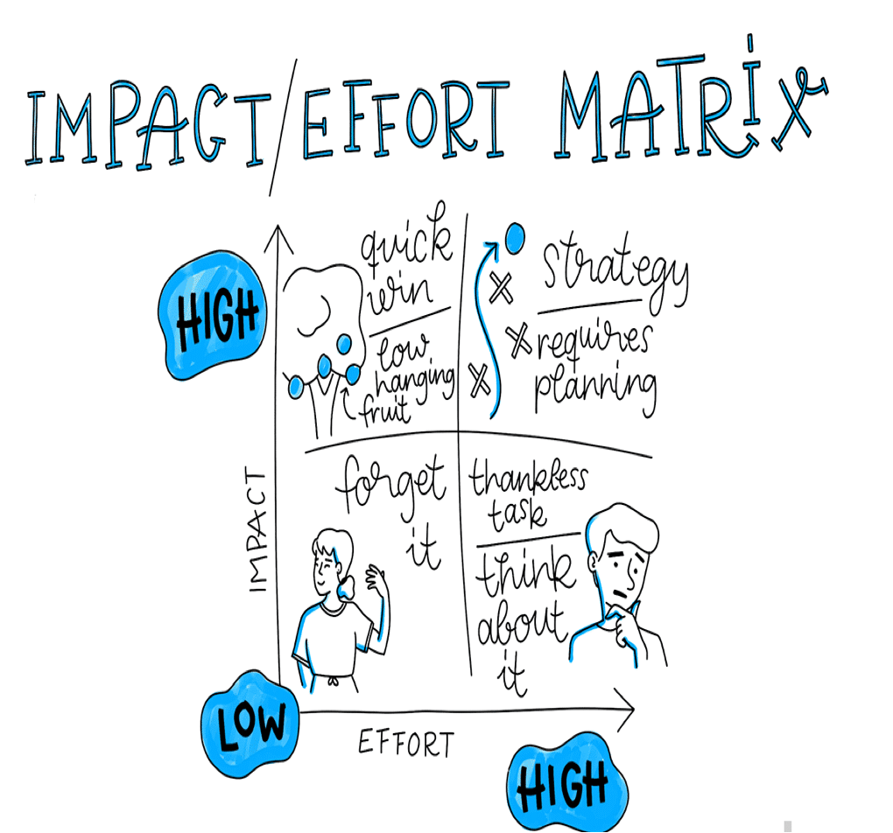

تعداد محدودی از شرکت ها به دلیل فقدان ایده های خوب شکست می خورند. این در حالی ست که انتخاب ایده اشتباه می تواند کشتی شما را سریعتر ازبرخورد با یک کوه در شب تاریک غرق کند. در واقع ، طبق بینش CB  ( نهاد های معتبر صادر کننده گواهینامه های استاندارد ایزو)، [دلیل شماره 1 شکست استارت آپ ها](https://www.cbinsights.com/research/startup-failure-reasons-top/) این است که آنها چیز اشتباهی را ساخته اند و  در بازار نیازی به آن وجود ندارد.

اما اینطور نیست که بنشینید و هیچ  فیچر (ویژگی) یا محصولی را برای ساخت انتخاب _نکنید_ . انتخاب فیچرهای (ویژگی) مناسب برای ساخت به معنای اولویت بندی مهمترین ، واقع بینانه ترین و فوری ترین موارد در شرایط کنونی ،از لیست بلند‌ بالای ایده های خوبتان است. 

این کار کوچک وکم اهمیتی نیست. و اکثر مدیران پروژه اتفاق نظر دارند که دشوارترین قسمت کار آنها ،این است که تصمیم بگیرند کدام فیچر شایسته زمان ، منابع ، پول و انرژی محدود تیم است.

در این راهنما ، ما می خواهیم همه فاکتورهایی  که مانع از اولویت بندی فیچرها هستند را ، به شما معرفی کنیم و سپس بهترین راهبردها را برای چگونگی اولویت بندی واقعی فیچر ها به بهترین شکل ممکن جمع آوری کنیم.

آنچه در این مقاله آورده شده است:

- **اولویت بندی فیچرها با یک چشم انداز و هدف مشترک شروع می شود**
- **چند روشی که به اولویت بندی فیچرها نمی انجامد**
-  **۷ روش عملی برای اولویت بندی فیچرها**

               ۱.فیچر ها را درون تم قرار دهید تا از انتخاب ناقص جلوگیری شود.

        ۲.فیچر های محصول را با توجه به امکان سنجی ، مطلوبیت و دوام تجزیه کنید.

        ۳. گزینه ها را در یک مقیاس تلاش / تاثیرامتیازبندی کنید.

         ۴. با روش RICE عمیق تر شوید.

             ۵. .برای امتیاز دهی به فیچر ها براساس معیارهای سفارشی ، از کارت امتیازی اولویت استفاده کنید.

             ۶.از روش کانو برای اولویت بندی فیچر ها بر اساس تمایل استفاده کنید.

        ۷. فیچر ها را بر أساس محدودیت‌ها اولویت‌بندی کنید.

- **افکار نهایی درمورد اولویت‌ بندی فیچر ها**

**اولویت بندی فیچر ها با یک چشم انداز و هدف مشترک شروع می شود**

یکی از سخت ترین قسمت ها در مورد اولویت بندی فیچرها این است که تصمیمات فقط منوط به محصول نیست واغلب بعد شخصی دارد. هر فیچر ، زاویه ، رویکرد و ایده ،منعکس کننده تلاش و نظر کسی است. 

 این  امرحتی وقتی که با ذینفعانی با سطح مختلف سرمایه گذاری و کنترل بر روی یک پروژه سروکار داشته باشید، پیچیده تر می شود .

کنارگذاشتن ایده طراح UX برای جریان متفاوت دیگر ، شاید چندان دشوار نباشد . اما چگونه می توان پیشنهاد مدیرعامل را برای انتقال به چارچوبی متفاوت در اولویت قرار نداد؟

با این حال ، برای موفقیت ، اولویت بندی نمی تواند شخصی باشد. در نظر داشته باشید که در حال انتخاب ایده کسی نسبت به ایده شخص دیگری نیستید. شما در حال انتخاب فیچر _مناسب_ برای استراتژی و اهداف شرکت خود هستید.

همانطور که ریچارد بانفیلد ، نویسنده "رهبری محصول: چگونه مدیران برتر محصول، محصولات عالی را راه اندازی می کنند و تیم های موفق ایجاد می کنند" ، می نویسد:

اگر تیم در مورد تصویر کلی به توافق نرسد ، مطمئناً در مورد یک فیچر(ویژگی) واحد توافق نخواهند کرد.

قبل از اینکه بتوانید درباره شایستگی های هر فیچربحث کنید ، باید تصویر کلان ستراتژی و اهداف شرکت روشن باشد. در غیر این صورت مثل این است که وقتی حتی نمی دانید به کجا می خواهید سفر کنید با این موضوع که  ماشین بگیرید یا قایق درگیر باشید.

با این حال ، در حالی که اولویت بندی فیچرها با یک چشم انداز مشترک آغاز می شود ، اما اینجا  پایان راه نیست.

حتی اگر همه شما در یک دیدگاه مشترک توافق کرده باشید بازهم بن بست تصمیم گیری اتفاق می افتد. هنگامی که فیچرها را اولویت بندی می کنید ، باید به عنوان یک رهبر مشارکتی عمل کنید - نقشی که _هاروارد بیزینس ریویو چنین توصیف_می کند: "\[رهبرانی با\] توانایی درگیر کردن افراد و گروههایی که خارج از کنترل رسمی شخص هستند و ایجاد انگیزه در آنها برای کار در جهت اهداف مشترک - علی رغم تفاوت در اعتقادات ، ارزشهای فرهنگی و هنجارهای عملیاتی. "

لازم است و کاملاً هم صحیح  است ، که با همه افراد تیم خود برابر رفتار کنید ، اما همه آنها نمی توانند در مورد اولویت بندی فیچرها اظهار نظر کنند.چراکه اصلا چنین چیزی چگونه ممکن است؟ بله ، شما با افراد خوب و باهوش کار می کنید، اما همه افراد زمینه لازم برای تصمیم گیری عمده در مورد محصول را ندارند.

**چند روشی که به اولویت بندی فیچر ها نمی انجامد**

بسیارخب تا اینجا ما می دانیم که اولویت بندی به چشم انداز مشترک شرکت نیاز دارد. وهمچنین می دانیم که نیاز به کسی است که انتخاب های سختی انجام دهد و از بن بست "طراحی توسط هیئت مدیره" جلوگیری کند.

اما قبل از اینکه ما به روش های عملی برای اولویت بندی فیچر ها بپردازیم ، چند پرچم قرمز دیگر نیز وجود دارد که باید مراقب آنها باشید:

**واکنش های راسخ**: همه ما به دلیل برخی از تجربه های شخصی ، افراد را مجبور به انجام دستور کار خود کرده باشیم. شاید مدیرعامل شما وارد سیستم شده باشد و موردی را که دوست ندارند ببیند یا از یک سرمایه گذار بازخورد منفی داشته باشد وشما را مجبور به پذیرفتن نظر خویش کند. 

گرچه پرش ازاولویت های مشخص،آسان است ، اما این کارها باید همیشه قبل از اختصاص منابع و زمان ،توسط داده ها یا تحقیقات کاربر پیش بینی شده باشد.

- **درخواست های فروش و پشتیبانی‌:** افرادی که در خط مقدم شرکت شما هستند وقتی شکایتی می شنوند ، با شما در میان می گذارند. گرچه این روش _می_ تواند یک روش قدرتمند برای یافتن فیچر هایی برای اولویت بندی باشد ، اما باز هم شما تمایل دارید بر اساس روندهای خود انتخاب کنید. 
- حواستان باشد که درخواست ها شخصی نیستند. قبل از اینکه اجازه بدهید نقشه راه شما را قطع کنند ، دقت لازم را انجام دهید تا ببینید آیا این مشتری همان مشتری ایده آل شما است ودرخواست واقعی است یا خیر.

• **قابلیت بازگشت سرمایه (****ROI****) :** نه گفتن به درآمد بیشتر دشوار است. با این حال ، هر فیچر کوتاه مدت و پولساز در بلند مدت برای شرکت شما مفید نیست. درآمد همیشه با یک تجربه کاربری بهتر برابر نیست و در طولانی مدت ، مشتریان شادتر هستند که بیشترین موفقیت را برای شما به ارمغان می آورند.

**۷** **روش عملی برای اولویت بندی فیچر ها**

با تمام ترس از خارج شدن از مسیر، بیایید به قسمت جذاب اولویت بندی فیچر ها برگردیم.

گرچه این یک تصمیم بزرگ است ، اما هیجان انگیز است. شما در حال انتخاب مسیر آینده محصول خود هستید و به انتخاب فیچر هایی کمک می کنید که می دانید مشتریانتان دوست خواهند داشت و به رشد شرکت کمک خواهد کرد.

بیایید با یک جمع بندی سریع شروع کنیم: ما می دانیم که برای حفاظت از عقاید خود به داده و روندهایی نیاز داریم. ما می دانیم که باید اولویت های خود را به استراتژی های بزرگتر شرکت گره بزنیم و از سوگیری شخصی خودداری کنیم. و ما می دانیم که نباید قربانی تفکر کوتاه مدت شویم.

اما در بیشتر موارد، هنوز هم می توانید تعداد زیادی از فیچرهای عالی را انتخاب کنید. بنابراین چگونه بدانید _اکنون_ باید بر روی کدام یک تمرکز کنید ؟

خوشبختانه ، استراتژی های فوق العاده هوشمند و ساده ای برای غوطه وری در تصمیمات محصول وجود دارد و به شما کمک می کند فیچرها ، پیشرفت ها و ایده ها را اولویت بندی کنید.

**۱.** **فیچر ها را درون تم قرار دهید تا از انتخاب ناقص جلوگیری شود**

قبل از اینکه فیچر‌های مورد نظر خود را در اولویت قرار دهید ، باید آنها را به گروه های کوچکتر تقسیم کنید. هنگام انتخاب پروژه هایی برای کار کردن ، انتخاب های ناقص یک مشکل واقعی است. و یکی از ساده ترین راه های جلوگیری از آن استفاده از "تم" فیچراست.

تم ها گروهی از فیچر ها هستند که با هدف شرکت ، چشم انداز محصول یا استراتژی کلی همسو هستند. آنها به شما کمک می کنند تا مطمئن شوید که روی فیچر هایی کار می کنید که در حال حاضر مهمترین آنها هستند ، ضمن اینکه از مشکلات زیاد بودن گزینه ها جلوگیری می کنند .(به یاد داشته باشید ، نه گفتن به یک فیچر یا به روزرسانی‌، به معنای کنار گذاشتن آن برای همیشه نیست. شما به سادگی در حال انتخاب جایی هستید که در حال حاضر کار خود را آغاز کنید .)

**چند روش وجود دارد که می توانید برای فیچر های خود به تم نزدیک شوید**:

**۱.تم نقشه راه محصول****:**  نقشه راه محصول شما احتمالاً از قبل به موضوعات سطح بالایی مانند "گزارش" ، "یکپارچه سازی" ، "ارتباطات" ، "گردش کار" و غیره تقسیم شده است ... یکی از ساده ترین راه ها برای تجزیه فیچر های جدید ، گروه بندی آنها توسط این تم های آماده است . به این ترتیب ، شما می دانید که آنها در حال کار روی چه بخشهای خاصی از محصول و استراتژی شما هستند.

**۲.محرکهای متریک ، محبوب ترین ها و پیشنهادهای جذاب:**  گزینه دیگر این است که فیچرها را بر اساس مکان و تأثیر بالقوه آنها گروه بندی کنید. برای انجام این کار ، ، گریلاک پارتنر آدام نش ، استفاده از سه ظرف خاص را پیشنهاد می کند:

محرکهای متریک برای فیچر های مرتبط با نیازهای خاص تجاری.  محبوب ترین ها برای فیچر هایی که کاربران شما زیاد  تقاضا دارند و پیشنهادهای جذاب برای فیچر هایی که  درخواستی برای آن داده نشده  اما به نظر شما کاربرانتان آنها را دوست خواهند داشت. 

فیچرها می توانند در چندین ظرف قرار بگیرند ، اما یک نقشه راه سالم هر سه گزینه را اولویت قرار می دهد.

**۳.تم‌های خاص و متریک شده:** در آخر ، اگر درباره معیارهایی که باید منتقل شوند کاملاً  آگاه هستید، ایجاد تم‌هایی که به طور خاص با آنها مرتبط باشند می تواند مفید باشد. این امر می تواند به معنای دسته بندی هایی مانند: "کاهش ریزش با افزایش تعامل" یا "افزایش ثبت نام برای خرید تبدیل ها" باشد. به این ترتیب ، اولویت های شما به نیازهای خاصی گره خورده است و می دانید موفقیت چگونه خواهد بود.

هرکدام از روش ها را که انتخاب کنید ، اولین قدم عالی این است که بتوانید به دسته بندی فیچرهای سطح بالاتر نگاه کنید  .(درختان تصمیم  نیز یک چارچوب تصمیم گیری و اولویت بندی رایج هستند که ممکن است بخواهید در اینجا امتحان کنید.) در مرحله بعدی ، شما باید خود تم‌ها را اولویت بندی کنید و در نهایت ، فیچر های درون آنها را تعیین کنید.

**۲****.** **فیچر های محصول را بر اساس امکان سنجی ، مطلوبیت و دوام تجزیه کنید**

اگر تعصب و گرایش شخصی باعث گمراهی ما می شود ، یکی از اولین کارهایی که باید انجام دهید این است که از دریچه عینی تری به فیچر های مورد‌نظرخود نگاه کنید. ، به این معنی که هر یک را براساس چند معیار نگاه کنید و با اعضای خاص تیم خود صحبت کنید:

۱. **امکان سنجی**: با توجه به منابع و ابزاری که در حال حاضر دارید ، از نظر فنی این فیچر چقدر امکان پذیر است؟ با اعضای تیم فنی خود - مهندسین بک اند ، طراحان رابط کاربر و توسعه دهندگان فرات اند- صحبت کنید تا بفهمید چه کاری _می_ تواند انجام شود (در مقابل. چه چیزغیرممکن است یا بسیار بعید است.)

۲.**مطلوبیت**: آیا واقعاً مشتریان شما آن را می خواهند؟ از هر ابزار موجود استفاده کنید تا بفهمید که آیا این همان چیزی است که کاربران شما می خواهد یا نه . این به معنای گفتگو با محققان ، طراحان UX ، بازاریابان و پشتیبانی و همچنین انجام آزمایشات و اعتبارسنجی کاربران است که ممکن است قبلاً کامل کرده باشید.

۳.**دوام****:** این فیچر چگونه با استراتژی کلی شما و نیازهای بازار ارتباط دارد یا از آن پشتیبانی می کند؟ با مدیران مربوطه و سایر مدیران محصولات صحبت کنید تا بفهمید این فیچر در یک اکوسیستم بزرگتر چه از طریق خود شما (سایر فیچر ها ، استراتژی ها و اهداف) و چه به طور کلی از طریق صنعت (مقررات ، مسائل حقوقی ، مالی) چگونه کار می کند.

در حالی که این معیارها از نظرات افراد ناشی می شود ، بررسی متقابل آنها از طریق لنزهای متعدد به عینی ماندن همه چیزکمک می کند. و مطمئناً ، آوردن هرگونه داده پشتیبانی یا مکمل می تواند شما را در ادامه این تمرین صادق تر نگه دارد.

**۳****.**   **گزینه ها را در یک مقیاس تلاش / تاثیرامتیازبندی کنید**

با فیچر هایی که کم و بیش از آنها نقشه برداری و اعتبارسنجی شده است ، وقت آن است که ابتدا بررسی کنیم کدام یک از آنها برای شروع مهمترهستند. یک روش اساسی و معمول برای انجام این کار ترسیم آنها در یک ماتریس ساده تلاش / تأثیر است. این فقط یک شبکه ۲ x ۲  است ، که در آن هر مربع نشان دهنده سطح متفاوتی از تلاش برای ساخت فیچر و تأثیر بالقوه آن است:

هدف این است که فیچرهایی را پیدا کنید که با کمترین تلاش بیشترین تأثیر را داشته باشند. با این حال ، همیشه به آسانی نمی توان فهمید که کدام فیچر در ماتریس قرار می گیرد.

آژانس طراحی AJ & Smart  پیشنهاد می کند این کار را به عنوان یک تمرین تیمی انجام دهید. هر ایده فیچر را روی یک کاغد یادداشت  بنویسید و سپس ماتریس خود را روی وایت برد بکشید. گروه متنوعی از هم تیمی ها را جمع کنید و سپس یک به یک ، هر نکته مهم را یادداشت کنید ، آن را توضیح دهید و به تیم اجازه دهید در مورد اینکه چقدر تلاش لازم دارد و سپس تأثیر احتمالی آن رأی دهد.

در مورد اولویت بندی فیچرها هنوز آخرین صحبت‌ها باقی مانده است، اما این تمرین به شما کمک می کند تا به سرعت از یک گروه متنوع از افراد تیم خود استفاده کنید.

**۴****\-**  **با روش** **RICE** **عمیق تر شوید**

گاهی اوقات فیچرها پیچیده هستند و باید با جزئیات بیشتر از یک شبکه ساده اولویت بندی شوند. در این حالت ، [روش RICE](https://www.intercom.com/blog/rice-simple-prioritization-for-product-managers/) راهی عالی برای امتیاز دهی به اولویت ها است. همانطور که شان مک براید ، مدیر محصول در Intercom ، توضیح می دهد:

سیستم هایی که برای تعادل هزینه ها و منافع طراحی شده اند بسیار زیاد هستند. اما یافتن چیزی که به شما امکان مقایسه موثر ایده‌های مختلف را به روشی منسجم بدهد مشکل است.

در پاسخ ، شان و تیمش چهار فاکتور مشترک برای ارزیابی هر فیچرهنگام تصمیم گیری برای اولویت بندی تعریف کردند:

۱.**رشد**: این فیچر در یک دوره معین بر چند نفر تأثیر می گذارد؟ این فاکتور با استفاده از معیارهای واقعی محصول مانند "مشتری در هر سه ماه" یا "معاملات در ماه" اندازه گیری می شود تا از سوگیری در انتخاب محصولات یا فیچرهایی که شخصاً می خواهید ایجاد کنید جلوگیری شود..

۲. **تأثیر**: این پروژه چقدر سوزن را بر روی اهداف و استراتژی شما حرکت می دهد؟ برای یکنواخت ترکردن ، شان  از مقیاس چند گزینه ای استفاده می کند: 3 برای "تاثیر زیاد" ، 2 برای "بالا" ، 1 برای " تاثیر متوسط" ، 0.5 برای " تاثیر کم" ، و در آخر 0.25 برای " تاثیر حداقل".

۳. **اطمینان**: براساس دانسته‌هایتان، تا چه اندازه از موفقیت این فیچر اطمینان دارید؟ اگر فکر می کنید پروژه ای تأثیرگذار است ، اما اطلاعاتی برای پشتیبانی از آن ندارید ، این فاکتوربه شما کمک خواهد کرد. 

باز هم ، استفاده از مقیاس ساده چند گزینه ای این کار را آسان می کند: 100٪ " اطمینان بالا" ، 80٪ "متوسط" ، 50٪ "کم" است.  (کمتر از آن ،زیر این مقدار است.)

۴. **تلاش**: پروژه به چه میزان به تیم های محصول ، طراحی و مهندسی نیاز دارد؟ می توانید این را بر حسب "ماه به نفر" اندازه بگیرید و به اعداد کامل (حداقل با نیم ماه) پایبند باشید.

وقتی همه شماره های خود را برای هر فیچر بدست آوردید ، وقت آن است که آنها را در یک معادله ساده قرار دهید:

امتیاز حاصل  "تأثیر کلی هر زمانی که کارشده" را به شما می دهد - یک عدد بسیار قدرتمند برای اولویت بندی دقیق فیچر ها.

**۵. برای امتیاز دهی به فیچر ها براساس معیارهای سفارشی ، از کارت امتیاز اولویت استفاده کنید**

روش RICE تنها راه نمره دهی دقیق فیچرهای شما نیست. گاهی اوقات برای اینکه اطمینان حاصل کنید که تمام نیازهای ذینفعان برآورده می شود ، باید عواملی را که به آنها امتیاز می دهید سفارشی کنید. در این حالت ، یک کارت امتیازی اولویت ساده ممکن است گزینه بهتری باشد.

با کارت امتیایز اولویت ، شما با یک لیست پیشنهادی از پارامترها و "وزن" آنها شروع می کنید (اساساً اهمیت آنها به عنوان درصدی از کل پروژه چیست؟) مهم این است که شما با تهیه این لیست به صورت خودکار شروع کنید ، اما بعد به ذینفعان برای تعیین دقیق اعداد بازخورد دهید.

| دسته بندی | تعامل مشتری | تجربه ی کاربر | قیف فروش | بهره وری عملیاتی | جمع |
| --- | --- | --- | --- | --- | --- |
| وزن | 20٪ | 10٪ | 30٪ | 40٪ | 100٪ |

 در اینجا مثالی  از مدیر پروژه دانیل الیزالد آورده شده است:

اکنون ، برای هر فیچر که اولویت بندی می کنید ، نمره ای از ۱-۱۰۰برای هر یک از دسته های کارت امتیاز اولویت ، اختصاص دهید.

 (۱۰۰ به معنای تأثیر زیاد بر آن دسته است. 0 به معنای عدم تأثیر است. )

بنابراین ، اگر می خواهیم بین طراحی مجدد وب سایت و تجربه جدید پرداخت ، اولویت بندی کنیم ، ممکن است چیزی شبیه به این باشد:

| دسته بندی | تعامل مشتری | تجربه ی کاربر | قیف فروش | کارآمد عملیاتی | جمع |
| --- | --- | --- | --- | --- | --- |
| وزن | 20٪ | 10٪ | 30٪ | 40٪ | 100٪ |
| فیچر: | نمره: | امتیاز: |
| طراحی مجدد وب سایت | 90 | 90 | 60 | 50 | 65 |
| صندوق جدید | 70 | 90 | 80 | 90 | 83 |

نمره کل هر فیچر با ضرب نمره در وزن محاسبه می شود. بنابراین برای طراحی مجدد وب سایت مان به صورت زیر است:

90 x 20% + 90 x 10% + 60 x 30% + 50 x 40%.

نکته جالب در مورد این روش این است که تا زمانی که فیچرها همه تحت همان تم باشند ، به شما امکان می دهد براساس نیازهای خاص سهامداران مختلف خود ، اولویت بندی کنید. وگرچه هنوز هم برخی از نظرات و تعصبات در مدل وجود دارد (براساس چگونگی تشخیص وزن ها) ، بازهم اعتبار قابل توجهی به اولویت های نقشه راه شما می بخشد.

 **۶.** **.** **از روش کانو برای اولویت بندی فیچر ها براساس تمایل استفاده کنید.**

همانطور که فیچر ها را اولویت بندی می کنید ، نباید فراموش کنید که هدف نهایی ایجاد چیزی است که مشتریان شما آن را دوست داشته باشند.

با استفاده از مدل کانو ، می توانید از طریق لنزهای تمایل مشتری ،هر فیچر بالقوه را مشاهده کنید. این در مقایسه با سایر روش هایی که بررسی کرده ایم ، کمی فرایند پیچیده تری است ، اما در هنگام گیر افتادن می تواند بینشی شگفت انگیز برای شما ایجاد کند.

با استفاده از مدل کانو ، هر فیچر بالقوه به دسته های مختلف و پاسخ های احساسی آنها تقسیم می شود:

- **نیازهای جذاب**: این فیچر ها احساس رضایت و لذت را ایجاد می کنند ، اما اگر این فیچر در آن نباشد کاربران ناراضی نیستند.
- **نیازهای عملکردی****:** این فیچر ها اگر وجود داشته باشند باعث لذت می شوند و در صورت عدم وجود (یا ناقص بودن) باعث عدم رضایت می شوند. ماهیت آنها کاملا یک بعدی هستند و و به عملکرد عالی تکیه می کنند تا توسط کاربران ارزش گذاری شود.
- **نیازهای اساسی****:** این مواردی است که شما باید داشته باشید - فیچر هایی که مشتری شما انتظار دارد در آنجا باشد. عدم گنجاندن آنها ناراحت کننده است ، اما ROI  برای بهبود آنها به سرعت کاهش می یابد.

  سرانجام ، فیچر هایی نیز وجود دارد که واقعا ناخواسته هستند و تأثیر مثبت سایر فیچر های شما را از بین می برند. به هر قیمتی از اینها خودداری کنید.

اکنون ، اینجا همان جایی ست که همه چیز روی تدبیراست. برای درک اینکه هر فیچر در کجای منحنی قرار دارد ، باید با یک گروه نماینده متشکل از 12 تا 24 کاربر صحبت کرده و چند سوال ساده از آنها بپرسید:

1. اگر این فیچر وجود داشته باشد ، چه احساسی خواهند داشت؟
2. اگر فیچر ارائه نشود یا به طور کامل وجود نداشته باشد ، چه احساسی خواهید داشت؟

سوال ها مثبت / منفی پاسخ داده می شود: با "من آن را دوست دارم" ، "من انتظار دارم" ، "من بی طرف هستم" ، "من می توانم آن را تحمل کنم" یا "من آن را دوست ندارم". بر اساس پاسخ ، می توانید منحنی احساسی آن فیچر را مشخص کنید.

**۷.**  **اولویت بندی فیچر ها با محدودیت ها**

اگر هنوز مطمئن نیستید که چه فیچرهایی را براساس نیازهایی که دارید ،اولویت بندی  کنید ، اولویت بندی بر اساس آنچه ندارید می تواند به همان اندازه قدرتمند باشد.محدودیت هایی مانند زمان ، افراد ، پول و روند کار می تواند روش های خوبی برای کاهش گزینه های شما و تمرکز بر فیچر هایی باشد که واقع بینانه ترین و با ارزش ترین هستند.

بیشتر محدودیت ها به دو ظرف بزرگ می رسد: افراد و فرایندها.

افراد: با پرسیدن اینکه آیا افراد مناسبی برای این پروژه ها دارید ، شروع کنید. اگر بله ، کدام یک از افراد مناسب شما بهترین نتیجه را می دهد؟ آیا در دسترس هستند؟ اگر به اولین سوال پاسخ "نه" داده اید ، ممکن است بخواهید در مورد فیچرها تجدید نظر کنید یا استخدام یک فریلنسر یا یک شرکت خارجی را بررسی کنید.

فرآیندها: به همه چیزهای غیرانسانی ای  که می تواند کاری  که انجام می دهید را محدود می کند نگاه کنید، این به معنای زمان (یعنی آیا این فیچر در چرخه تحویل شما قرار می گیرد؟) و همچنین وابستگی ها (یعنی برای کارکرد این فیچر چه کارهایی باید اکنون یا بعداً انجام شود؟) است. هر فیچر که شما در اولویت قرار می دهید پیچیدگی محصول کلی شما را اضافه می کند. و سرانجام وابستگی ها می تواند عامل اصلی در ساخت یا عدم ساخت چیزی باشد.

**افکار نهایی در مورد اولویت بندی فیچر ها**

وقتی شروع به صحبت درباره چیزهایی برای ساختن می کنید ، همیشه هیجان انگیز است. فیچر های جدید هیجان انگیز است. شما می توانید  تمام مکان های شگفت انگیزی که  محصولتان می تواند برود ، نتایج حاصل از آن و بهترین ستاریو را تصور کنید. اما شما به عنوان یک مدیر محصول باید صدای واقعیت باشید.

هنگامی که فیچرها را در نقشه راه محصول خود قرار می دهید و اولویت بندی می کنید ، به یاد داشته باشید که استراتژی کلی و نقشه راه محصول شما همیشه باید جلو و مرکز باشد. با یک ایده جالب ،توجه خود را بر روی تصویر بزرگتر از دست ندهید. 

محافظه کار باشید و سعی کنید با اصطلاح "کوچکترین مقدار میتواند موثرتر از بزرگترین مقدارباشد" زندگی کنید. اگر داده ها و تحقیقات کاربردی برای تهیه نسخه پشتیبان نداشته باشید ، فیچر های بزرگ به همین راحتی می توانند خطرات بزرگی باشند. در صورت امکان ، از روشهای توسعه Agile  برای راه اندازی زود هنگام استفاده کنید.

در آخر ، وقت بگذارید تا مرتباً اولویت بندی کنید . تجارت نیاز به تغییر دارد. بازارها تغییر می کنند.  رهبری تغییرمی کند. و علی رغم تمام کارهایی که شما برای اولویت بندی فیچر ها انجام می دهید ، این اولویت ها نیز تغییر خواهد کرد. زمانی را برای مرور لیست خود اختصاص دهید و مطمئن شوید همه چیز با تصویر بزرگتر هم تراز است.
