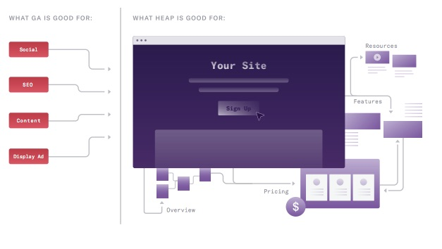
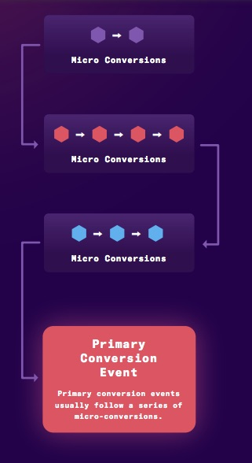
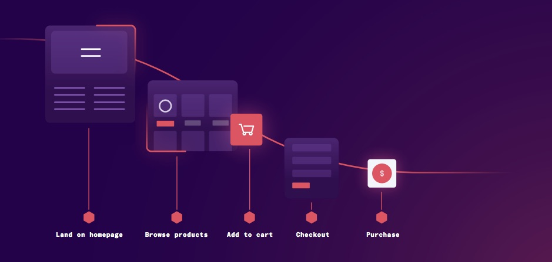

Conversion rate optimization is ultimately making a sale, but it can be any step along the path, such as opening an account, signing up for a service or newsletter, choosing email, and so on. The more successfully customers complete these actions, the more revenue there will be for your company. A million visitors but zero customers means the company is not profitable (and its shareholders are dissatisfied). An optimized conversion process not only increases revenue; it can also keep your business going by using resources efficiently, by getting the most from the users you already have. Using valuable insights about them is what turns visitors into buyers.

Conversion rate will differ based on your business goals. Service companies (SaaS) use conversion rate optimization (CRO) to get more people to sign up for a limited free version (trials) or freemium offers, and to guide existing customers to use more of their products’ features.

## Why is conversion rate optimization (CRO) important?

### Making web traffic valuable

Many teams, especially marketing, spend their time increasing web traffic. But web traffic is only useful for the business if these users convert into buyers. A small increase in conversion rate can easily add hundreds and thousands of dollars to your business. If you currently have $1,000 a month in sales of your product, increasing your conversion rate from 1 to 2 percent means an increase to $2,000 a month. That is what doubles your sales.

### Lower acquisition cost

CRO helps you reduce the cost of acquiring each customer and turn quantity into quality. CRO enables you to analyze your site and, instead of paying more to attract irrelevant visitors, get the most from your site’s optimized traffic.

### Improving the user experience

Doing CRO can give you better insight into visitor behavior. CRO tools such as funnel and path analysis put you in the customer’s mind, telling you which pages people viewed, where they spent the most time, and what they did before leaving. You can see which points in the customer journey led to bottlenecks and which pages performed best. You can even break these analyses down by user segment. The result? An improved experience for all users not only increases conversion, it also creates better brand loyalty.

### Increasing customer lifetime

In e-commerce companies and especially fintech, competition is intense. Often there are many websites selling similar products. But which one do customers come back to? Often, the sites that are more customer-friendly.

In service companies (SaaS), CRO can be a powerful strategy for getting users to use product features they currently do not use, and helping them get more value from your product. More value equals more retention.

## **Using Google Analytics for CRO**

Google Analytics was introduced in 2005. At that time, websites were simple and static. All that mattered was how many people visited your site and how they got there. Today’s websites guide visitors through complex, multi-directional journeys. Of course it is still important to capture web-traffic data. But if you are interested in improving conversions while people are on your site, how users behave there is important information. Google Analytics cannot answer these questions. You can still (and should) use GA to measure advertising cost and traffic. But to improve the user experience on your site or app, only real product-analytics tools such as Heap can provide the information you need.

## **CRO best practices**

If there is only one best method for increasing conversion, it is this: act scientifically and methodically. Don’t spin around with random guessing. Be smart: build a hypothesis, measure and test results, then iterate.

1. Collect information about your site.

2. Set baseline numbers.

3. Get to work identifying your biggest opportunities.

4. Be creative and experiment.

If you are worried that being scientific will kill the artistic creativity that plays a large role in designing a user experience, don’t worry. Being scientific gives you plenty of room for creativity. It also allows you to understand the effects of experiments correctly, whether positive or negative.

Note that it is almost impossible to act scientifically about CRO unless you automatically capture all user behavior. When you can see everything your users do, paths, funnels, and behavioral segmentation (which we will get into soon) all work far better. Without that complete data set, you easily miss important work, and it is very hard to penetrate the small moments that also have a large effect.

A large part of the testing process is recognizing what you do not know. Without automatic capture, it is almost impossible to find the “unknown unknowns” you are not aware of, but that can dramatically change your business.

When all customer data is at your fingertips, you have found the whole haystack — CRO is finding the right needles in it.

## **CRO by industry**

What conversion means, and how you should improve it, often differs depending on your business goals. Let’s examine CRO by industry.

### **CRO for e-commerce**

The primary goal is usually making it easier to find the goods visitors are looking for. If they cannot find what they want, they cannot buy it. In general, e-commerce teams tend to focus on four stages of the customer journey:

- Presenting the right products and getting users to add them to their cart.

Show product information to customers in a form that encourages them to buy. You can apply CRO to elements of your site page such as design, images, reviews, and messaging to encourage more people to add a product to their cart.

- Increasing average order value (AOV)

You either increase the average price of items in users’ carts (meaning you get them to buy more expensive items), or you can increase the average number of items a user buys. Site flow can deliver both effectively.

- Completing the purchase without friction

This is more about locating the moments when the user runs into a problem. CRO suggestions often focus on the checkout flow: reviewing the cart, payment-gateway information, and shipping. Funnel and path analysis of checkout is essential for identifying the key points where the user drops out of the path. Is the checkout process too complex? Are there hidden costs at the end, such as extra shipping cost? Are there issues integrating with an intermediary gateway?

- Bringing in the right customers

Behavioral analysis allows you to segment users into groups that are likely to convert. By tracking what people actually do with your product, you can identify group interests with considerable accuracy. Once you have identified a mother lode of potential customers, you can start sending them special offers, coupons, and targeted marketing materials.

**Strategy for e-commerce CRO**

Desktop versus mobile

Do your users focus more on mobile than desktop? Is the mobile experience not well optimized? Can users easily go from desktop to mobile during a purchase?

Remember that online buyers want a seamless, fast, convenient experience. Make sure customers can easily find answers to their questions. Consider a chat feature — because unanswered questions lead to lower conversion among those customers who do not want to contact support.

Encouraging repeat purchase

Teams often focus so much on the first purchase that they forget to encourage customers to come back. Build relationships with a personalized web experience — identifying similar items they might like, and sending a special offer or price. When users come back to your site and see their interests, they are more likely to buy. A personalized web experience is essential for building brand trust and ultimately increasing conversion rate.

### **CRO for service companies (SaaS)**

The ideal SaaS customer journey includes continuous growth, because the business model is built on creating relationships and the latest interaction with users. For most SaaS companies, the initial conversion event is when a user buys a product subscription. The sales cycle, depending on price and complexity, can become long, and may include a trial period and ongoing touchpoints, including interaction with salespeople.

That said, CRO in SaaS companies generally revolves around three important moments:

1. Signing up for a free trial

In this goal, SaaS sites are similar to e-commerce sites: the goal is to show customers how they can get value from their products and get them excited about your product. For product-led companies, even those that bring people into a free trial with an army of salespeople, the first major step is considered acquisition. In a more complex product or sales process, the conversion event can be receiving a demo. For teams working on this goal, the key things to test are standard website features: copy, CTAs (calls to action), information flow, design, messaging.

2. Converting users from a free version to a paid version of the products

You need to nurture potential customers who are testing your product and get them along their learning curve as soon as possible. Ideally your product will be intuitive, but a good CRO strategy — especially A/B testing — can be very useful in making sure your customers get value quickly. In-app, depending on your product, guides and chats can be useful.

Customer segmentation — demographic and behavioral: by segmenting customers to understand their needs and interests, you can direct your educational content and in-app guidance to best meet their needs.

3. Encouraging existing customers to renew paid subscriptions

When it comes to customer retention, users get access to key features that give them more value from the product. You want to give customers such value that they cannot live without it. The simplest way is to offer an outstanding product, but SaaS products sometimes contain features people rarely use. In-app guidance and recommendations can encourage users to discover them. Think about different user flows, and where you might introduce new features to them.

### **CRO for fintech companies**

In fintech conversions, the tendency is toward less repetition but more value. For many fintech companies, in fact, CRO is the whole game: the single point of many fintech sites is getting the user through a loan-application funnel. And once users are acquired, their work is usually done forever. (Think: how often do you like applying for insurance, or a mortgage, or a loan at all?)

At the same time, fintech conversions — at least application conversions — tend to become difficult and often include a number of form pages. It can turn conversion into a game of micro-conversions. While you want to pull people through the funnel, doing so often includes removing every small individual step.

Anyway, unlike e-commerce, most applications in fintech, because many of these companies want to keep conversion a bit difficult to prevent a harmful outcome, have complexity. (Too much simplicity causes you to receive applications from many unqualified people, which makes your business inefficient.) So it often includes a large number of complex obstacles and tests.

Based on what was said, in fintech there are often three main categories of conversion funnel.

Applications and opening an account

As described above, this stage usually includes a number of form pages, and a number of small steps. It is worth noting that labeling each of these steps by hand would be very difficult. With a solution that automatically captures all these points (such as Heap), the work is simpler.

2. Helping customers do their work online instead of calling

For industries such as insurance and healthcare, where products are complex and highly structured, people often call customer service to change coverage, file a claim, or correct their accounts. The problem is that call centers are expensive to keep going, especially as companies grow.

A better solution is to view these tasks as a conversion funnel and optimize your site so completing them is simple for users. Doing this helps the customer keep their information up to date or allocate their budget correctly. It also helps the brand, because consumers certainly appreciate the ability to easily manage their finances, insurance, and loans.

3. Using new features

As more companies become digital, they create newer features for users: stock brokers, financial calculators, IRA option selectors. After adoption, these can add significant value to the user experience. As in SaaS, CRO is an excellent strategy for nudging users to use these features and then helping them.

A systematic approach to improving conversion

Conversion rate is calculated by dividing the number of visitors who take the intended action by the total visitors to your site. Multiply by 100 to get the percentage rate. This is the way to determine your baseline numbers.

CR % = (# of visitors who convert) / (total # of visitors) * 100

One of the interesting points about conversion rate is that when looking for improvement opportunities you can be as broad and as specific as you want. Identify the moments when conversion is high so you can copy those moments on your site or app. And pick the places where conversion is low so you can improve it!

## **Conversion optimization**

We suggest you think of CRO like cooking. Start with some ingredients, season, add a few more, then taste again. Maybe next time you try it with more lemon. Maybe your family hates that version, so you add olives. The goal is continuous improvement over time.

At Heap, we endorse a scientific approach to CRO. Identify areas for improvement, take baseline measurements, test the hypothesis, test and measure again and again.

We recommend looking regularly at all of the following:

**Step 1: define your conversion event**

What is the important action you want visitors to take? Primary conversion events differ across industries and depend on the work context. Before getting into CRO, specify what matters most to your team and product.

In e-commerce, the main conversion event is usually a version of “complete purchase.”

On SaaS marketing sites, it is something like “sign up for a free trial” or “contact sales.”

In fintech, it is usually some kind of “complete application.”

These events usually represent the end of a series of micro-conversions, such as “fill in line 14 on this form” or “add item to cart.” Marketing teams may also focus on smaller conversion goals, outside the main conversion path.

On a landing page, the conversion goal may be clicking “download whitepaper” or “chat online.” These granular micro-conversions, together, add up to a large-scale macro conversion. Conversion optimization is often focused on improving these micro-conversions, because each can be a potential barrier to the main conversion event.

## **Step 2: map the conversion funnel(s)**

After you are clear about the main event or macro conversion you want to produce, map the steps leading to it. Create a conversion funnel to visualize the path and flow of guiding your users toward becoming high-revenue customers. This is an excellent tool to help you create a reliable picture of how the user feels at each stage of your customer journey.

A conversion funnel should be between 4 and 6 stages. No more.

For example, in an e-commerce store, the funnel is often a variation of:

Here is a description of each stage of the conversion funnel for eComm

Landing on the home page:

Something about your site attracts the user. Maybe they know your product, or were recommended by a friend. Now that you have their attention, keep it!

Create interesting content that meets buyers’ needs, answers their questions, and positions your company as a thought leader in its industry.

Highlight that your product is different and better than your competitors.

Test your content, create complexity, and see how the changes perform.

In exchange for their email address, offer buyers useful resources so you can turn them from ordinary visitors into engaged users.

Move them to the next stage in your funnel so you can send them more content and stay on their radar.

Browse / consider the product:

Now that your visitor is a lead, show them why they should absolutely have your product. Test changes to page elements such as copy, graphics, and recommended items to see which ones move people to the next stage.

Remember that not all of your users will take the same paths to a sale — a buyer can land in one of your subcategories without going to the home page. Keep this in mind so you do not miss small optimization opportunities. Make sure users can explore seamlessly without error messages.

Add to cart

Here is the risk of cart abandonment — your goal is to discover why.

Some research indicates that up to 75% of buyers abandon the purchase after adding items to their cart because of site issues such as shipping cost, lack of payment options, and technical problems. If users do not convert here, run an A/B test. Maybe revealing shipping costs earlier in the customer journey leads to more of them converting than revealing costs later. For users who have added your product to their cart but never fully checked out, send retargeting emails or run retargeting ads.

Checkout

This is where people review their cart right before buying. You want your customers to buy! But e-commerce businesses, on average, lose a staggering 69% of their sales because of cart abandonment at checkout. Running funnel and path analyses helps identify and fix the problem.

Is it easy and secure for them to enter their personal information?

Do they abandon when they are asked to sign up for an account?

Does offering guest checkout allow you more conversions?

Signing up for a new account is one of the most important reasons people abandon the cart at this stage, because it creates extra work for buyers and adds another step to the purchase process.

Click “Buy”

Time to celebrate — your leads are now officially customers! But your work is not done. As you know, the cost of acquiring a new customer is 6 to 7 times higher than retaining an existing customer. The probability of selling to a new customer is between five and twenty percent, but the probability of selling to an existing customer is 60–70%!

Don’t let all your hard work go to waste. Because customers know the value of your product and trust your company, your top priority is keeping them engaged. Ideally, the easy experience of your site will help this goal, but emails and other promotional actions can also help.

**Step 3: identify drop-off points with funnel analysis**

Once you have identified the main stages in your conversion funnel, dig into each one to find the main drop points.

Drop points = the main opportunity.

We say it again: drop points equal a large opportunity! Users are telling you exactly where they lose interest. If you understand the cause, you can change it. Keep in mind, if you have an analytics platform such as Heap that automatically tracks user data, isolating drop points is easier. Otherwise, you have to track every single event in the funnel by hand. This not only makes the work far more tedious, it also makes you struggle to do it. The best way to identify drop points is to do a funnel analysis to examine a series of events and see the number or percentage of users who drop at each event. A good funnel-analysis tool can break this information down into behavioral and demographic segments, so you can compare completion rates at each stage across all groups.

**Step 4: go step by step with path analysis**

It is time to focus your microscope on the problem areas you have identified. If users always completed all the stages you wanted in the order you wanted, conversion funnels would work perfectly. However, users may go through your product in arbitrary ways, even a path you did not anticipate.

Path analysis isolates entry and exit paths of events for conversion or drop. It allows you to see what actions people take before and after. This is very useful for saying whether users follow your ideal conversion flow or instead do something else. With path analysis, you can see your shortest, longest, and most popular funnels. A good path-analysis tool also allows segmentation.

In path analysis you do two things:

1. Look for small fixes that bring large gains

2. Try to understand how the typical user uses your site.

Targeting key moments

Let’s say you are a fintech company and have a relatively complex application process. This requires users to fill in dozens of forms and provide a lot of information. You see that at a particular point in the funnel there is a large drop, so you can do a path analysis.

The data shows that at this particular point in the application, it is a place where many people receive an error message. Some corrected the error and continued the application, while others simply continued the application as if they had not received an error message. They are the ones who eventually dropped. With this insight, you can now look for a solution.

Why do some people continue without fixing their error?

Did they notice the error message?

If we make the error message more visible, what do they do?

The ability to target specific users who dropped during a particular stage is essential. Now you can create marketing campaigns targeting those specific users to bring them back to your site.

Using path analysis, you can find the most problematic part(s) on your drop pages and take a deeper look at what users do or see before they drop. Examine every click around the exit points.

Which one causes users to leave more?

Are there particular places where people get stuck?

These paths can have issues you were not previously aware of, or have technical problems that consistently block users from accessing a particular stage of the funnel.

Step 5: segment by behavior with cohort analysis

There is undoubtedly no more powerful CRO strategy than behavioral segmentation. Behavioral segments allow you to put your users into groups (cohorts) based on actions they take — or have not taken.

Do users who convert read your blog?

Have they done a review? Saved a report?

Do they prefer purple CTAs?

What you are looking for is behaviors that predict conversion, so you can steer your product toward getting more users to do them.

When you use a platform with behavioral-analysis capability such as Heap, you can track and analyze your groups over time to gather more actionable insights about them. You will learn how particular groups interact with your product while discovering how to reinforce these interactions and gradually build loyalty. This process is known as cohort analysis.

The possible uses of behavioral segmentation and cohort analysis are limitless. You can identify your most loyal customers, implement better re-engagement campaigns, and deliver more personal, better user experiences.

A few examples of how you can use behavioral segmentation to grow your business:

Increase revenue through offers:

You notice that users who buy handbags from your fashion website also tend to buy shoes. Then you can send a 20% discount coupon for shoes via email or an alert to users who have just bought a handbag.

Make the buyer journey easier:

You notice that visitors who use the bookmarking capability of your free app tend to upgrade to paid membership at a higher rate than those who do not use it. You can create an in-app guide that encourages new visitors to use bookmarks.

Improve customer retention and reduce churn:

You notice that users who are inactive for more than 60 days have a low retention rate. You can send a special three-step email marketing campaign to re-engage users who have been inactive for 30, 45, and 60 days.

**Step 6: consider your sources:**

Who visits?

In addition to improving the site experience for users, CRO is about knowing which groups to target. By bringing in users who have a good chance of converting, they are more likely to do so.

For example, if your data shows that website visitors who come from Accountants Weekly magazine convert at 2 times the rate compared with people who do not come from there, you can adjust your online marketing to bring in more “A.W.” and optimize messaging on your landing pages.

The equivalent for SaaS products is analyzing conversions by user type. If VPs convert at 2 times the rate of ICs, you can use this information to tailor your product to VPs or tell your sales team to sell to more VPs.

Group segmentation will also show low engagement, so you can readjust your marketing efforts. Maybe it is time to stop focusing on a segment that has no traction. A better strategy may be creating campaigns to motivate first-time visitors or re-engage inactive users. Once you have specified your segments, you can personalize goals for each campaign.

.

## **Segmentation examples**

These are only some of the methods for how to segment users to compare conversion rates. There are many others, and the only limit is the number of ideas you can offer. Of course the traits will be unique to your product, but the more ways you have to split the data, the more likely you are to find the underused segment.

Based on demographics:

Job title

Geography

Company size

Industry

Gender

Age

Education

Based on behavior

Compare conversion rates based on segmenting users according to whether they do something or not:

- They read your documents
- They see a particular page or pages
- They spend time browsing your site
- They click on read more
- They go to the FAQ page
- They receive your emails
- They share something on your site
- They use coupons
- They subscribe to updates
- They use in-app chat

Based on marketing channel

You will often run multiple campaigns on a single channel. Using Heap, you can measure conversion rates for each channel.

Social media

Search engines

Referral sites

Partner sites

Traditional media

Paid ads.

**Step 7: hypothesize, test, measure. Then iterate.**

The guiding principle for data-driven CRO is using data to create informed hypotheses and learning as much as possible from every test. The best way to improve a product is learning everything about how people use it, where they come from, and what their problems are. Be a good scientist. Ask creative questions. Examine the information you have to pinpoint answers. Then make improvements toward larger business goals.

Imagine you are a product manager at a SaaS company and you need to understand which features are most valuable and how to improve conversions. Take the product-analytics fundamentals from Heap, then build hypotheses for why particular metrics are what they are. From these hypotheses, you can now ideate from new features to a complete rethink of experiences, including small improvements that make your customers more successful.

At Heap, we believe the key to building a good product is continuing to ask questions. Working with all kinds of customers at large and small companies has taught us that diligent use of these seven steps leads to significant improvements in conversion.

## **Key CRO tools**

The secret of CRO is this: the more you measure, the easier it becomes. The more information you collect about how users navigate the site or app, the simpler it is to isolate problems, fix them, and understand the effects created on conversion.

Many product-analytics solutions have you label events by hand to make sure you collect information about them. For CRO, this is a nightmare. If you do CRO correctly, you will make a lot of changes, so your site or app is continuously evolving. With manual labeling, keeping sheets for all these changes is almost impossible. If you forgot to label an event, you now cannot get information about it. How bad.

The ideal product-analytics solution for CRO is automatically capturing data from everywhere on your site. Whatever users do, you know. Then you can take all this data and analyze it to understand how your users engage with your product at every stage of the way.

For that reason, it is highly recommended that you choose a product-analytics solution such as Heap that uses automatic capture. Automatic capture enables the business to capture customer interactions, clicks, taps, form submissions, and more on the website and mobile app with just one piece of code. Using automatic capture, you make sure your core data set is complete and every part of user interaction is retrievable.

A/B testing

A/B testing is an amazing tool. There are few better methods for optimizing your site and driving more conversions. We have found that A/B testing works best when split into a few stages:

Step 1 — design a hypothesis

Step 2 — run your test effectively

Step 3 — measure all the effects of your test

**Step 1 — design a hypothesis**

Run every A/B test according to a clear hypothesis. State in advance what you are testing. Specify why you think a change will create a change.

Why is doing this in advance important? It forces you to:

1. Clarify the problem you want to solve

2. Explain how you will solve it.

3. State the change in behavior that counts as success.

4. Establish the KPIs you want to move

5. State your mechanism for moving them

6. Think in advance about downstream metrics

Below is a small A/B hypothesis that has the main questions you need to answer before doing any testing.

What are we changing about the site / product?

What different behavior are we testing for?

The metrics that tell us whether our test is successful or not?

What counts as success?

What downstream metrics do we expect to change?

**Step 2: run your test effectively**

When you have set your A/B hypothesis, it is time to run your test. How do you do this correctly?

1. Choose the right tool.

| [AB Tasty](https://www.abtasty.com/) | [LunchDarkly](https://launchdarkly.com/?utm_source=bing&utm_medium=cpc&utm_campaign=BingSearch:%20Brand&utm_terms=%2Blaunchdarkly&matchtype=e&utm_content=&_bt=&_bk=%2Blaunchdarkly&_bm=e&_bn=o&_bg=1312817737186848&msclkid=345b0d1da9371202a49c524f050103aa) | [monetate](https://monetate.com/) | [Qubit](https://www.qubit.com/). | [ORACLE maxymser](https://www.oracle.com/cx/marketing/personalization-testing/) |
| --- | --- | --- | --- | --- |
| [split](https://www.split.io/) | [Google optimize](https://marketingplatform.google.com/about/enterprise/) | [Optimizly](https://www.optimizely.com/) |   |   |

Here are some of the best tools available for A/B testing. All of them integrate easily with Heap.

2. Sample size and statistical significance

If you do not run your test on enough people or do not test enough, you will not get reliable results. So you have to calculate the right population and sample size and make sure you have run your test long enough to collect the right data. (“Population” means all the people who visit your site or app, and “sample size” means the people who will interact with what you are A/B testing.)

Because not everyone is a statistician, A/B testing tools such as Unbounce, AB Tasty, and Optimizely X provide a calculator to help you understand what sample size and number of test days you need. You can also use [Evan Miller’s A/B Sample Size estimator](https://www.evanmiller.org/ab-testing/sample-size.html)

The main goal of getting these numbers right is making sure your results are statistically accurate — meaning 95% confidence that any difference you measure is not due to chance. If you have already run your A/B test, you can also use the [Visual Website Optimizer](https://vwo.com/tools/ab-test-siginficance-calculator/) statistical-significance tool to check whether the test has reached statistical accuracy.

3. Complete tests to the end

We have seen it many times: marketers start running a test, see some promising early results, and stop immediately. After all, everything looks good — let’s make this change and keep moving!

The problem is this. If you have not completed your test, you have probably landed on a “false positive.” The less information you collect, the more likely the result is random.

If you stop the test early, or introduce new items that were not part of your original hypothesis, you do not collect enough data to know whether what you are observing is a real result or a random fluctuation. Let your test run its course! Stay strong and wait for the results. Then act.

**Step 3: measure the whole customer journey**

As powerful as A/B testing is, many people ignore the most important reason for doing it:

This test is not just for optimizing a local goal, but for optimizing the business!

To make sure you do this, measure all the data the test generates. Highly useful information appears when you start measuring the downstream effects of your changes and know whether more people bought from you or not. Or whether they are likely to come back to your site or not. Or whether they are likely to go from a trial plan to a paid plan. These are the metrics that matter a great deal for your business, and your A/B test is really meant to improve them. By thinking about downstream events and tracking them, when you review them days, weeks, and months later, you measure the real effects of your tests.

## **Examples of successful CRO from our customers**

Conversion-rate optimization strategies from leading brands

Here are some case studies from companies that have used CRO effectively to grow revenue and improve their customer experience:

[OppLoans](https://heap.io/customer-stories/opploans)

This online lender provides a reliable, trustworthy alternative to loans with daily repayment. They wanted to improve funnel performance and reduce friction in their customer experience. But OppLoans, as a startup in a growth stage, has a busy engineering team. They cannot bear the load of building, testing, and running a set of in-house solutions. Using Heap as their analytics tool, the team was able to find a broken step in their funnel.

“With a meaningful improvement in our pre-pop experience, the team saw a seven-figure increase in new principal issued annually and a 5 percent increase in conversion rate for direct mail.”

[Casper](https://heap.io/customer-stories/casper)

Sleep startup Casper is dedicated to creating a complete sleep environment and delivering it directly to the customer’s door. When Casper evaluated its checkout funnel in Heap, they found that more than 80% of users had chosen courier delivery instead of standard UPS delivery. Using A/B testing, Casper moved the “same-day courier delivery” option to before checkout (pay after delivery). This change caused a 100 percent increase in the number of people who wanted to learn about shipping methods, as well as a 20 percent increase in conversion rate.

[Sur La Table](https://heap.io/customer-stories/sur-la-table)

One of the world’s largest retailers of premium cookware, this company’s success has been built by creating an excellent online customer experience. As part of this mission, the company has created a culture of CRO and rapid iteration. Behavioral data showed that users who view more products buy more and spend more on the goods they choose. Path analysis showed that product cross-selling increased product visits. So the team developed product pages to display more complementary or related products. The result was a 12% increase in page visits and a 6% overall increase in conversion rate.

**Conclusion**

Every business has a strategic responsibility to do CRO. There is always room for progress, and you will always benefit from turning viewers into profitable customers. We hope that after reading this ebook, you are convinced that the scientific method is the best method — organized and thoughtful, not hit-and-miss.

Translator: Atefeh Abbasizadeh

Source:

[https://heap.io/wp-content/uploads/2020/10/HEAP\_CRO\_eBook\_L1R2.pd](https://heap.io/wp-content/uploads/2020/10/HEAP_CRO_eBook_L1R2.pdf)
