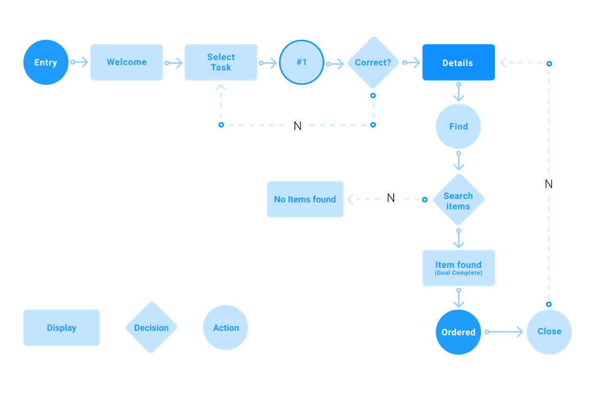

User flow can be interpreted in many ways. It can be seen as an overview that describes where users can navigate in your product.

It can also mean the quality and actual experience of the path users take to complete a task.

Or it can mean the actual sequence of user steps to complete a task. Flow diagrams can be useful in visualizing the paths users take when using your solution (that is, a website or app).

User flow takes them through their entry by going step by step to a successful outcome and a final action such as buying a product.

This work helps you picture a logical path the user should take when interacting with the system, the relationships between system function, potential user actions, and related consequences.

## The role of user flow

User flow is the basis of content needs on web pages or an app screen. At the start, by understanding user needs, it helps the product team create a flow and user experience designed to meet those needs.

## User persona pattern

If you can find the customer profile, you take one step closer to understanding your user journey.

Here you can use a customer journey map (user story mapping) to correctly analyze what your customers do when interacting with your business (that is, visiting your website) and the different touchpoints.

Questions you should consider for this work include:

- What is the user trying to do?
- What matters to the user, and what gives them the confidence to continue?
- What additional information does the user need to do this?
- What are the user’s doubts or obstacles in doing the work?

Answering these questions informs how you design pages and determine what content and navigation links to include.

If the user’s main goal is browsing different content, your page or screen will offer a different design and function than when your main goal is buying a product.

Let’s examine together, in 6 simple stages, the steps of creating a customer journey map.

By knowing the user journey, the rest of creating the user flow will be easier.

1. Specify your goals and your user’s goals
2. Getting an idea of your business goals as well as users’ goals.

You may already be aware of your business goals. For example, increasing conversion on your website, increasing sales of your product, and so on. This is usually the final result of the actions you want your users to take.

On the other hand, your users’ goals include the wants and needs they want to fulfill. And different users may have different goals in mind.

This is where the user personas and customer journey map you created earlier help you understand what they are.

- Specify where your users come from

If you are designing a website, you may want to know where your customers come from, or in other words what the entry points to the site are.

For example, a direct visitor searches for your brand name, while an organic search visitor first searches on Google for the product they want before discovering you as a suitable seller.

And mapping these different user flows based on different entry points is very important. This is the key to creating a better experience for users.

- Identify the information the visitor needs
- To design the best possible user flow, you have to put yourself in customers’ place.

This means understanding their needs and motivations. So you need to know what problem they have, their doubts, their questions about the product, and the answers they are looking for.

Since you have already created your buyer profile and journey map, doing this step is easier.

- Visualize your user flows

By now you are aware of the users for whom you are creating a user flow, what their goals are, and where they come from. The next step is creating the user flow.

Think about what your users do before and after visiting a particular page on your website. What they see, what action they take to reach their goal. This helps you identify the pages you should create, what information or content you should offer, and how they should connect to one another.

Pay attention to the start and end of each task. This may change based on different users’ goals.

And when a high-quality prototype is ready, you can test it with real users.

That way you can collect information about every stage of the user flow and learn how users move through your product. Then you can specify areas for improvement and apply solutions before releasing the final product.

## Best practices to keep in mind

To make sure the user-flow diagrams you create are effective in helping you, stick to the following methods.

Always give your user-flow diagram a name that describes its purpose. This helps anyone who refers to it understand its basis.

When drawing a flow diagram, start from one direction.

Limit the number of decision points so you create it without noise and with less complexity.

Make sure the scope of the user-flow diagram covers one task or one user goal. If the user flow covers only half the work, or maps steps to cover more than one user goal, it will not be effective.

Make sure you add only the necessary information and avoid other details that do not help you describe the flow and user actions.

To speed up the process, use a digital diagramming tool. In addition, it allows you to take input from others and store your work in one place and in a cloud space, which lets you refer to it and work on it from anywhere.

## An example of a user flow

User flows can take different forms depending on the type of website or app you are building. For example, for an e-commerce site, a common user flow might look like this:

- The user starts from the home page
- The user clicks from the home page to a category page
- The user clicks on an item from the category page
- From the product page, the user adds the item to the cart
- The user reviews the cart
- From the checkout page, the user completes the purchase

Of course, the above is a very simple example. In the real world users can take different paths to purchase. For example, in the example above the user can go to the category page to see more products instead of going directly to the cart. Or they can use search to navigate the site instead of clicking through the site hierarchy. Or the user can enter from a page other than the home page.

Because there are different paths users can take, user flows are often modeled as a flow diagram with a node for each of the main navigation paths. The goal of analyzing user flow is to identify the main user flows through your app or website and identify areas where the navigation flow can be improved.

For example, on an e-commerce site you might analyze user flow and notice that many people go to the cart but do not complete their purchase. By identifying that cart abandonment is a problem, you can start forming hypotheses for why users drop off at that stage.

Your shipping rate may be very high and users get sticker shock. Or maybe there are too many fields to fill in and customers lose interest. Or maybe the navigation about the next action is not clear.

By going through your user flow, identifying opportunities for improvement, and testing different ideas, you can continuously improve your conversion rate.

## Using use-case diagrams

Diagrams are valuable for visualizing a system’s functional needs, which turn into design options and development priorities.

They also help identify internal or external factors that may affect the system and should be taken into account.

Use-case diagrams specify how the system interacts with actors without worrying about the details of how it is implemented.

## Symbols and signs used in the diagram

Rectangle: Use rectangles to show activities.

Oval and circle: Use ovals and circles for start and end, or entry and exit to an activity.

Diamond: For cases that require a decision, a diamond should be used.

Actors: Actors are users of a system. When a system is an actor of another system, label the actor system with the actor stereotype. Actors who have no name have the role of someone who interacts with the system. Keep your name short and the size of your use cases consistent for a professional look.

Relationships: Show relationships between an actor and a use case with a simple line. For relationships between use cases, use arrows labeled “use” or “extend.”

Final word

User-flow diagrams are essential in mastering the user experience. They allow you to understand how users interact with your app or website, the steps they take to complete a task or reach a goal on your website. This helps you create a superior user experience for the user and meet their needs more efficiently.

Source:
