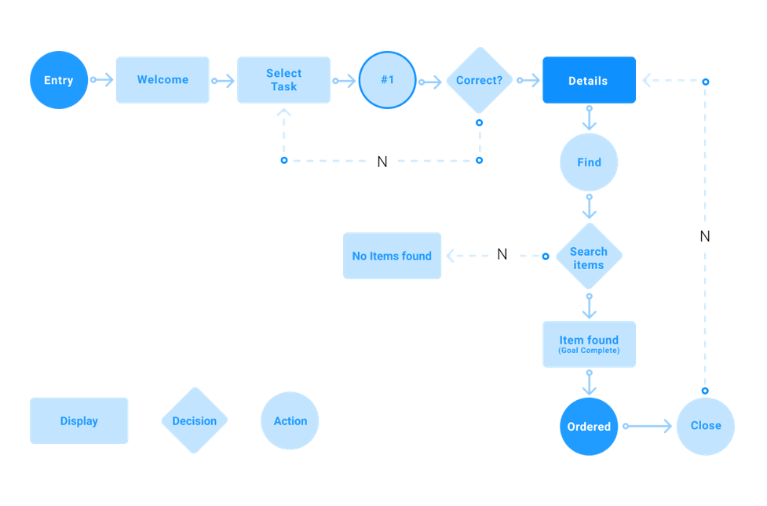

جریان کاربر از بسیاری جهات قابل تفسیر است. می‌تواند به عنوان یک نمای کلی که توصیف می کند کاربران کجا می توانند در محصول شما پیمایش کنند تلقی شود.

همچنین می تواند به معنای کیفیت و تجربه واقعی مسیری باشد که کاربران برای انجام یک کار طی می کنند.

یا می تواند به معنای دنباله واقعی مراحل کاربر برای انجام یک کار باشد. نمودارهای جریان می توانند در تجسم مسیرهایی که کاربران در هنگام استفاده از راه حل شما استفاده می کنند (یعنی وب سایت یا اپلیکیشن) مفید باشند.

جریان کاربر آنها را از طریق ورودی خود با طی یک مرحله به نتیجه موفقیت آمیز و اقدام نهایی مانند خرید یک محصول می رساند.

این کارها به شما کمک می کند تا یک مسیر منطقی که کاربر باید هنگام تعامل با سیستم طی کند ، روابط بین عملکرد سیستم ، اقدامات بالقوه کاربر و پیامدهای مرتبط را به تصویر بکشید. 

## نقش جریان کاربر

جریان کاربر مبنای نیازهای محتوا در صفحات وب یا صفحه اپلیکیشن است.  در شروع با درک نیازهای کاربر به تیم محصول کمک می کند تا جریان و تجربه کاربری ای را ایجاد کند که برای پاسخگویی به این نیازها طراحی شده است.

## الگو پرسونا کاربر

اگر بتوانید  مشخصات مشتری را بیابید ، یک قدم به درک سفر کاربر خود نزدیک می شوید.

در اینجا می توانید از نقشه سفر مشتری (user story mapping) استفاده کنید تا به درستی آنچه مشتریان شما هنگام تعامل با کسب و کار شما انجام می دهند (یعنی بازدید از وب سایت شما)  و نقاط مختلف تماس را تجزیه و تحلیل کنید. 

سوالاتی که  برای این کار باید در نظر بگیرید عبارتند از:

- کاربر در تلاش است تا چه کاری انجام دهد؟
- چه چیزی برای کاربر مهم است و چه چیزی به او اطمینان می دهد که ادامه دهد؟
- کاربر برای انجام این کار به چه اطلاعات اضافی نیاز دارد؟
- تردید یا موانع کاربر در انجام کار چیست؟

پاسخ به این سوالات به شما نحوه طراحی صفحات و تعیین اینکه چه محتوا و پیوندهای ناوبری را شامل می شود ، اطلاع می دهد. 

اگر هدف اصلی کاربر مرور مطالب مختلف باشد ، صفحه یا صفحه نمایش شما طراحی و عملکرد متفاوتی را  نسبت به زمانی که هدف اصلی شما  خرید محصول است ، ارائه می دهد.

بیایید با هم در 6 مرحله ساده مراحل ایجاد نقشه سفر مشتری را  بیشتر بررسی کنیم.

با دانستن سفر کاربر ، بقیه مرحله ایجاد جریان کاربر آسان تر خواهد شد.  

1. اهداف خود و اهداف کاربرخود را مشخص کنید 
2.  دریافت ایده در مورد اهداف کسب و کار شما و همچنین اهداف کاربران است. 

شما ممکن است از قبل از اهداف کسب و کار خود آگاه باشید. به عنوان مثال برای افزایش تبدیل در وب سایت خود ، افزایش فروش محصول خود و غیره. این معمولاً نتیجه نهایی اقداماتی است که می خواهید کاربران شما انجام دهند.

از طرف دیگر ، اهداف کاربران شما شامل خواسته ها و نیازهایی است که می خواهند برآورده کنند. و ممکن است کاربران مختلف اهداف مختلفی را در ذهن داشته باشند.

این جایی است که شخصیت های کاربر و نقشه سفر مشتری که قبلاً ایجاد کرده اید به شما کمک می کنند تا بفهمید چه چیزی هستند.

- مشخص کنید کاربران شما از کجا می آیند

اگر در حال طراحی وب سایت هستید ، ممکن است بخواهید بدانید که مشتریان شما از کجا می آیند یا به عبارت دیگر نقاط ورود به سایت چیست.

به عنوان مثال ، یک بازدید کننده مستقیم نام تجاری شما را جستجو می کند ، در حالی که یک بازدید کننده جستجوی ارگانیک ابتدا محصول مورد نظر خود را قبل از اینکه شما را به عنوان یک فروشنده مناسب کشف کند ، در Google جستجو می کند.

و ترسیم این جریانهای مختلف کاربر بر اساس نقاط مختلف ورود بسیار مهم است. این کلید ایجاد یک تجربه بهتر برای کاربران است.

- اطلاعات مورد نیاز بازدید کننده را شناسایی کنید
- برای طراحی بهترین جریان کاربرممکن ، باید خود را جای مشتری ها قرار دهید.

این به معنای درک نیازها و انگیزه های آنها ست. بنابراین شما باید بدانید که آنها چه مشکلی دارند ، تردیدها ، سوالات آنها درباره محصول و پاسخ هایی که دنبال می کنند چیست.

از آنجا که شما در حال حاضر مشخصات خریدار و نقشه سفر خود را ایجاد کرده اید ، انجام این مرحله آسانتر است.

- جریانهای کاربر خود را تجسم کنید

در حال حاضر شما از کاربرانی که جریان کاربری را ایجاد می کنید آگاه هستید ، اهداف آنها چیست و از کجا می آیند. مرحله بعدی ایجاد جریان کاربر است.

به این فکر کنید که کاربران شما قبل و بعد از بازدید از یک صفحه خاص در وب سایت شما چه کاری انجام می دهند. آنها چه می بینند ، برای رسیدن به هدف خود چه اقدامی انجام می دهند. این به شما کمک می کند صفحاتی را که باید ایجاد کنید شناسایی کنید ، چه اطلاعات یا محتوایی را باید ارائه دهید و چگونه باید به یکدیگر متصل شوند.

به شروع و پایان هر کار توجه کنید. این ممکن است براساس هدف کاربران مختلف تغییر کند.

و هنگامی که نمونه اولیه با کیفیت بالا آماده شد ، می توانید آن را با کاربران واقعی آزمایش کنید.

به این ترتیب می توانید اطلاعات مربوط به هر مرحله از جریان کاربر را جمع آوری کرده و از نحوه حرکت کاربران در محصول خود مطلع شوید. سپس می توانید زمینه های بهبود را مشخص کرده و راه حل هایی را قبل از عرضه محصول نهایی به کار بگیرید. 

## بهترین روش هایی که باید در ذهن داشته باشید

برای اطمینان از اینکه نمودارهای جریان کاربری ایجاد شده در کمک به شما موثر هستند ، به روشهای زیر پایبند باشید.

همیشه به نمودار جریان کاربر خود نامی بدهید که هدف آن را توصیف کند. این به هرکسی که به آن مراجعه کند کمک می کند تا اساس آن را درک کند.

هنگام ترسیم نمودار جریان از یک جهت شروع کنید.

تعداد نقاط تصمیم گیری را محدود کنید تا آن را بدون سر و صدا و با پیچیدگی کمتری ایجاد کنید.

اطمینان حاصل کنید که دامنه نمودار جریان کاربر، یک کار یا یک هدف کاربر را در بر می گیرد. اگر جریان کاربر فقط نیمی از کار را پوشش دهد یا مراحل را برای پوشش بیش از یک هدف کاربر ترسیم کند ، کارایی خود را نخواهد داشت.

اطمینان حاصل کنید که فقط اطلاعات لازم را اضافه کرده و از جزئیات دیگری که به شما در توصیف جریان و اقدامات کاربر کمک نمی کند خودداری کنید.

برای سرعت بخشیدن به روند ، از یک ابزار نمودار دیجیتال استفاده کنید. به علاوه به شما این امکان را می دهد که ورودی دیگران را بگیرید و کار خود را در یک مکان و دریک فضای ابری ذخیره کنید ، که به شما امکان می دهد از هرجایی به آن مراجعه کرده و روی آن کار کنید.

## نمونه ای از جریان کاربر

جریان های کاربر بسته به نوع وب سایت یا برنامه ای که می سازید ، می تواند اشکال مختلفی داشته باشد. به عنوان مثال ، برای یک سایت تجارت الکترونیکی ، یک جریان معمول کاربر ممکن است به صورت زیر باشد:

- کاربر از صفحه اصلی شروع به کار می کند
- کاربر از صفحه اصلی بر روی صفحه دسته بندی کلیک می کند
- کاربر از صفحه دسته بندی روی کالایی کلیک می کند
- کاربر از صفحه محصول ، مورد را به سبد خرید اضافه می کند
- کاربر سبد خرید را بررسی می کند
- از صفحه پرداخت ، کاربر خرید را کامل می کند

البته ، موارد فوق یک مثال بسیار ساده است. در دنیای واقعی کاربران می توانند مسیرهای مختلفی را برای خرید طی کنند. به عنوان مثال ، در مثال بالا کاربر می تواند به صفحه دسته بندی مراجعه کند تا محصولات بیشتری را به جای مراجعه مستقیم به سبد خرید ، مشاهده کند. یا می توانند به جای کلیک بر روی سلسله مراتب سایت ، از جستجو برای پیمایش در سایت استفاده کنند. یا کاربر می تواند از صفحه دیگری غیر از صفحه اصلی وارد شود.

از آنجا که مسیرهای مختلفی وجود دارد که کاربران می توانند طی کنند ، جریانهای کاربر اغلب به صورت نمودار جریان با گره برای هر یک از مسیرهای اصلی ناوبری مدلسازی می شوند. هدف از تجزیه و تحلیل جریان کاربر ، شناسایی جریانات اصلی کاربر از طریق برنامه یا وب سایت شما و شناسایی مناطقی است که می توان جریان پیمایش را بهبود بخشید.

به عنوان مثال ، در یک سایت تجارت الکترونیکی ممکن است تجزیه و تحلیل جریان کاربر را انجام دهید و متوجه شوید که بسیاری از افراد به سبد خرید مراجعه می کنند اما خرید خود را انجام نمی دهند. با شناسایی اینکه کنار گذاشتن سبد خرید  یک مشکل است ، می توانید فرضیه هایی را برای اینکه چرا کاربران در آن مرحله رها می شوند ، شروع کنید.

ممکن است نرخ حمل و نقل شما بسیار زیاد باشد و کاربران دچار شوک شوند. یا شاید فیلدهای زیادی برای پر کردن وجود دارد و مشتریان علاقه خود را از دست می دهند. یا شاید ناوبری در مورد اقدام بعدی مشخص نباشد.

با عبور از جریان کاربری خود ، شناسایی فرصت های بهبود و آزمایش ایده های مختلف می توانید به طور مداوم نرخ تبدیل خود را بهبود ببخشید

## استفاده از نمودارهای موردی

نمودارها برای تجسم نیازهای عملکردی یک سیستم که به گزینه های طراحی و اولویت های توسعه تبدیل می شوند ، ارزشمند هستند.

آنها همچنین به شناسایی عوامل داخلی یا خارجی که ممکن است بر سیستم تأثیر بگذارد کمک می کنند و باید مورد توجه قرار گیرند.

نمودارهای مورد استفاده ، نحوه تعامل سیستم با بازیگران را مشخص می کند بدون اینکه نگران جزئیات نحوه اجرای آن باشید.

## نمادها و نشانه های مورد استفاده در نمودار

مستطیل: برای نشان دادن فعالیت ها از مستطیل استفاده شود.

بیضی و دایره: بیضی ها و دایره ها را برای شروع و پایان  یا ورود و خروج به فعالیت به کار ببرید.

لوزی: برای مواردی که نیاز به تصمیم گیری دارد  باید از لوزی استفاده می شود.

بازیگران: بازیگران کاربران یک سیستم هستند. وقتی یک سیستم بازیگر سیستم دیگری است ، سیستم بازیگر را با کلیشه بازیگر برچسب گذاری کنید. بازیگرانی که  نامی ندارند نقش کسی را دارند که با سیستم تعامل دارد. نام خود را کوتاه و اندازه موارد استفاده خود را برای ظاهری حرفه ای ثابت نگه دارید.

روابط: روابط بین یک بازیگر و یک مورد استفاده را با یک خط ساده نشان دهید. برای روابط بین موارد استفاده ، از پیکانهایی استفاده کنید که دارای برچسب "استفاده" یا "گسترش" هستند.

سخن آخر

نمودارهای جریان کاربر در تسلط بر تجربه کاربر ضروری است. آنها به شما امکان می دهند نحوه تعامل کاربران با برنامه یا وب سایت شما ، مراحلی را که برای تکمیل یک کار یا دستیابی به یک هدف در وب سایت شما انجام می دهند ، درک کنید. این به شما کمک می کند یک تجربه کاربری برتر را برای کاربر ایجاد کنید و نیازهای او را با کارآیی بیشتری برآورده کنید. 

منبع:
