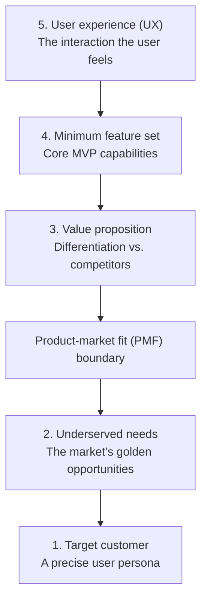
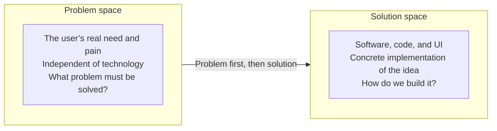
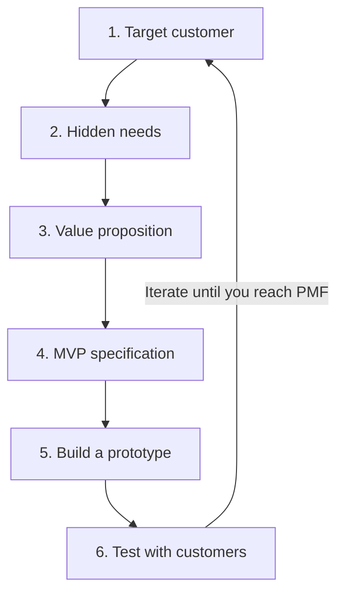

If *The Lean Startup* was the philosophy and the “why,” **The Lean Product Playbook** by Dan Olsen is the **“how”**—a practical field manual. Olsen wrote it because he believed that after reading the Lean Startup philosophy, product managers still did not know what to actually do when they walked into work on Monday morning.

Here is a summary and roadmap of the book, as if you had flipped through it yourself:

### 1. The Product-Market Fit Pyramid

Olsen compresses the whole of product management into a five-layer pyramid. To reach success (PMF), you have to move from the bottom up:

1. **Target customer:** Who exactly are you building for? (market segmentation)
2. **Underserved needs:** What pain does that customer have that still has not been treated well?
3. **Value proposition:** How will your product solve that need better than competitors?
4. **MVP feature set:** The minimum capabilities required to prove the value proposition.
5. **User experience (UX):** The layer the user interacts with and through which they feel the value.

> **Key point:** The bottom two layers are “the market” and the top three are “the product.” PMF means creating a logical, durable bond between those two parts.

### 2. Problem Space vs. Solution Space

This is the book’s most important mental distinction:

* **Problem Space:** Focus on “what does the customer want, and why?” (without thinking about software).
* **Solution Space:** Focus on “how do we build it?” (code, design, buttons).
* **Fatal mistake:** Product managers usually jump straight into the solution space. Olsen says that until you have engineered the problem space precisely, you have no right to go after a solution.

Dan Olsen’s rule: do not enter the solution space until you have made the problem space clear.

### 3. The Lean Product Process (six steps)

Olsen introduces a repeatable methodology for building product:

1. **Determine the target customer:** Use personas.
2. **Identify hidden needs:** Focus on needs that matter to the customer but with which they are **not satisfied** by current solutions.
3. **Define the value proposition:** Decide in which features you will be “the best,” and in which you will only be “good enough.”
4. **Specify the MVP features:** Use an effort-versus-value matrix.
5. **Build an MVP prototype:** Remember, a prototype is not coding! (It is only something the user can feel.)
6. **Test with customers:** Use real feedback to correct the lower layers of the pyramid.

### 4. The prioritization formula (Importance vs. Satisfaction)

Olsen gives a simple mathematical way to find the best opportunities:

$$Opportunity = Importance + \max(Importance - Satisfaction, 0)$$

In plain language: look for needs that matter a great deal to people, while current products on the market have left them deeply **dissatisfied**. That is where the money and the success sit.

### 5. Test, don’t seek confirmation!

The book stresses that when you show an MVP to a customer, you should not be looking for them to say “this is amazing!” You should hunt for weaknesses like a detective. If the user cannot work with your prototype, you have made a mistake in the UX layer or the feature set.

---

### How this book differs from the others (in one sentence):

If *Inspired* tells you “how to staff your team,” and *The Lean Startup* tells you “learn fast,” Dan Olsen’s book tells you **exactly which questions to ask the customer, and how to turn the answers into a list of features.**

**Final takeaway for you:**
To start, use the **PMF pyramid**. Always ask yourself: “Am I talking about the problem (the user’s pain) or the solution (buttons and code)?” If it is the latter, take a step back.

