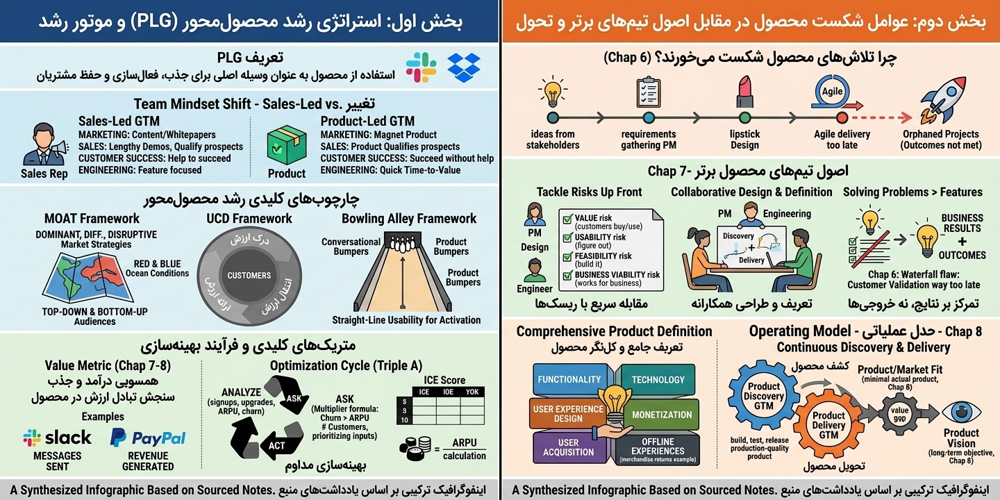

اگر کتاب *The Lean Startup* فلسفه و «چرایی» بود، کتاب **The Lean Product Playbook** نوشته دن اولسن (Dan Olsen)، دقیقاً همان **«چگونگی»** و دفترچه راهنمای عملی است. اولسن این کتاب را نوشت چون معتقد بود مدیران محصول بعد از خواندن فلسفه «نوپای ناب»، هنوز نمی‌دانند دوشنبه صبح که سر کار می‌روند، دقیقاً باید چه کار کنند.

در اینجا خلاصه و نقشه راه این کتاب را طوری برایت آورده‌ام که انگار آن را ورق زده‌ای:

================================================================================
          هرم برازش محصول با بازار (THE PRODUCT-MARKET FIT PYRAMID)
================================================================================

      ▲   ┌─────────────────────────────────────────┐
      │   │  ۵. تجربه کاربری (User Experience - UX)  │ ◄── تعاملی که کاربر حس می‌کند
محصول │   ├─────────────────────────────────────────┤
      │   │  ۴. مجموعه ویژگی‌های کمینه (Feature Set) │ ◄── قابلیت‌های اصلی MVP
Product   ├─────────────────────────────────────────┤
      ▼   │  ۳. ارزش پیشنهادی (Value Proposition)   │ ◄── تمایز نسبت به رقبا
══════════╧═════════════════════════════════════════╧═══════════════════════════
 ★★★                   مرز برازش محصول با بازار (PMF)                        ★★★
══════════╤═════════════════════════════════════════╤═══════════════════════════
      ▲   │  ۲. نیازهای برآورده‌نشده (Underserved)   │ ◄── فرصت‌های طلایی بازار
بازار │   ├─────────────────────────────────────────┤
Market    │  ۱. مشتری هدف (Target Customer)         │ ◄── پرسونای دقیق کاربر
      ▼   └─────────────────────────────────────────┘
---

### ۱. هرم برازش محصول با بازار (The Product-Market Fit Pyramid)

اولسن کل مفهوم مدیریت محصول را در یک هرم ۵ لایه خلاصه می‌کند. برای رسیدن به موفقیت (PMF)، باید از پایین به بالا حرکت کنی:

1. **مشتری هدف (Target Customer):** دقیقاً برای چه کسی می‌سازی؟ (بخش‌بندی بازار)
2. **نیازهای برآورده‌نشده (Underserved Needs):** آن مشتری چه دردی دارد که هنوز خوب درمان نشده؟
3. **ارزش پیشنهادی (Value Proposition):** محصول تو چطور قرار است بهتر از رقبا آن نیاز را حل کند؟
4. **مجموعه ویژگی‌های MVP:** حداقل امکاناتی که برای اثبات ارزش پیشنهادی لازم است.
5. **تجربه کاربری (UX):** لایه‌ای که کاربر با آن تعامل می‌کند و ارزش را لمس می‌کند.

┌─────────────────────────────────┐       ┌─────────────────────────────────┐
  │   فضای مسئله (Problem Space)    │  VS   │   فضای راه‌حل (Solution Space)   │
  ├─────────────────────────────────┤       ├─────────────────────────────────┤
  │ • نیاز، درد و خواسته واقعی کاربر │       │ • نرم‌افزار، کد، دکمه‌ها و UI    │
  │ • مستقل از هرگونه تکنولوژی     │       │ • پیاده‌سازی عینی یک ایده        │
  │ • سوال: «چه مشکلی باید حل شود؟» │       │ • سوال: «چگونه آن را بسازیم؟»    │
  └─────────────────────────────────┘       └─────────────────────────────────┘
     قانون دن اولسن: تا فضای مسئله را شفاف نکرده‌اید، وارد فضای راه‌حل نشوید.

> **نکته کلیدی:** دو لایه اول «بازار» هستند و سه لایه بالا «محصول». PMF یعنی ایجاد پیوند منطقی و مستحکم بین این دو بخش.

### ۲. فضای مسئله در مقابل فضای راه حل (Problem Space vs. Solution Space)

این مهم‌ترین تفکیک ذهنی کتاب است:

* **Problem Space:** تمرکز روی این است که «مشتری چه می‌خواهد و چرا؟» (بدون فکر کردن به نرم‌افزار).
* **Solution Space:** تمرکز روی این است که «چطور آن را بسازیم؟» (کد، طراحی، دکمه‌ها).
* **اشتباه مهلک:** مدیران محصول معمولاً مستقیم می‌پرند توی فضای راه حل. اولسن می‌گوید تا وقتی فضای مسئله را دقیقاً مهندسی نکرده‌اید، حق ندارید سراغ راه حل بروید.

[۱. مشتری هدف] ──► [۲. نیازهای پنهان] ──► [۳. ارزش پیشنهادی]
       │                                            │
       ▼                                            ▼
 [۶. تست با مشتری] ◄── [۵. ساخت پروتوتایپ] ◄── [۴. مشخصات MVP]
       │
       └───► (تکرار چرخه بر اساس بازخورد واقعی تا رسیدن به PMF)

### ۳. فرآیند ۶ مرحله‌ای محصول ناب (The Lean Product Process)

اولسن یک متدولوژی تکرارپذیر برای ساخت محصول معرفی می‌کند:

1. **مشتری هدف را تعیین کن:** از پرسوناها استفاده کن.
2. **نیازهای پنهان را شناسایی کن:** روی نیازهایی تمرکز کن که برای مشتری **مهم** هستند اما از راه‌حل‌های فعلی **راضی** نیستند.
3. **ارزش پیشنهادی را تعریف کن:** مشخص کن در کدام ویژگی‌ها قرار است «بهترین» باشی و در کدام‌ها فقط «در حد استاندارد».
4. **ویژگی‌های MVP را مشخص کن:** از ماتریس «تلاش در برابر ارزش» استفاده کن.
5. **پروتوتایپ MVP را بساز:** یادت باشد، پروتوتایپ کدنویسی نیست! (فقط چیزی که کاربر بتواند آن را حس کند).
6. **با مشتری تست کن:** از بازخوردهای واقعی برای اصلاح لایه‌های زیرین هرم استفاده کن.

### ۴. فرمول اولویت‌بندی (Importance vs. Satisfaction)

اولسن یک راه ریاضی ساده برای پیدا کردن بهترین فرصت‌ها می‌دهد:

$$Opportunity = Importance + \max(Importance - Satisfaction, 0)$$

به زبان ساده: دنبال نیازهایی بگرد که برای مردم **خیلی مهم** هستند اما محصولات فعلی بازار، آن‌ها را به شدت **ناراضی** نگه داشته‌اند. اینجاست که پول و موفقیت خوابیده است.

### ۵. تست کردن، نه تایید گرفتن!

کتاب تاکید دارد که وقتی MVP را به مشتری نشان می‌دهید، دنبال این نباشید که بگویند «چقدر عالی است!». شما باید مثل یک کارآگاه دنبال نقاط ضعف بگردید. اگر کاربر نتواند با پروتوتایپ شما کار کند، یعنی در لایه UX یا Feature Set اشتباه کرده‌اید.

---

### تفاوت این کتاب با بقیه (در یک جمله):

اگر *Inspired* به تو می‌گوید «تیمت را چطور بچین»، و *Lean Startup* می‌گوید «سریع یاد بگیر»، کتاب *Dan Olsen* به تو می‌گوید **«دقیقاً چه سؤالی از مشتری بپرسی و چطور آن را به یک لیست از فیچرها تبدیل کنی.»**

**خلاصه نهایی برای شما:**
برای شروع، از مدل **هرم PMF** استفاده کن. همیشه از خودت بپرس: «آیا من الان دارم درباره مسئله (مشکل کاربر) حرف می‌زنم یا راه حل (دکمه و کد)؟». اگر دومی بود، یک قدم به عقب برگرد.

