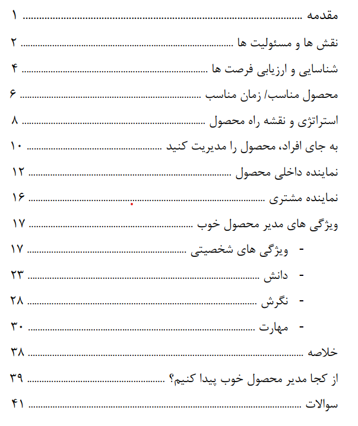

| مشخصات کتاب | توضیحات |
| :--- | :--- |
| **پدیدآور / نویسنده** | مارتی کاگان (Marty Cagan - SVPG) |
| **حوزه تخصصی** | مدیریت محصول و رهبری تیم |
| **تعداد صفحات** | ۳۶ صفحه |
| **فرمت و کیفیت** | PDF • دیجیتال استاندارد |
| **حجم فایل** | ۱.۱ مگابایت |
| **سطح مخاطب** | تخصصی • مدیران محصول و نوآوران |

---

تک تک اعضای تیم محصول مهم هستند. یک شرکت برای موفقیت باید طراحی، ساخت، آزمایش و فروش محصول را درست و دقیق انجام دهد. مدیر محصول نقشی است که موثرترین نقش در ساخت محصول مناسب را ایفا می کند که البته اغلب بی مصرف ترین نیز هست.

در این مطلب درباره مسئولیت های یک مدیر محصول خوب صحبت می کنیم و سپس به ویژگی ها، چگونگی به دست آوردن ویژگی ها و توسعه آنها می پردازیم.

---

### 📥 دریافت فایل کتاب


