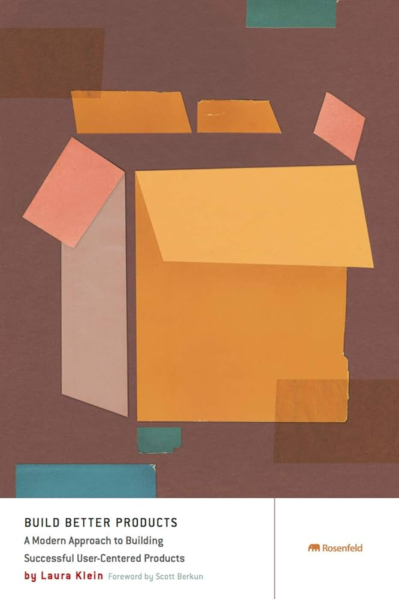

**Title: How do you build successful products by focusing on users?**

**Introduction:** Today, a product’s success depends heavily on how well it matches users’ needs and wants. *Build Better Products*, by Laura Klein and Kate Rutter, shows you how to build successful products with a focus on users.

**A summary of *Build Better Products*:** This book is a comprehensive guide to developing products that address users’ real needs. Combining design techniques, research, and data analysis, the authors offer a practical framework for building user-centered products.

**Key points:**

- **User research:** The book places a strong emphasis on research and on knowing users and their needs in detail.

- **Design for a better experience:** You learn how to create designs that deliver an excellent user experience for your audience.

- **Testing and continuous improvement:** The book shows you how to test your products and improve them based on the feedback you receive.

**Why this book is useful:** *Build Better Products* is an outstanding resource for designers, product managers, and development teams. With a practical, actionable approach, it helps you build better products that users love.

**Conclusion:** If you want to create successful products that are genuinely useful for users, *Build Better Products* is a book you should look at. With it, you can learn the principles and methods of building products that truly address users’ needs.

(This book is the original edition)
