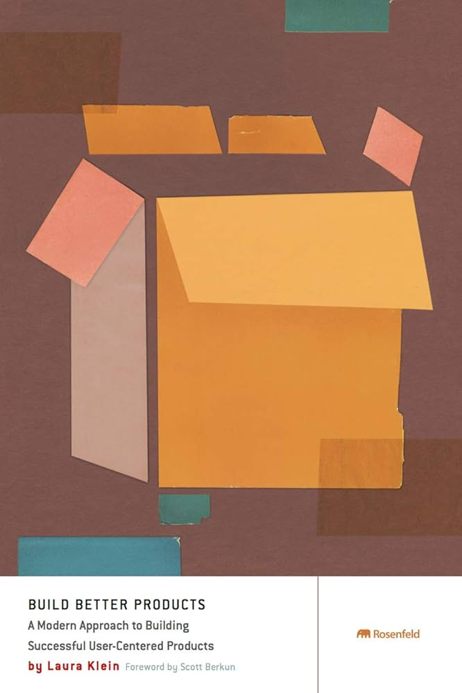

**عنوان: چگونه محصولات موفق با تمرکز بر کاربران بسازیم؟**

**مقدمه:** امروزه، موفقیت یک محصول بستگی زیادی به میزان تطابق آن با نیازها و خواسته‌های کاربران دارد. کتاب "Build Better Products" نوشته‌ی لورا کلاین و کیت راتر، به شما نشان می‌دهد چگونه می‌توانید محصولات موفقی را با تمرکز بر کاربران بسازید.

**خلاصه‌ای از کتاب Build Better Products :** این کتاب یک راهنمای جامع برای توسعه محصولاتی است که نیازهای واقعی کاربران را برطرف می‌کند. نویسندگان با ترکیب تکنیک‌های طراحی، تحقیق و تحلیل داده‌ها، یک چارچوب عملی برای ساخت محصولات کاربرمحور ارائه می‌دهند.

**نکات کلیدی:**

- **تحقیق درباره کاربران:** کتاب تأکید زیادی بر اهمیت تحقیق و شناخت دقیق کاربران و نیازهای آن‌ها دارد.

- **طراحی برای تجربه بهتر:** یاد می‌گیرید چگونه طراحی‌هایی را انجام دهید که تجربه کاربری عالی را برای مخاطبان فراهم کند.

- **تست و بهبود مداوم:** کتاب به شما نشان می‌دهد چگونه محصولات خود را تست کنید و بر اساس بازخوردهای دریافتی، آن‌ها را بهبود دهید.

**چرا این کتاب مفید است؟** "Build Better Products" یک منبع فوق‌العاده برای طراحان، مدیران محصول و تیم‌های توسعه است. این کتاب با رویکردی عملی و قابل اجرا، به شما کمک می‌کند تا محصولات بهتری را که کاربران عاشقشان می‌شوند، بسازید.

**نتیجه‌گیری:** اگر می‌خواهید محصولات موفقی ایجاد کنید که واقعاً برای کاربران مفید باشد، "Build Better Products" کتابی است که باید به آن نگاهی بیندازید. با این کتاب، می‌توانید اصول و روش‌های ساخت محصولاتی را که به طور واقعی نیازهای کاربران را برطرف می‌کنند، بیاموزید.

(این کتاب نسخه اصلی است)
